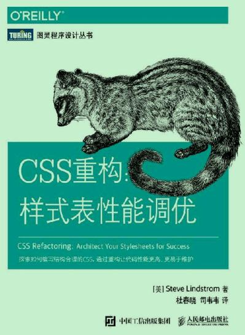

从样式表重构中学习CSS

本书所有代码均可从配套网站下载：

https://www.cssrefactoringbook.com



<!-- more -->

## 

- > 可以说没有比编写了一大堆 CSS，结果发现生效的不是目标样式而是其他样式更糟糕的了。

- > https://www.cssrefactoringbook.com

- > 因此，若要修改 HTML 元素样式，不要用 JavaScript 添加 style 属性，而是应该为元素增加或删除类。这样不仅可以应用合适的样式，该元素的CSS 样式集也能跟其余的网站 CSS 合理地组织在一起。

- > 不使用 ID 为元素增加样式，是将 CSS 和 JavaScript 分离的另外一个好方法，该方法非常类似于为类和 ID 增加 js- 前缀。

- > 因为盒子尺寸有两种不同的计算方法，所以应该考虑其使用场景。content-box 和 border-box 两者没有优劣之分，但是很多人发现border-box 更直观，因为它描述的是包括边框在内的元素的高度和宽度，而不只是内容区域的尺寸。

- > 任何元素都可以设置 box-sizing 属性，因此可以混用这两种盒子，但是为了保持一致性，通常选用其中一种并坚持使用。具体设置方法是，用通用选择器进行设置，指定盒子的类型：*,*:after,*:before { box-sizing: border-box;}

- > 基础样式应该只为最笼统的使用场景设置属性和属性值。通常我们为元素设置以下基础属性：● color● font-family● font-size● font-weight● letter-spacing
  > ● line-height● margin● padding如果你的网站本质上是信息类网站，用好这些样式可能就足够了。

  > ● line-height● margin● padding如果你的网站本质上是信息类网站，用好这些样式可能就足够了。

- > 4.3.6 文本语义元素

- > D. 用JavaScript修改样式（不管用什么框架），都必须通过增加或删除CSS 类来完成。

- > /** * 错误：在JavaScript中，操作元素的样式属性修改了元素的样式。 */$('.js-menu-item').on('click', function (e) { $(this).css('background-color', '#FFFF00');});/** * 正确：用JavaScript为元素添加类，修改元素的样式。
  > */$('.js-menu-item').on('click', function (e) { $(this).addClass('highlighted');});

  > */$('.js-menu-item').on('click', function (e) { $(this).addClass('highlighted');});

- > E. 用作JavaScript选择器的类和ID，必须添加js- 前缀，并严禁在样式表中使用。

- > /** * 正确：在JavaScript中，用专门用作JavaScript选择器的类选择元素。 */$('.js-menu-item').on('click', function () { $(this).addClass('highlighted');});

- > 我们从第 2 章学习到，CSS 样式根据选择器的特指度和样式的顺序产生作用。因此，有必要按照样式产生作用的顺序组织 CSS 代码。(1) 通用样式(2) 基础样式(3) 组件及其容器的样式(4) 结构化样式(5) 功能性样式(6) 浏览器特定样式（如果一定需要）按照以上顺序添加 CSS，随着声明块选择器的精确度提高，更为复杂的选择器将与已经添加的更加宽泛的选择器区分开来。

- > 如果按照本章所讲的重构顺序进行重构，那么到目前为止你：● 正在朝保持 CSS 在结构上的一致性而努力● 有更少的僵尸代码● 分离了 CSS 和 JavaScript● 建立了基础样式● 通过删除多余的 ID 和将 ID 转化为类，降低了特指度最高的选择器● 将功能性样式单独放在一起，减少了 !important 声明的使用
  > ● 定义了可复用组件完成以上重构，你可以迁移行内样式了

  > ● 定义了可复用组件完成以上重构，你可以迁移行内样式了

