# 1  Lucene与ElasticSearch概述

来源10、尚学堂大数据第十阶段：elasticsearch\02笔记\10ElasticSearch_v3.0.docx

## 1.1 Lucene全文检索

### 1.1.1   Lucene概述

Lucene是一个全文搜索框架，而不是应用产品。因此它并不像http://www.baidu.com/ 或者google Desktop那么拿来就能用，它只是提供了一种工具让你能实现这些产品。

**1.**  **lucene能做什么 ：**

本质就是给搜索内容定位
    要回答这个问题，先要了解lucene的本质。实际上lucene的功能很单一，说到底，就是你给它若干个字符串，然后它为你提供一个全文搜索服务，告诉你你要搜索的关键词出现在哪里。知道了这个本质，你就可以发挥想象做任何符合这个条件的事情了。你可以把站内新闻都索引了，做个资料库；你可以把一个数据库表的若干个字段索引起来，那就不用再担心因为“%like%”而锁表了；你也可以写个自己的搜索引擎……

**2.**  **你该不该选择lucene** 

下面给出一些测试数据，如果你觉得可以接受，那么可以选择。 
 测试一：250万记录，300M左右文本，生成索引380M左右，800线程下平均处理时间300ms。 
 测试二：37000记录，索引数据库中的两个varchar字段，索引文件2.6M，800线程下平均处理时间1.5ms。

### 1.1.2 倒排索引

正排索引

**我是中国人（1）**

**中国是全球人口最多的国家,中国人也最多（2）**

1: 我 , 是, 中国,中国人

2: 中国,是,全球….

**倒排索引**

1，我 （1:1）｛0｝#第1行出现1次，在第一行中偏移量0

2，中国 (1:1) {2}, (2:2){0，13} #第1行出现1次，偏移量2; 第2行出现2次，偏移量0和13

 

## 1.2 ElasticSearch概述

### 1.2.1 简介

ElasticSearch是一个基于Lucene的实时的分布式搜索和分析引擎。设计用于云计算中，能够达到近实时搜索，稳定，可靠，快速，安装使用方便。基于**RESTful**接口。

 

### 1.2.2 ES与solr的对比：

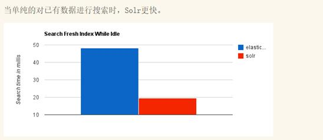

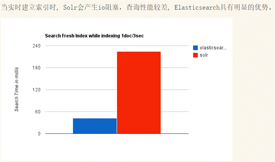

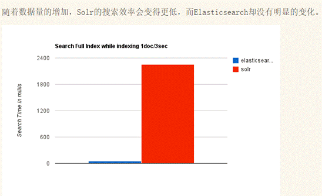

ElasticSearch vs Solr 总结

1. es基本是开箱即用，非常简单。Solr安装比较复杂

2. Solr 利用 Zookeeper 进行分布式管理，而 Elasticsearch 自身带有分布式协调管理功能。

3. Solr 支持数据格式：JSON、XML、CSV，而 Elasticsearch 仅支持json文件格式。

4. Solr 官方提供的功能更多，而 Elasticsearch 本身更注重于核心功能，高级功能多有第三方插件提供，例如图形化界面需要kibana友好支撑。

5. Solr 查询快，但更新索引时慢（即插入删除慢），用于电商等查询多的应用；ES建立索引快（即查询慢），即实时性查询快，用于facebook、GitHub、新浪等搜索。

6. Solr 是传统搜索应用的有力解决方案，但 Elasticsearch 更适用于新兴的大数据实时搜索应用。

 

### 1.2.3 ES与关系型数据对比

### 1.2.4 ES优点：

a)   **分布式**：ES的自动发现机制会识别新增的节点并重新平衡分配数据。

b)   **全文检索**：ES后台使用Lucene提供全文检索，自带多语言支持、强大的查询语言、地理位置支持、上下文感知的建议、自动完成和搜索片段

c)   **近实时搜索和分析**：数据从进入ES到能够搜索到是近实时的。除了搜索，ES也可以进行聚合分析操作。

d)   **高可用**：ES会自动发现新的或失败的节点，重组和重新平衡数据，确保数据是安全的和可访问的。

e)   **模式自由**：ES的动态Mapping机制可以自动检测数据的结构和类型，创建索引，并使数据可搜索。

f)   **RESTful API**：几乎任何操作都可以使用一个简单的RESTful API，JSON基于HTTP请求来实现，客户端也可以使用多种编程语言。

### 1.2.5 应用场景

a)   站内搜索：Facebook、新浪微博、论坛等的站内搜索

b)   NoSQL数据库：ES读写性能优于MongoDB，同时也支持地理位置查询

c)   日志分析：日志分析由实时日志分析平台ELK完成，能够对日志进行集中的收集、存储、搜索、分析、监控以及可视化。

# 2  环境安装与启动

 

## 2.1 准备工作

\1.  环境准备

需要服务器3台：node2,node3,node4

切换快照到：JDK1.8、Zookeeper安装、以及免密登录后的快照。

\2.  用户准备（三台机器上都要操作）

**只允许普通用户操作，不允许****root****用户**

**注意：因为elasticsearch****有远程执行脚本的功能所以容易中木马病毒，所以不允许用root****用户启动，root****用户是起不来的，赋权限，用一般的用户启动**

**要配置network.host****才能别的机器或者网卡访问，否则只能是127.0.0.1****或者localhost****访问，这里配置成自己的局域网ip**

**注意配置yml****结尾的配置文件都需要冒号后面加空格才行**

创建esuser用户：

useradd esuser

设置密码

passwd esuser

让esuser拥有sudo的权限，需要修改/etc/sudoers文件

需要先给/etc/sudoers添加写的权限

[root@node2 ~]# ll /etc/sudoers

-r--r-----. 1 root root 4002 Mar 2 2012 /etc/sudoers

[root@node2 ~]# chmod u+w /etc/sudoers

[root@node2 ~]# vim /etc/sudoers

root  ALL=(ALL)    ALL

esuser ALL=(ALL)    ALL

[root@node2 ~]# chmod u-w /etc/sudoers #改完之后将写权限删除

[root@node2 ~]# scp /etc/sudoers node3:/etc/

sudoers                                100% 4024   3.9KB/s  00:00  

[root@node2 ~]# scp /etc/sudoers node4:/etc/

sudoers                                100% 4024   3.9KB/s  00:00 

 

\3.   在/opt下创建目录es，将es的所有权切换给esuser

三台服务器上操作

[root@node2 ~]# su esuser

[esuser@node2 root]$ ll /root

ls: cannot open directory /root: Permission denied

[esuser@node2 root]$ cd

[esuser@node2 ~]$ pwd

/home/esuser

[esuser@node2 ~]$ mkdir /opt/es

mkdir: cannot create directory `/opt/es': Permission denied

[esuser@node2 ~]$ sudo mkdir /opt/es

We trust you have received the usual lecture from the local System

Administrator. It usually boils down to these three things:

 

  \#1) Respect the privacy of others.

  \#2) Think before you type.

  \#3) With great power comes great responsibility.

 

[sudo] password for esuser: 

[esuser@node2 ~]$ ll /opt

total 40

drwxr-xr-x 2 root root 4096 Jun 14 07:16 es

[esuser@node2 ~]$ sudo chown -R esuser:esuser /opt/es

[esuser@node2 ~]$ ll /opt

drwxr-xr-x 2 esuser esuser 4096 Jun 14 07:16 es

同时在node3和node4上执行同样操作。

## 2.2 安装与配置

\1.   使用esuser账户将以下三个安装包上传到服务器的esuser家目录

elasticsearch-2.2.1.tar.gz、elasticsearch-analysis-ik-1.8.1.zip、

elasticsearch-head-master.zip

\2.   解压elasticsearch-2.2.1.tar.gz到/opt/es

[esuser@node2 ~]$ tar -zxvf elasticsearch-2.2.1.tar.gz -C /opt/es

[esuser@node2 ~]$cd /opt/es/elasticsearch-2.2.1/config

[esuser@node2 config]$ vim elasticsearch.yml

 

\3.   添加可视化插件（方案一）

A.   将提供的02_软件\附件\plugins文件夹上传到/opt/es/elasticsearch-2.2.1目录下。

B.   修改plugins目录的所有者和所属用户组。

[esuser@node2 elasticsearch-2.2.1]$ sudo chown -R esuser:esuser plugins/

[sudo] password for esuser: 

[esuser@node2 elasticsearch-2.2.1]$ ll

drwxr-xr-x 3 esuser esuser 4096 Jun 14 08:12 plugins

\4.   添加可视化插件（方案二）两个方案选择其一

下载地址：

https://github.com/mobz/elasticsearch-head/archive/master.zip

执行安装插件命令：

[esuser@node2 ~]$ /opt/es/elasticsearch-2.2.1/bin/plugin install [file:///home/esuser/elasticsearch-head-master.zip](file:///\\home\esuser\elasticsearch-head-master.zip)

\5.   ik中文分词器插件安装  

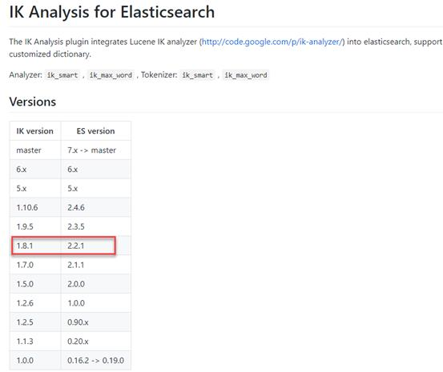

下载地址：

https://github.com/medcl/elasticsearch-analysis-ik/releases/download/v1.8.1/elasticsearch-analysis-ik-1.8.1.zip

如果elasticsearch/plugins不存在就创建该目录，然后执行：

[root@node2 ~]# yum install unzip -y

[root@node2 ~]# cd ~esuser

[root@node2 esuser]# unzip elasticsearch-analysis-ik-1.8.1.zip -d /opt/es/elasticsearch-2.2.1/plugins/ik

[root@node2 esuser]# cd /opt/es/elasticsearch-2.2.1/plugins/

[root@node2 plugins]# ll

total 8

drwxr-xr-x 6 esuser esuser 4096 Jun 14 08:20 head

drwxr-xr-x 3 root  root  4096 Jun 14 23:11 ik

[root@node2 plugins]# chown -R esuser:esuser ik

[root@node2 plugins]# ll

total 8

drwxr-xr-x 6 esuser esuser 4096 Jun 14 08:20 head

drwxr-xr-x 3 esuser esuser 4096 Jun 14 23:11 ik

 

或者在宿主机上解压后上传到虚拟机中，然后在设置所有者和所属用户组。

\6.   分发到node3和node4

[esuser@node2 es]$ scp -r elasticsearch-2.2.1/ esuser@node3:`pwd`

[esuser@node2 es]$ scp -r elasticsearch-2.2.1/ esuser@node4:`pwd`

\7.   node2配置环境变量

[esuser@node2 ~]$ exit

exit

[root@node2 ~]# vim /etc/profile

export ES_HOME=/opt/es/elasticsearch-2.2.1

export PATH=$PATH:$ES_HOME/bin

[root@node2 ~]# source /etc/profile

\8.   将配置环境变量配置文件从node2远程拷贝到node3和node4上，并让它生效。

[root@node2 ~]# scp /etc/profile node3:/etc/

[root@node2 ~]# scp /etc/profile node4:/etc/

[root@node3 ~]# source /etc/profile

[root@node4 ~]# source /etc/profile                 

\9.   node3修改配置文件

[esuser@node3 ~]$cd /opt/es/elasticsearch-2.2.1/config

[esuser@node3 config]$ vim elasticsearch.yml

  # ------------------------------------  Node ------------------------------------  node.name: node3  #当前服务器的名称,分发后修改  #  ---------------------------------- Network  -----------------------------------  network.host: 192.168.20.73 #,分发后修改  ......  

 

\10.  node4修改配置文件

[esuser@node4 ~]$cd /opt/es/elasticsearch-2.2.1/config

[esuser@node4 config]$ vim elasticsearch.yml

  #  ------------------------------------ Node  ------------------------------------  node.name: node4  #当前服务器的名称,分发后修改  #  ---------------------------------- Network  -----------------------------------  network.host: 192.168.20.74 #,分发后修改  ......  

## 2.3 启动与测试

\1.   启动：分别执行elasticsearch

发生给全部的xshell窗口

su esuser

分别输入esuser密码 esuser

source /etc/profile

elasticsearch

注：bin/elasticsearch -d(后台运行)

\2.   测试：

通过浏览器访问选择三台服务器中任意一服务器的9200端口

http://192.168.20.74:9200/ 或者 http://node4:9200

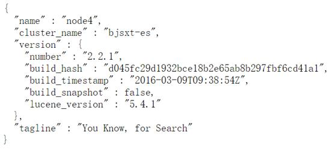

http://192.168.20.74:9200/_plugin/head/

# 3   ES集群架构

## 3.1 ES为什么要实现集群

　　

在单台ES服务器节点上，随着业务量的发展索引文件慢慢增多，会影响到效率和内存存储问题等。

　　我们可以采用ES集群，将单个索引的分片到多个不同分布式物理机器上存储，从而可以实现高可用、容错性等。

　　ES集群中索引可能由多个分片构成，并且每个分片可以拥有多个副本。通过将一个单独的索引分为多个分片，我们可以处理不能在一个单一的服务器上面运行的大型索引，简单的说就是索引的大小过大，导致效率问题。不能运行的原因可能是内存也可能是存储。由于每个分片可以有多个副本，通过将副本分配到多个服务器，可以提高查询的负载能力。

 

 

## 3.2 ES集群涉及的名词

**Cluster**

 　代表一个集群，集群中有多个节点，其中有一个为主节点，这个主节点是可以通过选举产生的，主从节点是对于集群内部来说的。es的一个概念就是去中心化，字面上理解就是无中心节点，这是对于集群外部来说的，因为从外部来看es集群，在逻辑上是个整体，你与任何一个节点的通信和与整个es集群通信是等价的。

**Shards**

　　代表索引分片，es可以把一个完整的索引分成多个分片，这样的好处是可以把一个大的索引拆分成多个，分布到不同的节点上。构成分布式搜索。分片的数量只能在索引创建前指定，并且索引创建后不能更改。

**replicas**

　　代表索引副本，es可以设置多个索引的副本，副本的作用一是提高系统的容错性，当某个节点某个分片损坏或丢失时可以从副本中恢复。二是提高es的查询效率，es会自动对搜索请求进行负载均衡。

**Recovery**

代表数据恢复或叫数据重新分布，es在有节点加入或退出时会根据机器的负载对索引分片进行重新分配，挂掉的节点重新启动时也会进行数据恢复。

 

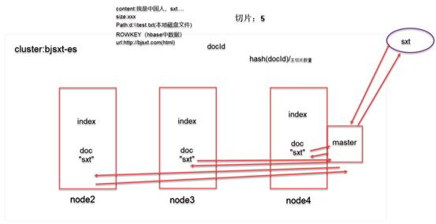

 

# 4  Rest CURL命令

## 4.1 Rest简介

全称：Representational State Transfer

一种软件架构风格，而不是标准，只是提供了一组设计原则和约束条件。它主要用于客户端和服务器交互类的软件。基于这个风格设计的软件可以更简洁，更有层次，更易于实现缓存等机制。

**REST****的操作分为以下几种：**

\1.  GET：获取对象的当前状态；

\2.  PUT：改变对象的状态；

\3.  POST：创建对象；

\4.  DELETE：删除对象；

\5.  HEAD：获取头信息。

**ES****内置的REST****接口：**

## 4.2 索引文档的语法curl用法

CURL：简单认为是可以在命令行下访问url的一个工具

curl是利用URL语法在命令行方式下工作的开源文件传输工具，使用curl可以简单实现常见的get/post请求。 

curl 

 -X 指定http请求的方法

​       GET POST PUT DELETE    restful

-d  指定要传输的数据

 

## 4.3 索引库的创建与删除

创建索引库blog，默认分片5个，每个分片一个副本分片

[root@node2 ~]# **curl -XPUT node3:9200/blog**

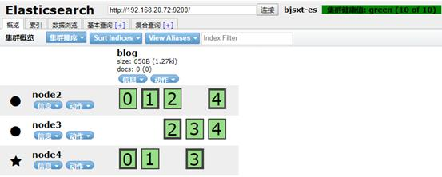

关闭一个从节点：node2（或者node3） Ctrl+C

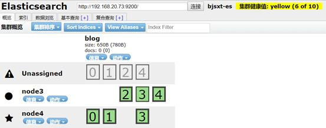

Node4上的日志：

[2020-06-14 11:08:35,278][INFO ][cluster.routing.allocation] [node4] Cluster health status changed from [**GREEN**] to [**YELLOW**] (reason: [[{node2}{eJUKnA0nQ0y0aUO3K_YH7A}{node2}{node2:9300}] left]

该状态是一个临时状态，沙丁切片的再分配，稍后会被调整为如下图：

[2020-06-14 11:09:35,922][INFO ][cluster.routing.allocation] [node4] Cluster health status changed from [**YELLOW**] to [**GREEN**] (reason: [shards started [[blog][0], [blog][0]] ...]).

启动node2上的ES：

[root@node2 ~]# su esuser

[esuser@node2 root]$ cd

[esuser@node2 ~]$ elasticsearch

 

[root@node2 ~]# **curl -XPUT node3:9200/test**

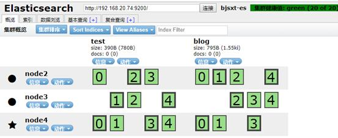

**删除索引库：**

[root@node2 ~]# **curl -XDELETE node3:9200/test**

 

## 4.4 POST创建type以及新建或修改文档

curl -XPOST http://node2:9200/blog/employee/_mapping -d'

{

  "employee": {

​      "properties": {

​        "id": {

​          "type": "long",

​          "store": "yes",

​          "index": "not_analyzed"

​        },

​        "first_name": {

​          "type": "string",

​          "store": "yes",

​          "analyzer": "ik_max_word"

​        },

​        "about": {

​          "type": "string",

​          "store": "yes",

​          "analyzer": "ik_max_word"

​        },

​        "interests": {

​          "type": "string",

​          "store": "yes",

​          "analyzer": "ik_max_word"

​        }

​      }

​    }

}'

 

Postman: POST  http://node2:9200/blog

{

 "mappings":{

​    "employee": {

​      "properties": {

​        "id": {

​          "type": "long",

​          "store": "yes",

​          "index": "not_analyzed"

​        },

​        "first_name": {

​          "type": "string",

​          "store": "yes",

​          "analyzer": "ik_max_word"

​        },

​        "about": {

​          "type": "string",

​          "store": "yes",

​          "analyzer": "ik_max_word"

​        },

​        "interests": {

​          "type": "string",

​          "store": "yes",

​          "analyzer": "ik_max_word"

​         }

​      }

​    }

  }

}

 

curl -XPOST http://node2:9200/blog/employee -d '

{

 "first_name" : "bin",

 "age" : 33,

 "about" : "I love to go rock climbing",

 "interests": [ "sports", "music" ]

}'

Id没有写可以自动生成。可视化在显示时并没有将数组显示出来。

再添加一条，先要在页面中看到需要刷新一下：

curl -XPOST http://node2:9200/blog/employee -d '

{

 "first_name" : "gob bin",

 "age" : 43,

 "about" : "I love to go rock climbing",

 "interests": [ "sports", "music" ]

}'

可以动态添加列add field yes：

curl -XPOST http://node2:9200/blog/employee -d '

{

 "first_name" : "pablo2",

 "age" : 33,

 "about" : "I love to go rock climbing",

 "interests": [ "sports", "music" ],

 **"sex": "man"**

}'

 

指定id后则不再使用自动生成的id。

curl -XPOST http://node2:9200/blog/employee/1 -d '

{

 "first_name" : "tom",

 "age" : 45,

 "about" : "I love to go rock climbing",

 "interests": [ "sports", "music" ]

}'

 

Id已经存在的话，则进行修改。

curl -XPOST http://node2:9200/blog/employee/1 -d '

{

 "first_name" : "tom2",

 "age" : 22,

 "about" : "I love to go rock climbing",

 "interests": [ "sports", "music" ]

}'

 

## 4.5 PUT新建或修改文档

通过PUT新建文档时必须指定id，如果不指定则添加失败。

curl -XPUT http://node2:9200/blog/employee -d '

{

 "first_name" : "god bin",

 "last_name" : "bin",

 "age" : 45,

 "about" : "I love to go rock climbing",

 "interests": [ "sports", "music" ]

}'

失败提示：

No handler found for uri [/blog/employee] and method [PUT]

 

指定id这可以正常添加：

curl -XPUT http://node2:9200/blog/employee/3 -d '

{

 "first_name" : "god bin",

 "last_name" : "pang",

 "age" : 42,

 "about" : "I love to go rock climbing",

 "interests": [ "sports", "music" ]

}'

 

Id为3的文档数据已经存在，则执行修改操作。

curl -XPUT http://node2:9200/blog/employee/3 -d '

{

 "first_name" : "god lucy",

 "last_name" : "bin",

 "age" : 45,

 "about" : "I love to go rock climbing",

 "interests": [ "sports", "music" ]

}'

通过POST添加的数据，PUT方式能否修改呢？

curl -XPUT http://node2:9200/blog/employee/1 -d '

{

 "first_name" : "god bin",

 "last_name" : "pang",

 "age" : 40,

 "about" : "I love to go rock climbing",

 "interests": [ "sports", "music" ]

}'

测试发现可以正常修改。

注意：POST创建文档时可以不指定id，PUT必须指定id。

## 4.6  GET查询文档

 

\#根据document的id来获取数据：(pretty格式美观)

curl -XGET http://node2:9200/blog/employee/1?pretty

 

\#根据field来查询数据（了解不推荐）：

curl -XGET http://node2:9200/blog/employee/_search?q=first_name="bin"

 

\#根据field来查询数据：match

curl -XGET http://node2:9200/blog/employee/_search?pretty -d '

{

 "query":

 {"match":

  {"first_name":"bin"}

 }

}'

 

 

\#对多个field发起查询：multi_match

curl -XGET http://node2:9200/blog/employee/_search?pretty -d '

{

 "query":

 {"multi_match":

  {

  "query":"bin",

  "fields":["last_name","first_name"],

  "operator":"and"

  }

 }

}'

 

 

\#对多个field发起查询:bool（boolean） 

\# 组合查询，must，must_not,should 

\# must + must : 交集

\# must +must_not ：差集

\# should+should : 并集

first_name中包含bin的并且年龄为33的

curl -XGET http://node2:9200/blog/employee/_search?pretty -d '

{

 "query":

 {"bool" :

  {

  "must" : 

   {"match":

   {"first_name":"bin"}

   },

  "must" : 

   {"match":

   {"age":33}

   }

  }

 }

}'

first_name包含bin年龄不为33的：

curl -XGET http://node2:9200/blog/employee/_search?pretty -d '

{

 "query":

 {"bool" :

  {

  "must" : 

   {"match":

   {"first_name":"bin"}

   },

  "must_not" : 

   {"match":

   {"age":33}

   }

  }

 }

}'

 

first_name不包含bin，age也不为33的数据：

curl -XGET http://node2:9200/blog/employee/_search?pretty -d '

{

 "query":

 {"bool" :

  {

  "must_not" : 

   {"match":

   {"first_name":"bin"}

   },

  "must_not" : 

   {"match":

   {"age":33}

   }

  }

 }

}'

 

查询first_name=bin的，或者年龄不在20岁到33岁之间的

curl -XGET [http://node2:9200/blog/employee/_search](http://192.168.20.72:9200/blog/employee/_search)?pretty  -d '

{

 "query":

 {"bool" :

  {

  "must" :

  {"term" : 

   { "first_name" : "bin" }

  }

  ,

  "must_not" : 

  {"range":

   {"age" : { "from" : 20, "to" : 33 }

  }

  }

  }

 }

}'

range表示区间

注意：match和term的区别见：https://www.cnblogs.com/yjf512/p/4897294.html

更多内容见：

https://www.elastic.co/guide/cn/elasticsearch/guide/current/index.html

 

## 4.7 修改配置

每个切片两个从片（一个主片）

curl -XPUT http://node2:9200/test2/ -d '{"settings":{"number_of_replicas":2}}'

 

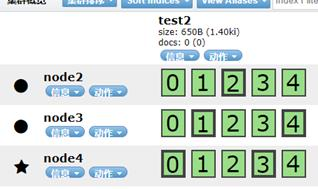

 

curl -XPUT 'http://node2:9200/test3/' -d'{"settings":{"number_of_shards":3,"number_of_replicas":3}}'

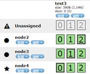

思考如下命令之后会是什么结果？

curl -XPUT 'http://node2:9200/test4/' -d'{"settings":{"number_of_shards":6,"number_of_replicas":4}}'

删除索引库：

curl -XDELETE node3:9200/test4

curl -XDELETE node3:9200/test3

 

