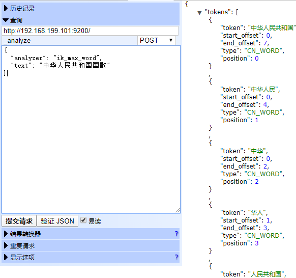
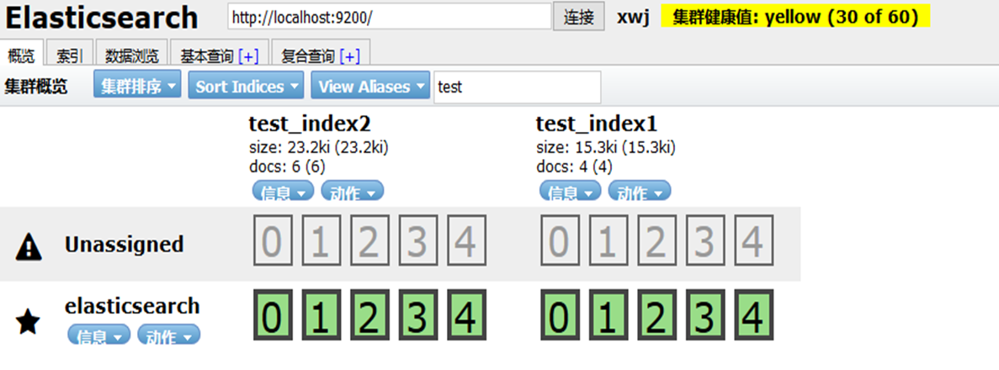
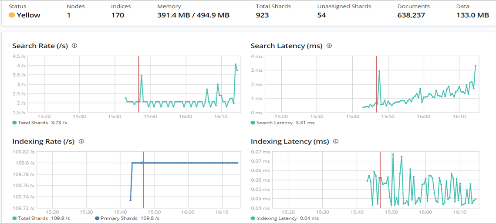

上一节讲述了elasticsearch的查询方式，索引的增删改查，dsl语句查询，dsl分为两种，一种是Query，一种是filter。

本节主要介绍elasticsearch的插件，包括head, kibnan, ik分词,searchguard

<!-- more -->
### ik中文分词插件

 ik_smart: 会做最粗粒度的拆分，比如会将“中华人民共和国国歌”拆分为“中华人民共和国,国歌”，适合 Phrase 查询。
ik_max_word: 会将文本做最细粒度的拆分，比如会将“中华人民共和国国歌”拆分为“中华人民共和国,中华人民,中华,华人,人民共和国,人民,人,民,共和国,共和,和,国国,国歌”，会穷尽各种可能的组合，适合 Term Query；




链接:https://github.com/medcl/elasticsearch-analysis-ik

### elasticsearch-sql插件

```
./bin/elasticsearch-plugin install https://github.com/NLPchina/elasticsearch-sql/releases/download/6.7.0.0/elasticsearch-sql-6.7.0.0.zip
```

```
curl -u admin:admin -X GET "localhost:9200/_sql" -H 'Content-Type: application/json' -d"select * from centerweb-crm_web-20191114   ORDER by op_time desc  limit 0,10"
```

### head插件

安装包：
elasticsearch-head.tar.gz 
nodejs.tar.gz（自己手动制作离线安装环境）链接：https://blog.csdn.net/qq_24570443/article/details/82151056

```
tar -zxvf nodejs.tar.gz 
tar -zxvf elasticsearch-head.tar.gz 
ln -s /home/gpadmin/soft/nodejs/bin/node /usr/local/bin/node
ln -s /home/gpadmin/soft/nodejs/bin/npm /usr/local/bin/npm
ln -s /home/gpadmin/soft/nodejs/bin/grunt  /usr/local/bin/grunt 
node -v
npm -v
grunt -version
启动head
cd /opt/elasticsearch-head/
nohup grunt server &
```

默认访问端口 9100

```
http://localhost:9100/?base_uri=http://localhost:9200&auth_user=admin&auth_password=admin
```





### kibnan插件

安装包：kibana-6.7.0-linux-x86_64.tar.gz

```
elasticsearch.username: "admin"
elasticsearch.password: "admin"
//example-pki-scripts来源于search-guard-ssl目录
elasticsearch.ssl.certificateAuthorities: "/home/ivory/kibana-6.7.0-linux-x86_64/example-pki-scripts/ca/root-ca.pem"
elasticsearch.url: "http://localhost:9200"
server.host: "localhost"
elasticsearch.ssl.verificationMode: none
elasticsearch.requestHeadersWhitelist: [ "Authorization" , "sgtenant" ]
```

默认访问端口 5601 http://localhost:5601/app/kibana
查看和关闭kibana进程

```
netstat -tunlp|grep 9100
tcp        0      0 10.159.114.183:9100     0.0.0.0:*               LISTEN      1576/bin/../node/bi 
 
kill -9 1576
```

启动kibana

```
nohup  bin/kibana &
```




### searchgurad插件

基于用户，角色，权限的配置，实现对集群，索引细粒度的访问控制。通过控制索引名称，实现了多租户功能。
安装包
search-guard-6-6.7.0-24.3.zip
search-guard-ssl-6.7.x.zip

安装search-guard-6-6.7.0-24.3.zip

```
bin/elasticsearch-plugin install -b file:///path/to/search-guard-6-6.7.0-24.3.zip
bin/elasticsearch-plugin install -b com.floragunn:search-guard-6:6.7.0-24.3
```

利用search-guard-ssl-6.7.x.zip生成证书
1.修改example-pki-scripts/example.sh中的密码和根密码changit ，并增加develop用户

```
#!/bin/bash
set -e
./clean.sh
./gen_root_ca.sh 03ccd455f8xxxxxxxxxxxxxxxxxxxxxx ba6f8xxxxxxxxxxx
./gen_node_cert.sh 0 ae003cxxxxxxxxxxx 03ccd455f8xxxxxxxxxxxxxxxxxxxxxx
./gen_client_node_cert.sh spock 06e9faxxxxxxxxxxx 03ccd455f8xxxxxxxxxxx
./gen_client_node_cert.sh kirk 079f95xxxxxxxxxxx 03ccd455f8xxxxxxxxxxxx
./gen_client_node_cert.sh develop 6e88c98xxxxxx  03ccd455f8xxxxxxxxxxxx
rm -f ./*tmp*
```

2.执行example-pki-scripts/example.sh，生成证书
3 ../plugins/search-guard-6/sgconfig下存放kirk-keystore.jks和truststore.jks
4 develop-keystore.jks证书给开发者用于tcp开发
5.elasticsearch-6.7.0/config下存放node-0-keystore.jks和truststore.jks，
6.elasticsearch.yml上配置证书名称和密码

```
searchguard.ssl.transport.enabled: true
searchguard.ssl.transport.keystore_filepath: node-0-keystore.jks
searchguard.ssl.transport.keystore_password: ae003cxxxxxxxxxxx
searchguard.ssl.transport.truststore_filepath: truststore.jks
searchguard.ssl.transport.truststore_password: ba6f8xxxxxxxxxxx
searchguard.ssl.transport.enforce_hostname_verification: false
searchguard.ssl.transport.resolve_hostname: false
searchguard.ssl.http.enabled: false
#searchguard.ssl.http.keystore_filepath: node-0-keystore.jks
#searchguard.ssl.http.keystore_password: ae003cxxxxxxxxxxx
#searchguard.ssl.http.truststore_filepath: truststore.jks
#searchguard.ssl.http.truststore_password: ba6f8xxxxxxxxxxx
```

编辑 ../plugins/search-guard-6/sgconfig/sg_config.yml ,basic_internal_auth_domain下添加transport_auth_domain,用于开发者认证

```
basic_internal_auth_domain: 
        http_enabled: true
        transport_enabled: true
        order: 4
        http_authenticator:
          type: basic
          challenge: true
        authentication_backend:
          type: intern
transport_auth_domain:
        enabled: true
        order: 2
        http_authenticator:
        authentication_backend:
          type: intern
```

sg_internal_users.yml添加develop用户连接和其它用户和权限

```
CN=develop,OU=client,O=client,L=Test,C=DE:
  hash: "_transport_only"
```

```
asiainfo:
  hash: $2a$xxxxxxxxxxxxxxxxxxx
  roles:
    - sg_own_index
```

启动es集群后，手动刷新

```
./sgadmin.sh -ts ../sgconfig/truststore.jks -tspass ba6f8xxxxxxxxx -ks ../sgconfig/kirk-keystore.jks -kspass 079f9544xxxxxxxxx -cd ../sgconfig/ -cn es-cluster -nhnv -p 9300 --accept-red-cluster
```


链接:
https://docs.search-guard.com/latest/authentication-authorization
https://search-guard.com/searchguard-elasicsearch-transport-clients/
https://search-guard.com/elasticsearch-security-first-steps/
https://search-guard.com/transport-client-authentication-authorization/
https://search-guard.com/search-guard-ssl-tls/
https://search-guard.com/elasticsearch-custom-auth-modules/
https://search-guard.com/jwt-secure-elasticsearch/