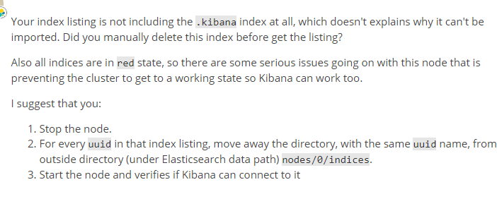

上一节介绍elasticsearch的插件，包括head, kibnan, ik分词,searchguard。

本节主要介绍elasticsearch的系统环境配置，es配置和一些操作和优化命令

<!-- more -->

### 系统环境配置
1. /etc/sysctl.conf
#增加以下参数
```
vm.max_map_count=655360
```
#永久关闭内存交换或设置为1
```
vm.swappiness = 1	
```
执行以下命令，确保生效配置生效：
sysctl -p

2. /etc/security/limits.conf
#增加以下参数
```
* soft nofile 655360
* hard nofile 655360
* soft nproc unlimited
* hard nproc unlimited
* soft memlock unlimited
* hard memlock unlimited
```
3. /etc/security/limits.d/20-nproc.conf
#增加以下参数
```
* soft nproc 65536
```
查看打开文件数（当发现打开文件数不足时，可以用命令查看
```
lsof -u hnivory |wc -l
```
### elasticsearch.yml配置
```
cluster.name: es-cluster
node.name: node1
http.cors.enabled: true 
http.cors.allow-origin: "*"
network.host: 0.0.0.0
http.port: 9200
transport.tcp.port: 9300
http.cors.allow-headers: Authorization,X-Requested-With,Content-Length,Content-Type
xpack.security.enabled: false
searchguard.enterprise_modules_enabled: false
searchguard.restapi.roles_enabled: ["sg_all_access"]
searchguard.ssl.transport.enabled: true
searchguard.ssl.transport.keystore_filepath: node-0-keystore.jks
searchguard.ssl.transport.keystore_password: xxxxx
searchguard.ssl.transport.truststore_filepath: truststore.jks
searchguard.ssl.transport.truststore_password: xxxxx
searchguard.ssl.transport.enforce_hostname_verification: false
searchguard.ssl.transport.resolve_hostname: false

searchguard.ssl.http.enabled: false
#searchguard.ssl.http.keystore_filepath: node-0-keystore.jks
#searchguard.ssl.http.keystore_password: xxxxx
#searchguard.ssl.http.truststore_filepath: truststore.jks
#searchguard.ssl.http.truststore_password: xxxxx

searchguard.authcz.admin_dn:
 - CN=kirk,OU=client,O=client,L=test,C=DE

#关闭searchguard,测试用
searchguard.disabled: true
indices.fielddata.cache.size: 40%
node.max_local_storage_nodes: 2
cluster.routing.allocation.same_shard.host: true
bootstrap.memory_lock: true
xpack.ml.enabled: false
#action.destructive_requires_name: true
discovery.zen.ping.unicast.hosts: ["192.168.8.101:9300", "192.168.8.103:9300", "192.168.8.104:9300"]  
#这个参数控制的是，一个节点需要看到的具有master节点资格的最小数量，然后才能在集群中做操作。官方的推荐值是(N/2)+1，其中N是具有master资格的节点的数量
discovery.zen.minimum_master_nodes: 2 
#控制集群在达到多少个节点之后才会开始数据恢复,通过这个设置可以避免集群自动相互发现的初期,shard分片不全的问题,假如es集群内一共有5个节点,就可以设置为5,那么这个集群必须有5个节点启动后才会开始数据分片,如果设置为3,就有可能另外两个节点没存储数据分片
#gateway.recover_after_nodes: 1
#初始化数据恢复的超时时间,假如gateway.recover_after_nodes参数设置为5,就是5个节点全部启动后,再过5分钟开始数据恢复
#gateway.recover_after_time: 5m
#启动几个节点后开始数据恢复,假如gateway.recover_after_nodes这个参数设置为5,那么等到这5个节点全部启动后直接可以数据恢复,不用等待gateway.recover_after_time设置的时间
#gateway.expected_nodes: 2
举例来说，对于一个有10个data node的集群，如果有以下的设置:
#gateway.expected_data_nodes: 10
#gateway.recover_after_time: 5m
#gateway.recover_after_data_nodes: 8
那么集群5分钟以内10个data node都加入了，或者5分钟以后8个以上的data node加入了，都会立即启动recovery过程。
#配置在每轮ping操作中等待DNS查找的时间。这被指定为时间单位，默认为5秒。。
#discovery.zen.ping.unicast.resolve_timeout
#（默认为30s）确定节点将多久决定开始选举或加入现有的群集之前等待
# discovery.zen.ping_timeout: 30s
#How often a node gets pinged. Defaults to 1s.
#ping_interval
#How long to wait for a ping response, defaults to 30s.
#ping_timeout
#How many ping failures / timeouts cause a node to be considered failed. Defaults to 3.
#ping_retries
#控制fielddata允许内存大小，达到HEAP 40% 自动清理旧cache
#indices.fielddata.cache.size: 40%
#防止同一个shard的主副本存在同一个物理机上（因为如果存在一个机器上，副本的高可用性就没有了
#cluster.routing.allocation.same_shard.host:true
#但仍允许os在紧急情况下发生交换。对于大部分Linux操作系统，可以在sysctl 中这样配置：#vm.swappiness = 1，
#临时修改sysctl vm.swappiness=1 ， 永久修改，vi /etc/sysctl.conf  在这个文档的最后加上这样一行:vm.swappiness=1,保存，重启
#如果上面的方法都不能做到，你需要打开配置文件中的mlockall开关，它的作用就是运行JVM锁住内存，禁止OS交换出去。在elasticsearch.yml配置如下：bootstrap.mlockall: true
```

### 集群参数设置和优化
停止和开启分片分配
```
curl -u admin:admin -X PUT localhost:9200/_cluster/settings {"persistent":{"cluster.routing.allocation.enable":"none"}}
curl -u admin:admin -X PUT localhost:9200/_cluster/settings {"persistent":{"cluster.routing.allocation.enable":"all"}}
```
同步副本分片，刷新到磁盘
```
curl -XPOST http://127.0.0.1:9200/_flush/synced
```
索引段强制合并为1个(*通配符表示全部，也可以具体的索引和其它通配符索引)，**该操作会占用大量资源**，慎重操作
```
curl -u admin:admin -XPOST http://localhost:9200/*/_forcemerge?max_num_segments=1
```
统计节点个数
```
curl -u admin:admin -XGET localhost:9200/_cat/nodes  |wc-l
```
获取节点状态
```
curl -u admin:admin -XGET localhost:9200/_nodes/stats?pretty
```
查看索引分片
```
curl -u admin:admin -XGET http://localhost:9200/_cat/shards/indexname
```
设置节点离开重新分配时间
```
  _all/_settings PUT
  {
  "settings": {
    "index.unassigned.node_left.delayed_timeout": "5m"
  }
}
```
查看集群待处理任务
```
curl -u admin:admin -XGET localhost:9200/_cluster/pending_tasks
```
最大文件描述符
```
curl -u admin:admin -XGET localhost:9200/_nodes/stats/process?filter_path=**.max_file_descriptors
```
关闭/开启监控
```
curl -u admin:admin -XPUT localhost:9200/_cluster/settings   -H 'Content-Type: application/json' -d'{"persistent": {"xpack.monitoring.collection.enabled": false}}'
```
模糊设置副本
```
curl -u admin:admin -XPUT localhost:9200/*-20191127/_settings -H 'Content-Type:application/json'  -d'{"index":{"number_of_replicas":0}}'
```
排除节点(根据ip,节点名称)
```
curl -u admin:admin -XPUT localhost:9200/_cluster/settings  -H 'Content-Type: application/json' -d '{"transient":{"cluster.routing.allocation.exclude._ip":"10.159.102.43"}}'
```
停止排除节点
```
curl -u admin:admin -XPUT localhost:9200/_cluster/settings  -H 'Content-Type: application/json' -d '{"transient":{"cluster.routing.allocation.exclude._ip":""}}'
curl -u admin:admin -XPUT localhost:9200/_cluster/settings  -H 'Content-Type: application/json' -d '{"transient":{"cluster.routing.allocation.exclude._name":""}}'
```
查看磁盘分片分配
```
curl -u admin:admin localhost:9200/_cluster/allocation/explain?pretty
```
查看该节点任务
```
curl -u admin:admin -XGET localhost:9200/_cat/tasks
```
查看节点任务
```
curl -u admin:admin -XGET localhost:9200/_tasks?nodes=esnode_10.159.102.45_9200
  {"nodes":{"YKhjmEw6TP2d-VDCyxCvNA":{"name":"esnode_10.159.102.45_9202","transport_address":"10.159.102.45:9302","host":"10.159.102.45","ip":"10.159.102.45:9302","roles":["master","data","ingest"],"attributes":{"xpack.installed":"true"},"tasks":{"YKhjmEw6TP2d-VDCyxCvNA:90113856":{"node":"YKhjmEw6TP2d-VDCyxCvNA","id":90113856,"type":"netty","action":"cluster:monitor/tasks/lists[n]","start_time_in_millis":1574855877228,"running_time_in_nanos":541054,"cancellable":false,"parent_task_id":"3WMnBj-pTNegdkT19ao5nQ:11035209","headers":{}}}}}}[hnivory@data01 ~]
```
取消任务
```
curl -u admin:admin localhost:9200/_tasks/YKhjmEw6TP2d-VDCyxCvNA:90113856/_cancel
```
取消节点任务和某类型的任务
```
_tasks/_cancel?nodes=esnode_10.159.102.43_9202,esnode_10.159.102.43_9203,esnode_10.159.102.43_9204,esnode_10.159.102.43_9205,&actions=cluster:*
_tasks/_cancel?nodes=esnode_10.159.102.45_9202&actions=cluster:*   POST
_tasks/_cancel?nodes=esnode_10.159.102.45_9202&actions=*reindex    POST
```
 查看节点任务和某类型的任务
```
_tasks?nodes=esnode_10.159.102.45_9202&actions=cluster:*  GET
```

#### 遇到的问题

##### 超过单个字段最大长度32766
```
ava.lang.IllegalArgumentException: Document contains at least one immense term in field="groupTemplateValue" 
(whose UTF8 encoding is longer than the max length 32766), all of which were skipped.  Please correct the analyzer 
to not produce such terms.  The prefix of the first immense term is: '[102, 114, 111, 109, 32, 58, 32, 42, 32, 44, 10, 
42, 32, 58, 32, 36, 78, 85, 77, 32, 44, 10, 98, 111, 111, 108, 32, 58, 32, 123]...', original message: bytes can be at most 
32766 in length; got 102464
```
分析：此问题仅对keyword类型字段
解决办法：
1.更换字段类型为text,
2.添加ignore_above设置
```
"raw_message": {
"ignore_above": 10000,
"type": "keyword"
}
```
##### 任务超出队列,拒绝请求
```
error":{"root_cause":[{"type":"es_rejected_execution_exception","reason":"rejected execution of org.elasticsearch.transport.TransportService$7@215f2351 on EsThreadPoolExecutor[name = node-0/bulk, queue capacity = 200, org.elasticsearch.common.util.concurrent.EsThreadPoolExecutor@587b75c[Running, pool size = 32, active threads = 32, queued tasks = 200, completed tasks = 98211]]"}],"type":"es_rejected_execution_exception","reason":"rejected execution of org.elasticsearch.transport.TransportService$7@215f2351 on EsThreadPoolExecutor[name = node-0/bulk, queue capacity = 200,
```
默认值是200，可设置参数
thread_pool.write.queue_size: 1000
调参数是临时解决办法，需要扩容集群
##### 新加入机器到集群时，写入倾斜到新集群
```
The cluster-level shard allocator tries to spread the shards of a single index across as many nodes as possible. However, depending on how many shards and indices you have, and how big they are, it may not always be possible to spread shards evenly.

The following *dynamic* setting allows you to specify a hard limit on the total number of shards from a single index allowed per node:

    index.routing.allocation.total_shards_per_node

  The maximum number of shards (replicas and primaries) that will be allocated to a single node. Defaults to unbounded.

You can also limit the amount of shards a node can have regardless of the index:

    cluster.routing.allocation.total_shards_per_node

  The maximum number of shards (replicas and primaries) that will be allocated to a single node globally. Defaults to unbounded (-1).

These settings impose a hard limit which can result in some shards not being allocated.
  Use with caution.
```
索引级别设置：单个机器上分配该索引多少个分片，默认无限制
集群级别设置：单个机器上总分片数，默认无限制
注意：设置不合理，可能导致分片无法分配，比如索引有10个分片，只有2个es节点，如果设置单个节点该索引最大值为3，就会导致该索引分片无法分配

https://www.elastic.co/guide/en/elasticsearch/reference/current/allocation-total-shards.html


##### 模糊查询导致Elasticsearch服务宕机
```sql
select * from asiainfo-ceshizhibiao-* where cpu like '%在迪士尼乐园，点亮心中奇梦。它是一个充满创造力、冒险精神与无穷精彩的快地。您可在此游览全球最大的迪士%' 
```
like中字段太长，导致集群挂掉，目前like限制在30个字节
```
[2017-06-14T21:06:39,330][ERROR][o.e.b.ElasticsearchUncaughtExceptionHandler] [xx.xx.xx.xx] fatal error in thread [elasticsearch[xx.xx.xx.xx][search][T#29]], exiting
java.lang.StackOverflowError
at org.apache.lucene.util.automaton.Operations.isFinite(Operations.java:1053) ~[lucene-core-6.2.1.jar:6.2.1 43ab70147eb494324a1410f7a9f16a896a59bc6f - shalin - 2016-09-15 05:15:20]
at org.apache.lucene.util.automaton.Operations.isFinite(Operations.java:1053) ~[lucene-core-6.2.1.jar:6.2.1 43ab70147eb494324a1410f7a9f16a896a59bc6f - shalin - 2016-09-15 05:15:20]
at org.apache.lucene.util.automaton.Operations.isFinite(Operations.java:1053) ~[lucene-core-6.2.1.jar:6.2.1 43ab70147eb494324a1410f7a9f16a896a59bc6f - shalin - 2016-09-15 05:15:20]
at org.apache.lucene.util.automaton.Operations.isFinite(Operations.java:1053) ~[lucene-core-6.2.1.jar:6.2.1 43ab70147eb494324a1410f7a9f16a896a59bc6f - shalin - 2016-09-15 05:15:20]
```
##### Can not be imported as a dangling index 

https://discuss.elastic.co/t/how-to-resolve-dangling-indices-error-on-each-index/130609/11
1.找到索引对应的uuid，
2.在报错的es节点上删除对应的本地存储nodes/0/indices/{uuid}文件


