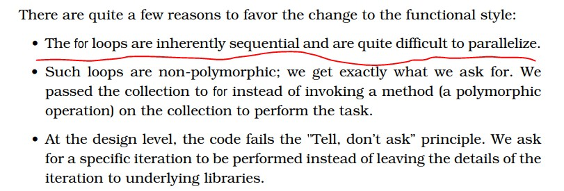

Java函数式编程，有代码有例子，java函数式编程的好书



<!-- more -->

### 21





### 32 the compiler will convert the lambda expression to an instance of the appropriate functional interface.





### 36 lambda express  来源及作用，参数，操作













### 38 bad for lop


### 40 Using Method References


### 44 filter参数Predicate








### 48 Function Predicate


### 50 Optional




### 68 collect()






### 89 compose()


### 93 default()


### 98 load pattern 借贷模式


### 100 异常处理












### 112 参数Runnable 用lambda表示等于 () -> {}




### 120 supplier




### 153 To the Function Style






### 168 总结 Syntax Overview




















