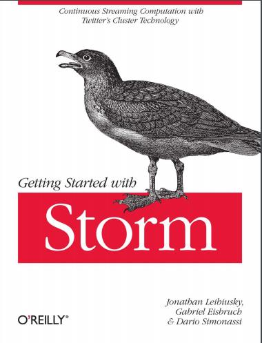
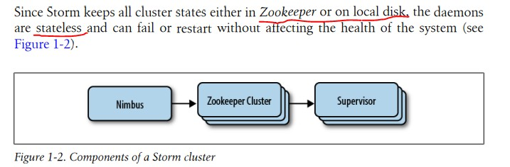
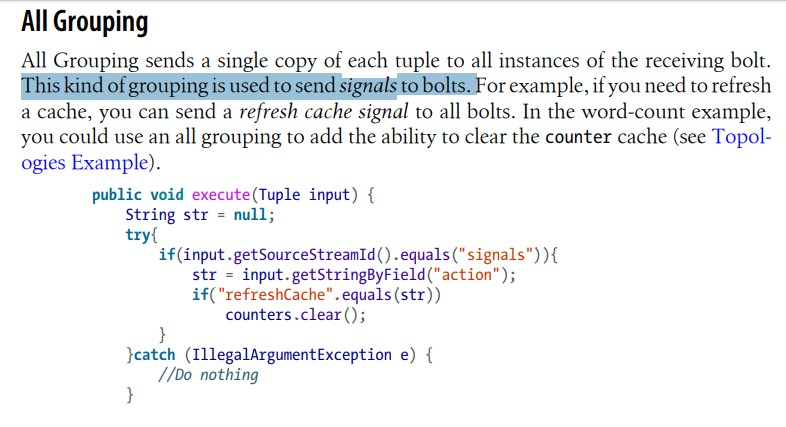
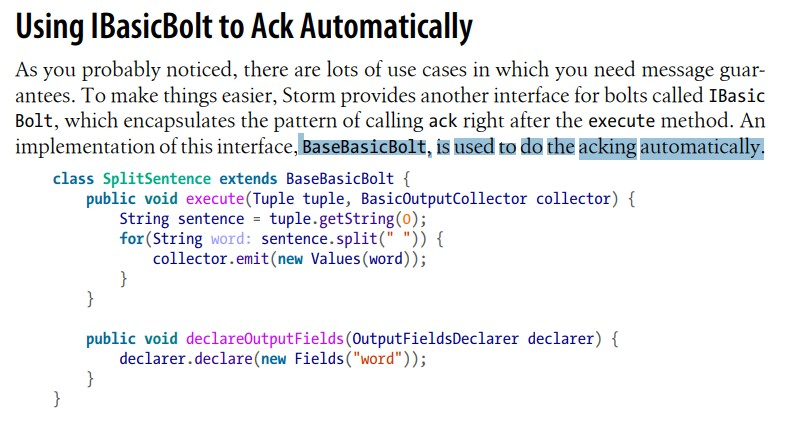

听名字就知道是Storm入门书籍



<!-- more -->

### 15 storm保存所有状态在zookeeper或者硬盘上，所以守护进程Nimbus是无状态的,失败或重启不影响系统健康状态



### 34 All Grouping：一般用于发送信号



### 54  BaseBasicBolt, is used to do the acking automatically



