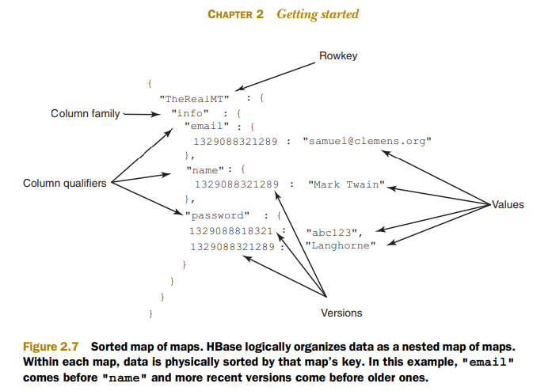
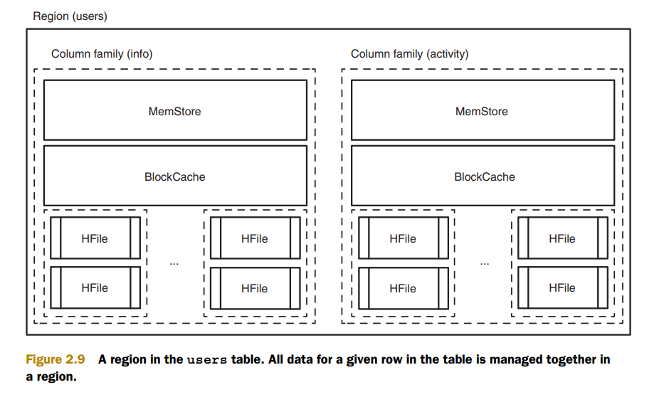
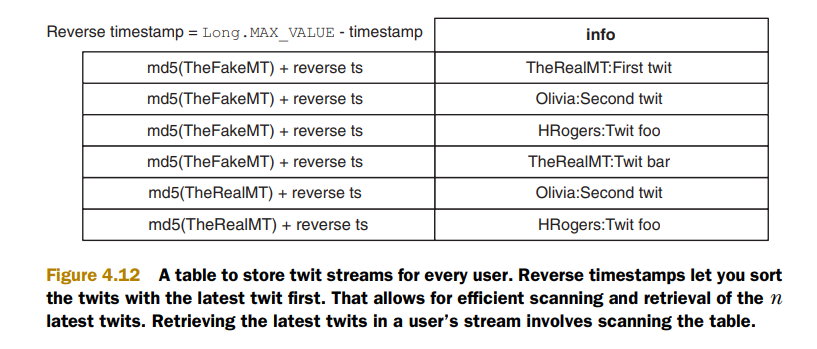

#### 18/362  hbase客户端只有get,put,scan，难道你想写一本只有三个api调用的书？

> the idea of writing HBase in Action for Manning came up. We initially scoffed at the thought of writing a book on HBase, and I remember saying to Nick,**"It’s gets, puts, and scans—there’s not a lot more to HBase from the client side. Do you want to write a book about three API calls?”** 

<!-- more-->

#### 30  rowkey, columnkey, and timestamp三个维度

> HBase is a database: the Hadoop database. It’s often described as a sparse, distributed, persistent, multidimensional sorted map, which is indexed by    **rowkey, column key, and timestamp** . You’ll hear people refer to it as a key value store, a column family-oriented database, and sometimes a database storing versioned maps of maps. All these descriptions are correct. But fundamentally, it’s a platform for storing and retrieving data with random access, meaning you can write data as you like and read it back again as you need it. HBase stores structured and semistructured data naturally so you can load it with tweets and parsed log files and a catalog of all your products right along with their customer reviews. It can store unstructured data too, as long as it’s not too large. It doesn’t care about types and allows for a dynamic and flexible data model that doesn’t constrain the kind of data you store.

#### 41  选取HBase的主要因素是并发

>When looking for ways to expand its database arsenal to include distributed database systems, Salesforce evaluated the full spectrum of NoSQL technologies before deciding to implement HBase.**The primary factor in the choice was consistency**. Bigtable-style systems are the only architectural approach that combines seamless horizontal scalability with strong record-level consistency. Additionally, Salesforce already used Hadoop for doing large offline batch processing, so the company was able to take advantage of in-house expertise in running and administering systems on the Hadoop stack.

#### 53 因为hbase是无模式的，你不用事先定义列名和类型

> Remember, HBase uses coordinates to locate a piece of data within a table. The rowkey is the first coordinate, followed by the column family. When used as a data coordinate, the column family serves to group columns. The next coordinate is the column qualifier, often called simply column, or qual, once you’re versed in HBase vernacular. The column qualifiers in this example are name, email, and password. **Because HBase is schema-less, you never need to predefine the column qualifiers or assign them types. They’re dynamic; **all you need is a name that you give them at write time. These three coordinates define the location of a cell. The cell is where HBase stores data as a value. A cell is identified by its [rowkey, column family, column qualifier] coordinate within a table. The previous code stores three values in three cells within a single row. The cell storing Mark’s name has the coordinates [TheRealMT, info, name]. The last step in writing data to HBase is sending the command to the table. That part is easy:

#### 56 块是最小的检索单元和从磁盘上读取的最小数据单元，默认是64KB,大小取决于你的使用情况 ,如果是随机查，适合小块，如果是连续扫描数据，更适合大块
> Understanding the BlockCache is an important part of understanding how to run HBase at optimal performance. The “Block” in BlockCache is the unit of data that HBase reads from disk in a single pass. The HFile is physically laid out as a sequence of blocks plus an index over those blocks. This means reading a block from HBase requires only looking up that block’s location in the index and retrieving it from disk. **The block is the smallest indexed unit of data and is the smallest unit of data that can be read from disk.** The block size is configured per column family, and the default value is 64 KB. You may want to tweak this value larger or smaller depending on your use case. If you primarily perform random lookups, you likely want a more granular block index, so a smaller block size is preferred. Having smaller blocks creates a larger index and thereby consumes more memory**.   If you frequently perform sequential scans, reading many blocks at a time, you can afford a larger block size. This allows you to save on memory because larger blocks mean fewer index entries and thus a smaller index.**

> Reading a row from HBase requires first checking the MemStore for any pending modifications. Then the BlockCache is examined to see if the block containing this row has been recently accessed. Finally, the relevant HFiles on disk are accessed. There are more things going on under the hood, but this is the overall outline. Figure 2.2 illustrates the read path.

#### 60 HBase数据是四维的 rowkey, column family, column qualifier, and version

> In the logical data model, the version number is also part of the coordinates of a piece of data. You can think of a relational database as storing a piece of data in a table in a 2D coordinate system based first on row and second on column. By that analogy, HBase stores a piece of data in a table based on a 4D coordinate system. The coordinates used by HBase, in order, are **rowkey, column family, column qualifier, and version.** Figure 2.4 illustrates these coordinates in our users table. Considering the full set of coordinates as a unit, you can think of HBase as a keyvalue store. With this abstraction of the logical data model in mind, you can consider the coordinates as a key and the cell data as the value (see figure 2.5). The HBase API is built such that you aren’t required to provide the entire coordinate path when requesting data. If you omit the version in your Get request, HBase

#### 66 HBase的数据结构其实可以看作是排序的map的map

> 2.5.1 Logical model: sorted map of maps 
>
> There are a number of valid descriptions for the logical data model used in HBase. Figure 2.6 illustrated that model as a key-value store. The next model we’ll consider is a sorted map of maps. Presumably you’re familiar with a map or dictionary structure from your favorite programming language. Think of HBase as an unlimited, persisted, nested version of that structure. We’ll start with this map of maps idea. You’ve seen the coordinate system HBase uses to identify data in a cell: [rowkey, column family, column qualifier, version]. For an example, take Mark’s record from the users table (figure 2.7).

> While thinking of this map of maps, consider those coordinates from the inside out. You can think of a cell as a map keyed on version with the stored data as the value. One layer up, a column family is a map keyed on column qualifier with the cell as the value. At the top, a table is a map keyed on rowkey to the column family. Described in Java, you’d have this monstrosity:  **Map<RowKey, Map<ColumnFamily, Map<ColumnQualifier,Map<Version, Data>>>>**. It’s not pretty, but it’s simple. 
>
> Notice also we said it’s a sorted map of maps. The example shows only a single record, but even there the sorting is present. Notice the two versions in the password cell. The newest version is sorted before the later versions. HBase sorts the version timestamp in descending order so the newest data is always on top. This physical design decision results in slightly faster access to recent versions. The other map keys are sorted in ascending order. The current example doesn’t display this behavior, so let’s insert a couple records and see what it looks like:

#### 69 每个列族对应不同的HFile

#### 126 指定列族可以让客户端访问特定的HFiles,减小I/O

> When you execute a Get, you can skip to the exact block that contains the row you’re looking for. From there, it scans the block to find the relevant KeyValue objects that form the row. In the Get object, you can also specify the column family and the column qualifiers if you want**. By specifying the column family, you can limit the client to accessing only the HFiles for the specified column families.**Specifying the column qualifier doesn’t play a role in limiting the HFiles that are read off the disk, but it does limit what’s sent back over the wire. If multiple HFiles exist for a column family on a given region, all of them are accessed to find the components of the row you specify in the Get call. This access is regardless of how many HFiles contain data relevant to the request. Being as specific as possible in your Get is useful, though, so you don’t transfer unnecessary data across the wire to the client. The only cost is potential disk I/O on the RegionServer. If you specify timestamps in your Get object, you can avoid reading HFiles that are older than that timestamp. Figure 4.11 illustrates this in a simple table. 

#### 129 反转时间戳

#### 136 hbase和数据库属性对比，数据库主键对应HBase rowkey,HBase没有组合键，通常多个属性组成rowkey

> ATTRIBUTES 
>
> To map attributes to HBase, you must distinguish between (at least) two types:
>
>  ■ Identifying attribute—This is the attribute that uniquely identifies exactly one instance of an entity (that is, one row). In relational tables, this attribute forms the table’s primary key. In HBase, this becomes part of the rowkey, which, as you saw earlier in the chapter, is the most important thing to get right while designing HBase tables. 
>
> Often an entity is identified by multiple attributes. This maps to the concept of compound keys in relational database systems: for instance, when you define relationships. In the HBase world, the identifying attributes make up the rowkey, as you saw in the tall version of the follows table. The rowkey was formed by concatenating the user IDs of the users that formed the relationship**. HBase doesn’t have the concept of compound keys,** so both identifying attributes had to be put into the rowkey. 
>
> Using values of fixed length makes life much easier. Variable lengths mean you need delimiters and escaping logic in your client code to figure out the composite attributes that form the key. Fixed length also makes it easier to reason about start and stop keys. A way to achieve fixed length is to hash the individual attributes as you did in the follows table. 
>
> **NOTE It’s common practice to take multiple attributes and make them a part of the rowkey, which is a byte[]. Remember, HBase doesn’t care about types. **
>
> ■ Non-identifying attribute—Non-identifying attributes are easier to map. They basically map to column qualifiers in HBase. For the users table that you built earlier in the book, non-identifying attributes were things like the password and the email address. No uniqueness guarantees are required on these attributes.
