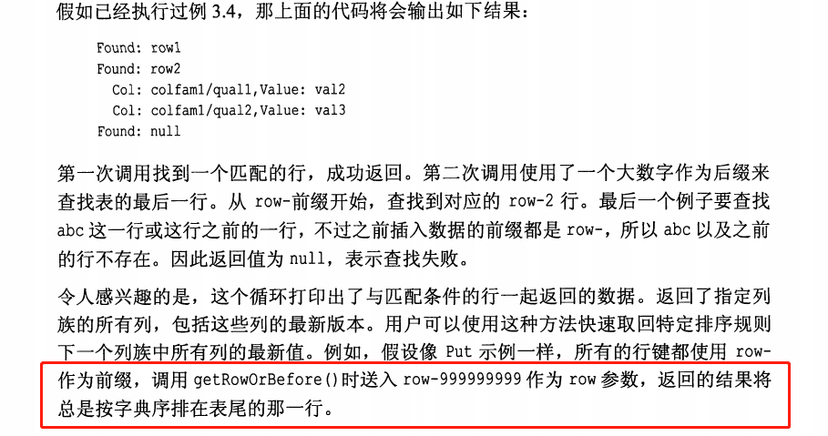
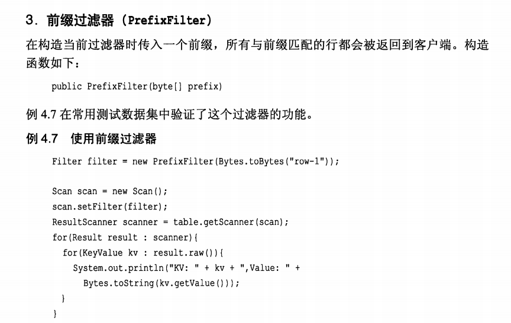
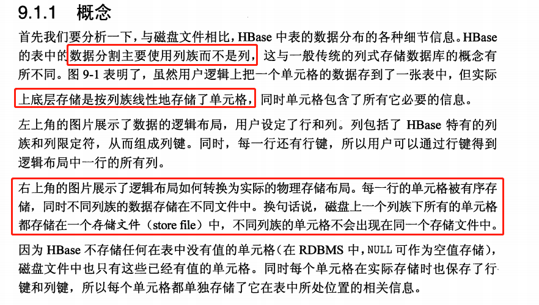
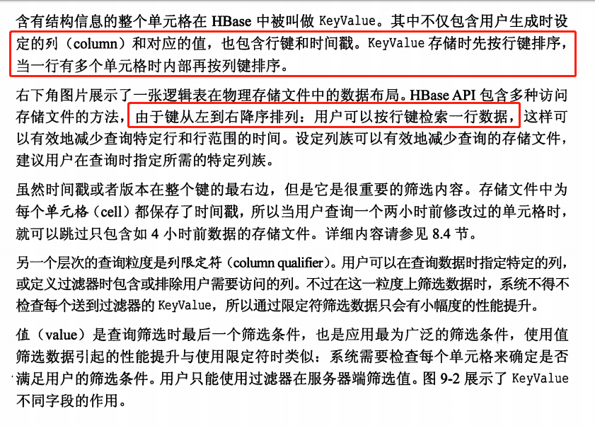
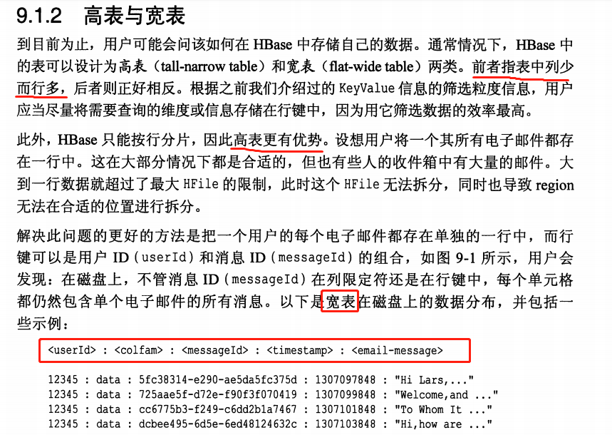
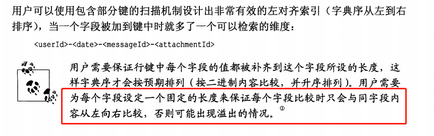

#### 29/504

33/554

> Note, though, that HBase is not a column-oriented database in the typical RDBMS sense, but utilizes an on-disk column storage format. This is also where the majority of similarities end, because although HBase stores data on disk in a column-oriented format, it is distinctly different from traditional columnar databases: whereas columnar databases excel at providing real-time analytical access to data, HBase excels at providing key-based access to a specific cell of data, or a sequential range of cells.

<!-- more-->

