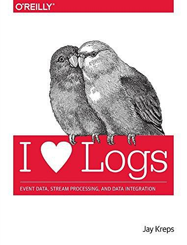



一本讲日志的短书，虽然这本书中所阐述的模式和思想在今天看来已经非常普及了，但是作为这套思想早期的启蒙书，它在当时为很多互联网领域的大佬打开了天眼,  内容很赞，放到四年前的确是奇书，不过今天来看，很多内容早已普及.

<!-- more -->

日志的使用从ACID数据库（atomicity 原子性，consistency一致性 ，isolation隔离性和durability持久性）的特性实现细节发展为在数据库之间复制数据的方法。事实证明，数据库中发生的更改顺序正是保持远程副本数据库同步所需的。Oracle，MySQL，PostgreSQL和MongoDB都包含日志传送协议，来将日志的一部分传输到从属的副本数据库中。然后，从服务器中将日志所记录的更改应用于本地数据结构，以保持与主服务器同步

对于所有分布式系统，最基本的问题之一就是数据库日志解决的相同问题（例如，将数据分发给副本并同意更新顺序）。

分布式日志可以看作是模拟共识问题的数据结构。

使用Paxos时，通常使用称为“ multi-paxos”的协议扩展来完成，该协议将日志建模为一系列共识问题，每个问题对应一个日志。

源代码管理与数据库之间有着密切的关系。版本控制解决了与分布式数据系统必须解决的非常相似的问题

日志的实用性都来自于日志提供的简单功能：生成持久的，可重播的历史记录。

对于所有分布式系统，最基本的问题之一就是数据库日志解决的相同问题（例如，将数据分发给副本并同意更新顺序）

从这个意义上讲，您可以将表和事件视为一对：表支持静态数据，日志捕获更改行为。日志的神奇之处在于，如果它是更改的完整日志，则它不仅可以保存表最终版本的内容，而且还可以重新创建可能已经存在的所有其他版本。实际上，它是对表的每个先前状态的一种备份。

这可能会使您想起代码版本控制。源代码管理与数据库之间有着密切的关系。版本控制解决了与分布式数据系统必须解决的非常相似的问题：管理状态的分布式并发更改。

“日志”是“流”的另一个词，而日志是流处理的核心。

为什么要翻译 I ❤ Logs这本书 - 简书 https://www.jianshu.com/p/b541ea186647

## 

- > Chapter 1. Introduction

  - > At this point you might be wondering, “Why is it worth talking about something sosimple?” How is an append-only sequence of records in any way related to data systems?The answer is that logs have a specific purpose: they record what happened and when. Fordistributed data systems this is, in many ways, the very heart of the problem.

  - > Over time, the usage of the log grew from an implementation detail of the ACID databaseproperties (atomicity, consistency, isolation, and durability) to a method for replicatingdata between databases. It turns out that the sequence of changes that happened on thedatabase is exactly what is needed to keep a remote replica database in sync.

  - > Figure 1-3. In the primary backup model, a master node is chosen tohandle all reads and writes. In the state machine replicatio model, allnodes act as peers.

  - > The distributed log can be seen as the data structure that models the problem of consensus.

  - > The log is much more prominent in other protocols such asZAB, RAFT, and Viewstamped Replication, which directly model the problem ofmaintaining a distributed, consistent log.

  - > In reality, the consensus problem is a bit too simple. Computer systems rarelyneed to decide a single value, they almost always handle a sequence of requests. So a log,rather than a simple single-value register, is the more natural abstraction.

  - > if you have a table taking updates, you can recordthese changes and publish a changelog of all the updates to the state of the table. Thischangelog is exactly what you need to support near-real-time replicas. In this sense, youcan see tables and events as dual: tables support data at rest and logs capture change. Themagic of the log is that if it is a complete log of changes, it holds not only the contents ofthe final version of the table, but can also recreate all other versions that might haveexisted. It is, effectively, a sort of backup of every previous state of the table.

- > Chapter 2. Data Integration

  - > Event data records things that happen rather than things that are.

  - > if you compare any twomessaging systems that both promise publish-subscribe, you find that they guarantee verydifferent things, and most models are not useful in this domain. You can think of the log asacting as a kind of messaging system with durability guarantees and strong orderingsemantics.

  - > For a long time, Kafka was a little unique (some would say odd) as an infrastructureproduct — neither a database nor a log file collection system nor a traditional messagingsystem.

  - > A data warehouse containing clean, integrated data is a phenomenal asset, but themechanics of getting this are a bit out of date.

  - > But having a batch system be the onlyrepository of clean, complete data means the data is unavailable for systems requiring areal-time feed: real-time processing, search indexing, monitoring systems, and so on.

  - > We used a few tricks in Kafka to support this kind of scale:Partitioning the logOptimizing throughput by batching reads and writesAvoiding needless data copies

  - > Lack of global order across partitions is a limitation, but we have not found it to be amajor one. Indeed, interaction with the log typically comes from hundreds or thousands ofdistinct processes, so it is not meaningful to talk about a total order over their behavior.Instead, the guarantees that we provide are that each partition is order preserving, andKafka guarantees that appends to a particular partition from a single sender will bedelivered in the order they are sent.

  - > A log, like a filesystem, is easy to optimize for linear read and write patterns. The log cangroup small reads and writes together into larger, high-throughput operations.

- > Chapter 3. Logs and Real-Time Stream Processing

  - > Itturns out that “log” is another word for “stream” and logs are at the heart of streamprocessing.

  - > So why has the traditional view of stream processing been as a niche application? I thinkthe biggest reason is that a lack of real-time data collection made continuous processingsomething of a theoretical concern.

  - > Why do you need a log at all in stream processing? Why not have the processorscommunicate more directly using simple TCP or other lighter-weight messagingprotocols? There are a couple of strong reasons to favor this model.

  - > The final use of the log is arguably the most important, and that is to provide buffering andisolation to the individual processes.

  - > This leaves the only real option: buffering. The log acts as a very, very large buffer thatallows the process to be restarted or fail without slowing down other parts of theprocessing graph.

- > Chapter 4. Building Data Systems with Logs

