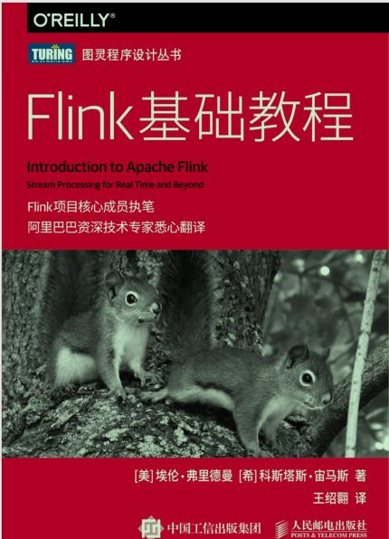
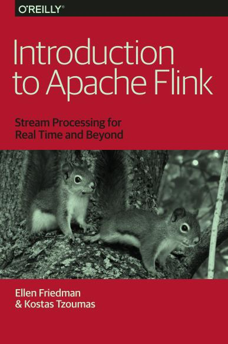

Flink基础知识讲解的很深入，

Flink基础知识讲解的很深入，时间，水印，窗口等概念讲解的很透彻，没有源码(概念基础也不需要源码)，目前只看了中文版，没看英文版



<!-- more -->

## Flink基础教程

- > 第 1 章为何选择Flink

  - > 1.3 流处理技术的演变

  - > Apache Storm 项目（以下简称 Storm）是流处理先锋

  - > Storm 提供了低延迟的流处理，但是它为实时性付出了一些代价：很难实现高吞吐，并且其正确性没能达到通常所需的水平。换句话说，它并不能保证 exactly-once；即便是它能够保证的正确性级别，其开销也相当大。

  - > 对低成本规模化的需求促使人们开始使用分布式文件系统，例如 HDFS和基于批量数据的计算系统（MapReduce 作业）。但是这种系统很难做到低延迟。用 Storm 开发的实时流处理技术可以帮助解决延迟性的问题，但并不完美。其中的一个原因是，Storm 不支持 exactly-once 语义，因此不能保证状态数据的正确性，另外它也不支持基于事件时间的处理。

  - > 在低延迟和高吞吐的流处理系统中维持良好的容错性是非常困难的，但是为了得到有保障的准确状态，人们想出了一种替代方法：将连续事件中的流数据分割成一系列微小的批量作业。如果分割得足够小（即所谓的微批处理作业），计算就几乎可以实现真正的流处理。因为存在延迟，所以不可能做到完全实时，但是每个简单的应用程序都可以实现仅有几秒甚至几亚秒的延迟。这就是在 Spark 批处理引擎上运行的 Apache Spark Streaming
    > 8 ｜ 第 1 章（以下简称 Spark Streaming）所使用的方法。更重要的是，使用微批处理方法，可以实现 exactly-once 语义，从而保障状态的一致性。如果一个微批处理作业失败了，它可以重新运行。这比连续的流处理方法更容易。Storm Trident 是对 Storm 的延伸，它的底层流处理引擎就是基于微批处理方法来进行计算的，从而实现了 exactly-once 语义，但是在延迟性方面付出了很大的代价。

    > 8 ｜ 第 1 章（以下简称 Spark Streaming）所使用的方法。更重要的是，使用微批处理方法，可以实现 exactly-once 语义，从而保障状态的一致性。如果一个微批处理作业失败了，它可以重新运行。这比连续的流处理方法更容易。Storm Trident 是对 Storm 的延伸，它的底层流处理引擎就是基于微批处理方法来进行计算的，从而实现了 exactly-once 语义，但是在延迟性方面付出了很大的代价。

  - > 这种技术的潜在问题是，时间由系统中生成小批量作业的那一部分全权控制。Spark Streaming 等一些流处理框架在一定程度上弱化了这一弊端，但还是不能完全避免。

- > 第 2 章流处理架构

  - > 具有持久性的好处之一是消息可以重播。这个功能使得像 Flink 这样的处理器能对事件流中的某一部分进行重播和再计算（第 5 章会详细介绍）。正是由于消息传输层和流处理层相互作用，才使得像 Flink 这样的系统有了准确处理和“时空穿梭”（指重新处理数据的能力）的保障，认识到这一点至关重要。

  - > 流处理架构不需要集中式数据库。取而代之的是消息队列，它作为共享数据源，服务于各种不同的消费者。

- > 第 3 章Flink的用途

  - > 处理时间事件时间图 3-3：从处理时间切换到事件时间，让许多计算工作完成得更好。用处理时间来计算会导致错误，用事件时间则能得到正确的结果（图片来源：Jamie Grier 于2016 年 5 月在 OSCON 大会上所做的演示）

- > 第 4 章对时间的处理

  - > 用流处理器编程和用批处理器编程最关键的区别在于对时间的处理。

  - > 通常还有第 3 个时间概念，即摄取时间，也叫作进入时间。它指的是事件进入流处理框架的时间。缺乏真实事件时间的数据会被流处理器附上时间戳，即流处理器第一次看到它的时间（这个操作由 source 函数完成，它是程序的第一个处理节点）。

  - > 在 Flink 中，一分钟滚动窗口的定义如下。stream.timeWindow(Time.minutes(1))
    > 对时间的处理 ｜ 43每半分钟（即 30 秒）滑动一次的一分钟滑动窗口如下所示。stream.timeWindow(Time.minutes(1), Time.seconds(30))

    > 对时间的处理 ｜ 43每半分钟（即 30 秒）滑动一次的一分钟滑动窗口如下所示。stream.timeWindow(Time.minutes(1), Time.seconds(30))

  - > Flink 是目前唯一 2 支持会话窗口的开源流处理器

  - > 在 Flink 中，会话窗口由超时时间设定，即希望等待多久才认为会话已经结注 2： 作者在此处描述的是 2016 年的情况。目前，Apache Beam 和 Apache Spark 也支持会话窗口。——译者注
    > 44 ｜ 第 4 章束。举例来说，以下代码表示，如果用户处于非活动状态长达 5 分钟，则认为会话结束。stream.window(SessionWindows.withGap(Time.minutes(5))

    > 44 ｜ 第 4 章束。举例来说，以下代码表示，如果用户处于非活动状态长达 5 分钟，则认为会话结束。stream.window(SessionWindows.withGap(Time.minutes(5))

  - > Flink 还提供触发机制。触发器控制生成结果的时间，即何时聚合窗口内容并将结果返回给用户。每一个默认窗口都有一个触发器。例如，采用事件时间的时间窗口将在收到水印时被触发。对于用户来说，除了收到水印时生成完整、准确的结果之外，也可以实现自定义的触发器（例如每秒提供一次近似结果）。

  - > 图 4-7：流处理架构拥有时空穿梭（即重新处理数据）的能力。流处理器支持事件时间，这意味着将数据流“倒带”，用同一组数据重新运行同样的程序，会得到相同的结果若要按时间回溯并正确地重新处理数据，流处理器必须支持事件时间。如果窗口的设定是根据系统时间而不是时间戳，那么每次运行同样的程序，都会得到不同的结果。事件时间使数据处理结果具有确定性，因为用同一组数据运行同样的程序，会得到相同的结果。

  - > Flink 通过水印来推进事件时间。水印是嵌在流中的常规记录，计算程序通过水印获知某个时间点已到。对于上述一分钟滚动窗口，假设水印标记时间为 10:01:00（或者其他时间，如 10:03:43），那么收到水印的窗口就知道不会再有早于该时间的记录出现，因为所有时间戳小于或等于该时间的事件都已经到达。这时，窗口可以安全地计算并给出结果（总和）。水印使事件时间与处理时间完全无关。迟到的水印（“迟到”是从处理时间的角度而言）并不会影响结果的正确性，而只会影响收到结果的速度。

  - > 设定水印通常需要用到领域知识。举例来说，如果知道事件的迟到时间不会超过 5 秒，就可以将水印标记时间设为收到的最大时间戳减去 5 秒。另一种做法是，采用一个 Flink 作业监控事件流，学习事件的迟到规律，并以此构建水印生成模型。

- > 第 5 章有状态的计算

  - > 最先保证 exactly-once 的系统（Storm Trident 和 Spark Streaming）在性能和表现力这两个方面付出了很大的代价。为了保证 exactly-once，这些系统无法单独地对每条记录运用应用逻辑，而是同时处理多条（一批）记录，保证对每一批的处理要么全部成功，要么全部失败。这就导致在得到结果前，必须等待一批记录处理结束。因此，用户经常不得不使用两个流处理框架（一个用来保证 exactly-once，另一个用来对每个元素做低延迟处理），结果使基础设施更加复杂。曾经，用户不得不在保证 exactly-once 与获得低延迟和效率之间权衡利弊。

  - > 检查点屏障和普通记录类似。它们由算子处理，但并不参与计算，而是会触发与检查点相关的行为。当读取输入流的数据源（在本例中与 keyBy 算子内联）遇到检查点屏障时，它将其在输入流中的位置保存到稳定存储中。如果输入流来自消息传输系统（Kafka 或 MapR Streams），这个位置就是偏移量

  - > 图 5-4：当 Flink 数据源（在本例中与 keyBy 算子内联）遇到检查点屏障时，它会将其在输入流中的位置保存到稳定存储中

  - > 图 5-5：位于检查点之前的所有记录（["b",2]、["b",3] 和 ["c",1]）被 map 算子处理之后的情况。此时，稳定存储已经备份了检查点屏障在输入流中的位置（备份操作发生在检查点屏障被输入算子处理的时候）。map 算子接着开始处理检查点屏障，并触发将状态异步备份到稳定存储中这个动作

  - > 状态备份和检查点屏障的位置备份被确认之后，该检查点操作就可以被标记为完成，如图 5-6 所示。我们在无须停止或者阻断计算的条件下，在一个逻辑时间点（对应检查点屏障在输入流中的位置）为计算状态拍了快照。通过确保备份的状态和位置指向同一个逻辑时间点

  - > 图 5-6：检查点操作完成，状态和位置均已备份到稳定存储中。输入流中的所有记录都已处理完成。值得注意的是，备份的状态值与实际的状态值是不同的。备份反映的是检查点的状态

  - > 如果检查点操作失败，Flink 会丢弃该检查点并继续正常执行，因为之后的某一个检查点可能会成功。虽然恢复时间可能更长，但是对于状态的保证依旧很有力。只有在一系列连续的检查点操作失败之后，Flink 才会抛出错误，因为这通常预示着发生了严重且持久的错误

  - > Flink 检查点算法的正式名称是异步屏障快照（asynchronous barrier snapshotting）。该算法大致基于 Chandy-Lamport 分布式快照算法。

  - > 现在回过头看看图 5-11 中的应用程序架构。之所以本例需要有输出存储系统，是因为外部无法访问 Flink 的内部状态，所以输出存储系统成了查询目标。但是，如果可以直接查询状态，则在某些情况下根本就不需要输出存储系统，因为状态本身就已经包含了查询所需的信息。这种情况在许多应用程序中真实存在，直接查询状态可以大大地简化架构，同时大幅提升性能

  - > Spark Streaming 遇到了吞吐量和延迟性难两全的问题。随着批处理作业规模的增加，延迟升高。如果为了降低延迟而缩减规模，吞吐量就会减少。Storm 和 Flink 则可以在吞吐量增加时维持低延迟

  - > Storm 能够承受每秒 40 万事件，但受限于 CPU；Flink 则可以达到每秒 300万事件（7.5 倍），但受限于 Kafka 集群和 Flink 集群之间的网络。

- > 第 6 章批处理：一种特殊的流处理

- > 附 录其他资源

  - > The Essential Guide to Streaming-first Processing with Apache Flink

