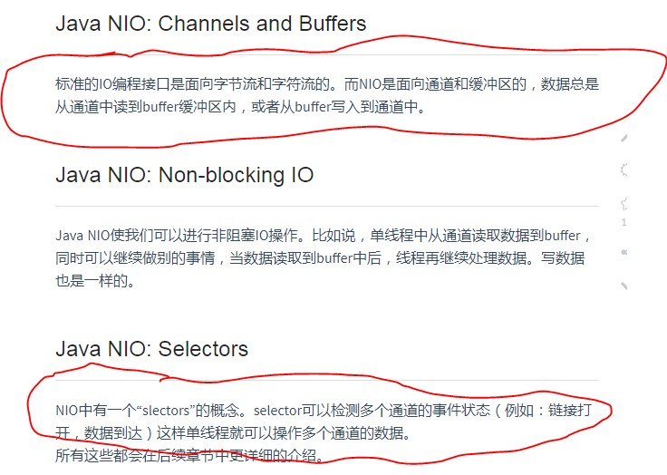
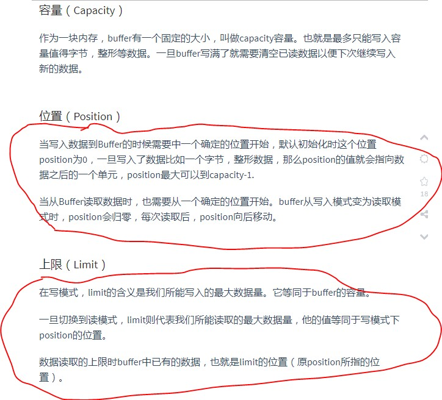
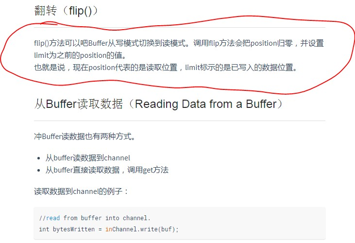
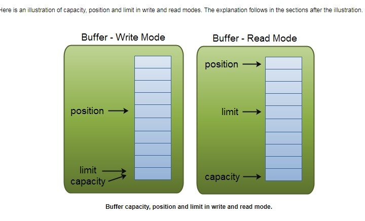
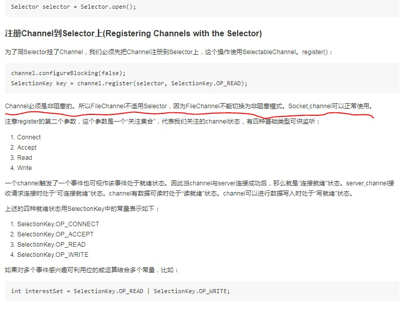

一位老外写的nio系列教程，教程质量整体非常不错，中文版由极客翻译
中文版 https://wiki.jikexueyuan.com/project/java-nio-zh/
英文版 http://tutorials.jenkov.com/java-nio/index.html 

<!-- more -->

### Channel 通道



### buffer 缓冲区







### Selector 选择器



