OReilly出口，Spark流式计算解读

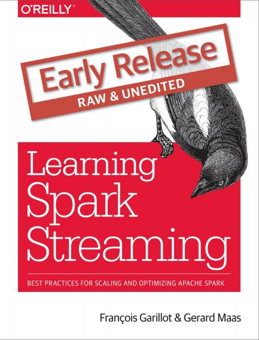
<!-- more -->

### 160 Spark Streaming’s output is often envisioned jointly with Dataframes

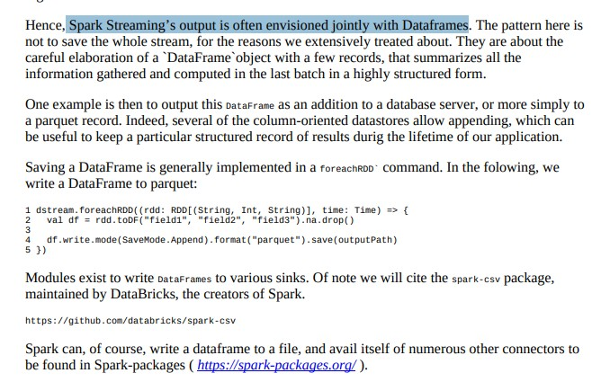
### 160 将dstream转成dataframe后按时间存储

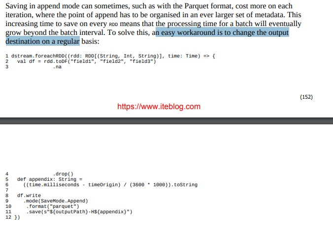
### 206 checkpoint时间点设置

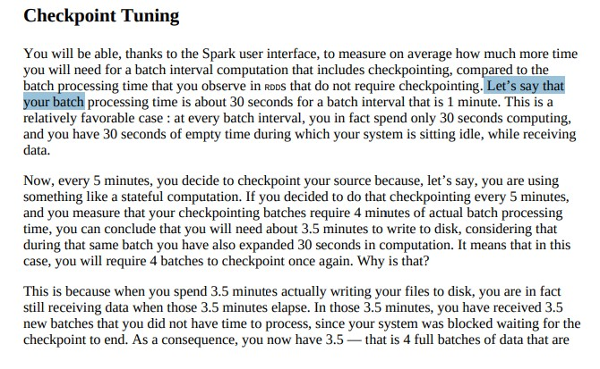

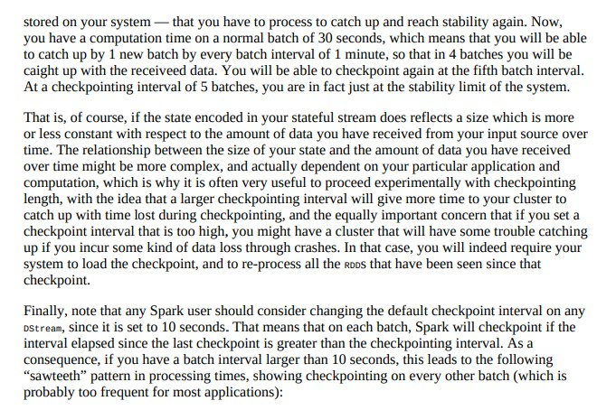
### 233 结果存储到hdfs 考虑其窗口数据接近hdfs分区数据128M

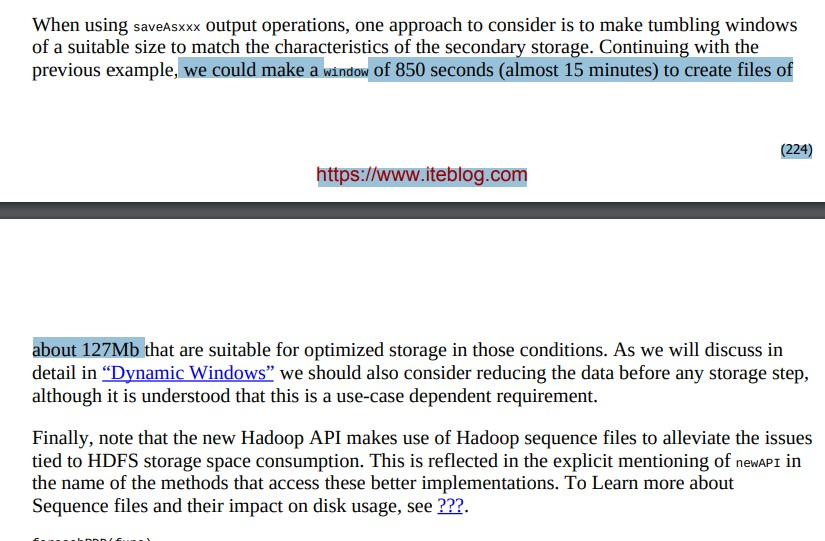
### 233 foreachRDD

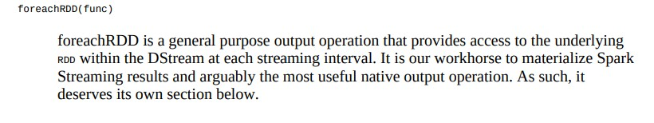

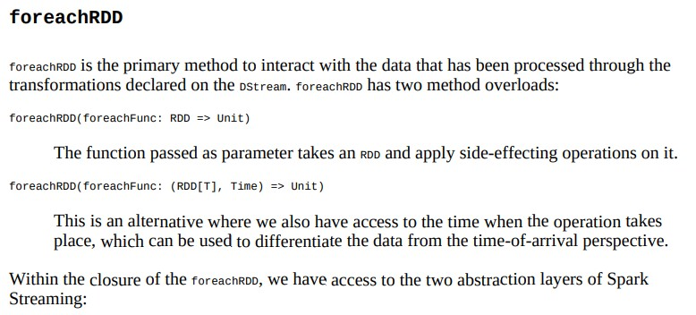

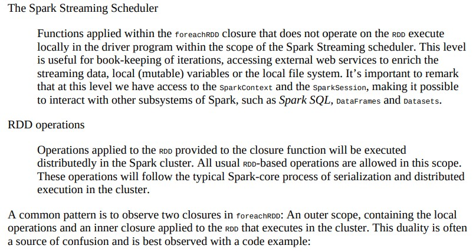

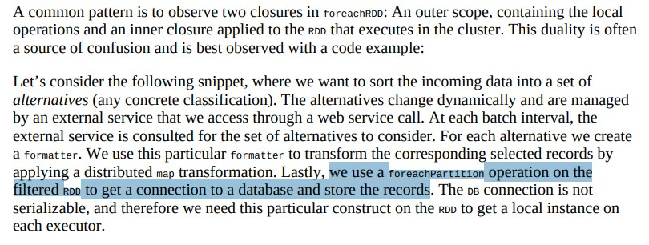
### 235 foreachRDD示例

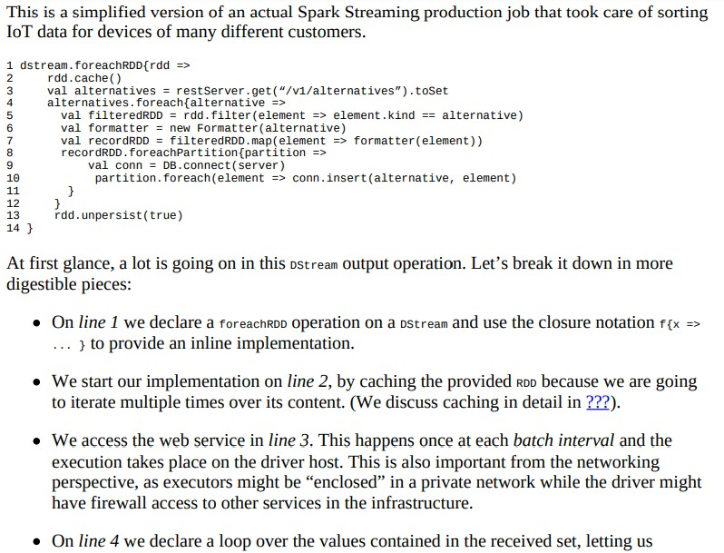

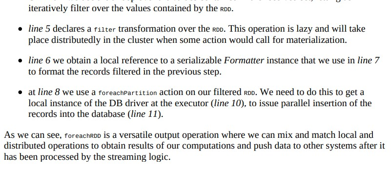
### 236 支持存储到kafka,es

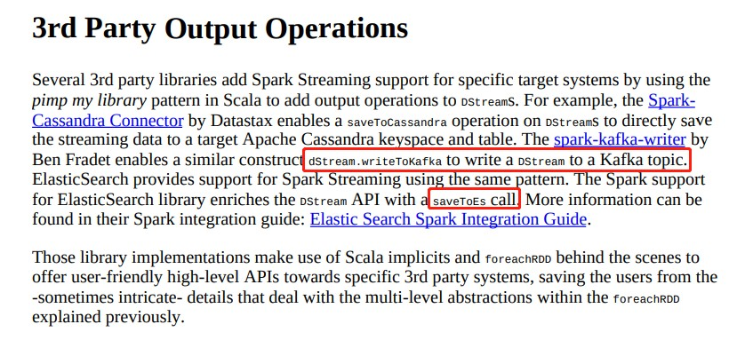
### 246 join操作，broadcast join

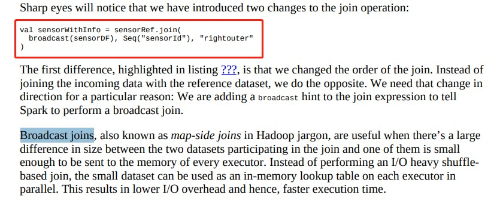
