Storm基础知识，由浅入深，学习storm不错的书


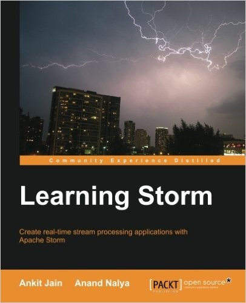

<!-- more -->

### 26 如果没有emit a tuple，storm会等待1毫秒重新调用

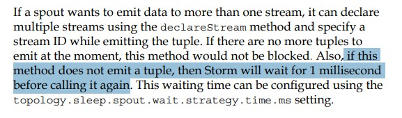

### 26 storm nexttuple,ack,fail占用一个线程，不能block阻塞

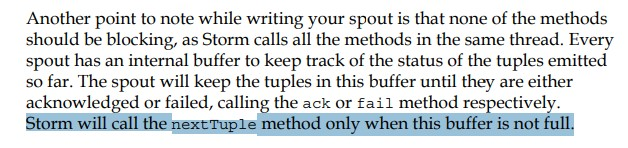

### 27 2个流时你可以等待另一个tuple过来后再emit

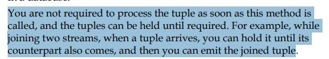

### 27 prepare方法调用时间

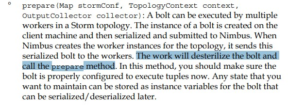

### 47 zookeeper只有主节点负责写，从节点只读

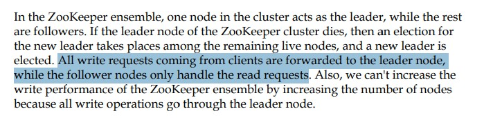

### 59 rebalance command

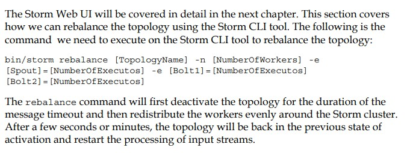

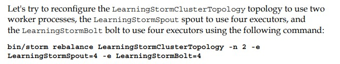

### 66 Global Grouping

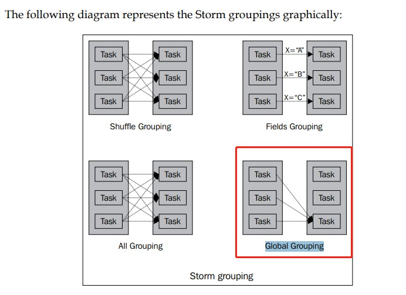

### 69 kafka消费组

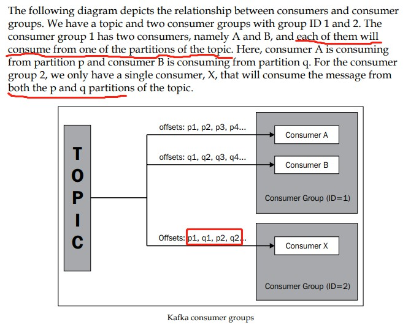

### 113 为什么使用Trident

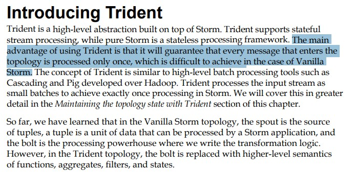

### 113 Trident引申阅读 http://www.flyne.org/article/216 

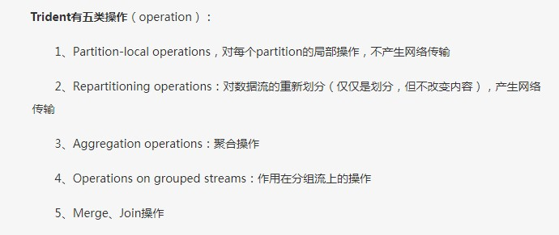

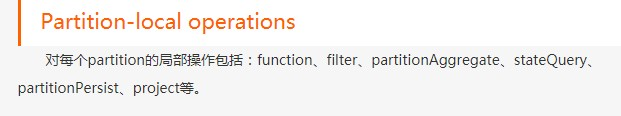

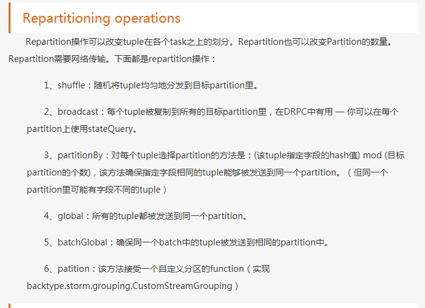

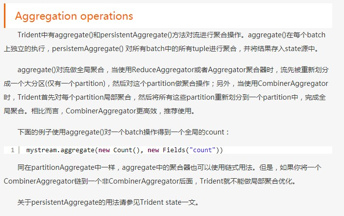

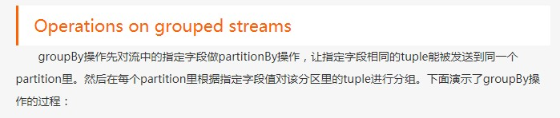

### 129 non-transactional topology包含最多一次和最少一次处理2种情况

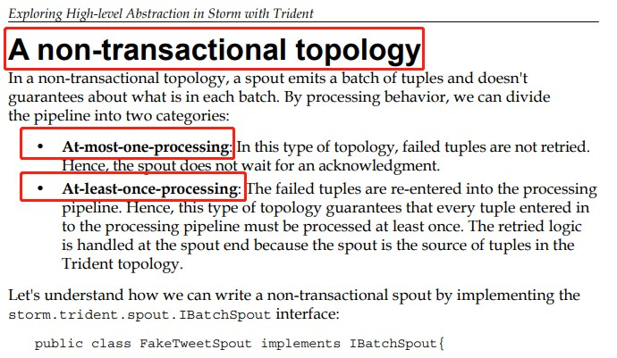

### 138 如果spout读取的数据来源不能容错，则spout也无法保证事务

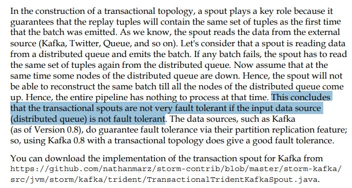

### 143 什么时候使用Trident, Trident不适合高速应用，因为Trident增加复杂性和状态管理

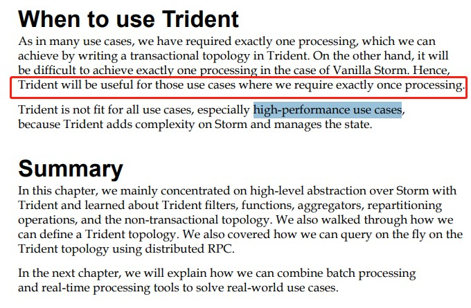

### 143 什么时候使用Trident,仅需要处理exactly once (仅处理一次)的情况

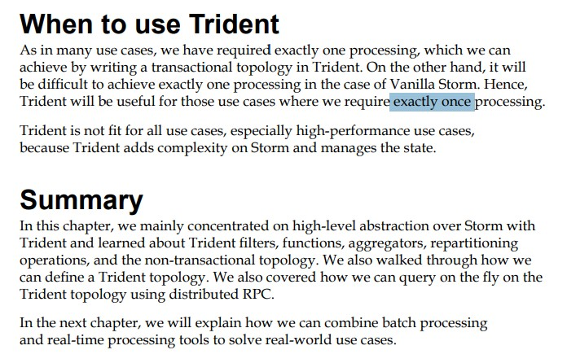

### 144 storm应用通过storm-yarn部署在已经存在的hadoop集群

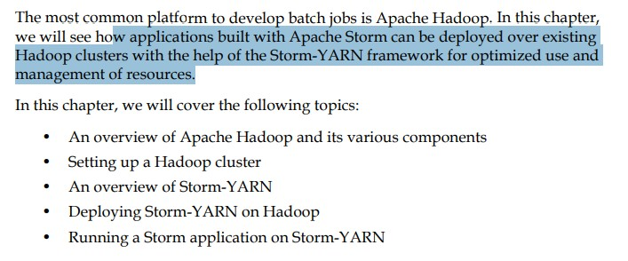

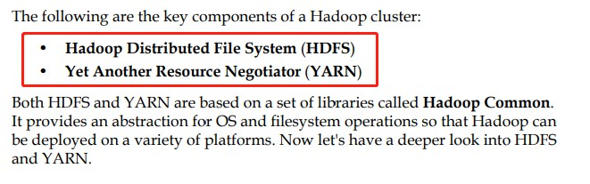

