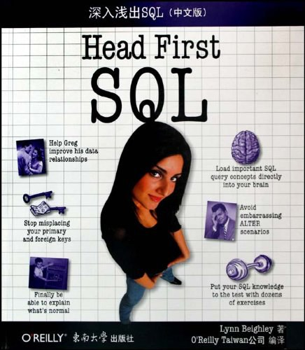

## 关联微信读书插件
https://github.com/zhaohongxuan/obsidian-weread-plugin


### 分割线
```
--------------------
```
--------------------

//评价
Head First通俗系列入门书籍之SQL，配图文，入门值得看

//封面链接
 
 



### 标签说明
  - TODO //待读
  - SQL
  - ✰✰✰✰  //评级
  - ※※   //难度
  
## 待读书籍
### 文学

| 名称                                                                                                                          | 作者     | 出版社 |            |                                                                                                                                                                  |
| --------------------------------------------------------------------------------------------------------------------------- | ------ | --- | ---------- | ---------------------------------------------------------------------------------------------------------------------------------------------------------------- |
|                                                                                                                             |        |     |            |                                                                                                                                                                  |
| 哲学小史                                                                                                                        |        |     |            |                                                                                                                                                                  |
| 嘉靖帝的四季                                                                                                                      |        |     |            |                                                                                                                                                                  |
| ~~身份与暴力~~                                                                                                                   |        |     |            |                                                                                                                                                                  |
| ~~午夜将至~~                                                                                                                    |        |     |            |                                                                                                                                                                  |
| Making China Modern                                                                                                         |        | pdf |            |                                                                                                                                                                  |
| 稍息：1981-1984年的中国                                                                                                            |        |     |            |                                                                                                                                                                  |
| ~~压裂的底层~~                                                                                                                   |        |     |            |                                                                                                                                                                  |
| 法西斯谎言简史                                                                                                                     |        |     |            |                                                                                                                                                                  |
| 反抗平庸之恶                                                                                                                      |        |     |            |                                                                                                                                                                  |
| 共和的危机                                                                                                                       |        |     |            |                                                                                                                                                                  |
| [the chinese road to socialism](https://twitter.com/linyujing/status/1505167799504699392?s=20&t=Q9yXOAtTlZqPvXB2_9v8Yw)     |        |     |            |                                                                                                                                                                  |
| [Chinese education under communism](https://twitter.com/linyujing/status/1505167799504699392?s=20&t=Q9yXOAtTlZqPvXB2_9v8Yw) |        |     |            |                                                                                                                                                                  |
| [历史的运用和滥用](https://twitter.com/porcorossin/status/1507352986455982082?s=20&t=Q9yXOAtTlZqPvXB2_9v8Yw)                        |        | pdf |            |                                                                                                                                                                  |
| 我们共同的朋友                                                                                                                     | 狄更斯    |     |            |                                                                                                                                                                  |
| [codes of the underwordl](https://twitter.com/Real_Danhuang02/status/1485401485395611651?s=20&t=Q9yXOAtTlZqPvXB2_9v8Yw)     |        |     |            |                                                                                                                                                                  |
| 翦商-李硕                                                                                                                       |        |     |            |                                                                                                                                                                  |
| 周灭商与华夏新生                                                                                                                    |        |     |            |                                                                                                                                                                  |
| 银魂：张嘉璈和他的时代                                                                                                                 |        |     |            |                                                                                                                                                                  |
| 遥远的救世主                                                                                                                      |        |     | 已下载ibook   |                                                                                                                                                                  |
| 中国震撼                                                                                                                        | 张维为    |     | 已下载ibook   |                                                                                                                                                                  |
| 战火中国 方得万                                                                                                                    |        |     | 已下载ibook   | 写透了中国国民党兴起、在抗战和内战中崩溃的全过程                                                                                                                                         |
| 魏昂德《脱轨的革命：毛泽东时代的中国》                                                                                                         |        |     |            | 短短三百页写透了中国共产党夺权、建政到带领中国走向灾难的全过程                                                                                                                                  |
| 中国底层访谈录                                                                                                                     | 廖义武    |     | 已下载ibook   | <br>《中国底层访谈录》收集了作者所做的访谈，是一部“下大力气精心制作的口述历史记录，几乎全部来自西南省份四川。……四川是一个有极大反差的地区：有山也有平原，有工业也有农业，有新近富裕的阶层也有永远贫困的阶层。四川人普遍接受的观念应有尽有，从万物有灵论、道教到毛泽东的无神论，再到四川最大的名人邓小平推行的半资本主义” |
| 大明帝国的黄昏                                                                                                                     |        |     | 已下载ibook   |                                                                                                                                                                  |
| 《周制与秦制》                                                                                                                     | 冯天瑜    |     |            | https://mp.weixin.qq.com/s/JJESNWMzs0dbk9YI5JRuzQ                                                                                                                |
| 反抗死亡                                                                                                                        | 贝克尔    |     | 已下载calibre | 来源吴思访谈录                                                                                                                                                          |
| 存在的勇气                                                                                                                       | 蒂利希    |     | 已下载calibre | 来源吴思访谈录，“理解人心和人性，10年前读毕此书，叹为观止，从此不再看心理学方面的书                                                                                                                      |
| 掌控力：让所有人对你讲真                                                                                                                |        |     | 未下载        |                                                                                                                                                                  |
| 锻造组织鍛造組織：紅軍與蘇區史新探（1927—1934）—张永                                                                                             | ~~张永~~ |     | 已下载calibre | 湘赣苏区大规模打“AB团”时，很多干部屈打成招。毛知道后在给中央的报告里说这些人：“如果真的是清白的，坚持一下挺过去就能重获清白嘛，为什么要委屈自己牵连同志呢”（大意） 文革中罗瑞卿跳楼摔断了腿之后，毛也批评他“没出息，被造反派斗一下就跳楼自杀”                                      |
|                                                                                                                             |        |     |            |                                                                                                                                                                  |
|                                                                                                                             |        |     |            |                                                                                                                                                                  |
|                                                                                                                             |        |     |            |                                                                                                                                                                  |
|                                                                                                                             |        |     |            |                                                                                                                                                                  |


```
# 在这17本书里读懂中国
**《干校六记》****(Six Chapters From My Life Downunder)，杨绛/****著**

“在丰富性、道德紧迫性和戏剧性方面，中国历史上几乎没有发生过比文化大革命更具有文学潜力的事件了。[杨绛](https://www.nytimes.com/2016/05/27/books/yang-jiang-chinese-author-and-translator-dies-at-104.html)的《干校六记》用不多的文字记述了她被‘下放’到‘五七干校’接受再教育的两年，是那个时期为数不多的回忆录之一，因此更为珍贵。”


**《富强：中国通往21世纪的长征》(Wealth and Power: China’s Long March to the Twenty-First Century)，****夏伟(Orville Schell)和鲁乐汉(John Delury)/著**  

在本书中，夏伟和鲁乐汉“认为，对一代又一代有影响力的中国人而言，羞耻则激人奋发”。他们审视了“中国文化中一种不同寻常的特性是如何渗透在政治和学术生活中，这是一部调和中国目前的成功与过往的苦痛的佳作。该书还为今天这个更加富强的中国所面临的最大挑战之一打下铺垫，因为中国不可能永远和自己已经驱逐的幽灵作斗争”。

**《帝国的黄昏：鸦片战争及中国最后的黄金时代的终结》The Opium War and the End of China’s Last Golden Age 裴士锋(Stephen R. Platt)/著**  

“在一个财富和权力不可阻挡地从东方转向西方的世纪里，英中两国走向了战争，裴士锋对此做了动人的描述。但是，如果在这个财富和权力同样不可避免地从西方转向东方的时代，这段历史还能给人们提供什么教训，那肯定是卡尔·马克思(Karl Marx)在鸦片战争十年后做出的结论——历史是人类自己创造的，但他们并不能随心所欲地创造历史。”

**《工厂女孩：在一个变化的中国，从乡村走向城市》(Factory Girls: From Village to City in a Changing China)，张彤禾****(Leslie T. Chang)/著**  

“关于中国巨型制造基地的出现，近年来见诸于无数的书籍文章，但张彤禾的选择不是去聚焦在其中发挥作用的广大市场劳动力，而是关注个体，其中大部分是妇女，那些离开村子，到这个经济体前线去寻找财富的她们。”

**《剩女：性别不平等在中国的复活》(Leftover Women: The Resurgence of Gender Inequality in China)，洪理达(Leta Hong Fincher)****/著**

在《剩女》中，洪理达认为，中国女性在25岁左右感受到压力，接受不适宜的婚姻。她认为，性别失衡、单身男人可能造成社会不稳定的潜在可能性，乃至没有安全感的父母的焦虑导致了这一局面，如果她们延迟结婚就会被称为“剩女”。由于父母与配偶的压力，这些女人被系统地剥夺了房子的所有权，必须把不动产记在丈夫名下，就算她们或她们的父母在买房中有很大贡献也是如此。

此外，还有其他无数关于中国的好书。例如：张戎(Jung Chang)的《鸿》(Wild Swans)、张彦(Ian Johnson)的《中国的灵魂》(The Souls of China)、马利德(Richard McGregor)的《党》(The Party)、维克拉姆·塞斯(Vikram Seth)的《从天堂湖》(From Heaven Lake)、史景迁(Jonathan Spence)的《毛泽东》(Mao Zedong)、彼得·霍普柯克(Peter Hopkirk)的《世界屋脊的闯入者》(Trespassers on the Roof of the World)。如果有你特别喜爱的书，请在留言中告诉我们。
```

```
## [美国学生读什么书了解中国？(附书单)](https://bbs.gogodutch.com/thread-451993-1-1.html)
去年用书书目：（15）  
帕拉维·艾雅尔 《烟雾与镜子:中国经历》  
Aiyar, Pallavi, Smoke and Mirrors  
  
  
　　凯瑞·布朗 《疲于奔命的巨人：21世纪中国》  
Brown, Kerry, Struggling Giant, China in the 21st Century  
  
  
　　罗德·吉福特《中国行》  
Gifford, Rob, China Road  
  
  
　　彼得·海斯勒 (何伟) 《寻路中国》  
Hessler, Peter, Country Driving  
  
  
　　彼得·海斯勒 (何伟) 《甲骨：游历于中国的历史与现实之间》  
Hessler, Peter, Oracle Bones:  A Journey Between China's Past and Present  
  
  
　　邓肯·海维特《先富起来：生活在开放中的中国》  
Hewitt, Duncan, Getting Rich First  
  
  
　　哈金《疯狂》  
Jin, Ha, The Crazed  
  
  
　　伊恩·约翰逊《野草：当代中国三个变革的故事》  
Johnson, Ian, Wild Grass:  Three Stories of Change in Modern China  
  
  
　　詹姆斯·金奇《中国震憾世界-饥饿之国的崛起》  
Kynge, James, China Shakes the World:  The Rise of a Hungry Nation  
  
  
　　廖亦武 《中国底层社会实录》  
Liao, Yiwu, The Corpse Walker; Real-Life Stories, China from the Bottom Up  
  
  
　　马建 《北京植物人》  
Ma, Jian, Beijing Coma  
  
  
　　迈克尔·梅尔《老北京的最后岁月》  
Meyer, Michael, The Last Days of Old Beijing  
  
  
　　潘公凯 《走出毛的阴影：追寻新中国的灵魂》  
Pan, Philip, Out of Mao's Shadow: The Struggle for the Soul of a New China  
  
  
　　潘文 《中国教训：五位同学及新中国的故事》  
Pomfret, John, Chinese Lessons: Five Classmates and the Story of the New China  
  
  
　　张丽佳 《社会主义好》  
Zhang, Lijia, Socialism is Great!  
  
  
建议用书书目：（24）  
奥利佛·欧古斯特 《红楼深深》  
August, Oliver, Inside the Red Mansion  
  
  
　　张彤禾 《工厂女工》  
Chang, Leslie, Factory Girls  
  
  
　　陈桂棣、吴春桃 《中国农民报告》  
Chen Guidi, Wu Chuntao and Zhu Hong, Will the Boiat Sink the Water?  The Life of China's Peasants  
  
  
　　林瑞秋 《外国宝贝在北京》  
Dewoskin, Rachel, Foreign Babes in Beijing  
  
  
　　詹姆斯·法罗斯《从明天广场发出的明信片》  
Fallows, James, Postcards from Tomorrow Square  
  
  
　　亚历山大·哈尼《探寻中国制造的价格优势》  
Harney, The China Price: The True Cost of Chinese Competitive Advantage  
  
  
　　彼得·海斯勒 (何伟)《消失中的江城：一位西方作家在長江古城探索中国》  
Hessler, River Town  
  
  
　　康正果 《出中国记：我的反动自述》  
Kang, Zhengguo, Confessions:  An Innocent Life in Communist China  
  
  
　　马克·莱纳德 《中国怎么想》  
Leonard, Mark, What Does China Think?  
  
  
　　李存信 《毛的最后一个舞者》  
Li, Cunxin, Mao's Last Dancer  
  
  
　　李翊云 《流浪汉》  
Li, Yiyun, The Vagrants  
  
  
　　亚伯拉罕·勒斯特加滕《华夏天路》  
Lustgarten, Abraham, China's Great Train  
  
  
　　丹尼尔·露西 《拉里的肾》  
Rose, Daniel Asa, Larry's Kidney  
  
  
　　詹姆斯·麦格雷戈 《十亿消费者》  
McGregor, Jim, One billion Customers  
  
  
　　梅文诗《红色狂想曲：西方古典音乐如何改变中国》  
Melvin, Sheila, Rhapsody in Red  
  
  
　　圣扎迦利·麦克西克 《中国深度游》  
Mexico, Zachary, China Underground  
  
  
　　裘小龙 《红尘岁月：大上海的故事》  
Qiu, Xiaolong, Years of Red Dust, Stories of Shanghai  
  
  
　　桑晔、白杰明 《真实的中国：共和国的人民》  
Sang, Ye and Geremie Barme, China Candid: The People in the People's Republic  
  
  
　　华衷《当十亿中国人一起跳起来》  
Watts, Jonathan, When a Billion Chinese Jump (about environmental issues)  
  
  
　　欣然 《见证中国: 沉默一代的声音》  
Xinran, China Witness  
  
  
　　欣然 《中国妇女》  
Xinran, The Women of China  
  
  
　　余华 《兄弟》  
Yu, Hua, Brothers  
  
  
　　査建英 《弄潮儿》  
Zha Jianying, Tide Players  
  
  
　　ZZ 《中国，高！》  
ZZ, China High
```
### 编程
| 名称                                                         | 作者                      | 出版社 |
| ------------------------------------------------------------ | ------------------------- | ------ |
| [A conflict of visions ](https://twitter.com/xleaps/status/1477427901729488896?s=20&t=Q9yXOAtTlZqPvXB2_9v8Yw) | Thomas Sowell             |        |
|                                                              |                           |        |
| ~~A Philosophy of Software Design《软件设计哲学》~~          |                           |        |
| 程序员数学：用Python学透线性代数和微积分                     |                           |        |
| ~~精通以太坊~~                                               |                           |        |
| The Pragmatic Programmer 《程序員修煉之道︰從小工到專家 》   | Andy Hunt and Dave Thomas |        |
| 范氏大代数                                                   |                           |        |
|                                                              |                           |        |
|                                                              |                           |        |

###  豆瓣不存在的电影/电视剧
https://terminus2049.github.io/Not-exist-in-douban/
|编号|电影/电视剧|年代|导演|IMDB|
|---|---|---|---|---|
|1|出租车司机|2017|张勋|[A Taxi Driver](https://www.imdb.com/title/tt6878038/)|
|2|1987：黎明到来的那一天|2017|Joon-Hwan Jang|[1987: When the Day Comes](https://www.imdb.com/title/tt6493286/)|
|3|樹大招風|2016|許學文、歐文傑、黃偉傑|[Trivisa](https://www.imdb.com/title/tt4379800/)|
|4|凛冬烈火：乌克兰为自由而战|2016|叶夫根尼·艾菲尼夫斯基|[Winter on Fire: Ukraine’s Fight for Freedom](https://www.imdb.com/title/tt4908644/)|
|5|悲兮魔兽|2015|赵亮|[Behemoth](https://www.imdb.com/title/tt4901304/)|
|6|天注定|2013|贾樟柯|[A Touch of Sin](https://www.imdb.com/title/tt2852400/)|
|7|昂山素季|2011|吕克贝松|[The Lady](https://www.imdb.com/title/tt1802197/)|
|8|夹边沟|2010|王兵|[The Ditch](https://www.imdb.com/title/tt1723112/)|
|9|被出賣的台灣|2009|Adam Kane|[Formosa Betrayed](https://www.imdb.com/title/tt1121786/)|
|10|春风沉醉的夜晚|2009|娄烨|[Spring Fever](https://www.imdb.com/title/tt1422119/)|
|11|苹果|2007|李玉|[Lost in Beijing](https://www.imdb.com/title/tt0949489/)|
|12|华丽的假期|2007|金志勋|[May 18](https://www.imdb.com/title/tt0800341/)|
|13|颐和园|2006|娄烨|[Summer Palace](https://www.imdb.com/title/tt0794374/)|
|14|丑角登场|2004|崔子恩|[Enter the Clowns](https://www.imdb.com/title/tt0387120/)|
|15|盲井|2003|李杨|[Blind Shaft](https://www.imdb.com/title/tt0351299/)|
|16|任逍遥|2002|贾樟柯|[Unknown Pleasures](https://www.imdb.com/title/tt0318025/)|
|17|旧约|2002|崔子恩|[The Old Testament](https://www.imdb.com/title/tt1918883/)|
|18|安阳婴儿|2001|王超|[The Orphan of Anyang](https://www.imdb.com/title/tt0285848/)|
|19|北纬38度线|2000|韦廉、石伟等|[Northern Limit Line](https://www.imdb.com/title/tt4696222/)|
|20|天浴|1998|陈冲|[Xiu Xiu: The Sent Down Girl](https://www.imdb.com/title/tt0115005/)|
|21|红色角落|1997|乔恩·阿维奈|[Red Corner](https://www.imdb.com/title/tt0119994/)|
|22|天安门|1996|卡玛|[The Gate of Heavenly Peace](https://www.imdb.com/title/tt0113147/)|
|23|扁担·姑娘|1996|王小帅|[So Close to Paradise](https://www.imdb.com/title/tt0200486/)|
|24|迷岸|1996|于晓洋||
|25|巫山云雨|1996|章明|[Rain Clouds over Wushan](https://www.imdb.com/title/tt0118199/)|
|26|桃花满天红|1995|王新生|[Tao hua man tian hong](https://www.imdb.com/title/tt0386814/)|
|27|裸血|1995|高子沣|[Naked Blood](https://www.imdb.com/title/tt0217679/)|
|28|蓝风筝|1993|田壮壮|[The Blue Kite](https://www.imdb.com/title/tt0107358/)|
|29|省港旗兵 4：地下通道|1990|麦当杰|[Long Arm of the Law: Part 4](https://www.imdb.com/title/tt0103162/)|
|30|特别手术室|1988|田壮壮|[Unforgettable Life](https://www.imdb.com/title/tt0470549/)|
|31|挖掘机|2017|李柱亨|[Fork Lane](https://www.imdb.com/title/tt7506740/)|
|32|厉害了，我的国|2018|卫铁|[Amazing China](https://www.imdb.com/title/tt8081062/)|
|33|十年|2015|郭臻/黄飞鹏/欧文杰/周冠威/伍嘉良|[Ten Years](https://www.imdb.com/title/tt5269560/)|
|34|劫后天府泪纵横：四川的眼泪|2009|Jon Alpert, Matthew O’Neill|[China’s Unnatural Disaster: The Tears of Sichuan Province](https://www.imdb.com/title/tt1430809/?ref_=ttls_li_tt)|
|35|上访|2009|赵亮|[Petition](https://www.imdb.com/title/tt1426381/)|
|36|塑料王国|2016|王久良|[Plastic China](https://www.imdb.com/title/tt6090264/)|
|37|垃圾围城|2012|王久良|[Beijing Besieged by Waste](https://www.imdb.com/title/tt1980046/)|
|38|大路朝天|2015|张赞波|[The Road](https://www.imdb.com/title/tt5142610/)|
|39|天降|2009|张赞波|[Falling From the SKy](https://www.imdb.com/title/tt2136916/?ref_=ttls_li_tt)|
|40|克拉玛依|2010|徐辛|[Karamay](https://www.imdb.com/title/tt1720130/)|
|41|刺杀金正恩|2014|塞思·罗根、埃文·戈德堡|[The Interview](https://www.imdb.com/title/tt2788710/)|
|42|斯大林之死|2017|阿尔曼多·伊安努奇|[The Death of Stalin](https://www.imdb.com/title/tt4686844/)|
|43|小活佛|1993|贝纳尔多·贝托鲁奇|[Little Buddha](https://www.imdb.com/title/tt0107426/)|
|44|建国大业|2009|黄建新|[The Founding of a Republic](https://www.imdb.com/title/tt1438461/)|
|45|建党伟业|2011|黄建新|[Beginning of the Great Revival](https://www.imdb.com/title/tt1699513/)|
|46|皇天后土|1981|白景瑞|[Huang tian hou tu](https://www.imdb.com/title/tt0082189/)|
|47|南海之后|2016|王男栿|[Hooligan Sparrow](https://www.imdb.com/title/tt4079902/)|
|48|1428|2009|杜海滨|[1428](https://www.imdb.com/title/tt1500679/)|
|49|一部塞尔维亚电影|2010|斯尔詹·斯帕索耶维奇|[A Serbian Film](https://www.imdb.com/title/tt1273235/)|
|50|竞相灭绝|2015|路易·西霍尤斯|[Racing Extinction](https://www.imdb.com/title/tt1618448/)|
|51|颍州的孩子|2006|杨紫烨|[The Blood of Yingzhou District](https://www.imdb.com/title/tt0859595/)|
|52|动词变位|2001|唐晓白|[Conjugation](https://www.imdb.com/title/tt0293107/)|
|53|河殇|1988|夏骏|[River Elegy](https://www.imdb.com/title/tt1441409/)|
|54|不再恐惧|2008|之项欠/久美嘉措|[Leaving Fear Behind](https://www.imdb.com/title/tt3464336/)|
|55|达赖的一生|1997|马丁·斯科塞斯|[Kundun](https://www.imdb.com/title/tt0119485/)|
|56|难以置信|2016|肯·斯通|[Hard to Believe](https://www.imdb.com/title/tt4675470/)|
|57|致命中国|2012|彼得·纳瓦罗|[Death by China](https://www.imdb.com/title/tt2304583/)|
|58|嘉农|2014|马志翔|[Kano](https://www.imdb.com/title/tt2247566/)|
|59|天与地|2011|戚其义/陆天华|[When Heaven Burns](https://www.imdb.com/title/tt2165489/)|
|60|西藏七年|1997|让·雅克·阿诺|[Seven Years in Tibet](https://www.imdb.com/title/tt0120102/)|
|61|绿帽子|2004|刘奋斗|[Green Hat](https://www.imdb.com/title/tt0416943/)|
|62|[辛普森一家（第16季）](https://web.archive.org/web/20150615050415/https://movie.douban.com/subject/4919243)|2004|Lance Kramer|[The Simpsons Season 16](https://www.imdb.com/title/tt0096697/episodes?season=16)|
|63|掩埋|2009|王利波|[Buried](https://www.imdb.com/title/tt4370770/)|
|64|死灵魂|2018|王兵|[Dead Souls](https://www.imdb.com/title/tt8296608/)|
|65|夹边沟祭事|2017|艾晓明|[Jiabiangou Elegy: Life and Death of the Rightists](https://www.imdb.com/title/tt7877136/)|
|66|南海之后|2016|王男栿|[Hooligan Sparrow](https://www.imdb.com/title/tt4079902/)|
|67|寻找林昭的灵魂|2004|徐杰|[In Search of Lin Zhao’s Soul](https://www.imdb.com/title/tt6083394/)|
|68|穹顶之下|2015|柴静|[Under the Dome](https://www.imdb.com/title/tt4495750)|
|69|我们的青春，在台湾|2018|傅榆|[Our Youth in Taiwan](https://www.imdb.com/title/tt8711506/)|
|70|独生子女国度|2019|Zhang Lynn（张嘉玲）, Nanfu Wang（王男栿）|[One Child Nation](https://www.imdb.com/title/tt8923482/)|
|71|公民哈维尔|2008|Miroslav Janek|[Obcan Havel(Citizen Havel)](https://www.imdb.com/title/tt0843329/)|
|72|中美共同体|2019|Channel 4 Television Corporation|[Chimerica](https://www.imdb.com/title/tt7948996)|
|73|出柜，中国LGBT的呐喊|2019|NHK|[ザ・カミングアウト～中国・LGBTの叫び～](https://www.nhk.or.jp/docudocu/program/2443/2409379/index.html)|
|74|切诺尔贝利|2019|乔韩·瑞克(Johan Renck)|[Chernobyl](https://www.imdb.com/title/tt7366338/)|
|75|傲骨之战 第三季|2018|罗伯特·金 / 弗雷德·托耶|[The Good Fight Season 3](https://www.imdb.com/title/tt8363128/)|
|76|凶年之畔|2017|黄闻海|[We the Workers](https://www.imdb.com/title/tt6433144/)|
|77|[未来岁月（此去经年）](https://webcache.googleusercontent.com/search?q=cache:3sKizDxkdj4J:https://movie.douban.com/subject/30240304)|2019|西蒙·赛伦·琼斯（Simon Cellan Jones）|[Years and Years](https://www.imdb.com/title/tt8694364/)|
|78|自助洗衣店（The Laundromat）|2019|史蒂文·索德伯格（Steven Soderbergh）|[The Laundromat](https://www.imdb.com/title/tt5865326/)|
|79|返校|2019|徐漢強|[返校](https://www.imdb.com/title/tt10805432/)|
|80|南方公园（所有季）|1999-2019|Trey Parker, Matt Stone, Brian Graden|[South Park](https://www.imdb.com/title/tt0121955/)|
|81|南方公园电影版：南方四贱客|1999|Trey Parker|[South Park: Bigger, Longer & Uncut](https://www.imdb.com/title/tt0158983/)|
|82|[蝴蝶（2004）](https://movie.douban.com/subject/1292331/)|2004|麦婉欣|[Butterfly](https://www.imdb.com/title/tt0440939/),登录豆瓣可见|
|83|[少年小赵](https://movie.douban.com/subject/26331957/)|2005|杜海滨|[A Young Patriot](https://www.imdb.com/title/tt4079566/)，豆瓣仅登录可见|
|84|[他们在毕业的前一天爆炸全2季](https://movie.douban.com/subject/4861417/)|2010|郑有杰|[Days We Stared at the Sun](https://www.imdb.com/title/tt1813893/)|
|85|大同（中国市长）|2015|周浩|[Datong](https://www.imdb.com/title/tt4056808/)|


###  豆瓣不存在的书籍

|编号|书名|出版社|作者|ISBN|
|---|---|---|---|---|
|56|Capitalism with Chinese Characteristics|CambridgeUniversityPress|Yasheng Huang|豆瓣已删除 [9780521898102](https://book.douban.com/subject/2427184/)|
|55|A Concise History of Hong Kong|Rowman & Littlefield Publishers, Inc.|John M. Carroll|豆瓣[链接](https://book.douban.com/subject/2427184/)|
|51|The Great Firewall of China:How to Build and Control an Alternative Version of the Internet|Zed Books|James Griffiths|[1786995352](https://www.goodreads.com/book/show/42585634-the-great-firewall-of-china)|
|~~22~~|~~[丁庄梦](https://www.worldcat.org/title/ding-zhuang-meng/oclc/952361538?loc=)~~|~~上海文艺出版社~~|~~阎连科~~|~~[7532129489](https://www.goodreads.com/book/show/20869383)~~|
|16|失落的一代：中国的上山下乡运动·1968-1980（_The Lost Generation: The Rustification of Chinese Youth(1968-1980)_ ）|中国大百科全书出版社|潘鸣啸[法]/欧阳因 译|9787500082545|
|06|违宪审查与民主制的平衡：一项比较研究|中国社会科学出版社|翟桔红|9787516113943|
|53|[中国米兔志](https://book.douban.com/subject/34811123/)|中国米兔志编辑组|周仪主编|[豆瓣不收录，请看libgen](https://libgen.is/book/index.php?md5=D65E91B6371965AD1A5DBBA631BDD915)|
|08|往事并不如烟|人民文学出版社|章怡和|9787020044405|
|~~23~~|~~软埋~~|~~人民文学出版社~~|~~方方~~|~~[7020116140](https://www.goodreads.com/book/show/35414562)~~|
|02|一滴淚：從肅反到文革的回憶|允晨文化|巫宁坤|9789867178398|
|29|圖伯特這幾年：聽說西藏之二|允晨文化|唯色、王力雄|9789866274640|
|34|鼠年雪獅吼-2008年西藏事件大事紀|允晨文化|唯色|9789867178800|
|41|躁動的新疆, 不安的維吾爾|光現出版|尼克·霍史達克（Nick Holdstock）、譯者：許庫爾|[9789869620246](https://www.goodreads.com/book/show/40949616)|
|45|沒有墓碑的草原：內蒙古的文革大屠殺實錄(墓標なき草原――内モンゴルにおける文化大革命・虐殺の記録)|八旗文化|楊海英、譯者：劉英伯、劉燕子|9789865842406|
|47|在中國與蒙古的夾縫之間：一個蒙古人未竟的民族自決之夢（中囯とモンゴルのはざまで：ウラーンフーの実らなかった民族自決の夢）|八旗文化|楊海英|9789578654235|
|50|她們的征途：直擊、迂迴與衝撞，中國女性的公民覺醒之路|八旗文化|趙思樂|9789869516884|
|43|遮蔽的圖伯特：國際藏學家解讀西藏百題問答（_Authenticating TIBET: Answers to China’s 100 Questions_）|前衛|安瑪莉．布隆鐸（Anne-Marie Blondeau）、卡提亞．畢菲特里耶（Katia Buffetrille）等、譯者：謝惟敏|9789578016644|
|48|東突厥斯坦：維吾爾人的真實世界|前衛|霍爾．唐日塔格（HÜR TANGRITAGH）|9789578018075|
|01|江上的母親|南方家園文化|野夫|9789868279551|
|44|噶倫堡的製麵師：達賴喇嘛二哥回憶錄‧不為人知的圖博奮鬥故事（_The noodle maker of Kalimpong:The untold story of my struggle for tibet_）|台灣圖博之友會（另，此出版社所有書）|嘉樂頓珠（Gyalo Thondup）、石文安（Anne F. Thurston）譯者：謝惟敏|9789868608153|
|15|天葬：西藏的命运|大塊文化|王力雄|[9789862131077](https://www.goodreads.com/book/show/9335765)|
|24|我的西域，你的東土|大塊文化|王力雄|[9789862130117](https://www.goodreads.com/book/show/7906957)|
|25|大典|大塊文化|王力雄|[9789862138458](https://www.goodreads.com/book/show/37460186)|
|26|黃禍|大塊文化|王力雄|[9789862138502](https://www.goodreads.com/book/show/39837383)|
|27|殺劫 不可碰觸的記憶禁區，鏡頭下的西藏文革，第一次披露|大塊文化|唯色、澤仁多吉|[9789862137000](https://www.goodreads.com/book/show/40432886)|
|28|聽說西藏|大塊文化|王力雄、唯色|[9789862131190](https://www.goodreads.com/book/show/12240166-voices-from-tibet)|
|31|西藏記憶|大塊文化|唯色|9867291859|
|32|名為西藏的詩|大塊文化|唯色|9867291905|
|35|西藏火鳳凰：獻給所有自焚藏人|大塊文化|唯色|9789862135914|
|36|絳紅廢墟|大塊文化|唯色|9789862137673|
|38|遞進民主|大塊文化|王力雄|9867291832|
|39|權民一體論：遞進自組織社會|大塊文化|王力雄|9789862137383|
|46|蒙古騎兵在西藏揮舞日本刀：蒙藏民族的時代悲劇（チベットに舞う日本刀 モンゴル騎兵の現代史|大塊文化|楊海英、譯者：吉普呼蘭|9789862137864|
|33|念珠中的故事|大風|唯色|9789889972523|
|~~19~~|~~大江大海：一九四九~~|~~天下雜誌~~|~~龍應台~~|~~9789862410493~~|
|42|龍在雪域：一九四七年後的西藏(_The Dragon in the Land of Snows: A History of Modern Tibet Since 1947_）|左岸文化|茨仁夏加(Tsering Shakya)、譯者：謝惟敏|9789866723490|
|10|历史学的境界|广西师范大学出版社|高华|9787549571413|
|14|大路：高速中国里的工地纪事|广西师范大学出版社|张赞波|9787549573806|
|59|尘世·挽歌|新星出版社|野夫|9787802258990 [条目删除](https://book.douban.com/subject/4809777/)|
|37|樂土背後：真實西藏|時報出版|唯色|9789571365770|
|58|與中國打交道：美國前財長鮑爾森的二十年內幕觀察|時報出版|亨利．鮑爾森(Henry M. Paulson)|9789571368696 [条目删除](https://book.douban.com/subject/27010498/)|
|30|絳紅色地圖|時英|唯色|9867762045|
|18|历史的先声：半个世纪前的庄严承诺|汕头大学出版社|笑蜀|9787810363457 [条目删除](http://www.douban.com/subject/3149832/)|
|13|巨婴国|浙江人民出版社|武志红|9787213076824|
|09|伶人往事|湖南文艺出版社|章怡和|9787540438173|
|03|上海生死劫/生死在上海（[_Life and Death in Shanghai_](https://www.goodreads.com/book/show/537404.Life_and_Death_in_Shanghai)）|百家出版社|郑念（译者：方耀君、郑培君、方耀楣）|7900000011|
|~~12~~|~~走出帝制：从晚清到民国历史的回望~~|~~群言出版社~~|~~秦晖~~|~~9787802569027~~|
|20|灵山|联经出版公司|高行健|[9789570836899](https://www.goodreads.com/book/show/14733840)|
|21|一个人的圣经（[One Man’s Bible](https://book.douban.com/subject/10548707/)）|联经出版公司|高行健|9570819413|
|07|定西孤儿院纪事|花城出版社|章怡和|9781780421834|
|05|纳粹德国的腐败与反腐|译林出版社|弗兰克·巴约尔（译者：陆大鹏）|9787544754750|
|60|过去与未来之间|译林出版社|汉娜·阿伦特(Hannah Arendt)|9787544720779 [条目删除](https://book.douban.com/subject/6540232/)|
|52|[邊境線：中國內陸邊疆旅行記](https://www.books.com.tw/products/0010781279)|遠足文化|柴春芽|[9789578630215](https://book.douban.com/subject/30127513)|
|40|無間空白|雪域（另，此出版社所有書）|唯色|9789869308892|
|49|東突厥斯坦獨立運動：1930年代至1940年代|香港中文大學出版社|王柯|9789629965006|
|11|身份和差異：1945-1965 年中國社會的政治分層|香港中文大學香港亞太研究所|高華|9789624417173|
|54|[香港简史](https://book.douban.com/subject/24855510/)|香港中華書局|高馬可|豆瓣 [9789888263202](https://book.douban.com/subject/24855510/)|
|04|牛鬼蛇神录：文革囚禁中的精灵（The Captive Spirits）|香港牛津大学出版社|杨小凯|9780195865226|
|57|盛世|麥田|陳冠中|9789861735795|
|17|我們最幸福：北韓人民的真實生活（_Nothing to Envy: Ordinary Lives in North Korea_）|麥田出版|芭芭拉·德米克 Barbara Demick/黃煜文 譯|9789861207896|


### 王五四文集和韩寒，李承鹏博文 如何本地镜像备份

  

高华的《历史学的境界》被大陆列为禁书，亚马逊出版了电子书也下架了。我买了电子书，亚马逊Kindle内容在网站上能看到，但无法下载到设备里。

《大江大海一九四九

王鼎钧《关山夺路》 [1]读后写20世纪40年代后期国共内战的书很多， 大陆和台湾都有上乘读本， 但这些书大多都缺少“人”之活动， 及至齐邦媛、 龙应台、 王鼎钧书的出版， 才弥补了这个缺憾。齐邦媛的《巨流河》 ，

王鼎钧的代表作是他的回忆录四部曲： 《昨天的云》 、 《怒目少年》 、 《关山夺路》 、 《文学江湖》各地都有中共地下党或外围组织的“读书会”， 但是王鼎钧不喜欢鲁迅的“气性”， 也不喜欢巴金、 茅盾、 郭沫若， 觉得他们“只谈意识形态， 不谈艺术技巧”， 作品满口不离“压迫”、 “剥削”、 “受侮辱和受损害的”， “不能陶情冶性”， 只能“引起绝望的积极和毁灭的快感”。 王鼎钧虽然热爱文学，

2.延伸阅读

  

针对国家能力危机，福山还提出国家构建的命题，想了解更多，可阅读《国家构建:21世纪的国家治理与世界秩序》，学林出版社，2017年版。《斯大林之死》很有现实意义，看后沉重，但也可以舒一口气。独裁者结局全都一样。配乐是老柴的第六交响曲，即悲怆。谢谢宋妈推荐。

《洪宪帝制外交》这本书呢，基本就是帮袁世凯和北洋政府翻案了，纠正中学历史书的谬误。


## hexo使用
Welcome to [Hexo](https://hexo.io/)! This is your very first post. Check [documentation](https://hexo.io/docs/) for more info. If you get any problems when using Hexo, you can find the answer in [troubleshooting](https://hexo.io/docs/troubleshooting.html) or you can ask me on [GitHub](https://github.com/hexojs/hexo/issues).

  - ※※※※  表示难度
  - ✰✰✰✰✰  表示编程书籍星级
  - ♡♡♡♡   表示非编程书籍喜爱程度 ❤


### hexo远程发布
```
cd /Users/xian/workplace/gxianch.github.io
hexo cl && hexo g && hexo d

本地启动
hexo s
```


### 关闭仓库后再开启设置
公开仓库后需要设置github-pages为master分支，同时要等一会才可以访问https://gxianch.github.io/




## hexo快速开始

### Create a new post

``` bash
$ hexo new "My New Post"
```

More info: [Writing](https://hexo.io/docs/writing.html)

### Run server

``` bash
$ hexo server
```

More info: [Server](https://hexo.io/docs/server.html)

### Generate static files

``` bash
$ hexo generate
```

More info: [Generating](https://hexo.io/docs/generating.html)

### Deploy to remote sites

``` bash
$ hexo deploy
```

More info: [Deployment](https://hexo.io/docs/one-command-deployment.html)

<font face="Arial" size=4>**aa**</font>

<font face="黑体" color=green size=5>我是黑体，绿色，尺寸为5</font>

## hexo常见问题
### 没有生成index.html文件

查看 npm 安装各 hexo 插件的情况

```
npm ls --depth 0
```
逐一安装缺失的包

```
npm install hexo-generator-archive --save

```

安装完后重新构建即可解决。
- 