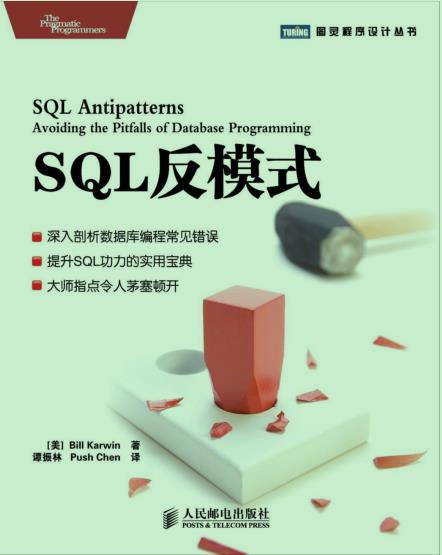

读到第三部分放弃了，主要为数据库人员准备的



## SQL反模式

- > 第一部分 逻辑型数据库设计反模式

- > 第2章 乱穿马路

  - > 需求可能会变为支持“每个产品有多个联系人”。此时，将数据库中原来存储单一用户标识的字段改成使用逗号分隔的用户标识列表，似乎是一个很简单且合理的解决方案

  - > 程序员通常使用逗号分隔的列表来避免在多对多的关系中创建交叉表，我将这种设计方式定义为一种反模式，称为乱穿马路（Jaywalking），因为乱穿马路也是避免过十字路口的一种方式。

  - > 2.5 解决方案：创建一张交叉表将account_id存储在一张单独的表中，而不是存储在Products表中，从而每个独立的account值都可以占据一行。这张新表称为Contacts，实现了Products和Accounts的多对多关系。Jaywalking/soln/create.sqlCREATE TABLE Contacts ( product_id BIGINT UNSIGNED NOT NULL, account_id BIGINT UNSIGNED NOT NULL, PRIMARY KEY (product_id, account_id), FOREIGN KEY (product_id) REFERENCES Products(product_id), FOREIGN KEY (account_id) REFERENCES Accounts(account_id));INSERT INTO Contacts (product_id, accont_id)VALUES (123, 12), (123, 34), (345, 23), (567, 12), (567, 34);当一张表有指向另外两张表的外键时，我们称这种表为一张交叉表1，它实现了两张表之间的多对多关系。这意味着每个产品都可以通过交叉表和多个账号关联；

- > 第3章 单纯的树

  - > 当你使用邻接表的时候，这样的查询会变得很不优雅，因为每增加一层的查询都会需要额外扩展一个联结，而SQL查询中联结的次数是有上限的。如下的查询能够获得四层数据，但无法更多了

  - > 这些都是使用邻接表时需要多步操作才能完成的查询范例，你不得不写很多额外的代码，而其实数据库设计本身就能做得很简单和高效。

  - > 3.5 解决方案：使用其他树模型有几种方案可以代替邻接表模型，包括路径枚举、 嵌套集以及闭包表。接下来我将分三段来展示这三种设计方案是如何解决3.2节中所描述的存储和查询树型评论的问题的。

  - > 3.5.4 你该使用哪种设计每种设计都各有优劣，如何选择设计依赖于应用程序中的哪种操作最需要性能上的优化。在图3-5中，操作依据每种树的设计被标记为简单或者困难。你也可以参考以下列出的每种设计的优缺点。图3-5 层级数据设计比较● 邻接表是最方便的设计，并且很多软件开发者都了解它。● 如果你使用的数据库支持WITH或者CONNECT BY PRIOR的递归查询，那能使得邻接表的查询更为高效。● 枚举路径能够很直观地展示出祖先到后代之间的路径，但同时由于它不能确保引用完整性，使得这个设计非常地脆弱。枚举路径也使得数据的存储变得比较冗余。
    > ● 嵌套集是一个聪明的解决方案——但可能过于聪明了，它不能确保引用完整性。最好在一个查询性能要求很高而对其他需求要求一般的场合来使用它。● 闭包表是最通用的设计，并且本章所描述的设计中只有它能允许一个节点属于多棵树。它要求一张额外的表来存储关系，使用空间换时间的方案减少操作过程中由冗余的计算所造成的消耗。

    > ● 嵌套集是一个聪明的解决方案——但可能过于聪明了，它不能确保引用完整性。最好在一个查询性能要求很高而对其他需求要求一般的场合来使用它。● 闭包表是最通用的设计，并且本章所描述的设计中只有它能允许一个节点属于多棵树。它要求一张额外的表来存储关系，使用空间换时间的方案减少操作过程中由冗余的计算所造成的消耗。

- > 第4章 需要ID

  - > 4.5.1 直截了当地描述设计为主键选择更有意义的名称：一个能够反应这个主键所代表的实体的类型的名字。比如， Bugs这张表的主键应该叫做bug_id。

- > 第5章 不用钥匙的入口

  - > 如果你需要精确地表示十进制数，使用NUMERIC类型。FLOAT类型无法表示很多十进制的有理数，因此它们应该当成非精确值来处理。尽可能不要使用浮点数。

  - > 开发人员激烈地争论着这个问题。两种方案都有很好的立足点，但是对于程序员来说通常只有一种选择，就是我们应该将文件存在数据库之外。

  - > 但真正的重点问题是选择什么样的数据类型来存储图片？原始图片文件可以以二进制格式存储在BLOB类型中，就像之前我们存储超长字段那样。然而，很多人选择将图片存储在文件系统中，然后在数据库里用VARCHAR类型来记录对应的路径。

  - > BLOB类型的最大值依据不同的数据库产品而不同，但对于存储大部分的图片文件来说都是足够的。所有的数据库都支持BLOB或者类似的类型。比如，MySQL提供了一个叫做MEDIUMBLOB的类型，支持最大16MB的数据，对于绝大部分图片来说都足够了。Oracle提供了一个LONG RAW或者BLOB的类型，最大支持2GB或者4GB的长度。类似的类型在其他数据库产品中也能找到。

- > 第三部分 查询反模式

