从中学到一些SpringBoot注解，可以简化编程


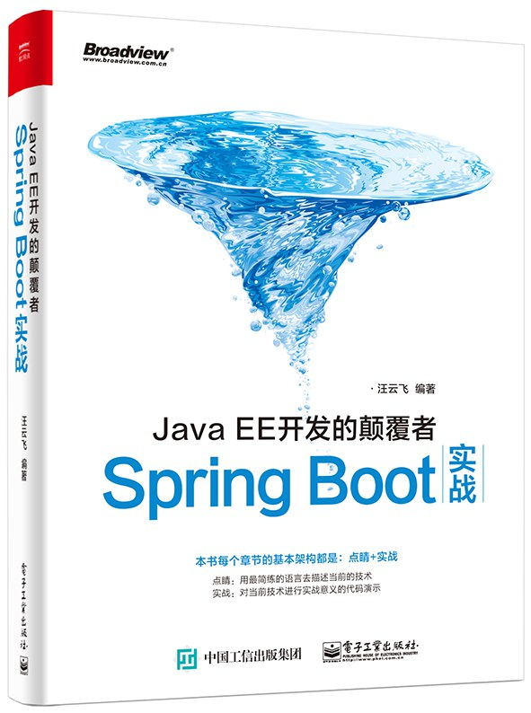

<!-- more -->

### 2.2 Spring EL 支持获取文件资源Resource，@Value("classpath:test.txt")


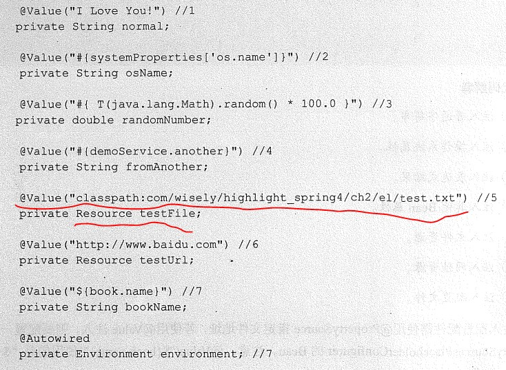

### 2.3 Bean的初始化 @PostConstruct


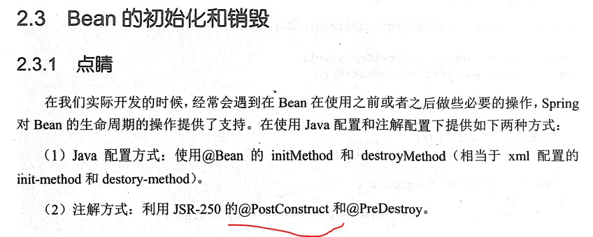

### 3.2.1 Spring 开启异步，实现多线程和并发编程


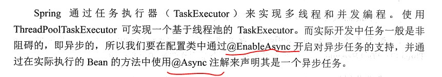


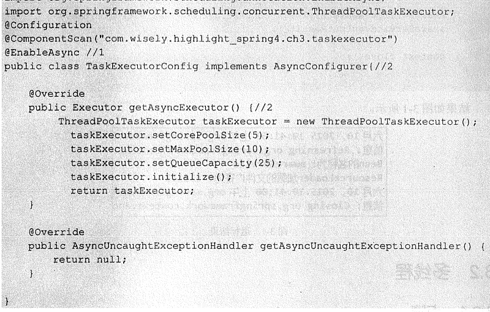


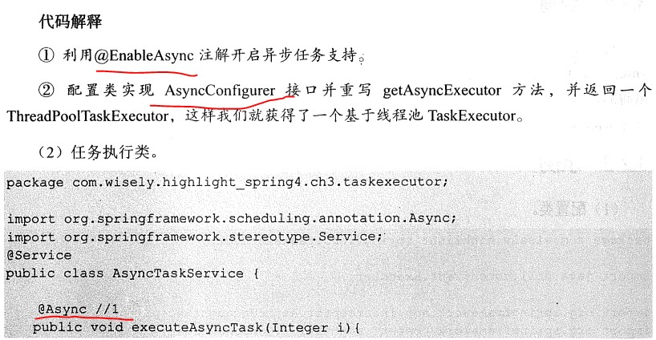


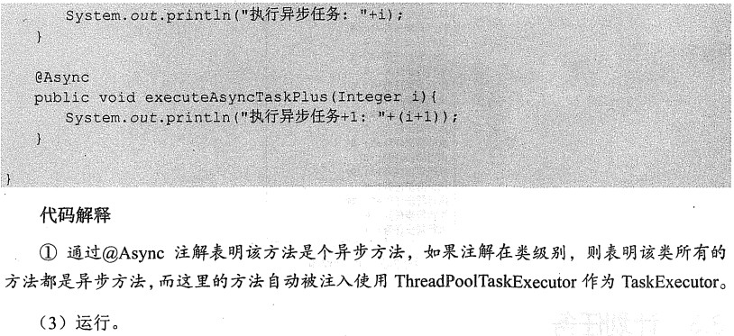


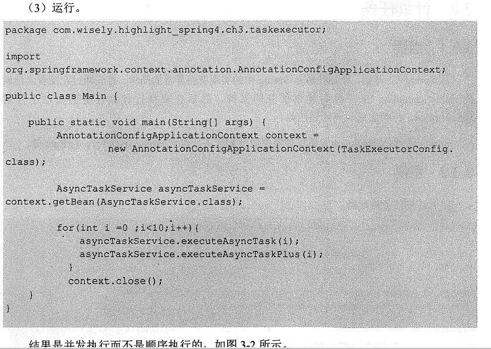

### 3.3.1 Spring开启对计划任务的支持


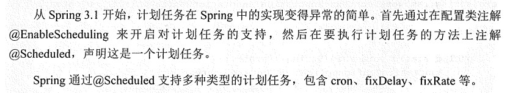

### 3.6.1 @Enable*开启功能支持原因在于该类注解有@Import注解来导入配置类


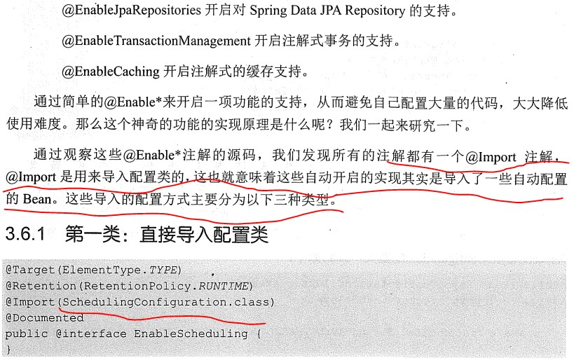

### 4.4.3 @ControllerAdvice 用于全局配置,包括@excepetionhandler


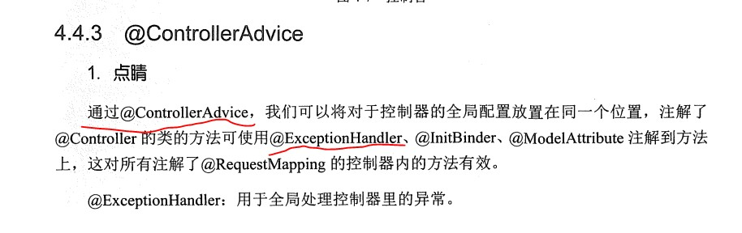

### 6.5.1 Springboot启动原理


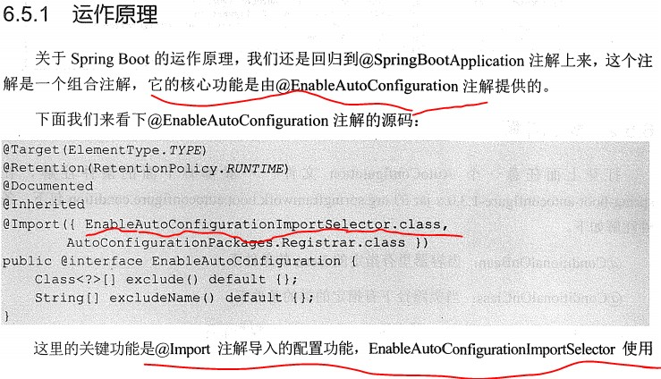


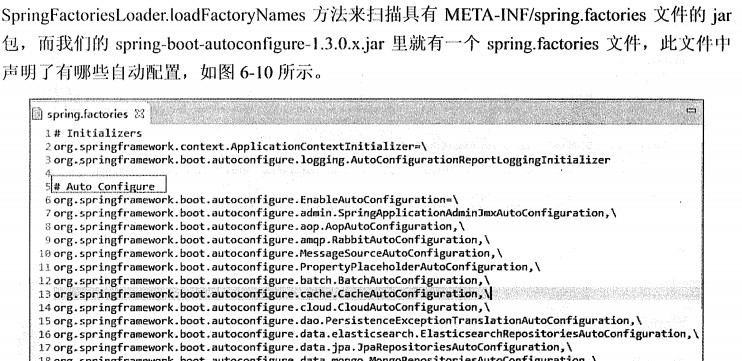