Packt出品，和Spring In Action同样优秀，Java开发人员必看

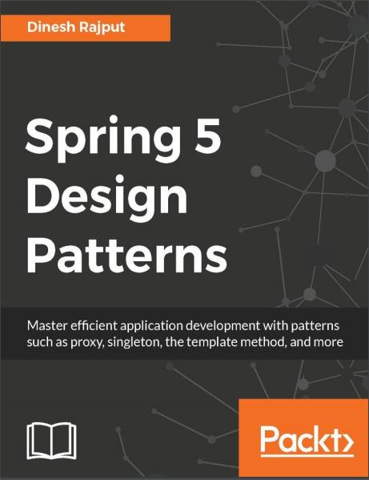
源码地址：https://github.com/PacktPublishing/Spring5-Design-Patterns
<!-- more -->

###  @PostConstruct

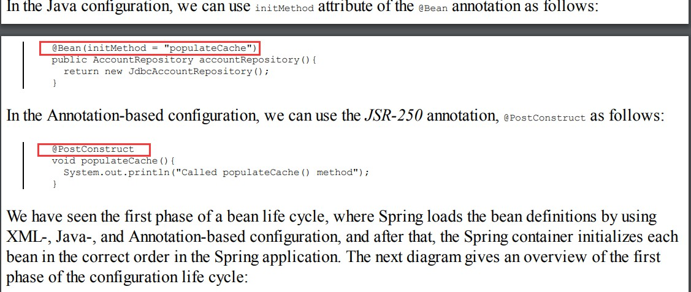
###  @Cacheable

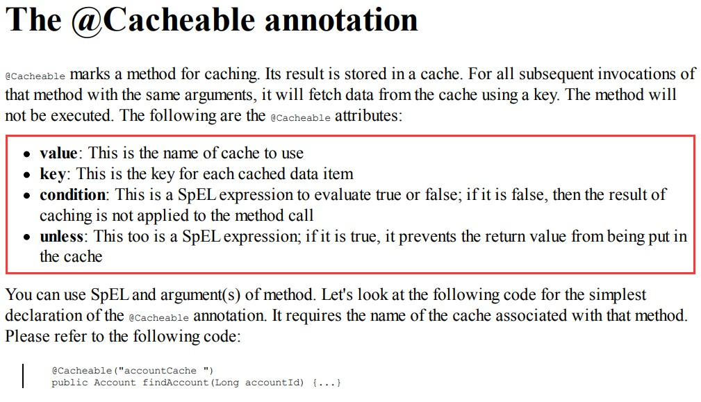
###  @Qualifier

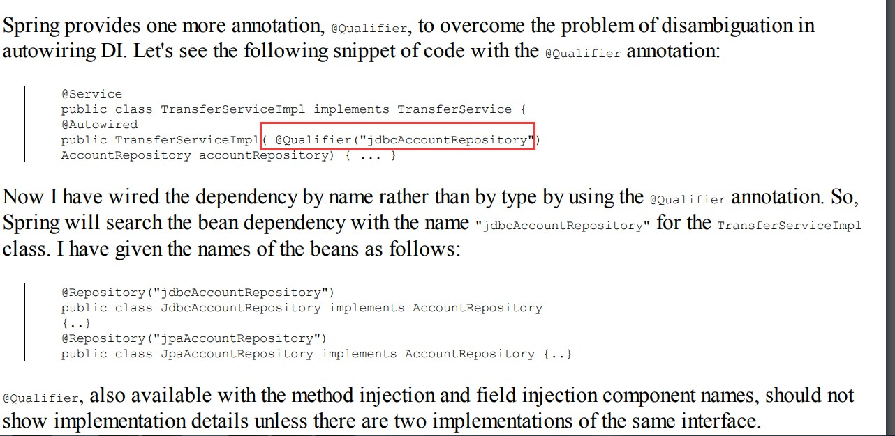
###  @Repository的作用是为了sql出现异常处理

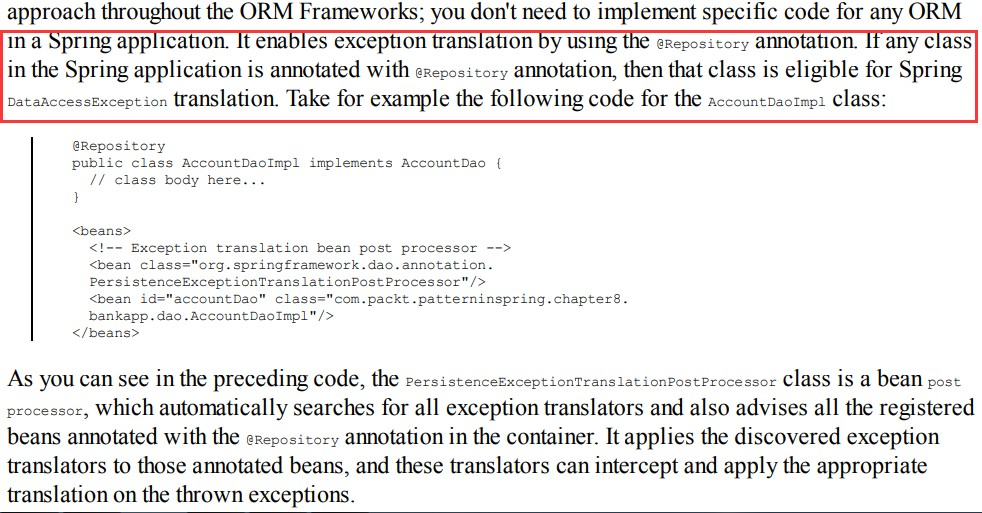
###  AnnotationConfigApplicationContext 读取java配置

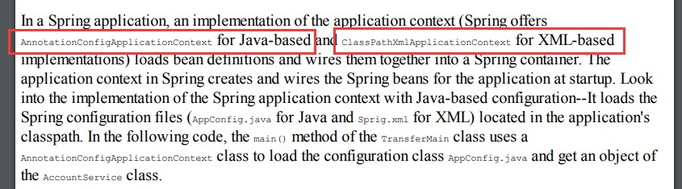

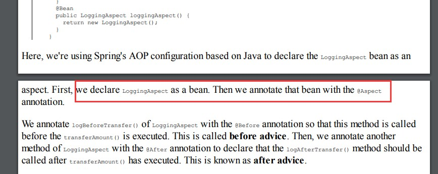
###  aop注解 joinpoints

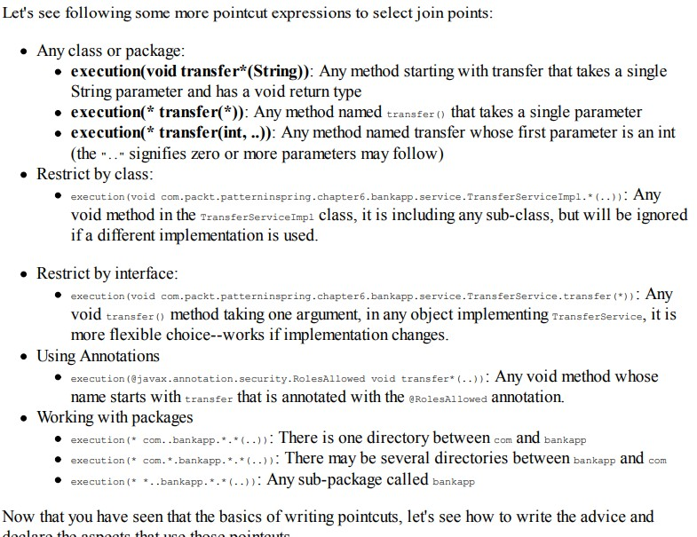
###  applicationcontext 具体实现

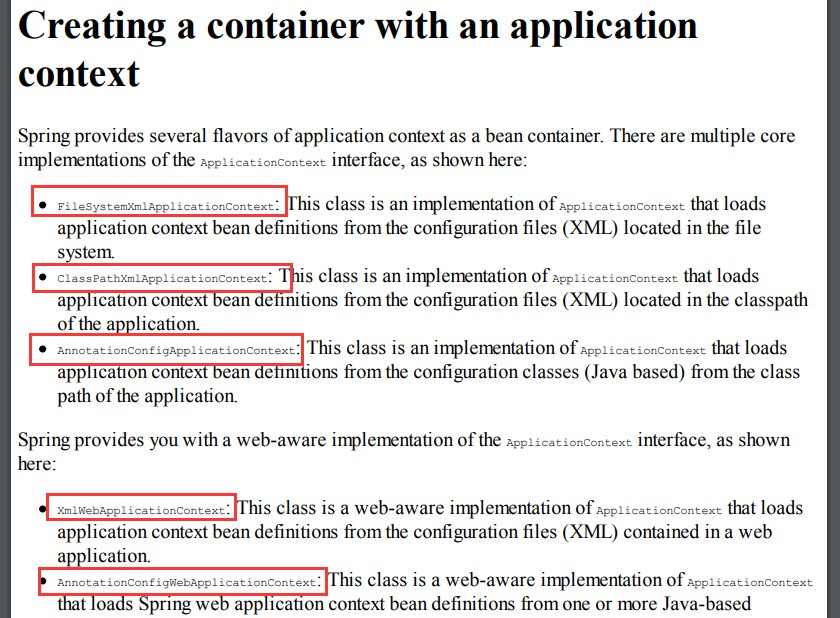
###  caching declaration

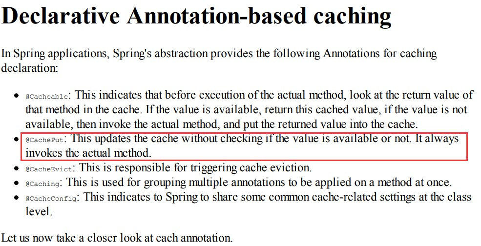
###  CGLIB代理采用继承，不能重写final方法

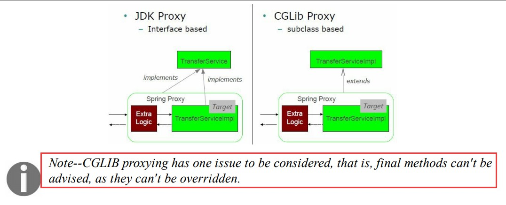
###  transactions as readOnly=true

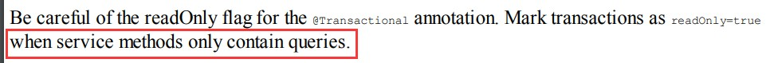
###  use SessionFactory and EntityManager

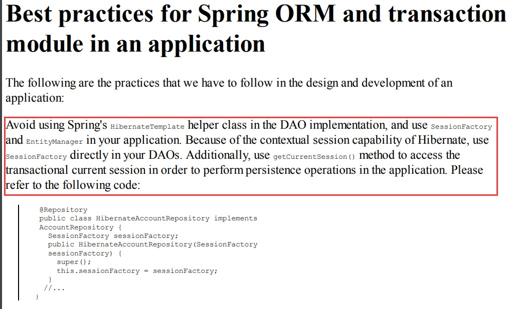
###  缓存注解加在service层

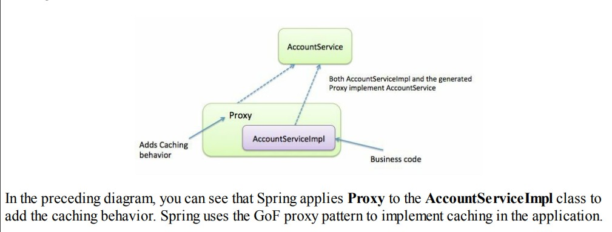
###  实现事务两步

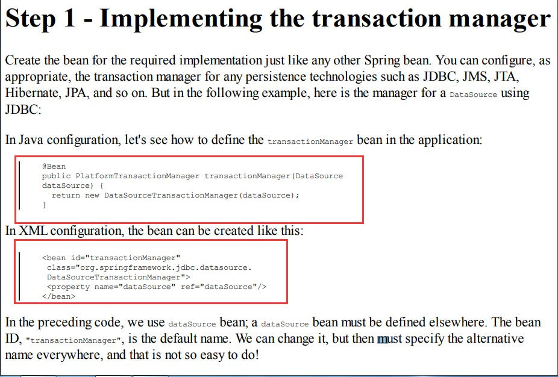

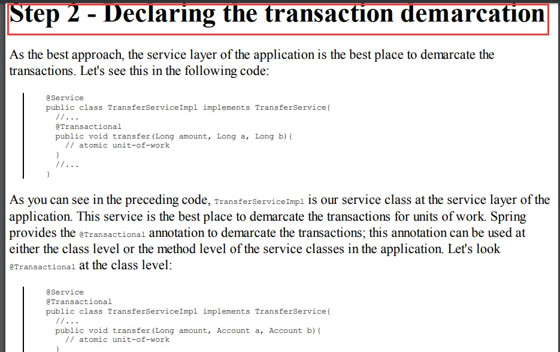

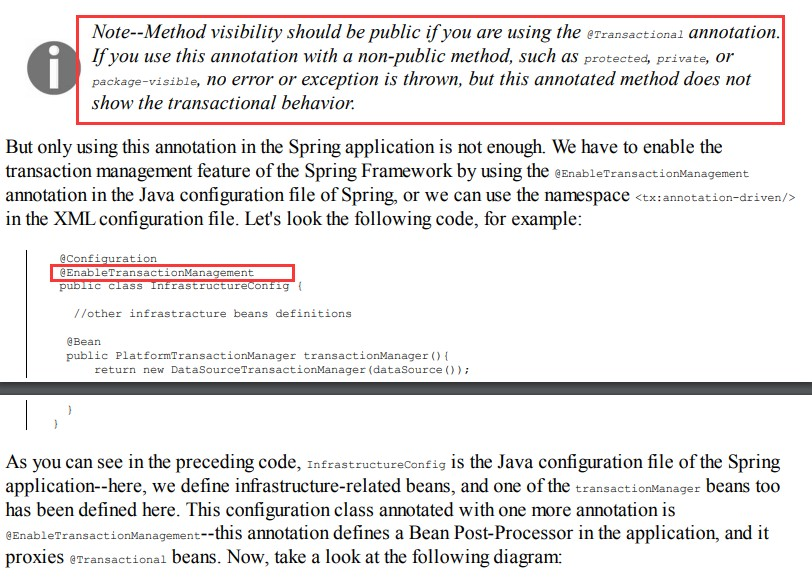

