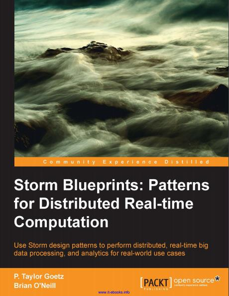
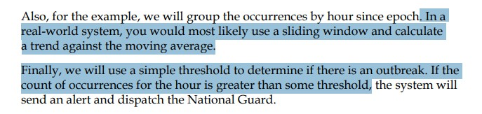
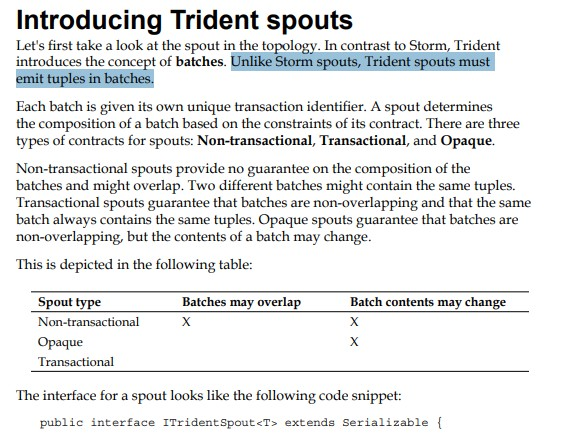
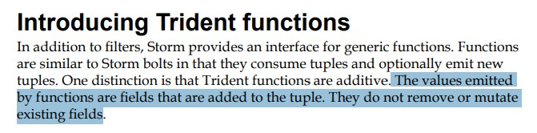



<!-- more -->

### 83 真实系统用滑动窗口倾向，这里采用简单的去判断是否超过阈值



### 86  Trident spouts must emit tuples in batches.



### 95 The values emitted by functions are fields that are added to the tuple

通过Trident函数发射的字段是添加的，不会删除原来的字段


