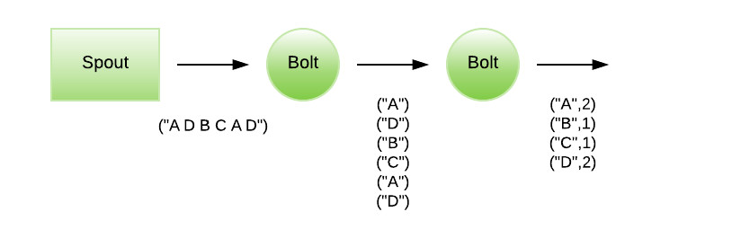
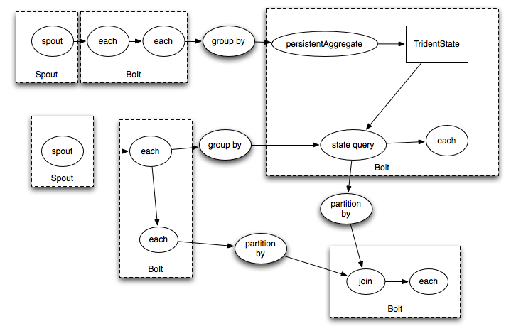
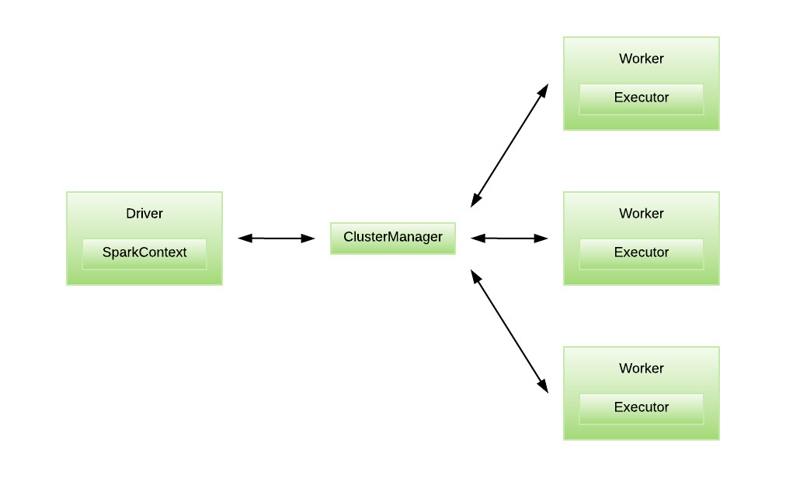
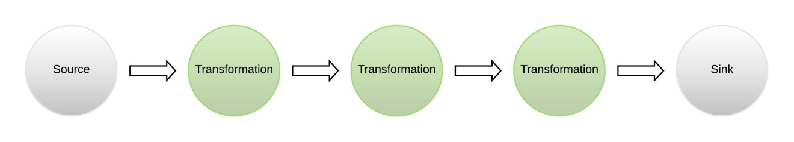
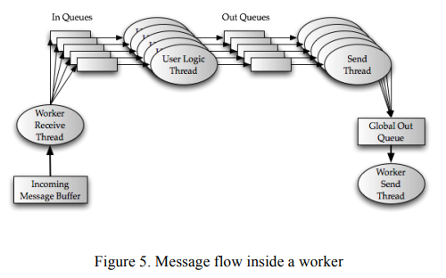
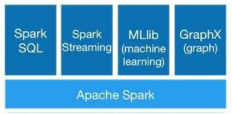

这篇文章一开始通过单词计数的例子向大家展示大数据框架开发的不同，让大家对各个框架的架构和编写应用程序有初步的印象，在单词计数例子的对比中发现各个架构中一些初步的不同。

随后描述的是Storm/Jstorm在开发复杂应用时将会遇到的一些问题，有些容易解决，有些将会难以解决，这个时候怎么办，首先关注的是在Storm/Jstorm中如何处理这些问题，然后探讨为什么会存在这些问题，Spark/flink会不会存在同样的问题，经过比较，发现这些问题只在Storm/Jstorm中存在，这时候需要回归到框架模型，架构上进行分析。

然后我们会发现Storm/Jstorm在实现复杂功能（比如窗口机制）为什么比Spark更困难，Storm/Jstorm的支持SQL开发为什么还是处于实验状态，其实这些都已经由Storm/Jstorm的底层模型决定了。

同时文章还给出Storm/Jstorm与Spark开发成本上的对比，最后将给出Storm/Jstorm的适应场景。

<!-- more -->

目录

[摘要........................................................................................................... 3](#_Toc1737)

[介绍........................................................................................................... 3](#_Toc20574)

[1．从单词计数例子开始................................................................................. 4](#_Toc1028)

[1.Storm/Jstorm的架构和示例.................................................................. 4](#_Toc4372)

[2. Storm/Jstorm Trident的架构和示例..................................................... 9](#_Toc9804)

[3.Spark架构和示例............................................................................... 12](#_Toc21529)

[3.Flink架构和示例................................................................................ 14](#_Toc23106)

[4.单词计数简单总结............................................................................... 16](#_Toc20807)

[1.代码量对比.................................................................................. 16](#_Toc26411)

[2.DAG（有向无环图）构建............................................................... 16](#_Toc11863)

[2.状态管理对比............................................................................... 16](#_Toc4411)

[2．时间窗口的探讨..................................................................................... 17](#_Toc1671)

[1.介绍时间窗口..................................................................................... 17](#_Toc14124)

[1.滚动窗口（Tumbling  Window）.................................................... 17](#_Toc29780)

[2.滑动窗口（Sliding Window）........................................................ 18](#_Toc3464)

[2.时间窗口的单词计数例子...................................................................... 18](#_Toc22039)

[3.Storm/Jstorm的窗口机制需要解决的问题.............................................. 24](#_Toc27988)

[1.Bolt不带消息时间........................................................................ 24](#_Toc3214)

[2.乱序消息的处理问题...................................................................... 24](#_Toc6396)

[3.窗口内存不足问题......................................................................... 25](#_Toc10895)

[4.窗口状态管理............................................................................... 26](#_Toc12717)

[5. 与Spark Streaming 对比............................................................ 26](#_Toc1916)

[3.SQL引擎的支持....................................................................................... 26](#_Toc10375)

[1. SQL引擎优点................................................................................... 27](#_Toc29232)

[2.利用原SQL语句对项目进行改造............................................................ 27](#_Toc4679)

[4.开发成本比较.......................................................................................... 28](#_Toc28797)

[1.语言抽象程度..................................................................................... 28](#_Toc14682)

[2.框架通用性比较.................................................................................. 29](#_Toc6005)

[2.开发人员熟悉程度............................................................................... 29](#_Toc27005)

[3.后期扩展和维护.................................................................................. 30](#_Toc11023)

[4.代码重用........................................................................................... 30](#_Toc2380)

[5.结论................................................................................................. 30](#_Toc26602)

[5.从架构说起............................................................................................. 31](#_Toc31097)

[1.通过消息队列实现............................................................................... 31](#_Toc12353)

[2.回顾窗口机制..................................................................................... 32](#_Toc11901)

[3.回顾Storm/Jstorm的 Trident................................................................ 32](#_Toc23873)

[4.回顾Storm/Jstorm的SQL引擎开发........................................................ 33](#_Toc24827)

[5.与Spark架构对比............................................................................... 34](#_Toc16491)

[6.Storm/Jstorm程序开发中的难点................................................................ 35](#_Toc21049)

[7.结论...................................................................................................... 37](#_Toc31907)

[8.引用和参考文档....................................................................................... 37](#_Toc19797)

 

 


# 摘要

 

这篇文章一开始通过单词计数的例子向大家展示大数据框架开发的不同，让大家对各个框架的架构和编写应用程序有初步的印象，在单词计数例子的对比中发现各个架构中一些初步的不同。

随后描述的是Storm/Jstorm在开发复杂应用时将会遇到的一些问题，有些容易解决，有些将会难以解决，这个时候怎么办，首先关注的是在Storm/Jstorm中如何处理这些问题，然后探讨为什么会存在这些问题，Spark/flink会不会存在同样的问题，经过比较，发现这些问题只在Storm/Jstorm中存在，这时候需要回归到框架模型，架构上进行分析。

然后我们会发现Storm/Jstorm在实现复杂功能（比如窗口机制）为什么比Spark更困难，Storm/Jstorm的支持SQL开发为什么还是处于实验状态，其实这些都已经由Storm/Jstorm的底层模型决定了。

同时文章还给出Storm/Jstorm与Spark开发成本上的对比，最后将给出Storm/Jstorm的适应场景。

 

 

# 介绍

 

经过在公司这段时间对于Storm/Jstorm的摸索，熟悉了Storm/Jstorm的处理模型和Spout/Bolt/Topology组织结构，也深入了解了Storm/Jstorm的高级抽象工具Trident, Storm/Jstorm 分布式调用DRPC, 阅读了有关Storm/Jstorm 窗口机制的处理官方文档，以及处于实验状态的Storm/Storm SQL。

随着对Storm/Jstorm越来越深入的了解，逐渐发现了一些Storm/Jstorm本身的局限性，尤其是在处理一些任务量大，任务复杂的情况时，Storm/Jstorm对此有些力不从心，开发人员可能面临束手无策的局面。

本文结合自身Spark的使用经验，没有对比就没法发现其中的巨大区别，相比Spark， Storm/Jstorm有它自己的优势，比如速度快（毫秒级别，Spark是秒级别），但是更多的是发现Storm/Jstorm有许多不足，各种支持情况缺乏，更多问题需要去面对，导致开发效率必将远不如Spark , 开发成本确远远超过Spark进行开发，担忧用Storm/Jstorm进行开发是否能按时完成开发任务，这也是我开始写这篇文章的初衷。 

本来想等更深入的了解Storm/Jstorm后再写，但是因为项目即将启动，所以不得不抓紧时间完成，由于本人对Storm/Jstorm只是接触到皮毛，依然缺乏足够深入的了解，再加上时间仓促，文章难免有观点错误，欢迎指正。

 

# 1．从单词计数例子开始

为避免枯燥繁琐的介绍，首先以一个单词计数的例子作为文章的开头，让大家先有个直观的印象，通过例子介绍其中的原理架构，后续再做详细的探讨，同时文章各个地方会用到单词计数的例子作为解说，所以希望你能尽量理解单词计数例子的架构和代码，对阅读理解本文很有必要。

## 1.Storm/Jstorm的架构和示例

我们需要创建一个简单的Spout，它生成要传输到Bolt的句子，将句子分解为单词，然后生成另一个Bolt，它会在单词流过时对其进行计数。

每个阶段的输出如下图所示。


 


代码示例,我们需要创建三个类，一个main方法

第一步，创建发送消息的spout

```
public class RandomSentenceSpout extends BaseRichSpout {
  SpoutOutputCollector _collector;
  Random _rand;
 
 
  @Override
  public void open(Map conf, TopologyContext context, SpoutOutputCollector collector) {
    _collector = collector;
    _rand = new Random();
  }
 
  @Override
  public void nextTuple() {
    Utils.sleep(100);
    String[] sentences = new String[]{ "the cow jumped over the moon", "an apple a day keeps the doctor away",
        "four score and seven years ago", "snow white and the seven dwarfs", "i am at two with nature" };
    String sentence = sentences[_rand.nextInt(sentences.length)];
    _collector.emit(new Values(sentence));
  }
 
  @Override
  public void ack(Object id) {
  }
 
  @Override
  public void fail(Object id) {
  }
 
  @Override
  public void declareOutputFields(OutputFieldsDeclarer declarer) {
    declarer.declare(new Fields("word"));
  }}
```

第二步，创建分割单词的Bolt

```
public static class SplitSentence extends BaseBasicBolt {
    @Override
    public void declareOutputFields(OutputFieldsDeclarer declarer) {
      declarer.declare(new Fields("word"));
    }
 
    @Override
    public Map<String, Object> getComponentConfiguration() {
      return null;
    }
 
    public void execute(Tuple tuple, BasicOutputCollector basicOutputCollector) {
      String sentence = tuple.getStringByField("sentence");
      String words[] = sentence.split("\\s+");
      for (String w : words) {
        basicOutputCollector.emit(new Values(w));
      }
    }}
```

第三步，创建计数的Bolt

```
public static class WordCount extends BaseBasicBolt {
    Map<String, Integer> counts = new HashMap<String, Integer>();
 
    @Override
    public void execute(Tuple tuple, BasicOutputCollector collector) {
      String word = tuple.getString(0);
      Integer count = counts.get(word);
      if (count == null)
        count = 0;
      count++;
      counts.put(word, count);
      collector.emit(new Values(word, count));
    }
 
    @Override
    public void declareOutputFields(OutputFieldsDeclarer declarer) {
      declarer.declare(new Fields("word", "count"));
    }}
```

最后构建topology,定义DAG(有向无环图）

```
public static void main(String[] args) throws Exception {
    TopologyBuilder builder = new TopologyBuilder();
    builder.setSpout("spout", new RandomSentenceSpout(), 5);
    builder.setBolt("split", new SplitSentence(), 8).shuffleGrouping("spout");
    builder.setBolt("count", new WordCount(), 12).fieldsGrouping("split", new Fields("word"));
 
    Config conf = new Config();
    conf.setDebug(true);
 
    if (args != null && args.length > 0) {
      conf.setNumWorkers(3);
 
      StormSubmitter.submitTopologyWithProgressBar(args[0], conf, builder.createTopology());
    } else {
      conf.setMaxTaskParallelism(3);
      LocalCluster cluster = new LocalCluster();
      cluster.submitTopology("word-count", conf, builder.createTopology());
      Thread.sleep(10000);
      cluster.shutdown();
    }}
```

这是一个由spout/bolt构成的组合引擎，从这个例子中可以看出，仅仅是创建一个简单的统计单词个数的topology,代码量非常多。

## 2. Storm/Jstorm Trident的架构和示例

Trident是Storm/Jstorm的高级抽象组件，用于在Storm/Jstorm之上进行实时计算，所以架构依然是Storm/Jstorm本身的架构，相比Storm/Jstorm，Trident实现了状态管理和抽象编程。并且提供了有且只有一次（exactly-once）的处理语义。

一个Trident 被编译成Storm/Jstorm spouts / bolt执行的图（不是单词计数的图）

图片来源于 http://storm.apache.org/releases/current/Trident-tutorial.html




让我们看一下Trident的单词计数的例子。例子来源于 http://storm.apache.org/releases/current/Trident-tutorial.html 。

这个例子将做两件事：

1.从输入的句子流计算流式字数

2.实现查询以获取单词列表的计数总和

出于说明的目的，此示例将从以下来源读取无限的句子流：

```
FixedBatchSpout spout = new FixedBatchSpout(new Fields("sentence"), 3,
               new Values("the cow jumped over the moon"),
               new Values("the man went to the store and bought some candy"),
               new Values("four score and seven years ago"),
               new Values("how many apples can you eat"));spout.setCycle(true);
```

这个Spout一遍又一遍地循环遍历这组句子以产生句子流。这是进行计算的流式字数统计的代码：

```
TridentTopology topology = new TridentTopology();        TridentState wordCounts =
     topology.newStream("spout1", spout)
       .each(new Fields("sentence"), new Split(), new Fields("word"))
       .groupBy(new Fields("word"))
       .persistentAggregate(new MemoryMapState.Factory(), new Count(), new Fields("count") 
       .parallelismHint(6);
```

Trident又是如何做状态管理的，上述例子是通过MemoryMapState来保存单词个数状态的。状态即可以保留在topology的内部，比如说内存和HDFS，也可以放到外部存储当中，比如说Memcached或者Cassandra

Split类

```
public class Split extends BaseFunction {
   public void execute(TridentTuple tuple, TridentCollector collector) {
       String sentence = tuple.getString(0);
       for(String word: sentence.split(" ")) {
           collector.emit(new Values(word));                
       }
   }}
```

可以看到相比原生的Storm/Jstorm，构建topology时采用了部分代码量（比如直接利用groupBy分组），但是其它功能的实现（split和count）依然需要像Storm/Jstorm一样继承类实现方法来编写代码。

## 3.Spark架构和示例

Spark体系结构基于RDD或弹性分布式数据集的概念 ，分布式的不可变数据，它们被拆分并发送给Worker，由执行者执行。它与MapReduce概念非常相似，即 对多个节点进行控制处理和委托处理，每个节点都进行自己的处理，然后将结果组合起来，形成完整的最终结果。对于Apache Spark，RDD是不可变的（**非常适合函数式编程**），因此没有工作节点可以修改它; 只处理它并输出一些结果，**非常适合基于功能和集合理论的编程模型（如SQL）。**




 

Spark 单词计数的例子（来源于 https://spark.apache.org/docs/latest/streaming-programming-guide.html ）

```
// Create a local StreamingContext with two working thread and batch interval of 1 second.// The master requires 2 cores to prevent a starvation scenario.
val conf = new SparkConf().setMaster("local[2]").setAppName("NetworkWordCount")
val ssc = new StreamingContext(conf, Seconds(1))
// Create a DStream that will connect to hostname:port, like localhost:9999
val lines = ssc.socketTextStream("localhost", 9999)
// Split each line into words
val words = lines.flatMap(_.split(" "))
val pairs = words.map(word => (word, 1))
val wordCounts = pairs.reduceByKey(_ + _)
// Print the first ten elements of each RDD generated in this DStream to the console
wordCounts.print()
ssc.start()             // Start the computation
ssc.awaitTermination()  // Wait for the computation to terminate
```

 

这段代码基本上只是从文件中读取，用空格分割单词，创建一个元组，其中包含每个单词和一个数字（1开头），然后将它们全部放在一起并添加计数。很有必要理解上面的代码，初步见识函数式编程的魅力，后面会有更多函数式编程的论述，你也可以从网上阅读函数式编程的资料，个人认为，函数式编程是大数据分布式开发必备的技能。

```
val words = lines.flatMap(_.split(" "))
```

**split****方法替代了Storm/Jstorm和Trident中的Split类**

```
val wordCounts = pairs.reduceByKey(_ + _)
```

**reduceByKey****方法替代了Storm/Jstorm和Trident中的Count类**

**在命令式编程中创建一个类才能解决的问题，在函数式编程只需要一个方法。**

**而且这些代码都没有明确涉及DAG本身(****Storm/Jstorm****需要手动构建DAG本身，****Storm/Jstorm****例子中的****topology****就是在构建DAG****，构建****DAG****花费的时间随DAG的复杂情况呈几何上升****)，Spark框架自动实现被调用函数的DAG。**

**因为Spark使用声明引擎****(****用函数式编程)，代码只定义了需要对数据执行的函数。仅几行代码就解决了单词计数，甚至可以将这些代码合并成一行。**

 

## 3.Flink架构和示例

 Flink使用Streams和Transformations的概念，通过其系统构成数据流。数据通过“源”进入系统并通过“接收器”退出




flink单词计数的例子 （来源于 https://blog.scottlogic.com/2018/07/06/comparing-streaming-frameworks-pt1.html  ）

```
public static void main(String[] args) throws Exception {
    // set up the streaming execution environment
    final StreamExecutionEnvironment env = StreamExecutionEnvironment.getExecutionEnvironment();
    String textPath = "<text file name>";
    DataStreamSource<String> text = env.readTextFile(textPath);
    DataStream<Tuple2<String, Integer>> counts =
            // split up the lines into pairs (2-tuples) containing: (word,1)
            text.flatMap(new Tokenizer())
                    // group by the tuple field "0" and sum up tuple field "1"
                    .keyBy(0).sum(1);
 
    counts.writeAsText("<output directory>/wcflink.results");
    env.execute("Streaming WordCount");}
```

创建Tokenizer类

```
public static final class Tokenizer implements FlatMapFunction<String, Tuple2<String, Integer>> {
   private static final long serialVersionUID = 1L;
   @Override
   public void flatMap(String value, Collector<Tuple2<String, Integer>> out)
           throws Exception {
       String[] tokens = value.toLowerCase().split("\\s+");
       for (String token : tokens) {
           if (token.length() > 0) {
               out.collect(new Tuple2<String, Integer>(token, 1));
           }
       }
   }}
```

Flink也使用声明引擎，DAG由转换的顺序暗示（flatmap - > keyby - > sum）。如果引擎检测到转换不依赖于先前转换的输出，则它可以重新排序转换。

 

## 4.单词计数简单总结

### 1.代码量对比

通过上述例子，我们可以简单的看出代码量Storm/Jstorm >> Storm/Jstorm Trident > flink > Spark Streaming ,这是因为Spark Streaming/flink 采用了更高级的抽象编程（声明式编程或函数式编程），所以代码简洁度更高、代码量更少。更为重要的是函数式编程在实现聚合、Join等复杂操作时非常容易实现（天然支持）。

### 2.DAG（有向无环图）构建

流式处理流程是一个有向无环图，图中展示了了数据流的处理流程。**Storm/Jstorm需要我们手动构建DAG, 包括spout/Bolt的个数、并发度设置都需要我们自定义，对于Spark框架，由Spark根据代码为我们自动构建。**

### 2.状态管理对比

Storm/Jstorm没有内置的状态管理，框架能做的事很少，基本是接收消息然后发送到下一个bolt，需要自己在程序中定义局部状态，在创建计数的Bolt中，我们自己设置hashMap作为计数的存储状态

` `Map**<**String**,**` `Integer**>**` `counts` `**=**` `**new**` `HashMap**<**String**,**` `Integer**>();**

如果需要更为复杂的状态管理，我们不可能全部自己去实现状态管理，而聚合，Join等复杂操作是需要状态管理的，如果框架不能提供，依靠自己实现状态管理，程序复杂度将成指数级别上升甚至导致项目开发失败，所以，Storm/Jstorm 框架只适合处理任务量小，线性型的任务

由于Storm/Jstorm Trident的出现改善了上述情况，Trident提供了状态管理，所以我们可以用Trident实现聚合，Join等操作，但是因为Storm/Jstorm 架构中的spout/bolt是单独分散的，所以**用Trident实现状态管理，必然以牺牲很大性能为代价**。

**Spark** **采用函数式编程，函数式编程本身拥有聚合，join等复杂操作的api**，这些api自动实现状态管理，在程序中我们只需要编写函数式编程然后在代码中定义如何执行，Spark 还拥有各种上下文（Sparkcontext, SparkStreamingcontext）作为全局的状态管理。

 

# 2．时间窗口的探讨

## 1.介绍时间窗口

首先我们需要理解时间窗口，时间窗口分为2种类型，

### 1.滚动窗口（Tumbling Window）

每个Tuple只能属于其中一个滚动窗口，一个Tuple不能同时是两个或者两个以上窗口的元素。比如下面我们以消息到达的时间来划分成一个个滚动窗口，窗口大小是5秒:

第一个窗口w1包含的是0~5th到达的数据，第二窗口w2包含的是5~10th秒到达的数据，第三个窗口包含的是10~15th秒到达的数据。每个窗口每隔5秒被计算，窗口和窗口直接没有重叠。

### 2.滑动窗口（Sliding Window）

tuples被划分到一个个滑动窗口，窗口滑动的间隔是sliding interval。每个窗口间会有重叠，重叠部分的tuple可以先后属于前后两个窗口。比如下面我们以事件处理时间划分滑动窗口，窗口大小是10秒，滑动间隔是5秒：

第一个窗口w1包含的是0-10th到达的数据，第二窗口w2包含的是5-15th秒到达的数据。消息时间e3-e6都是窗口w1和w2的一部分。在15th秒时，窗口w2会被计算，这时候e1 e2的数据会会过期，会从队列中移除。

 

## 2.时间窗口的单词计数例子

1.Storm/Jstorm的word count的例子，

为了叙述方便，我们把无关代码都精简了，只关注如何定义window以及用户的window实现：

代码来源于 http://jstorm.io/ProgrammingGuide_cn/NewWindow.html

这段代码你不需要阅读，建议直接跳过这段代码

```
package com.alipay.dw.jstorm.example.newindow;
 
// import xxx
// ...
 
public class FastWordTimeWindowTopology {
    private static Logger LOG = LoggerFactory.getLogger(FastWordTimeWindowTopology.class);
 
    public static class FastRandomSentenceSpout implements IRichSpout {
        SpoutOutputCollector _collector;
        Random _rand;
        long startTime;
        long sentNum = 0;
        long maxSendNum;
        int index = 0;
 
        private static final String[] CHOICES = {
                "JStorm is a distributed and fault-tolerant realtime computation system.",
                "Whenever a worker process crashes, ",
                "the scheduler embedded in the JStorm instance immediately spawns a new worker process to take the place of the failed one.",
                " The Acking framework provided by JStorm guarantees that every single piece of data will be processed at least once."};
 
        @Override
        public void open(Map conf, TopologyContext context, SpoutOutputCollector collector) {
            _collector = collector;
            _rand = new Random();
            startTime = System.currentTimeMillis();
            maxSendNum = JStormUtils.parseLong(conf.get("max.send.num"), 1000L);
        }
 
        @Override
        public void nextTuple() {
            if (sentNum >= maxSendNum) {
                JStormUtils.sleepMs(1);
                return;
            }
 
            sentNum++;
            String sentence = CHOICES[index++];
            if (index >= CHOICES.length) {
                index = 0;
            }
            _collector.emit(new Values(sentence));
            JStormUtils.sleepMs(10);
        }
 
        @Override
        public void declareOutputFields(OutputFieldsDeclarer declarer) {
            declarer.declare(new Fields("sentence"));
        }
        
        // ...
    }
 
    public static class SplitSentence implements IRichBolt {
        OutputCollector collector;
 
        @Override
        public void execute(Tuple tuple) {
            String sentence = tuple.getString(0);
            for (String word : sentence.split("\\s+")) {
                collector.emit(new Values(word));
            }
        }
 
        @Override
        public void declareOutputFields(OutputFieldsDeclarer declarer) {
            declarer.declare(new Fields("word"));
        }
   
        // ...
    }
 
    // window的实现，注意它从BaseWindowedBolt派生，因为构造window时需要BaseWindowedBolt。
    public static class WordCount extends BaseWindowedBolt<Tuple> {
        OutputCollector collector;
 
        @Override
        public void prepare(Map stormConf, TopologyContext context, OutputCollector collector) {
            this.collector = collector;
        }
 
        // 初始化window状态，对于word count的例子，我们需要的是一个word -> count的map
        @Override
        public Object initWindowState() {
            return new HashMap<>();
        }
 
        // 执行消息，更新word count
        @Override
        public void execute(Tuple tuple, Object state, TimeWindow window) {
            Map<String, Integer> counts = (Map<String, Integer>) state;
            String word = tuple.getString(0);
            Integer count = counts.get(word);
            if (count == null)
                count = 0;
            counts.put(word, ++count);
        }
 
        // purge窗口。这里我们就简单地打印出这个窗口所有消息的word count。
        @Override
        public void purgeWindow(Object state, TimeWindow window) {
            Map<String, Integer> counts = (Map<String, Integer>) state;
            System.out.println("purging window: " + window);
            System.out.println("=============================");
            for (Map.Entry<String, Integer> entry : counts.entrySet()) {
                System.out.println("word: " + entry.getKey() + "\tcount: " + entry.getValue());
            }
            System.out.println("=============================");
            System.out.println();
        }
    }
 
    static Config conf = JStormHelper.getConfig(null);
 
    public static void test() {
        TopologyBuilder builder = new TopologyBuilder();
        builder.setSpout("spout", new FastRandomSentenceSpout(), 1);
        builder.setBolt("split", new SplitSentence(), 1).shuffleGrouping("spout");
 
        // 构造一个大小为1分钟，每隔500ms滑动一次的窗口
        builder.setBolt("count", new WordCount()
                        .timeWindow(Time.seconds(1L), Time.milliseconds(500L)),
                1).fieldsGrouping("split", new Fields("word"));
 
        String[] className = Thread.currentThread().getStackTrace()[1].getClassName().split("\\.");
        String topologyName = className[className.length - 1];
        JStormHelper.runTopology(builder.createTopology(), topologyName, conf, 60,
                    new JStormHelper.CheckAckedFail(conf), true);
    }
 
    public static void main(String[] args) throws Exception {
        conf = JStormHelper.getConfig(args);
        test();
    }
}
```

 

上述代码你不需要你阅读，贴上上述代码的目的只是为了和Spark Streaming的代码进行对比

在Spark中实现时间窗口非常简单，比如在wordcout的例子上实现时间窗口的功能我们只需要在Spark Streaming单词计数的例子上更改一行代码

代码来源于

 https://spark.apache.org/docs/latest/streaming-programming-guide.html

```
val windowedWordCounts = pairs.reduceByKeyAndWindow((a:Int,b:Int) => (a + b), Seconds(30), Seconds(10))
```

每隔10秒获取最后30秒的数据。

**就是这么简单，你甚至不需要重复开发，但是在Storm/Jstorm中流处理和批处理是不同的，需要编写不同的代码，而且代码量之多超乎想象，对于窗口的批处理代码量更是令人咂舌。**

为什么Storm/Jstorm的窗口机制代码会这么多，因为它需要解决很多问题，导致代码量急剧上升，下面将探讨Storm/Jstorm窗口机制存在的一些必须要处理的问题。

## 3.Storm/Jstorm的窗口机制需要解决的问题

### 1.Bolt不带消息时间

时间窗口是在bolt中进行处理，把tuple为单位的处理逻辑改成以一个窗口为单位的处理逻辑。在窗口执行过程中每个tuple对应一个时间戳，默认情况下Window中涉及的时间都是指当前消息处理时间，这时候每个tuple对应的时间戳是通过System.currentTime()生成的；但Storm/Jstorm 以支持以消息本身的时间（event time）来定义窗口、执行窗口操作，这时候每个tuple必须携带一个时间戳，且消息携带的时间戳必须以预设好的字段来标识。

### 2.乱序消息的处理问题

如果说上面的问题通过添加字段来解决对你来说太简单了，那么这个问题可能对你来说有点困难。

 当用户的处理节点是通过基于Event Time的时间窗口来处理数据时（如果按每个bolt接收消息的时间进行处理则结果毫无用处），它必须在确定所有属于该时间窗口的消息全部流入操作节点后才能开始数据处理。但是由于消息可能是乱序的（因为spout/bolt是分散并行的，而且只负责发送和接收收据tuple，tuple到达多个相同的bolt时间会不同，甚至超过设置的窗口时间），所以操作节点无法直接确认何时所有属于该时间窗口的消息全部流入此操作符。这时候Storm/Jstorm以和flink一样，引入了WaterMark的概念。

WaterMark本身也是一条消息，包含一个时间戳，Storm/Jstorm使用WaterMark标记所有小于该时间戳的消息都已流入，Storm/Jstorm会会根据已经流入该节点的消息定时生成一个包含该时间戳的WaterMark，插入到消息流中输出到Storm/Jstorm流处理系统中，Storm/Jstorm操作符按照时间窗口缓存所有流入的消息，当bolt节点处理到 WaterMark时，它对所有小于该WaterMark时间戳的时间窗口数据进行处理并发送到下一个处理节点。

为了保证能够处理所有属于某个时间窗口的消息，bolt节点必须等到大于这个时间窗口的WaterMark之后才能开始对该时间窗口的消息进行处理，相对于基于消息处理时间的时间窗口，基于event time的窗口需要**占用更多内存，且会直接影响消息处理的延迟时间**。对此，一个可能的优化措施是，**对于聚合类的操作，我们建议提前对部分消息进行聚合操作**，当有属于该时间窗口的新消息流入时，基于之前的部分聚合结果继续计算，这样的话，只需缓存中间计算结果即可，无需缓存该时间窗口的所有消息。

有关WaterMark的详细介绍及原理参照 http://jstorm.io/ProgrammingGuide_cn/AdvancedUsage/Window.html

### 3.窗口内存不足问题

Storm/Jstorm的窗口机制最大的问题是所有窗口都需要憋数据，即，消息过来的时候，并不会触发窗口计算， 只是简单地把数据堆在内存中，一直到达触发窗口计算的条件，才会拿所有的数据进行计算。显然，这种设计是不实用的，窗口稍微大一点就会爆掉了。

基于此，JStorm重新设计了窗口的实现，在**2.3版本**中开始提供对新窗口机制的实现。但是现在对方集群提供的版本是**Jstorm2.1.1**，也就是说现在这个问题我们还无法解决。

### 4.窗口状态管理

由于window处理节点的executor处理消息是以一个窗口为维度，如果其中窗口中的一条tuple处理失败，可能就会造成整个窗口所有数据replay。

### 5. 与Spark Streaming 对比

恭喜你，如果你用Spark Streaming将不存在上述任何一个问题。

针对消息乱序问题，Spark Streaming 在入口按窗口设置的时间一次读取窗口数据，然后进行处理，不需要像Bolt一样发送处理后的数据到下一个Bolt,也就不存在消息乱序，

针对窗口状态管理，Spark Streaming 处理的是整个窗口的数据，而不是单个数据的处理，所以不存在单个数据处理失败，整个窗口重新计算。

其实**Storm/Jstorm的spout/bolt架构就不适合做窗口机制**，后面我们将根据底层模型详细探讨。

Storm/Jstorm的更新解决了部分问题，但是由于**底层架构不同，可以说Storm/Jstorm解决的是Spark中不存在的问题**

 

# 3.SQL引擎的支持

Sql是一种声明式语言，属于更高一级的抽象，像数据库的sql语句一样，我们只需要关注获取什么数据，而不需要关注程序的获取过程，过程交由数据库内部去执行，

## 1. SQL引擎优点

通过sql 可以 简化我们对数据的查询包括实现复杂的比较，过滤，统计，聚合，join等查询，可以用一句复杂的sql语句实现复杂的业务逻辑，比在代码中实现功能要简洁方便得多。一句SQL能解决的问题没有开发人员愿意写代码去解决。

**SQL****引擎大大简化了程序的编写，增加了工作效率，同时降低了开发人员的门槛**

然而从Storm官方文档可以看到Storm对于SQL的支持仍处于`experimental`实验 性质。

Spark 中由于RDD是不可变的，因此没有工作节点可以修改它; 只处理它并输出一些结果，非常适合基于功能和集合理论的编程模型（如SQL）。**Spark SQL****对Spark其它组件（比如Spark Streaming）也是原生支持**，**我们甚至可以在窗口机制中执行编写SQL语句。**

 

## 2.利用原SQL语句对项目进行改造

一些单机运行的老项目，由于业务扩展需要进行大数据改造，数据仓库不再是mysql或oracle, 如何把之前操作数据库编写的SQL语句进行分布式改造，有两种方式进行改造

一是将原SQL语句还原成代码程序，编写代码实现原有SQL语句的功能，这种方式对于简单的SQL语句可以接受，但是对于聚合，join，嵌套查询等SQL语句，再还原成代码形式，不仅难度高而且编写程序将十分复杂。

二是将SQL语句原封不动的移植到Spark SQL程序上，在这个过程中，我们只需要模拟创建视图表，然后执行原来的SQL语句，什么都不需要改变。

**在Storm/Jstorm中我们只有第一种可以选择，Spark中可以方便的使用移植过来的SQL，大大降低开发成本，提高开发效率。**

 

# 4.开发成本比较

本节将探讨使用Storm/Jstorm和Spark的开发成本，开发成本涉及到因素非常多，但是在大数据开发中，语言的抽象程度是第一位的，越抽象程序越简洁，越容易被重用 开发成本也就越低。排第二位的个人认为是框架的支持程度，一个好的框架首先是尽量让开发人员编写更少的代码，框架如果支持解析sql语句，开发就会容易许多倍。其它涉及开发成本的因素还有开发人员的熟悉程度，代码是否可以重用，后期扩展与维护等，下面我们一一探讨。

## 1.语言抽象程度

考察开发的语言抽象程度比较： 汇编语言 < 命令式编程 < 函数式编程 < SQL

SQL抽象程度最高， 函数式编程其次，命令式编程最低，语言的抽象程度和开发成本有什么关联呢，

直观的从代码量来观察，抽象程度越高，代码量越小，所以SQL最小，函数式编程其次，命令式编程最多，编写代码量越少，开发成本越低。

Storm/Jstorm一般用命令式编程开发，Storm/Jstorm Trident的main函数的实现了抽象编程，但是还不是语言层面的函数式编程，其它类和方法则是命令式编程。

Spark不仅支持函数式编程，而且推荐你采用函数式编程，Spark还能让你在代码中使用sql语句进行查询，将返回的结果进行下一步的操作（Storm/Jstorm想都不敢想）。

## 2.框架通用性比较

Storm/Jstorm只能进行流处理，**由于一个完整的应用程序，不仅需要流处理，还需要交互式处理（比如restful请求等）, 批处理（离线处理），迭代处理等，而这Spark都可以做到，所有的功能都可以集中在一个Spark程序中。而且Spark所有的组件都统一建立在抽象的RDD模型之上, 包括Spark SQL 和Spark Streaming ， 所以这些组件在一个程序中能够无缝兼容，互相原生支持。**

 

## 2.开发人员熟悉程度

从开发人员熟悉程度来看，SQL和命令式编程只要是开发人员都了解并且非常熟悉，而对于函数式编程，大多数开发人员并不是很熟悉，甚至没有接触过。

但是命令式编程在分布式程序开发中存在巨大的问题。平常命令式编程编写在单机上运行的程序是没有问题的，虽然我们要处理并发，加锁等问题，但是只在单机运行的程序中处理这些问题还不是特别困难。但是在分布式集群中，要处理的问题成指数级别上升，再通过命令式编程编写代码处理这些问题就不现实了，

这个时候我们有两个选择，一种是采用框架来帮我们处理这些问题，比如Storm/Jstorm, 语言仍然是命令式，但是框架会帮你处理这些问题，我们依然只需要通过命令式编程实现业务逻辑。另外一个选择是提升抽象程度，采用函数式编程或SQL，让语言的底层代码来帮你处理这些问题，你只要通过api/sql描述你的目的。

从上面的wordcout例子我们可以比较得出，虽然Storm/Jstorm框架已经简化了你的开发，但是你还是不得不继承各种类然后实现各种方法，尤其是处理join，统计，比较等复杂业务的时候，你需要花费巨大的精力来思考如何实现，并且无比繁琐，而这可能函数式编程一行代码就能解决，这就是编程中抽象的威力。

可以看到，随着大数据分布式开发业务复杂度的提升，函数式编程、SQL、框架的组合是开发的趋势，大数据开发人员需要由命令式到函数式编程范式的转变。所以从开发人员熟悉的角度来说最好是能采用声明式的SQL（需要框架支持，不支持开发成本就很高），然后是函数式编程。而这Spark全部支持。

 

## 3.后期扩展和维护

一个程序开发完成后，需要不断的添加新功能或者变更需求，如何用更加简单方便的添加是程序扩展要考虑的问题。在Storm/Jstorm中如果你需要添加新功能或者变更需求，你都需要改变 拓扑结构，重新构建DAG，然后编写业务代码，而在Spark中你只需要修改业务代码。

 

## 4.代码重用

在Storm/Jstorm中，不允许为流处理和批处理应用相同的代码，比如**流处理实现功能的代码在窗口机制内不能用！！！**，需要再次进行开发。

在Spark中，无论是流处理还是批处理都可以用相同的代码，因为Spark中的流处理实际上还是批处理。

 

## 5.结论

开发成本不仅是每一个公司需要考虑的问题，也是每一个开发人员需要关注的问题，如何用最少的资源创造最大的效益，从上述的分析中，我们可以得出，是否支持SQL开发是降低开发成本的关键。这也是为什么许多大公司都要对大数据框架开发一套SQL, 比如Hive：把sql解析后用MapReduce 运行，SparkSQL：把sql解析后用Spark 运行， Phoenix：一个绕过了MapReduce运行在HBase上的SQL框架。

很不幸的是作为最早的一个大数据实时处理框架，Storm/Jstorm 的SQL仍然处于实验状态，落后太多。

 

# 5.从架构说起

## 1.通过消息队列实现

文章开头单词计数的例子向大家展示了Storm/Jstorm的spout/Bolt处理模型，spout接收数据然后发射Tuple（数据）, Bolt 接收Tuple进行处理后发射Tuple或选择不发射。这里只考察Tuple, Tuple究竟是如何从Spout到Bolt的，或者从Bolt到下一个Bolt是如何传输的，答案是通过消息队列

图片来源于 storm@twitter 论文




没错，就是消息队列，相信在开发中都曾经用过实现消息队列的各种产品，比如Rabbitmq, ActiveMQ，ZeroMq等，Storm用的是zeromq，所以简单来说，Storm/Jstorm 流式处理的逻辑，spout接收数据处理后发送tuple到队列，bolt从这个队列中接收tuple，处理后发送下一个tuple到另外一个队列等待下一个bolt从队列中获取tuple。是的，逻辑就是这么简单，这也是为什么Storm/Jstorm消息处理速度快的原因，消息处理完发送到队列就可以了然后处理下一条到来的消息，你会觉得很惊讶，这 完全就是一个通过队列实现高速运转的系统，你甚至都可以自己搭建消息队列模拟Storm/Jstorm来实现单词计数。

## 2.回顾窗口机制

如果要你自己搭建消息队列模拟Storm/Jstorm来实现窗口机制，你会同样遇到第二节提到的同样问题，比如你有办法解决窗口机制中乱序消息的问题吗？ 对你来说可能难于登天，所以Storm/Jstorm开发人员真的是尽力了。

## 3.回顾Storm/Jstorm的 Trident

每个组件只需要从队列中获取消息进行处理发送到下一个队列，Storm/Jstorm没有状态管理，也不适合具有状态管理的操作，然而从简单的计数到复杂的aggr,join等都是需要状态管理，Storm/Jstorm简单的单词计数的例子都需要自己管理单词个数的状态，你可以想象如果自己去开发管理复杂的aggr,join等操作的状态，你会很困难。

Storm/Jstorm Trident的出现解决了这个问题，Storm/Jstorm Trident高级抽象组件实现了状态管理，但是Trident不再是流处理，而是变成批处理（从这里可以看出在真正的流处理中实现joins，aggregations等其实是很难实现，不然流处理的Storm/Jstorm的高级抽象组件Trident也不会变成批处理），Tident提供了 joins（数据流融合）, aggregations（聚合）, grouping（分组）, functions（自定义函数）, 以及 filters（过滤）等功能，让你可以实现复杂的操作。但是性能会下降很

多。

而Trident不是编程语言，只是加上一层抽象，最终还是解析成Storm/Jstorm的Topolog去执行，试想一个通过队列实现高速运转的系统，你要实现joins/aggregations等复杂操作，要管理的状态变量是何其之多，在Storm/Jstorm框架中这些都有Trident帮你解决，你会感觉还不赖，但是我告诉你如果编程语言本身就支持joins、aggregations等复杂操作，你还会用Trident吗？没错，这就是**函数式编程（****Java8****开始支持函数式编程，****scala****原生支持），****join,aggregations****等复杂操作只是它的一个****api****或者称内置方法而已**，简直是一个天上一个地下的区别。

 

## 4.回顾Storm/Jstorm的SQL引擎开发

1.从Trident的单词计数例子上看，用Trident进行开发其实并不容易，和Storm/Jstorm进行开发差不了太多，因为它还是命令式编程，只是在构建topology时用上了Trident的一些封装好的方法，一般用Trident是因为需要实现有仅一次（exactly once）的语义。

Storm/Jstorm SQL 就是解析成Trident去执行，遗憾的是由于抽象程度不高，所以Storm/Jstorm SQL 解析成Trident是非常复杂的，而且代码量必然很多（代码量和抽象程度有关），或许这是导致开发SQL引擎进展缓慢的原因。

**Spark SQL****中，****SQL****是被解析成函数式编程语言，所以容易的就能被解析执行。**

\2.  数据的可变还是不可变

一般需要操作的数据是不变的才容易开发声明式引擎（SQL只是声明式引擎的一种，比如elasticseach的所有的命令（查询，插入，更新等）操作也是一种声明式引擎，但它不是SQL, 还有MongoDB的所有命令集合，它们有自己的一套查询机制），在mysql和Oracle中，操作的数据是已经存在数据库中数据，它是不变的，所以你无论调用多少次相同的SQL, 返回的结果都是相同的，在Spark中操作的数据RDD, 它也是不变的，只处理它并输出一些结果，非常适合开发SQL引擎。

然而Storm/Jstorm的数据在内部是通过队列变动的，数据具有不确定性，所以Storm/Jstorm 不适合开发SQL引擎。

\3.  Storm/Jstorm SQL引擎查询结果不能交互

因为在Storm/Jstorm程序中只能构建一个topology, 也就是只有一个DAG(有向无环图),数据按流程处理，我们把一句SQL查询对应一个topology, 一个SQL语句就相当于一个应用程序， 在一个应用程序中你无法利用上一个DAG生成的结果去执行下一步的DAG，就是说在一个应用中不能有多个sql语句，**你只能写一个sql语句实现该应用的所有功能，在一个Storm/Jstorm程序中只能构建一个Topology**这个特征对于程序开发简直是致命的了，后面将更详细的描述。

顺便可以简单推断，在SQL语句中不能有两个查询，也就是开发的**SQL引擎必然不支持嵌套查询（在storm/Jstorm的官网上也确实没找到关于嵌套子查询）**。

 

## 5.与Spark架构对比

简单来说，Spark 每个节点都拷贝有执行程序，框架把数据分发送到节点后，每个节点获取这部分数据单独计算，需要时再汇总，从中我们可以看出这和Storm/Jstorm完全不同，分到每个节点的数据是不变的（所以更容易处理，也容易实现SQL查询），执行程序也是分布在每个节点，Spark真正实现了分布式计算。从底层处理数据来说它不是流处理，包括Spark Streaming 归结到底也是批处理，所以在流式处理速度上来说Spark比不上Storm/Jstorm（Spark 秒级别，Storm/Jstorm是毫秒级）。

# 6.Storm/Jstorm程序开发中的难点

在5.4节中提到了用Storm/Jstorm开发程序，在一个Storm程序中只能构建一个topology，不能利用上一个DAG生成的结果去执行下一步。这个问题对于开发来说很致命，这个问题特别重要，以至于不得不用一节进行详细的探讨。

一个Storm程序只能构建一个topology, 也就是这个Storm/Jstorm程序只有一个DAG(有向无环图),然后按DAG流程处理，包括高级抽象Trident解析成Storm/Jstorm程序后也只是一个Topology, 对于流程简单的Storm程序来说，这并不是个问题，但是如果是一个很复杂的程序，DAG（有向无环图）就会变的很长很复杂。

首先 你需要自己手动设计这个复杂的DAG（有向无环图），然后不断测试这个DAG（有向无环图）是否符合你的流程 ，然后更改DAG（有向无环图）是牵一发而动全身的，面对一个随需求随时更改的DAG（有向无环图），构建DAG（有向无环图）的开发任务就很大了，然后你构建的这个复杂DAG（有向无环图）是无法重用的，每一次都需要重新构建DAG（有向无环图）, 所以光是构建DAG（有向无环图）这一个步骤就需要花费大量精力。

因为一个应用程序中只能有一个DAG（有向无环图）,所以**在这个应用程序中你无法分解这个DAG（有向无环图）**, 如果你想分解这个DAG（有向无环图）, 这时候你就只有一个选择，开发多个应用程序，每个应用程序中构建一个稍微简单的DAG（有向无环图）,这么做也行不通，一个是多个应用程序会占用更多的系统资源，更重要的问题是你无法简单的直接利用上一个DAG程序生成的结果去执行下一步，除非你把上一个DAG程序生成的结果存储到某个地方，然后下一个程序再去取这个数据，但是没人会这么写程序。

就像下面的例子，获取两个DAG生成的结果，然后比较元素个数， select * from table1是一个DAG, select * from table1是另外一个DAG, 通常程序是这么写的（**示例是Spark SQL语法，也可以观察到sql与代码是集成的, storm sql是无法集成到程序中的**）

val list1 = sql(“select * from table1”)

val list2 = sql(“select * from table2”)

if(list.size() > list2 .size()） return true 

分三步，很正常的一段代码，

但是对于Storm ,每个DAG之间不存在这个变量 每个计算的部分都需要抽出来， “select * from table1”这个DAG生成的结果你需要存储到某个地方(比如redis),然后“select * from table2”这个DAG生成的结果你同样需要存储到某个地方(比如redis)，然后你发现你还需要构建一个DAG, 这个DAG需要先从redis中获取上述两个DAG存储的结果, 然后进行比较计算，没人会这么写程序。

归结到底，用Storm不能开发很复杂的应用。

但是用Spark开发任何复杂的应用都将会很流畅，Spark作为一个通用分布式计算框架，形成了完整的生态，集成了流处理，交互式处理, 批处理，迭代处理等，所有的功能都可以集中在一个Spark程序中。你可以在这个程序中写命令式代码，写函数式代码，写Spark sql, 写Spark Streaming , 写Spark Graph ，写Spark MLib， 因为Spark所有的组件都统一建立在抽象的RDD模型之上， 所以这些组件在一个程序中能够无缝兼容，互相原生支持。就像下图所展示的架构




 

# 7.结论 

**如果你的程序任务量小（不复杂）但是速度要求非常高（毫秒级别），Storm/Jstorm 是你不二的选择。**

 

如果任务复杂，采用Storm会有各种各样的难点去解决，开发任务将会急剧上升，开发难度也会翻倍，甚至影响到项目开发进度，所以更**强烈建议采用Spark一站式解决方案。**

 

# 8.引用和参考文档

[1] Storm 官方论文 storm @twitter

https://cs.brown.edu/courses/cs227/archives/2015/papers/ss-storm.pdf

[2] Storm 官方文档

http://storm.apache.org/

[3] JStorm 官方文档

http://jstorm.io/

[4] Spark Streaming Programming Guide

https://spark.apache.org/docs/2.2.0/streaming-programming-guide.html

[5] 实时流处理Storm、Spark Streaming、Samza、Flink对比

https://www.jianshu.com/p/1ef4cbfc89ba

[6] Comparing Apache Spark, Storm, Flink and Samza stream processing engines - Part 1

https://blog.scottlogic.com/2018/07/06/comparing-streaming-frameworks-pt1.html

[7] Storm高级原语（四） — Trident API 综述

http://www.flyne.org/article/216

[8] Stream Processing Everywhere – What to Use?

https://mapr.com/blog/stream-processing-everywhere-what-use/

[9] Apache Storm vs. Spark Streaming – two Stream Processing Platforms compared

https://www.slideshare.net/gschmutz/apache-stoapache-storm-vs-spark-streaming-two-stream-processing-platforms-comparedrm-vsapachesparkv11 

 