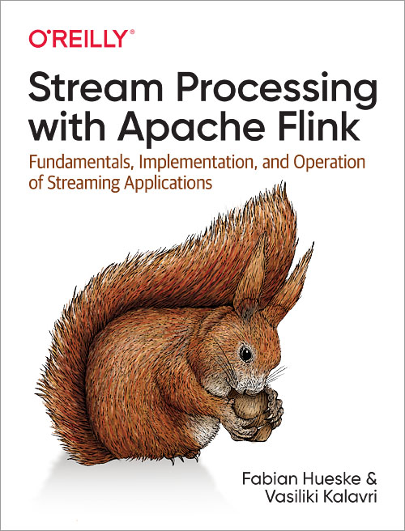

刚读的时候觉得很难，英语有点难懂，后面越读越容易，越读越有味，概念很清晰，逻辑完备，有一定的深度，值得再读一次的Flink好书，就算是学习英语也可以

有少量源码，主要是看书中内容熟悉Flink，每章的总结写的不错，重点阅读章节源码第五、六章



<!-- more -->

Fork地址 https://github.com/gxianch/examples-java.git

代码已更新提交

- > Chapter 1. Introduction toStateful Stream Processing

- > Chapter 2. Stream ProcessingFundamentals

  - > Data Exchange Strategies

  - > The forward strategy sends data from a task to a receivingtask. If both tasks are located on the same physical machine(which is often ensured by task schedulers), this exchangestrategy avoids network communication.

  - > The broadcast strategy sends every data item to all paralleltasks of an operator. Because this strategy replicates data andinvolves network communication, it is fairly expensive.

  - > The key-based strategy partitions data by a key attribute andguarantees that data items having the same key will beprocessed by the same task. In Figure 2-2, the output of the“Extract hashtags” operator is partitioned by the key (thehashtag), so that the count operator tasks can correctlycompute the occurrences of each hashtag.

  - > The random strategy uniformly distributes data items tooperator tasks in order to evenly distribute the load across
    > computing tasks.

    > computing tasks.

  - > LATENCY VERSUS THROUGHPUTAt this point, it should be clear that latency and throughput are notindependent metrics. If events take a long time to travel in the dataprocessing pipeline, we cannot easily ensure high throughput.Similarly, if a system’s capacity is small, events will be buffered andhave to wait before they get processed

  - > Figure 2-6. Count-based tumbling window

  - > Figure 2-7. Time-based tumbling window

  - > Figure 2-8. Sliding count-based window with a length of four events and a slide ofthree events

  - > Figure 2-9. Session window

  - > Figure 2-11. An application receiving online mobile game events played on the subway wouldexperience a gap when the network connection is lost, but events are buffered in the player’sphone and delivered when the connection is restored

  - > Figure 2-13. Event time correctly places events in a window, reflecting the reality of howthings happenedEvent time completely decouples the processing speed from the results.

  - > Handling delayed events is only one of the challenges that you canovercome with event time. The ubiquitous problem of out-of-order datacan also be solved with it

  - > Processing Time Versus Event Time

  - > At this point, you might be wondering why we would even bother withprocessing time if event time solves all of our problems. The truth is,processing time can indeed be useful in some cases.

  - > Thus, for applications wherespeed is more important than accuracy, processing time comes inhandy

  - > As you might imagine, supporting stateful operators comes with a fewimplementation challenges:State managementThe system needs to efficiently manage the state and make sure it isprotected from concurrent updates.State partitioningParallelization gets complicated, since results depend on both thestate and incoming events. Fortunately, in many cases, you canpartition the state by a key and manage the state of each partitionindependently. For example, if you are processing a stream ofmeasurements from a set of sensors, you can use a partitionedoperator state to maintain state for each sensor independently.State recoveryThe third and biggest challenge that comes with stateful operatorsis ensuring that state can be recovered and results will be correcteven in the presence of failures.
    > In the next section, we discuss task failures and result guarantees indetail.

    > In the next section, we discuss task failures and result guarantees indetail.

  - > WHAT IS A TASK FAILURE?For each event in the input stream, a task is a processing step thatperforms the following steps: (1) receives the event, storing it in a localbuffer; (2) possibly updates internal state; and (3) produces an output
    > record.

    > record.

  - > Result Guarantees

  - > AT-MOST-ONCEThe simplest thing to do when a task fails is to do nothing to recoverlost state and replay lost events. At-most-once is the trivial case thatguarantees processing of each event at most once. In other words,events can be simply dropped and nothing is done to ensure resultcorrectness. This type of guarantee is also known as “no guarantee”since even a system that drops every event can provide this guarantee.Having no guarantees whatsoever sounds like a terrible idea, but itmight be fine if you can live with approximate results and all you careabout is providing the lowest latency possible.

  - > AT-LEAST-ONCEIn most real-world applications, the expectation is that events shouldnot get lost. This type of guarantee is called at-least-once, and it meansthat all events will be processed, and there is a chance that some ofthem are processed more than once. Duplicate processing might beacceptable if application correctness only depends on the completenessof information.

  - > In order to ensure at-least-once result correctness, you need to have away to replay events—either from the source or from some buffer.Persistent event logs write all events to durable storage, so that theycan be replayed if a task fails. Another way to achieve equivalentfunctionality is using record acknowledgments. This method storesevery event in a buffer until its processing has been acknowledged byall tasks in the pipeline, at which point the event can be discarded.

  - > EXACTLY-ONCEExactly-once is the strictest guarantee and hard to achieve. Exactly-once means that not only will there be no event loss, but also updateson the internal state will be applied exactly once for each event.

  - > Flink uses a lightweight snapshotting mechanism toachieve exactly-once result guarantees. We discuss Flink’s fault-tolerance algorithm in “Checkpoints, Savepoints, and State Recovery”.

- > Chapter 3. The Architecture ofApache Flink

  - > Figure 3-2. Operators, tasks, and processing slots

- > Chapter 4. Setting Up aDevelopment Environment forApache Flink

- > Chapter 5. The DataStreamAPI (v1.7)

  - > Figure 5-7. Rebalance and rescale transformations

- > Chapter 6. Time-Based andWindow Operators

  - > Each event must be associated with a timestampthat typically indicates when the event actually happened. Event-timestreams also need to carry watermarks from which operators infer thecurrent event time.

    只有事件时间可能出现乱序，
    所以需要带水印，
    处理时间必然是按顺序的，
    所以不带水印

  - > Timestamps and watermarks can be eitherassigned and generated by a SourceFunction or using an explicituser-defined timestamp assigner and watermark generator. Assigningtimestamps and generating watermarks in a SourceFunction isdiscussed

  - > To ensure that event-time operations behave as expected, the assignershould be called before any event-time dependent transformation (e.g.,before the first event-time window).

  - > The DataStream API provides implementations for two common casesof timestamp assigners with periodic watermarks. If your inputelements have timestamps that are monotonically increasing, you canuse the shortcut method assignAscendingTimeStamps. Thismethod uses the current timestamp to generate watermarks, since noearlier timestamps can appear. The following shows how to generatewatermarks for ascending timestamps:val stream: DataStream[SensorReading] = ...val withTimestampsAndWatermarks = stream .assignAscendingTimestamps(e => e.timestamp)The other common case of periodic watermark generation is when youknow the maximum lateness that you will encounter in the input stream—the maximum difference between an element’s timestamp and thelargest timestamp of all perviously ingested elements. For such cases,Flink provides theBoundedOutOfOrdernessTimeStampExtractor, which takesthe maximum expected lateness as an argument:val stream: DataStream[SensorReading] = ...val output = stream.assignTimestampsAndWatermarks( new BoundedOutOfOrdernessTimestampExtractor[SensorReading]( Time.seconds(10))(e =>.timestamp)In the preceding code, elements are allowed to be late up to 10 seconds.This means if the difference between an element’s event time and themaximum timestamp of all previous elements is greater than 10seconds, the element might arrive for processing after its corresponding

  - > This method candecide to generate a new watermark or not.

  - > Watermarks are used to balance latency and result completeness. Theycontrol how long to wait for data to arrive before performing acomputation, such as finalizing a window computation and emitting theresult.

  - > Even though time information and watermarks are crucial to many
    > streaming applications, you might have noticed that we cannot accessthem through the basic DataStream API transformations we have seenso far. For example, a MapFunction does not have access totimestamps or the current event time.The DataStream API provides a family of low-level transformations,the process functions, which can also access record timestamps andwatermarks and register timers that trigger at a specific time in thefuture.

    > streaming applications, you might have noticed that we cannot accessthem through the basic DataStream API transformations we have seenso far. For example, a MapFunction does not have access totimestamps or the current event time.The DataStream API provides a family of low-level transformations,the process functions, which can also access record timestamps andwatermarks and register timers that trigger at a specific time in thefuture.

  - > Currently, Flink provides eight different process functions:ProcessFunction, KeyedProcessFunction,CoProcessFunction, ProcessJoinFunction,BroadcastProcessFunction,KeyedBroadcastProcessFunction,ProcessWindowFunction, andProcessAllWindowFunction.

  - > Timers can only be registered on keyed streams. A common use case for timers isto clear keyed state after some period of inactivity for a key or to implementcustom time-based windowing logic. To use timers on a nonkeyed stream, youcan create a keyed stream by using a KeySelector with a constant dummy key.Note that this will move all data to a single task such that the operator would beeffectively executed with a parallelism of 1.

  - > val avgTemp = sensorData .keyBy(_.id) // shortcut for window.(TumblingEventTimeWindows.of(size)) .timeWindow(Time.seconds(1)) .process(new TemperatureAverager)

    timeWindow是TumblingEventTimeWindows.of(size)简写的方式

  - > By default, tumbling windows are aligned to the epoch time, 1970-01-01-00:00:00.000. For example, an assigner with a size of onehour will define windows at 00:00:00, 01:00:00, 02:00:00, and so on.Alternatively, you can specify an offset as a second parameter in the
    > assigner. The following code shows windows with an offset of 15minutes that start at 00:15:00, 01:15:00, 02:15:00, and so on:val avgTemp = sensorData .keyBy(_.id) // group readings in 1 hour windows with 15 min offset .window(TumblingEventTimeWindows.of(Time.hours(1), Time.minutes(15))) .process(new TemperatureAverager)

    > assigner. The following code shows windows with an offset of 15minutes that start at 00:15:00, 01:15:00, 02:15:00, and so on:val avgTemp = sensorData .keyBy(_.id) // group readings in 1 hour windows with 15 min offset .window(TumblingEventTimeWindows.of(Time.hours(1), Time.minutes(15))) .process(new TemperatureAverager)

  - > Figure 6-3. A session window assigner places elements into varying size windows defined by asession gap

  - > The following examples show how to group the sensor readings intosession windows where each session is defined by a 15-minute periodof inactivity:// event-time session windows assignerval sessionWindows = sensorData .keyBy(_.id) // create event-time session windows with a 15 min gap .window(EventTimeSessionWindows.withGap(Time.minutes(15))) .process(...)// processing-time session windows assignerval sessionWindows = sensorData .keyBy(_.id) // create processing-time session windows with a 15 min gap .window(ProcessingTimeSessionWindows.withGap(Time.minutes(15))) .process(...)

  - > Applying Functions on WindowsWindow functions define the computation that is performed on theelements of a window. There are two types of functions that can beapplied on a window:1. Incremental aggregation functions are directly applied whenan element is added to a window and hold and update a singlevalue as window state. These functions are typically veryspace-efficient and eventually emit the aggregated value as aresult. ReduceFunction and AggregateFunction areincremental aggregation functions.2. Full window functions collect all elements of a window anditerate over the list of all collected elements when they areevaluated. Full window functions usually require more spacebut allow for more complex logic than incrementalaggregation functions. The ProcessWindowFunction isa full window function.

    定义窗口区间后有两种计算方式：
    1.增量窗口聚合计算，迭代计算会有window state窗口状态保存数据，接口函数有ReduceFunction和AggregateFunction两种
    2.全窗口计算，一次获取窗口所有数据进行计算，可以实现复杂计算但是占用更多空间，ProcessWindowFunction接口是全窗口计算

    从上面对窗口处理逻辑的介绍我们可以看出，在使用 ProcessWindowFunction 来对窗口进行操作的一个重要缺陷是，需要把整个窗口内的所有消息全部缓存在 ListState 中，这无疑会导致性能问题。如果窗口的计算逻辑支持增量聚合操作，那么可以使用 ReduceFunction, AggregateFunction 或 FoldFunction(过时) 进行增量窗口聚合计算，这可以在很大程度上解决 ProcessWindowFunction 的性能问题。

  - > When a new element isreceived, the ReduceFunction is called with the new element andthe current value that is read from the window’s state. The window’sstate is replaced by the ReduceFunction’s result.

  - > The advantages of applying ReduceFunction on a window are theconstant and small state size per window and the simple functioninterface. However, the applications for ReduceFunction arelimited and usually restricted to simple aggregations since the inputand output type must be the same.

    ReduceFunction的优势是每个窗口只有少量状态数据，然后函数只能实现简单聚合，因为限制了输入和输出的类型必须相同

  - > AGGREGATEFUNCTIONSimilar to ReduceFunction, AggregateFunction is alsoincrementally applied to the elements that are applied to a window.Moreover, the state of a window operator with anAggregateFunction also consists of a single value.While the interface of the AggregateFunction is much moreflexible, it is also more complex to implement compared to theinterface of the ReduceFunction. The following code shows theinterface of the AggregateFunction:

    AggregateFunction比ReduceFuntion函数能实现更复杂的逻辑

  - > The interface defines an input type, IN, an accumulator of type ACC,and a result type OUT. In contrast to the ReduceFunction, theintermediate data type and the output type do not depend on the inputtype.

  - > PROCESSWINDOWFUNCTIONReduceFunction and AggregateFunction are incrementally
    > applied on events that are assigned to a window. However, sometimeswe need access to all elements of a window to perform more complexcomputations, such as computing the median of values in a window orthe most frequently occurring value. For such applications, neither theReduceFunction nor the AggregateFunction are suitable.Flink’s DataStream API offers the ProcessWindowFunction toperform arbitrary computations on the contents of a window.

    > applied on events that are assigned to a window. However, sometimeswe need access to all elements of a window to perform more complexcomputations, such as computing the median of values in a window orthe most frequently occurring value. For such applications, neither theReduceFunction nor the AggregateFunction are suitable.Flink’s DataStream API offers the ProcessWindowFunction toperform arbitrary computations on the contents of a window.

    ProcessWindowFunction能一次获取窗口内的全部数据，所以比reduce和aggrate的迭代计算能实现更复杂的逻辑，比如中位数计算

  - > If you have incremental aggregation logic but also need access towindow metadata, you can combine a ReduceFunction orAggregateFunction, which perform incremental aggregation,with a ProcessWindowFunction, which provides access to morefunctionality. Elements that are assigned to a window will beimmediately aggregated and when the trigger of the window fires, theaggregated result will be handed to ProcessWindowFunction.The Iterable parameter of theProcessWindowFunction.process() method will onlyprovide a single value, the incrementally aggregated result.In the DataStream API this is done by providing aProcessWindowFunction as a second parameter to thereduce() or aggregate() methods as shown in the followingcode:input .keyBy(...) .timeWindow(...) .reduce( incrAggregator: ReduceFunction[IN], function: ProcessWindowFunction[IN, OUT, K, W])input .keyBy(...) .timeWindow(...) .aggregate( incrAggregator: AggregateFunction[IN, ACC, V], windowFunction: ProcessWindowFunction[V, OUT, K, W])The code in Examples 6-13 and 6-14 shows how to solve the same use
    > case as the code in Example 6-12 with a combination of aReduceFunction and a ProcessWindowFunction, emittingevery 5 seconds the minimun and maximum temperature per sensorand the end timestamp of each window.Example 6-13. Applying a ReduceFunction for incrementalaggregation and a ProcessWindowFunction for finalizing the windowresultcase class MinMaxTemp(id: String, min: Double, max:Double, endTs: Long)val minMaxTempPerWindow2: DataStream[MinMaxTemp] = sensorData .map(r => (r.id, r.temperature, r.temperature)) .keyBy(_._1) .timeWindow(Time.seconds(5)) .reduce( // incrementally compute min and max temperature (r1: (String, Double, Double), r2: (String, Double, Double)) => { (r1._1, r1._2.min(r2._2), r1._3.max(r2._3)) }, // finalize result in ProcessWindowFunction new AssignWindowEndProcessFunction() )As you can see in Example 6-13, the ReduceFunction andProcessWindowFunction are both defined in the reduce()method call. Since the aggregation is performed by theReduceFunction, the ProcessWindowFunction only needs toappend the window end timestamp to the incrementally computedresult as shown in Example 6-14.Example 6-14. Implementation of a ProcessWindowFunction thatassigns the window end timestamp to an incrementally computed resultclass AssignWindowEndProcessFunction extends ProcessWindowFunction[(String, Double, Double), MinMaxTemp,
    > String, TimeWindow] { override def process( key: String, ctx: Context, minMaxIt: Iterable[(String, Double, Double)], out: Collector[MinMaxTemp]): Unit = { val minMax = minMaxIt.head val windowEnd = ctx.window.getEnd out.collect(MinMaxTemp(key, minMax._2, minMax._3, windowEnd)) }}

    > case as the code in Example 6-12 with a combination of aReduceFunction and a ProcessWindowFunction, emittingevery 5 seconds the minimun and maximum temperature per sensorand the end timestamp of each window.Example 6-13. Applying a ReduceFunction for incrementalaggregation and a ProcessWindowFunction for finalizing the windowresultcase class MinMaxTemp(id: String, min: Double, max:Double, endTs: Long)val minMaxTempPerWindow2: DataStream[MinMaxTemp] = sensorData .map(r => (r.id, r.temperature, r.temperature)) .keyBy(_._1) .timeWindow(Time.seconds(5)) .reduce( // incrementally compute min and max temperature (r1: (String, Double, Double), r2: (String, Double, Double)) => { (r1._1, r1._2.min(r2._2), r1._3.max(r2._3)) }, // finalize result in ProcessWindowFunction new AssignWindowEndProcessFunction() )As you can see in Example 6-13, the ReduceFunction andProcessWindowFunction are both defined in the reduce()method call. Since the aggregation is performed by theReduceFunction, the ProcessWindowFunction only needs toappend the window end timestamp to the incrementally computedresult as shown in Example 6-14.Example 6-14. Implementation of a ProcessWindowFunction thatassigns the window end timestamp to an incrementally computed resultclass AssignWindowEndProcessFunction extends ProcessWindowFunction[(String, Double, Double), MinMaxTemp,

    > String, TimeWindow] { override def process( key: String, ctx: Context, minMaxIt: Iterable[(String, Double, Double)], out: Collector[MinMaxTemp]): Unit = { val minMax = minMaxIt.head val windowEnd = ctx.window.getEnd out.collect(MinMaxTemp(key, minMax._2, minMax._3, windowEnd)) }}

    ReduceFunction和ProcessWindowFunction
    还可以结合用

    在上面直接使用 AggregateFunction 的情况下，用户代码中无法访问窗口的上下文信息。为了解决这个问题，可以将增量聚合函数和 ProcessWindowFunction 结合在一起使用，这样在提交窗口计算结果时也可以访问到窗口的上下文信息：

- > Chapter 7. Stateful Operatorsand Applications

  - > functions can have twotypes of state, keyed state and operator state.

  - > Keyed state can only be used by functions that are applied on aKeyedStream. A KeyedStream is constructed by calling the
    > DataStream.keyBy() method that defines a key on a stream. AKeyedStream is partitioned on the specified key and remembers thekey definition. An operator that is applied on a KeyedStream isapplied in the context of its key definition.

    > DataStream.keyBy() method that defines a key on a stream. AKeyedStream is partitioned on the specified key and remembers thekey definition. An operator that is applied on a KeyedStream isapplied in the context of its key definition.

    keyed state 仅用于KeyeStream,KeyeStream是由DataStream.keyBy()方法产生的

  - > The following state primitives are supported by Flink:ValueState[T] holds a single value of type T

  - > ListState[T] holds a list of elements of type T.

  - > MapState[K, V] holds a map of keys and values.

  - > ReducingState[T] offers the same methods asListState[T] (except for addAll() and update()),but instead of appending values to a list,ReducingState.add(value: T) immediatelyaggregates value using a ReduceFunction. The iteratorreturned by get() returns an Iterable with a single entry,which is the reduced value.AggregatingState[I, O] behaves similar toReducingState. However, it uses the more generalAggregateFunction to aggregate values.AggregatingState.get() computes the final result andreturns it as an Iterable with a single element.All state primitives can be cleared by calling State.clear().

- > Chapter 8. Reading from andWriting to External Systems

  - > class DerbyUpsertSink extends RichSinkFunction[SensorReading] { var conn: Connection = _ var insertStmt: PreparedStatement = _ var updateStmt: PreparedStatement = _ override def open(parameters: Configuration): Unit = { // connect to embedded in-memory Derby conn = DriverManager.getConnection(
    > "jdbc:derby:memory:flinkExample", new Properties()) // prepare insert and update statements insertStmt = conn.prepareStatement( "INSERT INTO Temperatures (sensor, temp) VALUES (?, ?)") updateStmt = conn.prepareStatement( "UPDATE Temperatures SET temp = ? WHERE sensor = ?") } override def invoke(r: SensorReading, context: Context[_]): Unit = { // set parameters for update statement and execute it updateStmt.setDouble(1, r.temperature) updateStmt.setString(2, r.id) updateStmt.execute() // execute insert statement if update statement did not update any row if (updateStmt.getUpdateCount == 0) { // set parameters for insert statement insertStmt.setString(1, r.id) insertStmt.setDouble(2, r.temperature) // execute insert statement insertStmt.execute() } } override def close(): Unit = { insertStmt.close() updateStmt.close() conn.close() }}

    > "jdbc:derby:memory:flinkExample", new Properties()) // prepare insert and update statements insertStmt = conn.prepareStatement( "INSERT INTO Temperatures (sensor, temp) VALUES (?, ?)") updateStmt = conn.prepareStatement( "UPDATE Temperatures SET temp = ? WHERE sensor = ?") } override def invoke(r: SensorReading, context: Context[_]): Unit = { // set parameters for update statement and execute it updateStmt.setDouble(1, r.temperature) updateStmt.setString(2, r.id) updateStmt.execute() // execute insert statement if update statement did not update any row if (updateStmt.getUpdateCount == 0) { // set parameters for insert statement insertStmt.setString(1, r.id) insertStmt.setDouble(2, r.temperature) // execute insert statement insertStmt.execute() } } override def close(): Unit = { insertStmt.close() updateStmt.close() conn.close() }}

    JDBC 自定义sink方法，Connection在open方法中创建

- > Chapter 9. Setting Up Flinkfor Streaming Applications

- > Chapter 10. Operating Flinkand Streaming Applications

- > Chapter 11. Where to Go fromHere?

