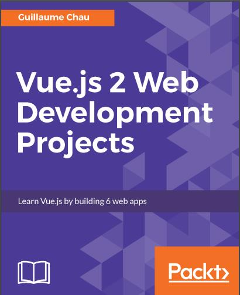

通过6个例子讲解vue特性, 从易到难, 阅读体验极佳，其中的代码示例可以拿来用



源地址：https://github.com/PacktPublishing/Vue-js-2-Web-Development-Projects

Fork地址 : https://github.com/gxianch/Vue-js-2-Web-Development-Projects.git

<!-- more -->

