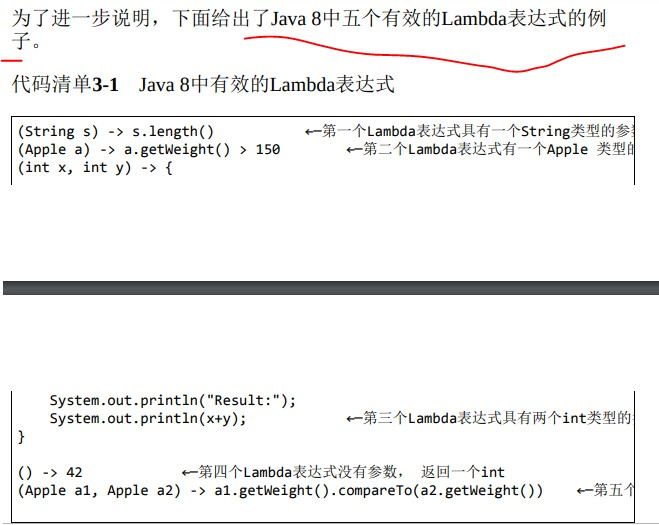
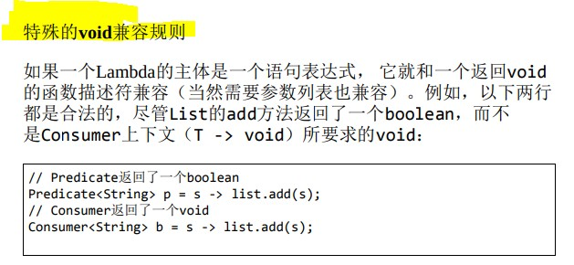

Java 8函数式及流的新特性编程



github:https://github.com/java8/Java8InAction

<!-- more -->

### 51 Collection主要是为了存储和访问数据，而Stream则主要用于描述对数据的计算。



### 74 行为参数化





### 77 开启线程(() -> System.out.println("Hello world")) == new Runnable()



### 83 Lambda表达式的例





### 86 函数式接口就是只定义一个抽象方法的接口





### 88 是函数式接口一个具体实现的实例



### 89 函数式接口的抽象方法的签名基本上就是Lambda表达式的签名。





### 90 @FunctionalInterface



### 97 function.Consumer<T>

为什么能用foreach,因为有Consumer函数接口，调用的是lambda中Consumer的accept方法，
Consumer签名是传入一个对象，但是没有返回，符合这个签名的操作都可以，不需要调用accept方法
foreach传入一个对象，没有返回



### 98 function.Function<T, R>





### 99 Java 8中的常用函数式接口





### 102 Lambdas及函数式接口的例子



### 103 任何函数式接口都不允许抛出受检异常（checked

异常主要分为种：Exception，RuntimeException以及Error。这三类异常都是Throwable的子类。直接从Exception派生的各个异常类型就是我们刚刚提到的Checked Exception。它的一个比较特殊的地方就是强制调用方对该异常进行处理。就以我们常见的用于读取一个文件内容的FileReader类为例。在该类的构造函数声明中声明了其可能会抛出FileNotFoundException：
 ，可以抛出RuntimeException以及Error







### 104 Lambda的类型是从使用Lambda的上下文推断出来的





### 107 特殊的void兼容规则



返回boolean,但是Consumer不需要boolean,void也可以
但是Predicate需要的boolean就不能返回void替换

### 109 局部变量必须显式声明为final





### 110 闭包



### 112 方法引用







### 123 函数复合



### 149 流的延迟性质



### 151 常见中间流操作和终端流操作



### 164 由map到flatmap,流的扁平化













### 291 Lambda表达式优化设计模式


