JavaScript知识讲的很深入的一本书

<!-- more -->

### 3% 作用域

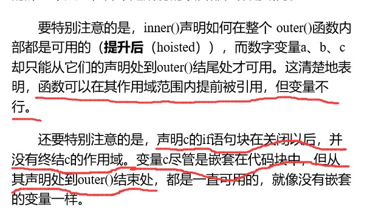

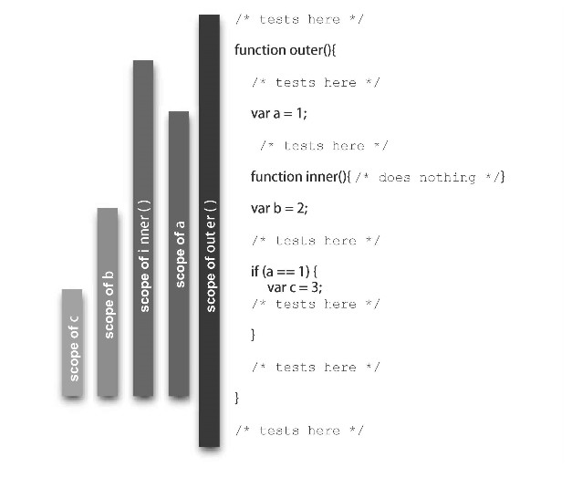

### 3.0 四个不同的方式可以进行函数调用

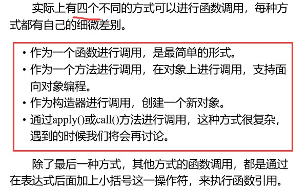

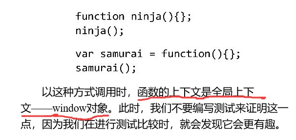

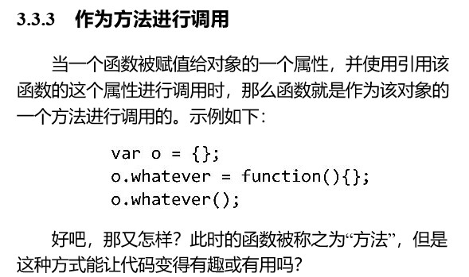

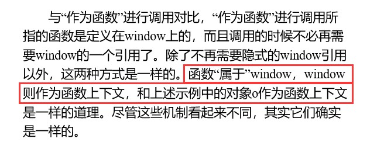

### 3.3 函数调用1，2 作为函数和方法进行调用

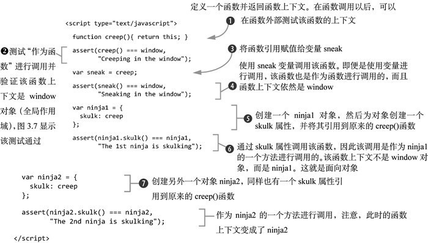

### 3.3.3　this

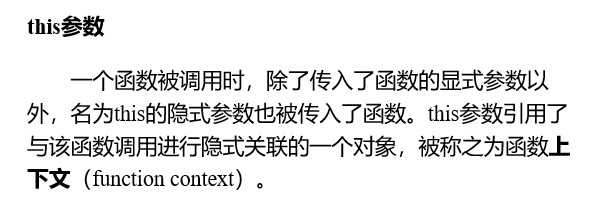

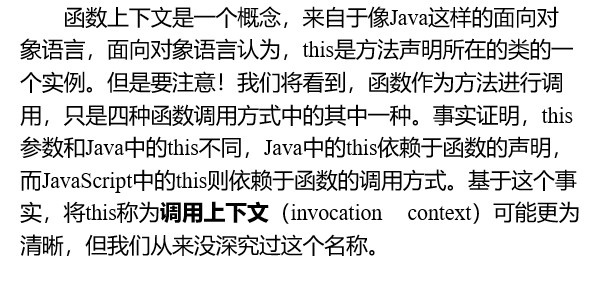

### 3.3 函数调用 3 使用构造器设置通用对象

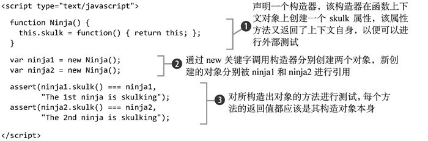

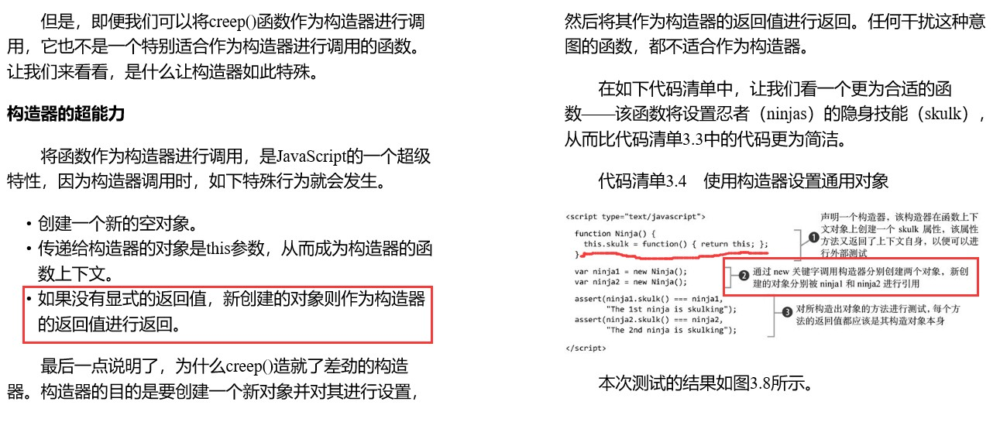

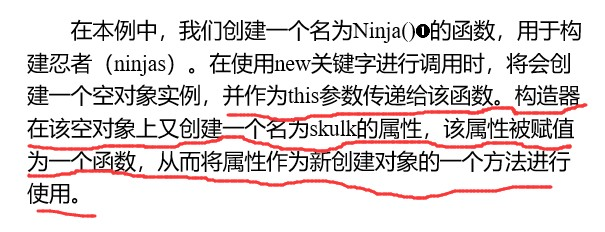

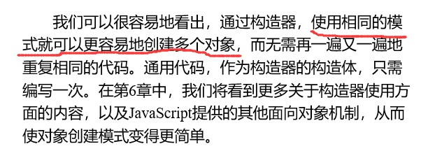

### 3.3 函数调用 4 使用apply()和call()方法进行调用

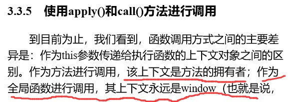

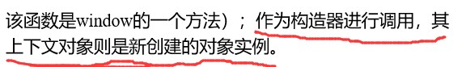

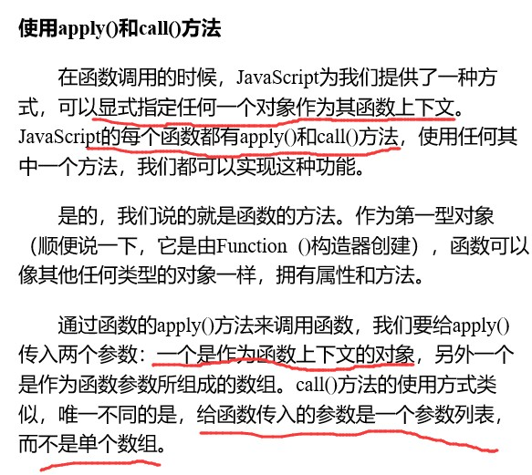

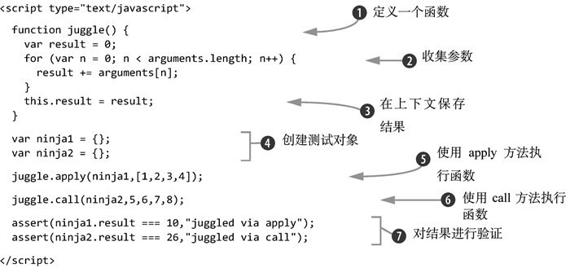

### 3.4 在回调中强制指定函数上下文

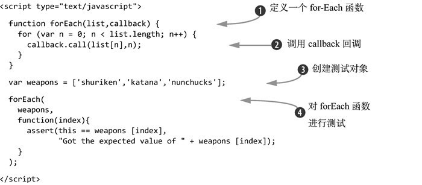

### 3.5 用不同的方法进行函数调用，不同的调用机制决定了函数上下文的不同

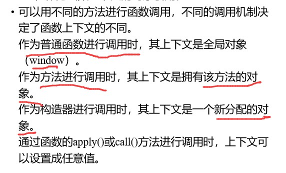

### 4.0 函数上下文指的是调用该方法的那个对象

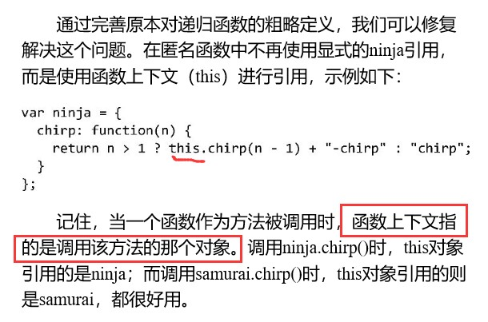

### 5.0 闭包

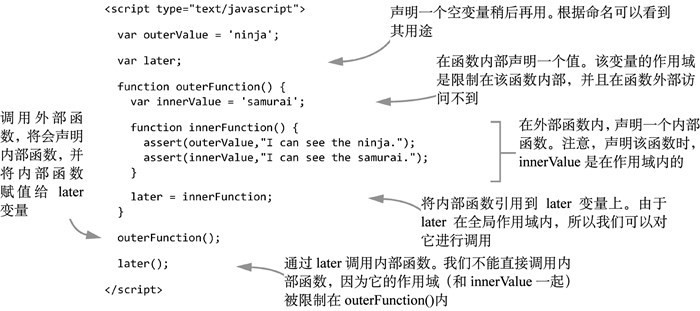

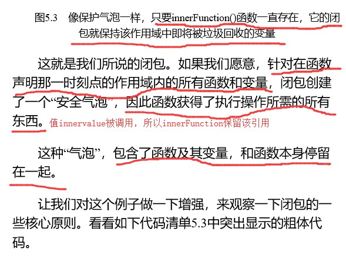

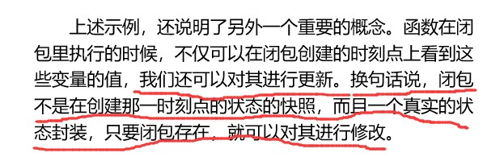

### 4.3.3 Array.prototype.push()方法是通过其函数上下文操作自身数组的

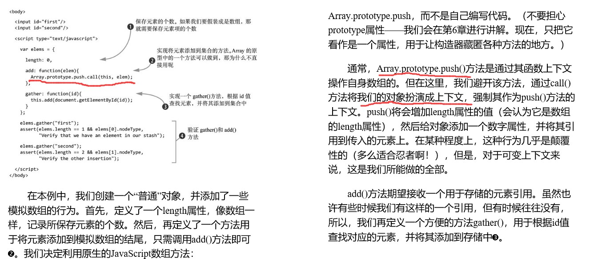

### 4.3.4 apply()方法

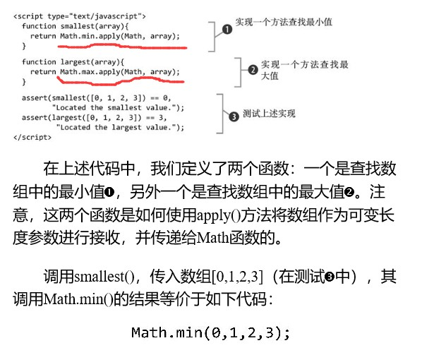

### 4.4.2 dialog()方法的实际执行，取决于传递参数的检查

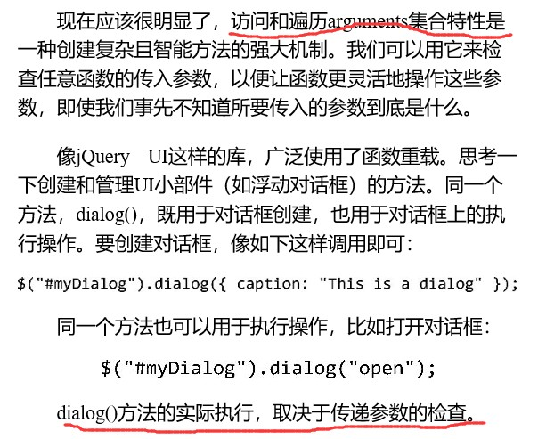

### 4.4.2 利用参数个数进行函数重载

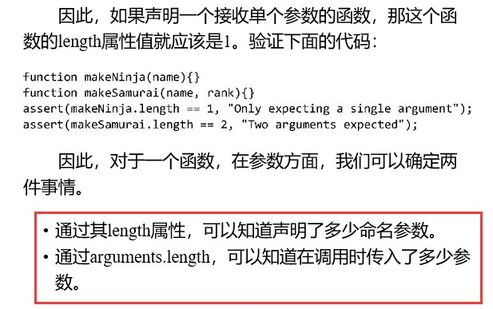

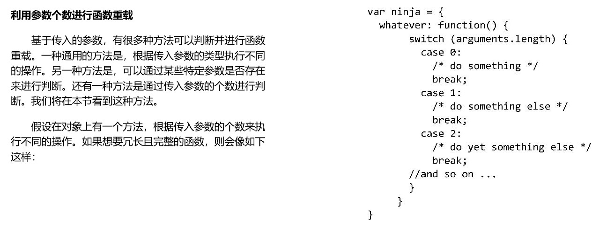

### 4.4.2 重载object[name]函数内的fn,old为闭包

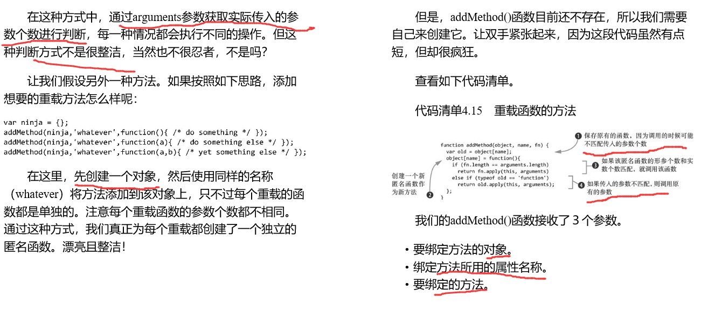

