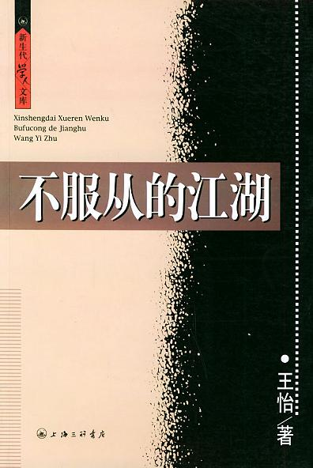

  - 序
  - 第一辑
  - 1 武侠小说中的刑讯逼供
  - 2 郭靖的信仰危机
  - 3 黄飞鸿的无影腿
  - 4 处江湖之远
  - 5 欧阳锋的毒能流多久
  - 6 傅红雪的逻辑与地毯式轰炸
  - 7 走出珍珑棋局
  - 8 赏善罚恶令的下落
  - 9 武侠小说中的政治说
  - ……
  - 第二辑
  - ……
  - 第三辑
  - ……
  - 第四辑
  - ……
  - 第五辑
  - ……

国内杂文的作者只有2个人印象深刻，一是李承鹏，代表作《全世界人民都知道》抨击各种社会乱象，还有一个就是王怡了，代表作《不服从的江湖》看王怡如何利用武侠小说，影视作品，历史等材料解构权威。相对来说，王怡的文章思想更具深度。

<!-- more -->

