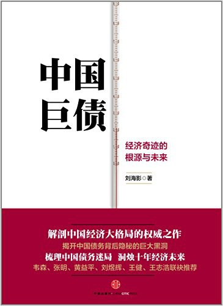
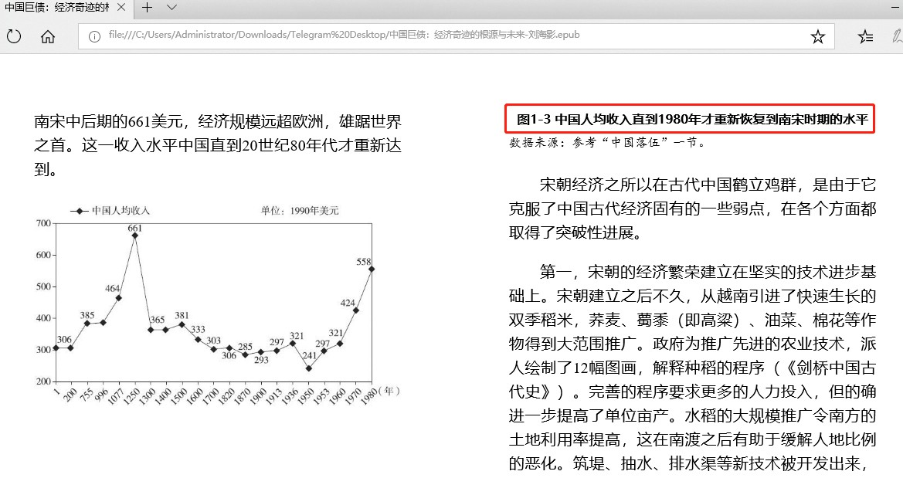
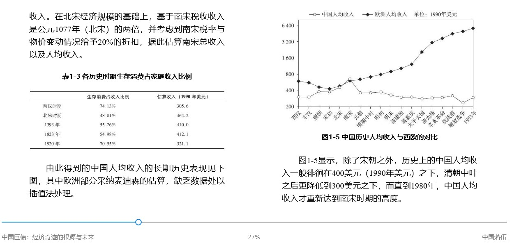
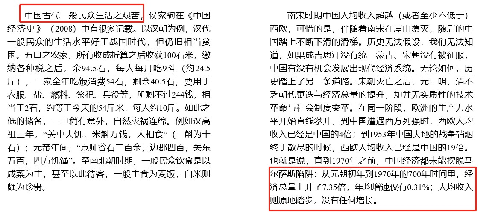
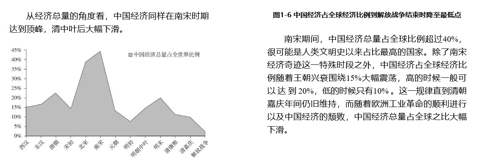

中国一直是个很穷的地方，人均GDP很低，百姓从来没有走出温饱，更没有宣传的康熙乾隆等盛世，中国走出饥饿才是最近几十年的事。


<!-- more -->

### 中国人均收入直到1980年才重新恢复到南宋时期的水平



### 中国历史人均收入与西欧的对比



### 从元朝初年到1970年的700年时间里 人均收入则原地踏步，没有任何增长。



### 中国经济占全球经济比例到解放战争结束时降至最低点



