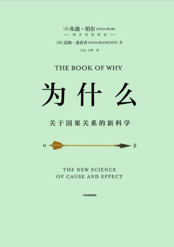

这本书讲需要跳出大数据统计思维，建立因果关系的因果图，作者的一种因果思想



## 为什么（图灵奖获得者、贝叶斯网络之父集大成之作）

- > 图3.2 托马斯·贝叶斯的台球桌示例。其中上部的示意图对应于一个前向概率问题：已知台球桌的长度，要求计算球在距桌边缘x英尺范围内停止的可能性。下部的示意图对应于一个逆概率问题：我们已经观察到球在距桌边缘x英尺范围内停止了，现在要求估计桌子长度为L的可能性（资料来源：马雅·哈雷尔绘图）

- > 这一哲学争论的关键在于，我们是否可以合法地将“假设我知道”这句表达翻译成概率语言。即使我们承认无条件概率P（S）、P（T）和P（S且T）反映了我对这些命题的信念度，但谁能证明我对T的修正后的信念度就应该等于P（S且T）/P（T），就像贝叶斯法则所规定的那样？“假设我知道T”是否就等同于“在T发生的情况下”？以符号P（S）作为表示法的概率语言，其根本目的是捕捉概率游戏中的“频率”这一概念。但“假设我知道”是一种认识论范畴的表达，受到知识的逻辑而非频率和比例的逻辑的约束。

- > 我们尝试将贝叶斯法则应用到台球难题中，那么为了得到P（L|x），我们就需要一个不能从实际存在的台球桌中得到的量：球桌长度L的先验概率，这一概率同我们想要的P（L|x）一样难以估计。此外，这一概率还因人而异，完全取决于个体对不同长度的台球桌的过往经验。一个从来没见过斯诺克球桌的人很难相信L会超过10英尺。而一个只见过斯诺克球桌，没有见过普通台球桌的人，则会给“L不足10英尺”一个很低的先验概率。这种变异性也被称为“主观性”，有时被看作贝叶斯推理的一个缺陷。但也有一些人认为这是贝叶斯推理的一个强大优势，它允许我们在数学上表达我们的个人经验，并以条理化的、易懂的方式将其与数据结合起来。在普通的直觉不起作用或情绪可能导致我们误入歧途的情况下，贝叶斯法则能引导我们进行正确的推理。

- > 图3.4 大卫·鲁梅哈特的神经网络草图，表明了我们大脑的信息传递网络是如何学会识别短语“THECAR”的（资料来源：美国加州大学圣迭戈分校的大脑与认知中心）

- > 所有指向肥料的箭头都已被清除，这反映了农民在决定使用何种肥料时只听从于抽签结果

- > 随机化处理是模拟模型2的一种方法。它让所有旧的混杂因子都失效了，同时并没有引入任何新的混杂因子。这就是随机化处理的关窍所在，没有什么神秘色彩

- > 我们观察到的是给定处理效应的条件概率P（Y|X），我们要问自然的问题是X和Y之间的因果关系，该因果关系可以通过干预概率P（Y|do（X））获得。如此一来，混杂就可以简单地定义为导致P（Y|X）≠P（Y|do（X）），即两个概率出现差异的所有因素。是不是很简单明了？

- > 解决这一悖论的关键是，我们不仅需要考虑数据（主持人打开某个特定门的事实），而且要注意数据生成的过程，也就是游戏规则。

- > 我们从这两个例子中得到的教训很简单：获得信息的方式和信息本身一样重要。

- > 让我们试着略微改变游戏规则，看看会对结论产生什么影响。试着想象存在另一个游戏节目，叫作“让我们假装交易”，游戏中蒙提·霍尔同样会打开你没有选择的两扇门之一，但他的选择是完全随机的。换句话说，他可能会打开那扇背后有车的门——真不走运

- > 表6.1 “让我们做个交易”的概率表

- > 表6.2 “让我们假装交易”的概率表

- > 这是因为蒙提·霍尔所选的门必须不同于“你选的门”和“车的位置”，他必须考虑这两个因素。图6.1 “让我们做个交易”的因果图

- > 答案是，在你选择了1号门之后，蒙提·霍尔就不能再打开它了——他本可以打开2号门，但他没有这样做，而是打开了3号门，这一事实表明他很有可能是不得不这样做的，因为2号门后面可能是汽车。因此，我们就有了比之前更多的证据表明汽车在2号门。这是贝叶斯分析的一个普遍主题：任何通过了威胁其有效性的测试的假设，其可能性都会变得更大。威胁越大，幸存下来的假设的可能性就越大。2号门很容易被驳斥（蒙提本可以打开它），而1号门则不然。因此，2号门后面更可能是汽车，而1号门后面则更可能不是汽车，汽车在1号门后的概率仍是1/3。

- > 我们对深度学习的理解完全是经验主义的，没有任何保证。AlphaGo团队并没有在一开始就预测到，这个程序会在5年的时间内击败人类最好的围棋棋手。他们只是想试验一下，而AlphaGo出人意料地成功了。有些人可能会说，我们并不真正需要透明

