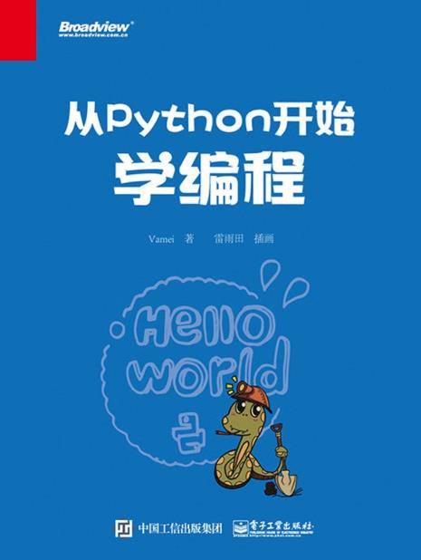

python入门基础



<!-- more -->

### 34% 参数*all_arguments和**all_arguments，一个是元祖，一个是词典

### 52% __call__()特殊方法的对象都被当作是函数

### 70 按照继承关系依次寻找__dict__

### 72 Python在为属性赋值时，只会搜索对象本身的__dict__

### 86 闭包中包含的是内部函数返回时的外部对象的值

### 90 装饰方法和装饰类

