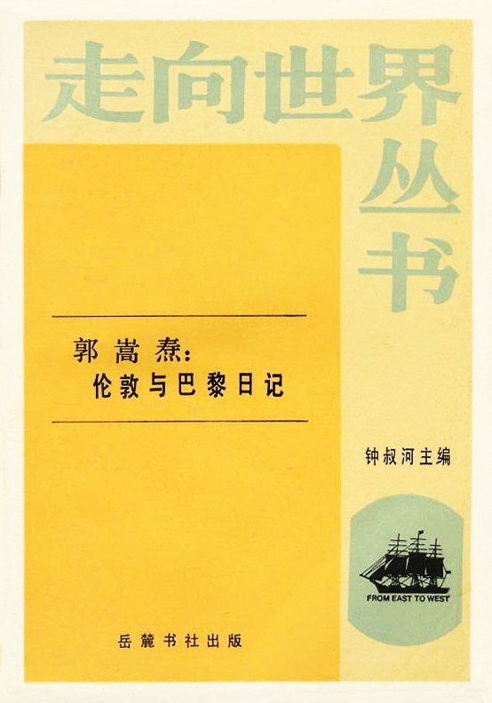

在当时人们都抱有洋人只是洋枪洋炮厉害，哪有我中华泱泱千年的历史和文化积累，称洋人为野蛮人， 我们素质肯定比洋人高。
郭嵩焘一个从小受传统儒家教育考上进士的的人，居然发现洋人的议会制比儒家向往孔子描述的三代之治更仁义，更道德，更不要说比现在的清朝了，原来人家真正实现了“公天下”，内心受到的冲击可想而知，我们向往的人家早实现了，我们还说别人是野蛮人，我们自己才是真正的野蛮人。彻底批判了中国秦汉以来二千余年来的封建专制政体，
1912清朝退位，如今2020年，一百多年过去了， 郭嵩焘的一句“**岂有百姓贫困而国家自求富强之理？**”   放在今天依然振聋发聩， 我们到底进步了啥，现在的人与当时的清朝的人一样无知可笑, 更悲催的是现在已经没有像清朝郭嵩焘一样了解世界，熟悉中国，并为之发声的人。

