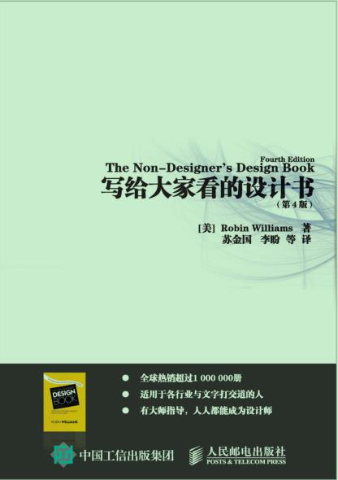

设计四大原则  亲密性，对齐，对比，重复



## 写给大家看的设计书 The Non-Designer’s Design Book by Robin Williams

- > 第 1 章引 言

  - > 4 大基本原则以下是对基本设计原则的概述，每一个优秀的设计中都应用了这些设计原则。尽管我在后面将逐个讨论各个原则，不过要记住，它们实际上是相互关联的。只应用某一个原则的情况很少。对比（Contrast）对比的基本思想是，要避免页面上的元素太过相似。如果元素（字体、颜色、大小、线宽、形状、空间等）不相同，那就干脆让它们截然不同。要让页面引人注目，对比通常是最重要的一个因素，正是它能使读者首先看这个页面。重复（Repetition）让设计中的视觉要素在整个作品中重复出现。可以重复颜色、形状、材质、空间关系、线宽、字体、大小和图片，等等。这样一来，既能增加条理性，还可以加强统一性。对齐（Alignment）任何东西都不能在页面上随意安放。每个元素都应当与页面上的另一个元素有某种视觉联系。这样能建立一种清晰、精巧而且清爽的外观。亲密性（Proximity）彼此相关的项应当靠近，归组在一起。如果多个项相互之间存在很近的亲密性，它们就会成为一个视觉单元，而不是多个孤立的元素。这有助于组织信息，减少混乱，为读者提供清晰的结构。

- > 第 2 章亲 密 性

  - > 如果多个项相互之间有很近的亲密性，它们就会成为一个视觉单元，而不是多个孤立的元素。就像实际生活中一样，亲密性（即紧密性）意味着存在关联。如果把类似的元素组织为一个单元，马上会带来很多变化。首先，页面会变得更有条理。其次，你会清楚地知道从哪里开始读信息，而且明白什么时候结束。另外，“空白”（字母以外的空间）也会变得更有组织。

  - > 亲密性原则并不是说所有一切都要更靠近，其真正的含义是：如果某些元素在理解上存在关联，或者相互之间存在某种关系，那么这些元素在视觉上也应当有关联。除此以外，其他孤立的元素或元素组则不应存在亲密性。位置是否靠近可以体现出元素之间是否存在关系。

- > 第 3 章对 齐

  - > 养成为元素画线的习惯，用线来明确哪里缺少关联。

  - > 你可能已经习惯了使用文本对齐。在得到更多培训之前，一定要坚持一个原则：只使用一种对齐方式。页面上只使用一种文本对齐，所有文本都左对齐，或右对齐，或者全部居中。

- > 第 4 章重 复

  - > 重复有助于组织信息，可以帮助读者浏览各个页面，也有利于将设计中单独的部分统一起来。即使在一个只有一页的文档中，重复元素也可以建立一种连续性，将文档“整个捆在一起”。如果在创建一个多页的、作为一个精美包装一部分的文档，充分使用重复就很关键。这里包含一些明显的重复元素，从而清楚地指出它的主要内容，除此以外，设计者可能还会在其求职信设计中采用其中一个或多个元素。重复元素ˆ 粗字体ˆ 细字体ˆ 方块项目符号ˆ 缩进ˆ 间隔ˆ 对齐

  - > 通常还可以增加实际上与页面主题没有任何关系的重复元素。例如，在一个调查表单上放入一些石刻字符；在报告中增加一些奇模怪样的鸟；在整个出版物中通过不同方式显示一些特别漂亮的字符，如设置不同规格的大字体，采用灰色或浅色，或者采用多种不同的角度。只要确保，作品看起来是有意为之，而不是乱七八糟就行了。

  - > 重复最大的好处是使各项看起来同属一组，虽然元素看起来都不完全相同。由此可以看出，一旦建立一组关键的重复项。你就可以变换这些项并仍可保持一致的外观。

  - > 使用重复原则时，有时可以把一个元素从现在的设计中抽取出来，并根据这个元素创建一个新设计。

- > 第 5 章对 比

  - > 这是一封相当典型的自荐信。信息是完备的，如果有人确实想去读它的话，当然可以了解到其中的信息，不过这样一封自荐信肯定无法吸引你的注意。注意以下问题。ˆ 职位不清晰；职位和正文混杂在一起。段与段之间不清晰。ˆ 页面上存在两种对齐方式：居中和左对齐。ˆ 不同成就之间的间距和不同段之间的间距相同。ˆ 布局不一致—日期有时在左边，有时在右边。记住，一致性才会产生重复性。

  - > 注意，如果使用了对比，不仅页面更吸引人，文档的目的和组织也会更一目了然。你的简历是别人对你的第一印象，所以一定要做得出色。

  - > 上述问题很容易修正。ˆ 只保留一种对齐方式：左对齐。在上面可以看到，如果只使用一种对齐，并不是说所有元素都要沿着同一个边界对齐，这只是说，所有一切都要采用同样的对齐方式。上面的左对齐文本很明确，而且互相促进（对齐和重复）。ˆ 明显的标题，这样就能立即知道这个文档是什么，有哪些要点（对比）。ˆ 段之间的间隔比各段内文本行之间的间隔大（空间关系对比；亲密性）。ˆ 学位和职位都用粗体（标题字体的重复），这种强烈对比能使你很快抓住要点。

- > 第 6 章4 大基本原则复习

  - > 有关设计（同时也是有关生活）的一个更一般的指导原则是：不要畏畏缩缩。ˆ 不要害怕在设计（或生活）中留有空白，这能让你的眼睛（以及心灵）稍作休息。ˆ 不要害怕设计是不对称的，使用非居中的格式，不居中往往能使效果更强烈。尽管不建议使用居中，不过有意这么做也无不可。ˆ 不要害怕把单词设置得非常大或非常小，不用担心说话声太大或者太小。在合适的场合这都是可以的。ˆ 只要最后的结果能支持或强调你的设计或观点，不要害怕让图片太大或太小。

  - > 在这里，虚线成为了一个重复元素。虽然它们长短不一，但是虚线很有特点，能够以各种方式出现在整个文件中，却仍然被视为重复元素。

- > 第 7 章颜 色 运 用

  - > 互补色轮上相对（即完全对立）的颜色为互补色。由于它们如此对立，所以最佳搭配是一种作为主色，另一种用于强调。

  - > 三色组彼此等距的三种颜色通常会形成一个让人愉悦的三色组。红色、黄色和蓝色就是一种极其流行的颜色组合，儿童产品通常都采用这种组合。由于这是三基色，所以这种组合也称为基色三色组。也可以尝试使用绿色、橙色和紫色构成的间色三色组，尽管不那么常用，但出于以上原因，这种组合也让人很舒服。除了红、黄、蓝构成的基色三色组以外，所有三色组中的三种颜色都有基础色使其相互连接，因此看上去非常协调。

