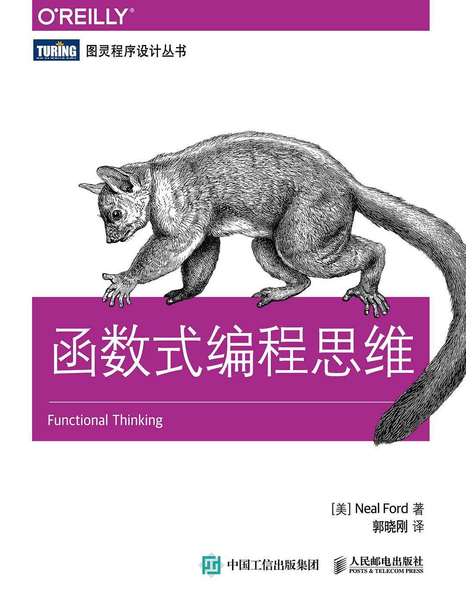
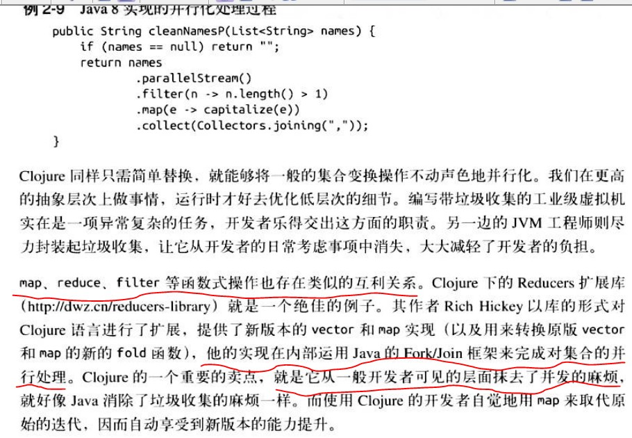
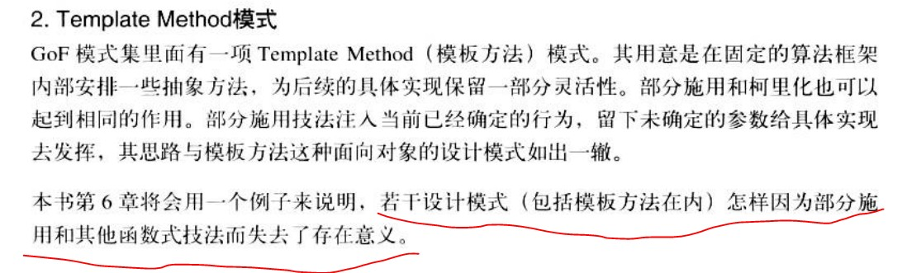
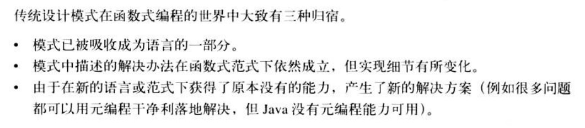
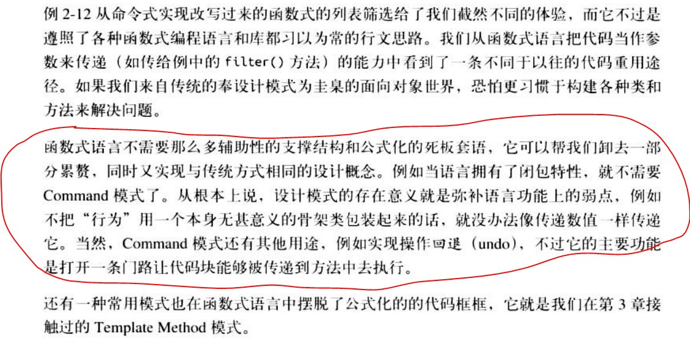

OReilly系列编程书的书都不错, 本书看点 1.函数式操作实际上封装了ForkJoin框架，2.若干设计模式因为函数式编程而失去存在意义


<!-- more -->

### 26 Java8的函数式操作用的是Fork/Join框架来完成对集合的并行处理

Fork/Join这个框架使用的场景就是将一个大任务按照意愿切分成N个小任务并行执行,并最终聚合结果,加快运算。比如我们想要计算1到1000的sum,就可以使用该框架实现一个二分算法的求和。如果你正在使用jdk8为我们带来的流式计算api的话,你可能也正在接触到该框架,因为流的parallel方法底层就是使用ForkJoinPool来处理。 

函数式操作实际上封装了ForkJoin框架，ForkJoin可以选择并行还是串行，如下java8实现的并行化处理过程，.parallelStream()



### 63 若干设计模式因为函数式编程而失去存在意义



### 122 传统设计模式在函数式编程的世界中大致有三种归宿



### 124



