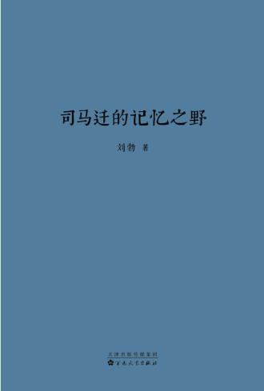

“刘勃历史三部曲”包括《失败者的春秋》《战国歧途》和《司马迁的记忆之野》，关注从先秦到汉代的华夏古史，这恰是奠定中国未来气质的青春期。在此期间，中国完成了从列国纷争到大一统，从贵族统治到皇权专制，从百家齐放到独尊儒术的转变。

作为知名历史作家，刘勃没有采用常见的通史写法，而是选取当时最有代表性的群体和个人，观照时代和国家的变迁。他擅长在史料基础上讲故事，重新勾画熟悉又陌生的古代中国世界。



## 

- > 序章 盛世

  - > 且夫孝始于事亲，中于事君，终于立身。扬名于后世，以显父母，此孝之大者。所谓孝道，从侍奉双亲开始，进而忠于君主，但终究是要成就你自己。你如果能扬名于后世，父母也会因此获得荣耀，这才是最重要的孝。

  - > 官员也是演员，一辈子就是争一个演员表上的位次，这样的表现不足为奇。但作为一个聪明、热情、爱议论的年轻人，司马迁就很难克制住鄙薄的情绪。

- > 第一章 少年

  - > 白起在杜邮亭被赐死，司马靳也在赐死名单之中。白起武功赫赫，是无数军事爱好者的偶像，也是人道主义者最痛恨的屠伯

  - > 在西周时代，关于鬼神和过去的知识被认为非常重要，所以“史”也就有崇高地位，太史寮是重要的实权部门。但春秋以来，政治家们越来越意识到，无论是鬼神对人事的影响力度，还是过去对现在的参考价值，其实都相当可疑，所以，“史”也就越来越被边缘化。在秦代的官僚系统中，太史令已经只是一个微不足道的小官。

  - > 秦统一前，刘邦跟着大侠张耳做门客；统一后张耳流亡，刘邦失去依附对象，只好投身官府，成为一名片警（泗上亭长）。

  - > 班固指出，游侠出现，是中央缺乏权威的表现：

  - > 也就是说，司马迁对不同的游侠做了精心区分，认为有人是好的，而另一些人则令好游侠蒙羞。而对制度精神理解更深透的班固则很清楚，这种区别并不重要，游侠的罪恶，在于其存在本身。

- > 第二章 统一

  - > 雄心勃勃的皇帝期待大有作为，天下人也早已不是救死扶伤之不暇、嗷嗷待哺的天下人了。人类的遗忘能力很强：两千多万人的尸骨早已融入大汉的沃土，两千多万人的亡魂在空气中消散得无影无踪，关于战争的恐怖记忆已经基本消失；同时，人类的记性又很好：刘邦、项羽、韩信、张良……这些英雄人物的传奇还在人间口耳相传，哪个血仍未冷的人类，听到这样的故事，不觉得豪情万丈悠然神往？

  - > 其实，这一点倒是不用出长安城就能感受得到的，因为“大一统”有一种奇异又伟大的向心力，能够让天下野心怦怦跳动的人，都怀揣着同一个梦想：到长安去！

  - > 主父偃为汉武帝提了许多建议，纵横家的阴谋之术用儒家思想包装后效果
    > 极佳，并且有利于塑造皇帝的道德形象。最典型例子，就是著名的“推恩令”，庞大的诸侯国对朝廷是个威胁，直接剥夺他们的土地却可能激起他们的反抗之心，不如“令诸侯得推恩分子弟”，除嫡长子继承王位外，其他儿子也可以获得侯爵的封号分得一个县。这样做完全符合仁孝之道，诸侯不但不会抵触，甚至可能感恩戴德，而朝廷要面对的，却由几个强大的诸侯国变成一众弱小的王国和更弱小的侯国，将来要褫夺他们的爵位，就轻而易举了。

    > 极佳，并且有利于塑造皇帝的道德形象。最典型例子，就是著名的“推恩令”，庞大的诸侯国对朝廷是个威胁，直接剥夺他们的土地却可能激起他们的反抗之心，不如“令诸侯得推恩分子弟”，除嫡长子继承王位外，其他儿子也可以获得侯爵的封号分得一个县。这样做完全符合仁孝之道，诸侯不但不会抵触，甚至可能感恩戴德，而朝廷要面对的，却由几个强大的诸侯国变成一众弱小的王国和更弱小的侯国，将来要褫夺他们的爵位，就轻而易举了。

  - > 上面这些故事的主人公，大多品德算不上高贵，但他们都才智过人，精力旺盛，野心勃勃，身上贯注着昂扬的斗志。如果生在宗法血缘把社会牢牢绑定的时代，他们没有任何机会，那些富贵、老朽、垄断着社会资源而满嘴仁义道德的特权阶级，会把他们死死踩在脚下。他们或者反抗而被轻易碾得粉碎，或者只能默默无闻了此一生。若生在列强争雄的战国，他们的人生会有更大的舞台，他们会在诸侯国间往来奔走，纵横捭阖兴风作浪。其中最成功者，可以一怒而诸侯惧，安居而天下息。但那个时代也已经过去，他们眼前不再是无穷歧路，而是大大小小的道路，最终都指向一个目标：去长安。因为能改变他们的命运的，只有一个人，那就是长安城中的皇帝。

  - > 所以，他们需要皇帝，而皇帝也需要他们。正是这些人改变自己人生的欲望，成为大汉疆域维持一统的源源不断的动力。尽管司马迁的品格比他们中的大多数人要高尚得多，但某种意义上说，他和他们也是一样的人。他在家乡父老那里得不到认可，他人生的机遇，也来自皇帝

- > 第三章 名将

  - > 卫子夫得宠，而卫青也成了外戚，从此平步青云。

  - > 卫青和皇帝相处时的诸多细节看，他都不像是一个正直有尊严的大臣。汉武帝掀起了推崇儒学的风气，“天下之学士靡然乡风”，而先秦以来的儒学，恰恰不欣赏大臣在皇帝面前过于恭顺。孟子说，把顺从当作正当的做法，这是小老婆的作风（“以顺为正者，妾妇之道也”）。汉代最流行的是“春秋公羊学”，而《公羊传》里，讲了许多或真或假的历史故事：一位大臣不理会君主的命令甚至和君主当面顶撞，而他固执己见所办成的事，最终为君主赢得了荣耀。

  - > 文化极其繁荣的宋代（意味着这个时代在中国文化史上有特别大的话语权），好大喜功的汉武帝经常被拉出来作为反面典型，卫霍有时也难免陪绑。到了现代，情势又一变。歌颂秦皇汉武的声势浩大，卫霍功业也获得了越来越多的称道。尤其是，他们不但无愧一代名将，还无疑是英俊少年，那就是太适合作为偶像存在了，所以像粉丝追星一样追捧卫青、霍去病的现象，也绝非罕见。

- > 第四章 开拓

  - > 这是过去二十年里最差的一年，但却是未来二十年里最好的一年。

  - > 和平安乐的岁月里，赌只会制造不幸；但历史的某些关键突破口，也许只有赌一赌才有希望。这也就是司马相如对汉武帝说的：“盖世必有非常之人，然后有非常之事；有非常之事，然后有非常之功。”人类进化的亿万年历史中，对赌的爱好始终保存在天性之中，大约也正是为此。

- > 第五章 亏空

  - > 正如自古以来迫害文人的急先锋也是文人一样，真正能帮助朝廷收拾商人的，也是商人。

- > 第六章 酷吏

  - > 张汤之所以是酷吏，是因为汉武帝需要酷吏，如果换一个需求完全不同的皇帝，张汤也完全可以是一个作风完全不同的官员。

- > 第七章 长生

  - > 杜周的作风，是凡事顺承皇帝的意旨，而经常不理会法律，不像张汤那样还喜欢“辅法而行”，做成符合程序的样子。有人指责这件事，杜周就说了一句后人讲中国法律史根本绕不过去的话：三尺37安出哉？前主所是著为律，后主所是疏为令，当时为是，何古之法乎！法律是哪里来的呢？以前君主所规定的就是法律，在位的君主所规定的就是诏令。令早晚会变成律的，与时俱进罢了，那么推崇古代的法做什么呢？

- > 第八章 西域

- > 第九章 李陵

  - > 这就是班固的春秋笔法：允许不同的立场都发出声音，好彰显宽容；同时把主流的音量调到最大，稳稳把控导向。作为宣传阵线上最优秀的战士，班固对李陵事件的写法，堪称上了一堂生动的示范课。

  - > 司马迁大概是后来才想明白，这个时候不论是重点批判李陵，还是大力表彰赵充国，都是想转移舆论的焦点，李陵是否被冤屈根本无关紧要。而自己称道李陵的功绩，更加显出李广利的无能，等于把人们眼光注视的方向，又拨了回去。

- > 第十章 倾国

  - > 汉武帝袒护自己的大舅子李广利，因为司马迁为投降匈奴的李陵辩护，有贬低李广利之嫌，所以对司马迁处以宫刑。现在李广利也投降匈奴了，汉武帝这脸真是被打得啪啪的。

- > 终章 绝笔

  - > 李斯就说了特别高尚的一段话，我受先帝大恩，我宁可死，也不做这种事。说到这里，赵高知道，事情已经成了。你李斯这么多年脏事臭事干得还少吗？你是舍生取义的人吗？这就是知识分子，矫情，干坏事需要人给个台阶。这个姿态摆出来，是跟我要台阶呢。于是赵高就啪啦啪啦说了一大堆，文辞华丽之极，把改遗诏的问题，上升到“无常”的哲学高度。如果是劝别人，说这些属于莫名其妙，但对李斯这种既热衷名利，又喜欢感慨人生的知识分子，就得这么劝。就这么，李斯流着眼泪叹着气，终于从台阶上下来，同意配合赵高。

