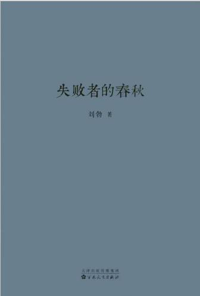

“刘勃历史三部曲”包括《失败者的春秋》《战国歧途》和《司马迁的记忆之野》，关注从先秦到汉代的华夏古史，这恰是奠定中国未来气质的青春期。在此期间，中国完成了从列国纷争到大一统，从贵族统治到皇权专制，从百家齐放到独尊儒术的转变。

作为知名历史作家，刘勃没有采用常见的通史写法，而是选取当时最有代表性的群体和个人，观照时代和国家的变迁。他擅长在史料基础上讲故事，重新勾画熟悉又陌生的古代中国世界。



## 

- > 序干卿底事写春秋

- > 序章天子的困境

  - > 上天生下各种财 富，就是为了让人类获得好处，天子的责任，则是当好一个 裁判，让人们获益的过程变得更加公平。现在，作为仲裁者 的天子自己去搞垄断，这是绝不可以的

  - > 这下“国人”不敢再多嘴多 舌，只能“道路以目”，就是在路上互相使眼色对暗号。于 是又有贤良的臣子对厉王再次劝谏，大意是强调言论自由的 重要。

  - > “防民之口，甚于防川。”（堵住老百 姓的嘴，危害比截断河流还要大，必然会引起洪水泛滥肆 虐。）

  - > 纵览古今中外的历史经验，人民在一位雄才大 略的暴君面前，通常表现得相当软弱可欺，但如果是一位无 能的暴君，局面就大不相同了。

  - > 当年为证明自己的天命，文王、武王和周公都把自己的 道德形象塑造得纯洁无瑕，现在，贵族和诸侯则通过把天子 架上道德高地，牢牢捆住了他的手脚。

- > 第一章齐鲁殊途

  - > “可叹哪，鲁国以后怕是要面 向北方侍奉齐国了。国家政策繁琐而难以理解，人民对领导 人就不会有亲近感。政策平易，方便人民的生活，这样人民 才会拥护政府。”

  - > 听众一般还是更爱听“人”的故事。神化或妖魔 化一个人，经常比神化或妖魔化一个体制更容易打动受众。

  - > 老子的名言——“民之难治， 36
    > 以其智多”

  - > 齐国最有名的人管仲也是一个著名的逃兵，曾经“三战 三走” O有人就去跟他的好朋友鲍叔牙说，管仲人品不堪。 结果鲍叔牙为管仲辩护，说管仲有老母在堂，逃跑也是应该

  - > 周公是庞大周礼的制定者，作为周公的 子孙后代所治理的国家，鲁国一直坚定不移地贯彻这套礼乐 制度。据说为表彰周公的圣德，所有诸侯国里只有鲁国保存 着天子的礼乐。宗周覆灭之后，鲁国这份反而成了孤本。邻 国的人到鲁国来，往往就要请求观摩，听完还要赞叹一句：“周礼尽在鲁矣。”

  - > 也就是“赘婿”（前面提到 的近代上海农村，往往也采用这个方案）。古人对赘婿的解 释是：“女之夫也，比于子，如人疣赘，是余剩之物也。” 就是虽然是老公，但可以像训儿子一样教训，而且既然是余 剩之物，那自然是哪天不顺眼了就可以扔掉的。赘婿一般很 受歧视，后来秦始皇抓人服苦役，犯错误的公务员（“吏有 过”）不够用了，接下来就抓赘婿。

- > 第二章河南三强

  - > 古代朝廷这么做，最主要是出于行政安全的考虑。这样 各地政治势力就很难利用“名山大川之限”犯上作乱，也很 难打造区域认同，一旦想闹独立，恐怕内部先要开撕。对现 代国家而言，这种划界方法也可以缩小省际差距，淡化地方 主义，强调国家意识。

  - > 宋国人是先秦诸子的群嘲对象，有各种小段子。孟子 说，有一农民看着地里，这庄稼怎么长这么慢呢？咱给帮帮 忙吧，就把这幼苗一根一根往上拔。掴苗助长，这是宋国 人。韩非子说，有一农民，看见草窠里窜出一兔子，SB一下 在树桩上撞死了。从此不种地了，每天蹲树桩边儿等兔子 去。守株待兔，这也是宋国人。庄子说，有个人跑到越国去 贩卖礼服，人家越国人经常在水里活动，剪短发，身上刺 满文身，谁会买这些礼服呢？结果当然是赔光了。这又是 宋国人。

  - > 秦这样的四塞之国是三十条命通关的难度，而郑国却是 困难模式，一个微操失误，就再也不能读档重来了。

  - > “人尽夫也，父一而已，胡可比也！”是个男人 就可以做老公，老爸可只有一个，根本不是一个量级上的好 吧。这是“人尽可夫”的出处。

- > 第三章内外乱战

  - > 所以庄公只能拖，等 待问题严重到“如两国”之后再以一场战争来解决气我们知 道，秦汉以后的君主，就绝无如此多的顾忌，所以他们碰到 同类问题，就通常不需要战争，派一个狱吏足矣。

  - > 但是，这种克制的战争很快成了明日黄花。公元前684 年，齐鲁长勺之战，也就是大家中学语文课里学过的《曹 刿论战》。其实这一战里，以奸猾多诈著称的齐国人是讲礼 的，相反鲁国这个礼仪之邦在曹刿的指挥下耍了个无赖。齐 国人开始敲鼓准备冲锋，鲁庄公也准备擂鼓，但曹刿说别， 咱等等。这时要是齐国人不理会鲁国的反应，你等你的，我 冲我的，那么处于静止状态下的鲁军对抗高速奔驰而来的齐 国战车，只会被撞击碾压得更惨。但这种情况没有发生，因 为按照西周的军礼，要冲一起冲，所以齐国军队只好缩回 87
    > 去。然后再敲鼓，鲁国又不动，齐国只好再缩回去。这就类 似一百米比赛，抢跑两回之后，状态当然会大受影响。这就是所谓“一鼓作气，再而衰，三而竭”，齐国人 就这么被阴了。

    > 去。然后再敲鼓，鲁国又不动，齐国只好再缩回去。这就类 似一百米比赛，抢跑两回之后，状态当然会大受影响。这就是所谓“一鼓作气，再而衰，三而竭”，齐国人 就这么被阴了。

- > 第四章戎狄交侵

  - > 戎狄和诸夏有着共 同的源头，而匈奴却未必如此。

- > 第五章霸业初起

  - > 三王最明确，这是结合夏商周三代讲的。夏朝的禹，商 朝的汤，周朝的文王和武王一三王确实是四个人

  - > 霸主有 三个特点：第一，他有牺牲精神；第二，他能为诸侯解决困 难；第三，他是天子意志的执行者。

  - > 某种意义上，春秋中期的霸主政治是怀旧的产物。东周 以来，各诸侯国内篡弑频繁，国际纷争不断，加之戎狄交侵 的压力，华夏各国越来越难以忍受。众所周知，人在对现状 不满时，就要为过去上色，追忆美好而伟大的传统了。想当年，周天子具有巨大权威的时代，何至于搞到现在 这个局面呢？

  - > 这段对话，还真真灌注了中国古代知识分子两千年来的 一个梦。古代读书人想当官吗？想，太想了。当官是为了功 名利禄吗？至少他会告诉自己，并不是，是有伟大的理想需 要靠我从政来实现。更重要的是这段文字里所体现的君臣关 129
    > 系。和那些草莽英雄相比，知识分子的野心比较有限，不指 望自己成为领导人，只是渴望作为最重要的辅佐，得到领导 人充分的信任和尊重。

    > 系。和那些草莽英雄相比，知识分子的野心比较有限，不指 望自己成为领导人，只是渴望作为最重要的辅佐，得到领导 人充分的信任和尊重。

  - > 这也是女人/文人的理想境界：你既然追到了我，就要 全心全意对我好，而且绝对绝对不可以怀疑我。某种意义上 说，这种津津乐道反而有点遮蔽了一个更实在的问题：齐桓 公的霸业，究竟是怎样建立起来的。

  - > 最突出的如齐桓公和管仲制定了许多政策，加强国君 对人口的直接控制。换句话说，许多那时帮助齐国取得成功 的策略，今天听起来恐怕并不舒服。《国语•齐语》说， 人民分为士、工、商、农，这四种职业一定要分开居住互 不交流，这样，士人的孩子永远都是士人，工匠的孩子永远 都是工匠，商人的孩子永远都是商人，农民的孩子永远都是 农民，于是各行各业就都能健康发展了，这就叫“成民之 事” 0

- > 第六章尊王攘夷

  - > 我们知 道，栽了跟头而想保全面子，最好的办法是什么？就是拿一 些风光的细节大做文章。《三国演义》里诸葛亮一出祁山败 给了司马懿，可是重点渲染的是空城计；近代史清政府饱受 列强欺凌，可是看晩清人的笔记里，全是李鸿章在私人谈判 里占尽洋人便宜的段子。

- > 第七章霸政之荡

  - > 一旦失去霸主地位，雅典经济立刻就会崩溃。 所以它不容许盟邦退出联盟，为惩戒有此企图的城邦，雅典 人留下了人类历史上最著名的霸权主义宣言：“强者为所 欲为，弱者接受事实。” (The strong do what they can, and the weak suffer what they must.)

  - > “什么九合诸侯一匡天下，就是赔钱赚吆喝！”“齐国是齐国人的齐国，齐国优先！”“每个齐国人都过上好日子了吗？为什么要去卫国和邢 国撒钱？ ”“楚国和我们风马牛不相及，为什么要去打它？ ”“帮燕国打退山戎付出了多大代价？死了多少齐国人？ 结果呢，就是保住了一个可耻的姬家政权，还割让领土给人 家••…”

- > 第八章晋国往事

  - > 电 视剧的“主流收视人群”，对有可能提升自己智商的剧情， 其实是拒绝的。

- > 第九章国位之争

  - > 卖国者心理的极好概括：“人实有国，我何爱焉。入而能 民，土于何有？ ”国家是人家的，我有什么舍不得？如果能 够回国成为人民的主人，还怕没有土地吗？

- > 第十章晋文之谪

- > 第十一章此路不通

  - > 在国家才能兴建的 体量巨大的建筑面前，人会格外意识到自己的渺小，从而增 加对国家的敬畏或热爱之情，归属感就是这么塑造出来的。

  - > 不 是的，就是“壮丽动之”而已，排场有了，凝聚力就有了。

  - > 你可以认为上述行为都很不理性，但指望人民群众都很 理性，那才是最大的不理性。身为政治人物，就是要“愚愚 民以其荣观”，利用民众天生的猥琐心理操纵他们。

  - > 中 国人看着一定觉得很亲切。大型建筑或雕塑对操控人心，有 时就是这么有魔力。

- > 第十二章晋楚争霸

  - > 简单说，春秋与战国，有隐性的丛林社会和赤裸裸的丛 林社会的区别。同样是大国吃小国的血肉，春秋相对比较文 雅，算得上钟鸣鼎食；战国则近乎茹毛饮血。当然，你也可 以说这不过是春秋时代多一些贵族的虚伪罢了。但是，吃人 者要花精力和心思保持吃相不难看，对弱小者来说，就多一 点逃生的时间和空间。所谓“文明”，常常也不过就在于留 不留这一点点余地而已。

  - > 这一仗打成了春秋时为 期最长的围城战，前后相持九个月。宋国人被逼到“易子而 食，析骸以鬓”的地步。没东西吃了，就相互交换自己的小 孩吃掉。柴禾早就没了，就拆解死人骨肉做燃料。

  - > 不妨一提的是，宋国都 城在睢水以北，这里也就是唐朝安史之乱时，名将张巡死守 的睢阳。那次睢阳之战的结果也是粮尽食人，一座睢阳城几 乎吃空。这样的悲壮和惨无人道，出现一次震撼人心，但在 同一个地方反复上演，就只剩下历史的荒谬和虚妄感了。

- > 第十三章贵族黄昏

  - > 一回头，发现教自己逃命的不是别人，正是追击自己的 楚军。于是晋国人觉得有必要说句话挽回面子：“吾不如大 国之数奔也。”我不像贵国那样经常逃跑。意思是你们老 兵油子有经验，我们常胜之师难得逃一回不熟练，让您见 笑了。

  - > 齐庄公到崔杼家去找棠姜幽会，于是被杀死。从齐庄公 之死前前后后的事里，我们可以看到几种不同的忠诚。在崔 杼家里，齐庄公被埋伏的甲士团团围住，庄公向他们求情。 甲士们说；“国君的臣子崔杼重病，不能听取您的命令。这 里临近国君的宫殿，我们（原文是’陪臣’，臣子的臣子） 只是巡夜捕击奸淫之人，不接受崔子之外的人的命令。”崔杼是齐庄公的臣子，他深知自己弑君是大逆不道，所 以这个场合根本不敢出现，这是企图逃避“不忠”的恶名。 甲士们是崔杼的臣子，从他们的话看，他们有忠于崔杼的义 304
    > 务，但没有忠于国君的义务，有点“我主人的主人不是我的 主人”的意味。

    > 务，但没有忠于国君的义务，有点“我主人的主人不是我的 主人”的意味。

  - > 国君为国家而死，我们有责任陪 他一起死；国君为国家而流亡，我们有责任陪他一起流亡； 305
    > 但是国君因为个人私事而死或流亡，除了他个人的亲信，谁 又有为他殉葬的责任呢？

    > 但是国君因为个人私事而死或流亡，除了他个人的亲信，谁 又有为他殉葬的责任呢？

  - > 这个问题当权者们反而好解决了。试想，如果崔杼可以 挑他的心腹代替太史、南史，那局面就完全不一样了。根本 不用杀人，只需要枪毙史官的稿子。这就是“子为政，焉用 杀”的境界，比起崔杼傻乎乎挥起屠刀得了恶名，最后却还 不得不让步，不知道高到哪里去了①。

  - > 《史记》还真是贵族史 学的余晖，往后的史官和史书就要面临严苛的审查制度了。

  - > 简单说，在那个年代，失败的贵族不死也会沦落到社会 下层，而唯一的成功者，追求的却不会是仅仅做一个贵族。 这也很容易让人联想起托克维尔那段著名的议论：在未来的黑暗中，人们已经能够洞察三条非常明显的 真理。第一条是，今天，举世的人都被一种无名的力量所 驱使，人们可能控制或减缓它，但不能战胜它，它时而轻 轻地，时而猛烈地推动人们去摧毁贵族制度；第二条是， 世界上所有社会中，长期以来一直最难摆脱专制政府的社 会，恰恰正是那些贵族制已不存在和不能再存在下去的社 会；最后，第三条真理是，没有哪个地方，专制制度产生 的后果比在上述社会中害处更大；因为专制制度比任何其 他政体更助长这种社会所特有的种种弊端，这样就促使它 们随着它们原来的自然趋向朝着那个方向发展下去。①

- > 第十四章华夏边缘

  - > 于是勾践派岀一伙刑徒，排成三行走到吴军面前，表演 抹脖子。这么多人整齐干脆地自杀，把吴国人惊到了，都专 注地看。越军趁机发起冲击，大败吴军，杀死吴王。

- > 春秋大事年表①

- > 后记

