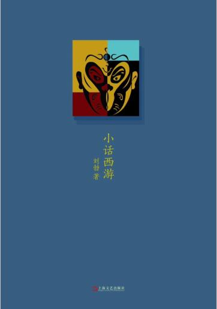

刘勃的一本西游杂文，重新解读西游人物



- > 在体制外搞民办教育，招生就不免成了问题。所以菩提空 有一身的本事，课也就只好上成那个样子

- > 所以哪吒闹海这一回书，怎么看都是李哪吒仗势欺人。就 算考虑龙王并非平头百姓，那也只能讲这"反映了统治阶级的 内部矛盾”，扯不到反叛精神上去°至于老百姓为什么会喜欢 一个仗势欺人的恶少，大约只能这样讲：第一，民间总是对神 014
  > 童故事怀有特别的爱好；第二，只要还没有欺到自己头上，人 欺负人的故事总是有点看头。

  > 童故事怀有特别的爱好；第二，只要还没有欺到自己头上，人 欺负人的故事总是有点看头。

- > 看来猴子也觉得自称齐天大圣是名不正言不顺的，要的还 是玉帝老儿的承认°这就显然不是最坚决最彻底的革命派，还 是认同现有领导核心的领导权的嘛。打两个胜仗，是为受招安后要官 做添卿码。因此停战之后听说太白金星又来，他当即大喜：

- > 明明是自己要去东方传教，但不送货上门，而是要人家千 辛万苦的来求，是高明的促销法。

- > 如来只说要"寻一个善信”，没有具体的人选，预备公平 公正公开选拔的意思;观音站出来，也没推荐谁。

- > 观音到了东土，挑中了陈玄奘大阐法师。妙在，这位玄奘和尚，恰恰本来就是"因为不听佛讲”而 受罚的如来弟子.妙在，当初送玄奘到大唐来投胎，恰恰是这位观世音菩萨。要说这背后没有一点猫腻，你信不信？

- > 基本上，这就快到精神崩溃的边缘了。此时能逮着一个猴 子这样的徒弟，唐僧的感觉，该跟样板戏里，老乡看见共产党 差不多吧。

- > 唐僧是凡人，在妖怪面前只有依 赖悟空可以理解，但在对佛法的认识问题上，还时常需要一只 半路出家的猴子来开导，就未免有些说不过去。

- > 苏童有一部小说，叫《新天仙配》

- > 唐僧仍然不喜欢悟空，但是知 道离不了他，不但不敢轻言放逐，连紧箍咒也渐渐念得少了。 这种处境当然会使得唐僧觉得感情受到压抑，被压抑的感情总 是来得特别强烈，所以他对八戒的偏爱也来得愈发明显。对这 一点，孙悟空是有嫉妒心理的，一一虽然未必肯承认。猴子对 猪的捉弄，很大程度上有耍性子的成分

- > 唐僧到西天后，菩萨亮出 一张九九八十一难的统计报表，这张表做得要多没逻辑就有多 没逻辑。”黄风怪阻十三难，请求灵吉十四难”，两难是一件事。"黑松林失散二十一难，宝象国捎书二十二难，金銮殿变 虎二十三难”，三难是一件事。遭遇红孩儿，更是生生拆成了四难，"号山逢怪二十八难， 风摄圣僧二十九难，心猿遭害三十难，请圣降妖三十一难”。也就是说，西天取经一路上遭遇了多少难，全看菩萨一张 嘴。只要她乐意，压缩成一十八难也行，分解成八百一十一难 也可以。

- > “有人说，这是阴谋。我们说，这是阳谋。因为事先 告诉了敌人：牛鬼蛇神只有让它们出笼，才好歼灭它们，毒 草只有让它们出土，才便于锄掉。”（《毛泽东选集》卷耳）

- > 宣传吃了唐僧肉可以长生不老，未必不也是个“阳谋”吧？

- > 却忘了他对唐僧常常缺乏起码的尊重，一这可能是你 对他再好都弥补不过来的。猴子散漫，对唐僧的清规戒律，繁 文缚节常不免加以嘲笑，而照孟德斯鸠的说法，"没有比违反 他人的习俗礼仪更得罪人的事了，因为这是蔑视他人一种的标 志。”恺撒之死，不是因为暴君的种种独断专行，而是因为忘 了在全体元老院议员面前起立。

- > 《水浒传》第二十三回，"王婆贪贿说风情”，总结了追女生 的五个关键词："第一件，潘安的貌；第二件，驴儿大的行货；第 三件，要似邓通有钱；第四件，小就要棉里针忍耐；第五件，要闲工 夫：一 五件，唤作'潘、驴、邓、小、闲

- > 中央集权政府最基本的信念，便是最高中央能对事无巨细 的一切问题都做出英明的决策。所以像降雨这样的事情，应该 是从“玉帝掷下旨意”开始的，然后，才下达到各个具体的执 行部门。

- > 小 腐败戴手铐，大腐败做报告

- > 有一个细节不妨提出。泾河老龙被斩，他的家族没有就此 败落，他的儿子们都得了不错的工作岗位：

- > 吃什么补什么，人将能点金的丹吃了，身体就也能有黄金的质 地，故又谓之“金身不坏”

- > 人在伦理与性欲间受虐，被虐出快感来了，爱情也就诞生 T.所以，无论伦理还是性欲，当它占着一边倒的优势的时 候，供爱情活动的空间，也就很小了。

- > 菩萨收了灵感，显鱼篮观音像。陈家庄一庄“老幼男女， 都向河边，也不顾泥水，都跪在里面，磕头礼拜”。灵感本就 是观音身边的人，这些年吃了庄里这许多孩子，大家好像全不 记得了。如此善良而善忘的百姓，真让人有些无语了。

- > 多好的见解，也架不住变成标准答案

- > 我只擅长精神攻击，所以碰上你这种低等生物我一点办法 都没有。

- > “雄辩是银，沉默是金。”这两句话我认为是条件关系， 也就是说，具有雄辩才能的人，他的沉默才有金子般的价值。

- > 那是个多么严肃的人，他嘴里出来的每一个字，都是黑体字。

- > 大众对明白人的办法是这样，就是不把你逼疯，也要逼得 你装糊涂。好了，你不糊涂而装糊涂，和他们那些真糊涂的相比，正 见得你的虚伪。这下，他又站稳道德制高点的山头了。

- > 谁稀罕你心服口服？我就是要你想不服而不能不服，这样 你闷气难舒，我才加倍欢喜。

- > 丑小鸭变成了天鹅，这和她是否经历过许多磨难无关，而 是因为她从来就是一颗天鹅蛋里的种子。

