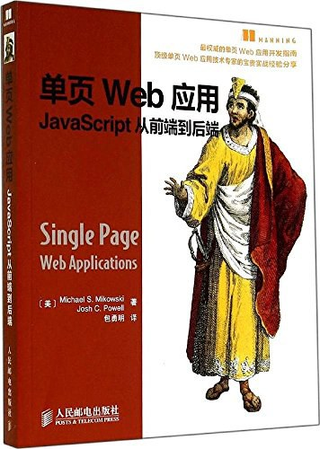
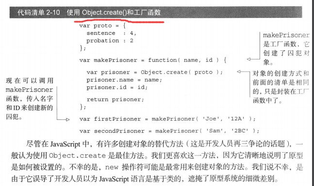
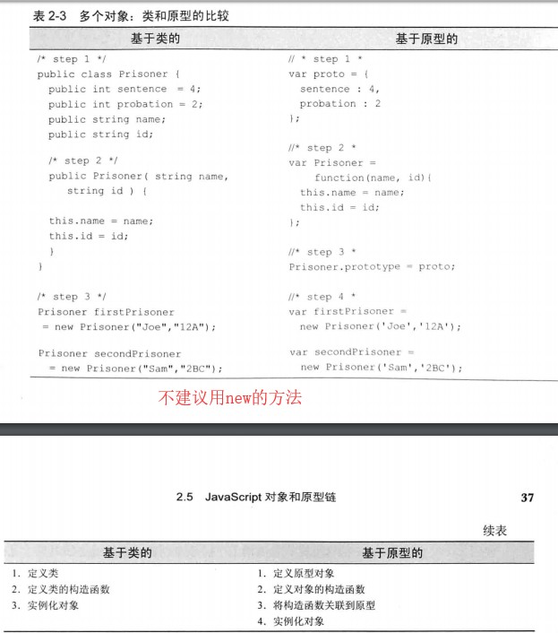
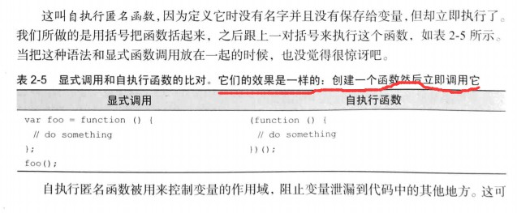
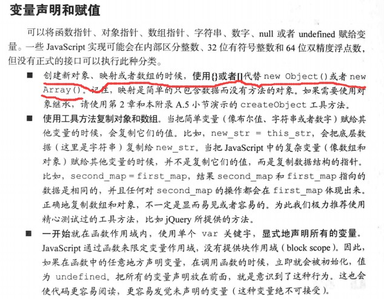

基本讲述的还是JavaScript知识，和单页关系不大


<!-- more -->

### 基于原型创建对象方法，Object.create(proto)

### 36 基于类和基于原型创建的不同

### 66 自执行函数等同于创建一个函数然后立即调用它，是显示调用的简写

### 369 创建对象，数组使用{}或者[]代替new Objecet()或者new Array()

