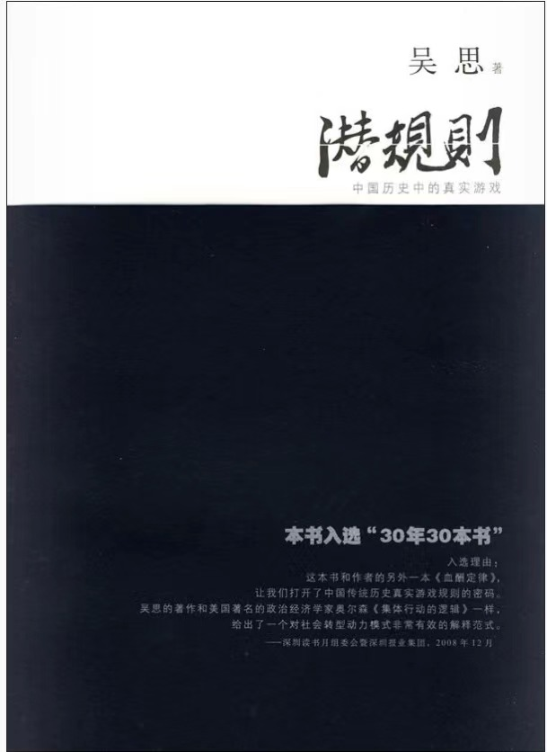

一个揭露中国社会现实的书，在中国生存必读书籍，读来触目惊心却又感叹事实确实如此，比如作者发现官员都有合法地祸害别人的能力，就是这一发现揭露了底层百姓的生活艰难。直到法制的今天，我们的官员依然有合法祸害别人的能力，就是要刁难你，老百姓办事难，解决办法是要实现民主监督，媒体监督，才能彻底清除毒瘤



<!-- more -->

合法地祸害别人的能力，乃是官吏们的看家本领。这是一门真正的艺术，种种资源和财富正要据此分肥并重新调整。

是和黑手党打交道，我也承认，在辨别专制政府与黑手党的实质性区别时，我经常感到自己愚钝无能。总之，合法伤害权是很值钱的。有了这种权力，没有钱可以有钱，没有敛钱的规矩可以创造出规矩。

如果某羊不反抗，也许能多活几天，一时还轮不上被吃。敢于反抗者，必将血肉模糊，立刻丧命，绝少成功的希望。冤大头是贪官污吏的温床。在冤大头们低眉顺眼的培育下，贪官污吏的风险很小，麻烦很少，收益却特别高，因此想挤进来的人也特别多，他们的队伍迅速壮大。但是最终会遇到一个问题。就好像狼群在羊群的养育下迅速扩大一样，大到一定的程度，羊群生长繁殖的速度就供不上人家吃了，羊群要被吃得缩小以致消亡了。这时候，狼的末日也就不远了。这竟是双输的结局。其实，中国历代老狼的经验很丰富，完全明白这个道理。那些为天子牧民或者叫牧羊的肉食者，都知道羊是狼生存的根本 -- 简称 " 民本 " 。大家都懂得爱护羊群的重要意义。奈何抵抗不住眼前绵羊的诱惑，也抵抗不住生育狼崽子的诱惑。这也是有道理的：我不吃，别的狼照样吃；我不生，别的狼照样生。个体狼的利益与狼群的集体利益未必一致。如果我的节制不能导致别人的节制，我的自我约束对羊群来说就没有任何意义，徒然减少自己的份额而已。在老狼忍不住饕餮的时候，我可以听到一声叹息：它们要是变成刺猬，俺们不就变成清官了么？

打死人命就白白的走了，再拿不来的！”说着就要发签，派人去抓。这时他看见旁边一个门子向他使眼色。进了后边的密室，门子和贾雨村有几段精彩的对话。门子问：“老爷既荣任到这一省，难道就没抄一张本省‘护官符’来不成？”雨村忙问：“何为‘护官符’？我竟不知。”门子道：“这还了得！连这个不知，怎能作得长远！如今凡作地方官者，皆有一个私单，上面写的是本省最有权有势，极富极贵的大乡绅名姓，各省皆然；倘若不知，一时触犯了这样的人家，不但官爵，只怕连性命还保不成呢！”说着拿出一张抄好的“护官符”来，上边就有薛家。贾雨村问门子此案该如何处理，门子说，薛家和帮助你当上知府的贾家是亲戚，何不作个人情，日后也好去见贾府的人。贾雨村道：“你说的何尝不是。但事关人命，蒙皇上隆恩，起复委用，实是重生再造，正当殚心竭力图报之时，岂可因私而废法？”门子听了，冷笑道：“老爷说的何尝不是大道理，但只是如今世上是行不去的。岂不闻古人有云：‘大丈夫相时而动’，又曰：‘赴吉避凶者为君子’。依老爷这一说，不但不能报效朝廷，亦自身不保。还要三思为妥。”贾雨村低了半日头，最后嘴里说着不妥，还要再研究研究，实际上完全遵循门子的建议，很巧妙地解脱了薛蟠。曹雪芹卒于 1764 年，与朱元璋相隔约 400 年，但是这个世界并没有多少变化。

从这个意义上说，民主制度的真正实行，也是提高公德水平的一个重要的前提条件。因为公德无非是主人翁的道德，不是主人翁，继续当臣民甚至奴才，这道德便没了根基。

