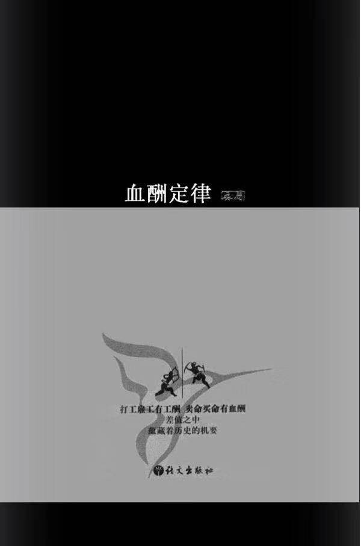

潜规则续本，揭露中国社会残酷现实



<!-- more -->

以大名鼎鼎的徐霞客为例。崇祯十年（ 1637 ）秋，徐霞客在广西游历，他无权免费使用公家的驿传系统。但是，凭着地方官赠送的马牌（使用驿传的证明信），徐霞客却支使村民为他和仆人抬轿赶路。主仆加上行李，动辄要用七八个夫役。村里人手不够时，还用“二妇人代舆”——让妇女为他抬轿。此外还要供他吃喝，有鱼有肉，“煮蛋献浆”。

英雄这种东西，本来就是非常时期的非常之物，稳定的常规秩序中不需要英雄，也没有英雄的位置。

每年 3 万两挂旗费买来了什么东西。这是一笔富于中国特色的交易。古往今来，无论是捐官衔还是送干股，无论是挂洋旗还是戴“红帽子”，这类交易频频发生，这笔费用很有理由列入中国工商业的常规开支。

我们当然知道，维护正义是很麻烦的。在当代社会中，这是检查官、律师和法官们，消耗了巨大的人力物力，费了无数的心血和麻烦，勉勉强强还未必能维持一个大概的。指望一个武术高手在短时间内明辨是非，以暴力维持公平和正义，这简直是一个神话。不过神话恰恰是既省事又省心的故事。我们特别怕麻烦，怕费心，怕受约束，还怕合作，怕处理复杂的人际关系，怕走复杂的组织程序，怕背诵复杂的法律条文，我们幻想舍弃这一切麻烦，不支付任何代价，像呼唤神灵一般地把正义从空中呼唤出来。原来，我们的白日梦是一个富于正义感的懒汉的富贵幻想。究竟什么人拥有超强的暴力，不受暴力的威胁，却能以暴力贯彻自己的意图？究竟什么人可以衣食无忧，既富且贵，身边美女如云？这种拥有匡扶正义的地位，凭借暴力获得立法和执法权威的社会角色，在中国历史上只有一个，那就是皇帝。皇帝的生活，乃是中国人所能想象的尘世间最幸福的生活。不过金庸又替我们想象了一个比皇上还幸福的角色，也就是大侠。皇帝还有许多不自由，还有上早朝的义务，处理公文的义务，不能睡懒觉，不能自由出入民间，被迫忍受许多约束。明朝的正德皇帝就因此深感痛苦，与文官们闹了一生。武侠没有这些烦人的事。这是一个摆脱了讨厌的义务，又可以尽情享受生活的角色。除了内心，没有任何可以约束他的力量。总之，武侠梦就是中国男人的改良皇帝梦。

对武侠的幻想，其实就是对暴力的幻想，对拥有强大的伤害能力的幻想。

将“合法伤害权”用到平头百姓身上，其影响和意义最为惊心动魄。我替上访告状的清朝百姓算过几笔账，为了告掉强加在自己身上的乱收 ? ，究竟要冒多大的风险，付出多高的代价，胜算又有几何？反过来，官吏们敲诈勒索，收取苛捐杂税，一旦被百姓告倒又有多大风险，多大损失？几笔账算下来，结论竟是骇人听闻的两句话：当冤大头是老百姓最合算的选择，而当贪官污吏则是官吏最合算的选择。这不是道德问题，而是利害格局决定的。

从道义的角度，我看不出这种城乡分割政策与种族隔离政策和种姓歧视政策有什么本质上的区别。但我怀疑中国能否产生马丁 · 路德 · 金，或者曼德拉那样的人物，这不是人种问题，而是土壤和气候问题。