elasticseach的查询方式介绍

<!-- more -->

4.4.2 MultiSearch

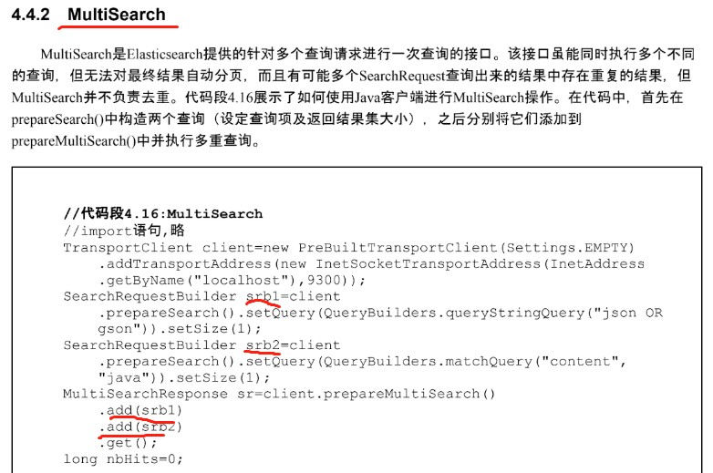

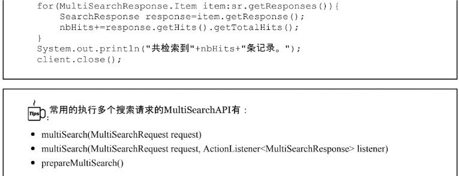

4.4.3 Search template

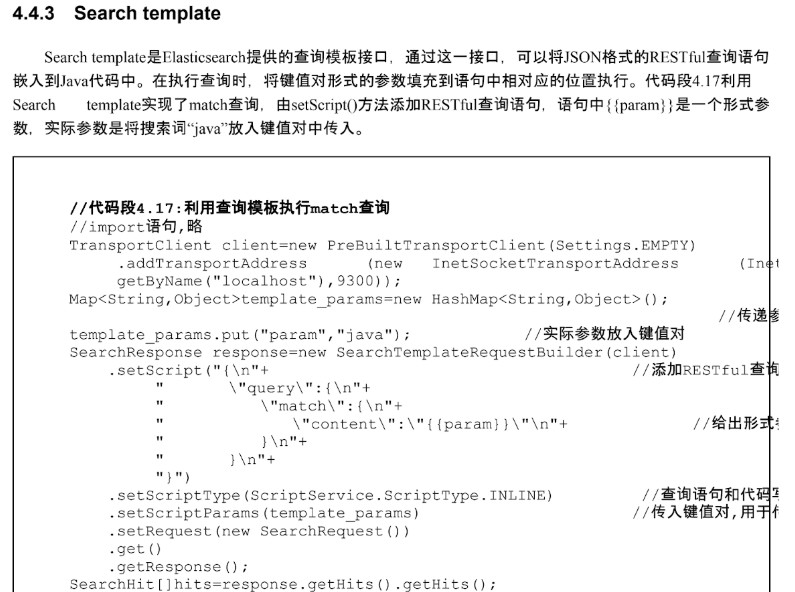

4.4.4 DSL概述

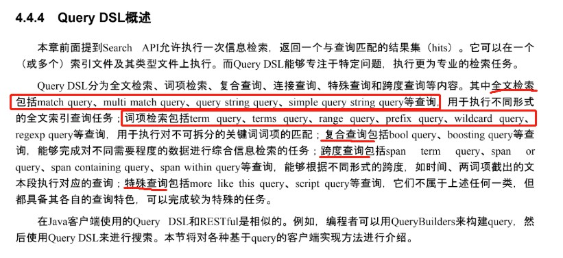

4.4.5 matchAllQuery 全局检索 

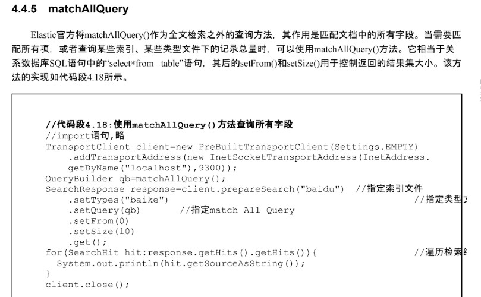

4.4.6.1 matchQuery

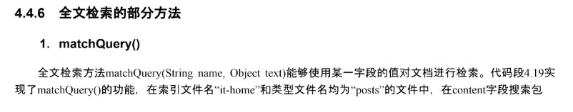

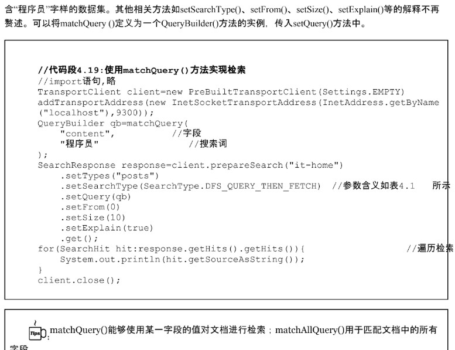

4.4.6.2 multiMatchQuery

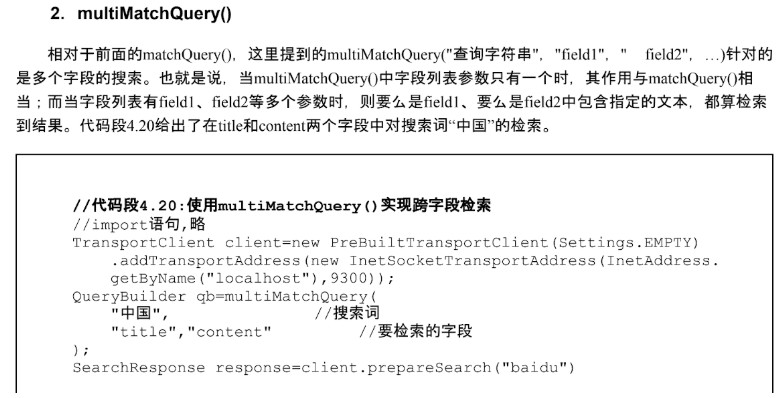

4.4.6.3 queryString

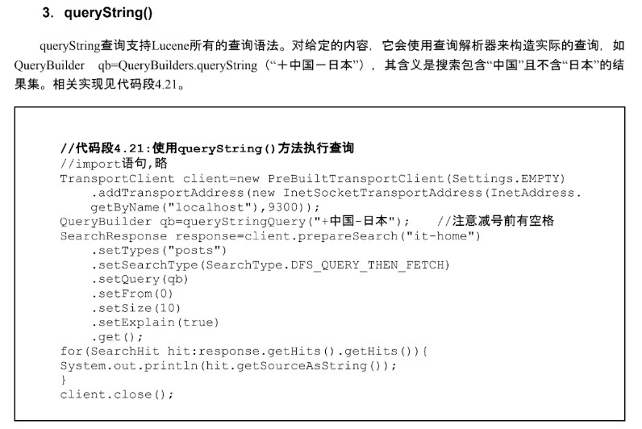

4.4.6.4 simpleQueryStringQuery

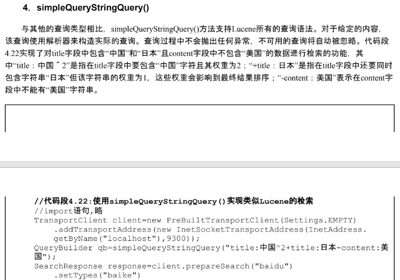

4.4.7.1 termQuery 词项检索

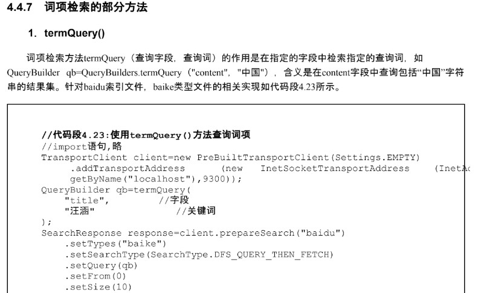

4.4.7.2 termsQuery

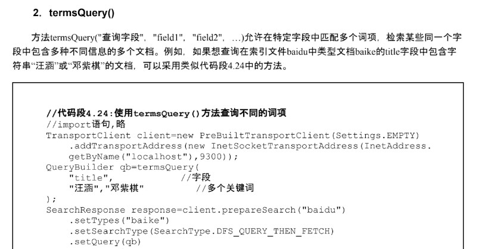

4.4.7.3 rangeQuery

5.4.7 boolQuery

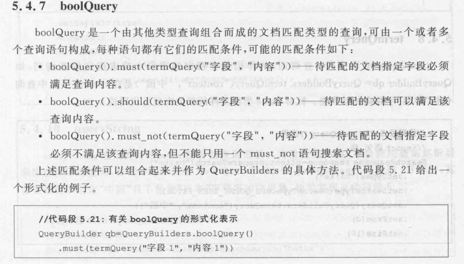

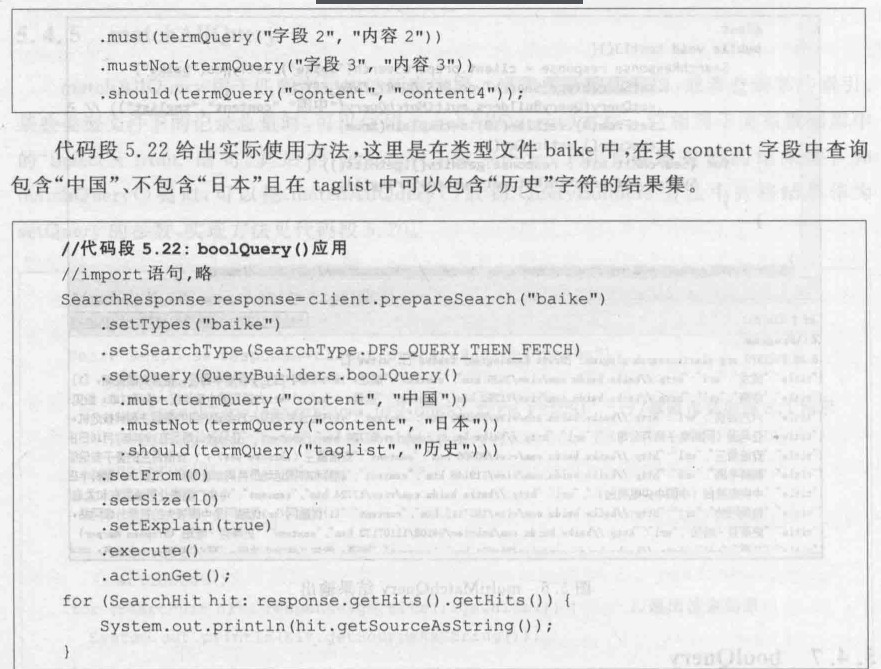

5.4.9 wildcardQuery

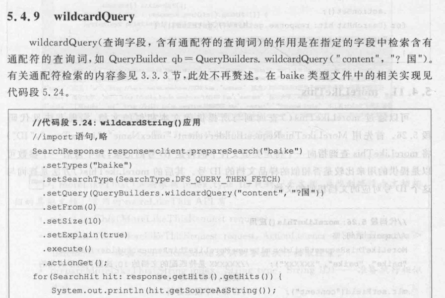