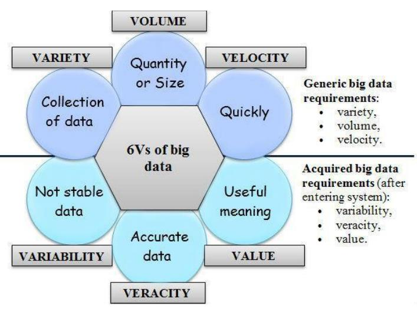
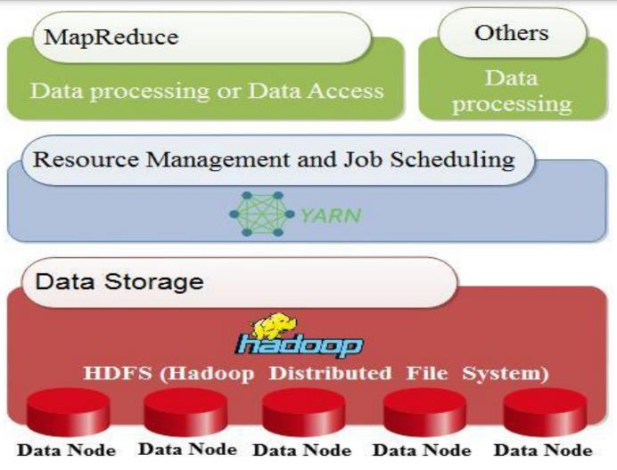
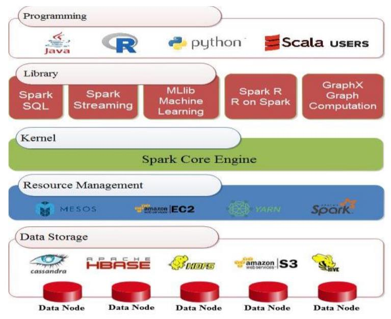
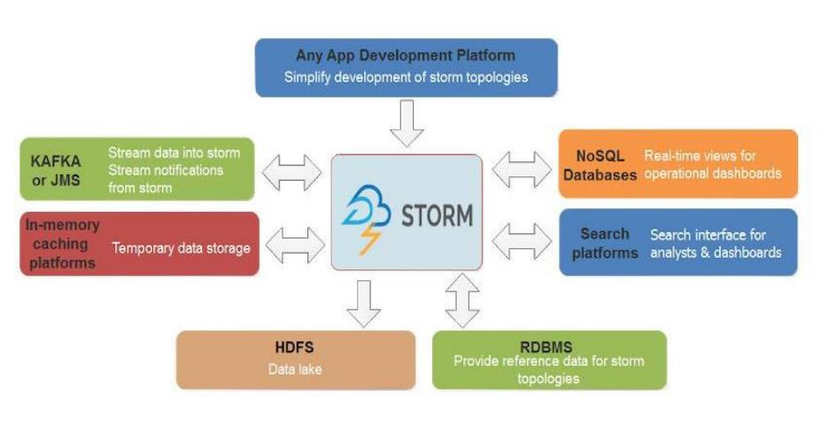
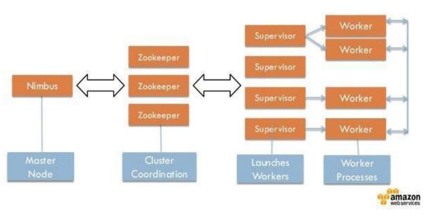
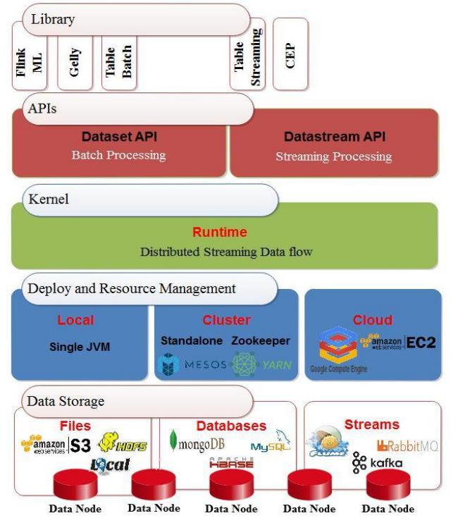

## 大数据框架Flink,Spark,Storm,Hadoop比较

**摘要**
每天，大数据分析作为一种用于分析大量按需数据的工具，越来越受到人们的欢迎。四个最常见的大数据处理框架包括Apache Hadoop，Apache Spark，Apache Storm和Apache Flink。虽然这四个都支持大数据处理，但是这些框架的用法和支持该用法的基础体系结构不同。许多研究已经投入了时间和精力来通过评估已定义的关键绩效指标（KPI）来比较这些大数据框架。本文通过确定一组通用的关键性能指标来总结这些早期工作，这些关键性能指标包括处理时间，CPU消耗，延迟，吞吐量，执行时间，可持续的输入速率，任务性能，可伸缩性和容错能力，并比较这四个大数据通过文献综述了解这些KPI的框架。**与Apache Hadoop和Apache Storm框架相比，在非实时数据中Spark为多个KPI（包括处理时间，CPU消耗，延迟，执行时间，任务性能和可伸缩性）的赢家。在流处理中Flink与Apache Spark和Apache Storm框架相比，Flink在处理时间，CPU消耗，延迟，吞吐量，执行时间，任务性能，可伸缩性和容错能力方面最适合流处理。**

**关键字-大数据，性能评估，Flink，Hadoop，Spark，Storm**

### 一.引言

​        近年来，由于技术的飞速发展，大数据已成为一个更加重要的问题。如果有人看数据的大小，他们会看到它正在从PB增长到EB或ZB。特别是在社交媒体分析中，通过使用从多个社交媒体渠道收集的结构化和非结构化数据进行分析。例如，在创建后的72个小时内，在Tumblr博客平台上，大约有三万个新帖子。在Twitter上有十万条Tweet，在Facebook上有二十万张图片[1]。以上所有这些数字表示数据量呈爆炸式增长，并且数据的增长比以往任何时候都要快。因此，“大数据”一词已经出现并引起了当今计算领域和研究人员的关注。
​        “大数据”一词由Roger Magoulas于2005年首次提出[2]。他将其定义为无法通过传统数据管理技术管理或处理的大量数据。此数据来自各种资源，例如：社交媒体网站，视频，传感器，智能手机和搜索查询，仅举几例。从其他数据定义“大数据”有几个重要方面，即：庞大的数据量，由复杂且独立的数据组成的数据集，此外，传统的数据管理技术无法对其进行处理[3]。
​        由于海量数据以及将数据用于分析目的时可能发生的复杂性，大数据分析工具正成为最重要的技术之一。这些技术提供了组织或操作所有数据的能力，而不是使用数据库或系统的传统平台。
​        本文的目的是概述四个大数据框架，并通过文献综述将它们与一组预定义的关键绩效指标进行比较。

​      本文分为以下几部分： 下一部分将解释大数据的主要特征，称为大数据的维度。 接下来是对一些大数据框架的讨论。 Hadoop，Spark，Storm和Flink。 它们的类别将作为框架和所得结果之间的比较研究而呈现。 之后，我们给出一些结论。

###  二.大数据的特征
​        当我们在上一阶段定义了大数据的含义时，现在说明其特征非常重要。 它由通用的大数据需求（volume（容量）, variety (多样性) , and  velocity (速度)）组成，这些需求统称为3维 [4]。 最近，大数据的特性从3维演变为6维度，增加了value (价值), veracity (准确性), 和variability (可变性) 的特征。 图1显示了6维的大数据。



​                                  *Fig. 1. 6V's of Big Data*

`译者注：Volume（指数据量大）、Velocity（指数据量增加速度快）、Variety（指数据种类多样）、Value（指数据价值密度）、Veracity（指数据真实性）、 variability（指数据源稳定性）`

#### A. Volume（容量）

Volume 是指数据的数量或大小。 大数据的大小约为TB，PB（PB），Zettabyte（ZB）和Exabyte（EB）[7] [8]。 Facebook，YouTube，Google和NASA等组织拥有大量数据，这给存储，检索，分析和处理这些数据带来了新的挑战。 大数据而非传统存储的使用改变了我们传输数据和使用数据的方式[9]。

#### B. Variety  (多样性) 

多样性是指正在生成的不同类型的数据。可以使用不同的维度来衡量类型（例如结构，使我们能够区别结构化，半结构化和非结构化数据，或批处理与流处理的处理量）

#### C. Variability     (可变性) 

可变性是指不稳定，难以处理且难以管理的数据。解释可变数据对研究人员来说是一个重大问题[6]。

`译者注：指数据源不稳定`

#### D. Velocity (速度)

是指大数据以多快的速度生成，以便进行操纵，交换，存储和分析[10]。由于涉及的高成本，速度对数据科学家提出了新的研究挑战[11]。当用户需要检索或处理数据并且处理速度不够快时，数据就被遗忘了[11]

#### E. Veracity  (准确性)

准确性是指正在处理的数据的质量。数据源的准确性还取决于分析数据准确性[5]。

#### F. Value (价值)

价值是指数据带来的目的或业务成果，以促进决策过程[5]。

### 三. 大数据处理框架
​        本文比较的四个框架在它们支持的功能和底层体系结构方面彼此不同，同时将支持大数据处理的主要目的保留在其核心。本节概述了这四个大数据处理框架的体系结构。
####  A.Hadoop
​        在2008年，Doug Cutting和Mike Cafarella将Apache Hadoop定义为一个开源框架，该框架通过一组称为群集或节点的主机（硬件层）收集和处理分布式数据。它提供的是分发服务机器，而不是一项服务。因此，它们可以通过使用群集或节点[12] [13]并行工作。
​        图2说明了Hadoop框架的三个主要层。第一个是用于收集数据的数据存储层，其中包含Hadoop分布式文件系统（HDFS）。第二层是YARN基础结构，它提供用于作业调度的算术资源，例如CPU和内存。第三个是MapReduce，它用于与其他进程一起处理数据（软件层）[13]。



​                               *Fig. 2. Hadoop Architecture Adapted [5]*

​        许多公司，企业和组织使用Apache Hadoop的主要原因有两个。首先，进行学术或科学研究。其次，进行分析以满足客户的需求并帮助组织做出正确的决定。例如，当组织需要知道客户需要哪种产品时。然后，它可以产生大量所需的产品，这是Apache Hadoop的几种应用程序之一[12]。

#### B.Spark

Apache Spark是在加州大学伯克利分校建立的开源框架。它在2013年成为Apache项目，通过大规模数据处理提供更快的服务[14]。 Spark框架对Hadoop而言就像MapReduce对数据处理和HDFS一样。此外，Spark具有数据共享功能，称为弹性分布式数据集（RDD）和有向无环图（DAG）[14]。
图3表示Spark架构，它非常容易且快速地选择大量数据处理。 Spark主要由五层组成。第一层包括数据存储系统，例如HDFS和HBASE。第二层是资源管理；例如YARN和Mesos。第三个是Spark核心引擎。第四个是一个库，由SQL，流处理，用于机器学习的MLlib，Spark R和用于图形处理的GraphX组成[14]。最后一层是应用程序接口，例如Java或Scala。通常，Spark提供了一种大型数据处理框架，供银行，电信公司，游戏公司，政府以及Apple，Yahoo和Facebook等公司使用。



​                              *Fig. 3. Spark Architecture Adapted [15]*

#### C. Storm

 Storm引擎[16]是一个开放源代码框架，旨在实时处理流数据。它是用Clojure语言编写的[17]。图4显示Storm可以在任何程序语言和任何应用程序开发平台上使用。因此，它保证了数据不会丢失。
图5说明了两种类型的节点：第一种是主节点，第二种是工作节点。主节点用于监视故障，承担分布式节点的责任并为每台计算机指定每个任务。所有这些任务统称为Nimbus，类似于Hadoop的Job-Tracker [18]。工作节点称为主管。当Nimbus为它分配特定的进程时，它将起作用。因此，拓扑的每个子过程都可与许多分布式计算机一起使用。 Zookeeper扮演Nimbus与主管之间的协调员。更重要的是，如果任何集群出现故障，它将把任务重新分配给另一个任务。因此，从节点控制自己任务的执行。



​                                       *Fig. 4. Storm Architecture [19]* 



​                                       *Fig. 5. Storm Processing [20]*

#### D.Flink 
Apache Flink [21]是由三所德国大学于2010年创建的开源框架，已被有效地用于实时和批处理模式下的数据处理。它使用内存中处理技术，并提供了许多用于查询的API，例如流处理API（数据流），批处理API（数据集）和表API。它还具有机器学习（ML）和图形处理（Gelly）库。
图6展示了Flink的体系结构[22]。在基础层中，存储层可以从多个目标（例如HDFS，本地文件等）读取和写入数据。然后，部署和资源管理层包含用于管理计划任务，监视作业和管理资源的群集管理器。该层还包含执行程序的环境，即集群或云环境。同时，它还支持单个Java虚拟机的本地部署。
此外，它还具有用于实时处理的分布式流数据流引擎的内核层。此外，应用程序还具有用于两个过程的接口层：批处理和流传输。上层是一个使用Java或Scala编程语言编写程序的库。然后在Flink优化器的帮助下将其提交给编译器进行转换，以提高其性能。



​                                     *Fig. 6. Flink Architecture Adapted [23]*

### 四.大数据框架的功能比较
我们研究中的每个大数据框架都支持一组功能，这些功能也可以用作关键绩效指标。在本节中，我们将介绍通过文献综述确定的一组通用功能，并比较这些功能中的四个框架。

#### A.Scalability(可伸缩性)

 可伸缩性是系统响应不断增加的负载量的能力。它有两种类型：（纵向）扩展和（横向）扩展。向上扩展用于升级硬件配置，而向外扩展用于添加额外的硬件。我们研究中的所有四个框架都是水平可扩展的。这意味着我们可以根据需要在集群中添加许多节点。

#### B.Message Delivery Guarantees(消息传递保证)

失败时将使用消息传递保证。根据上面提到的四个框架，它可以分为两种类型： exactly once(恰好一次)和atleast-once(至少一次)。exactly once(恰好一次)传递意味着该消息将不会重复，也不会丢失，并且将精确地传递给收件人一次。另一方面，atleast-once(至少一次)传递意味着有很多传递消息的尝试，并且这些尝试中的至少一个成功。此外，该消息可以重复而不会丢失。

#### C.Computation Mode(计算模式)
  计算模式可以是内存中计算，也可以是更传统的模式，在该模式下，计算结果将写回到磁盘上。 内存中计算速度更快，但存在潜在的缺点，即在关闭计算机的情况下丢失内容。

#### D.Auto-Scaling(自动扩展)

  自动扩展是指根据情况自动扩展或缩减云服务。

#### E.Iterative Computation(迭代计算)

  迭代计算是指迭代方法的实现，该迭代方法在没有实际解的情况下或在实际解的成本过高的情况下估计近似解。

#### 表I.大数据框架某些特征的汇总

| Features                                   | Hadoop                     | Spark                                | Storm                          | Flink                                |
| :----------------------------------------- | :------------------------- | ------------------------------------ | :----------------------------- | :----------------------------------- |
| Processing Mode (处理模式)                 | Batch(仅支持批处理)        | Batch and Stream(支持批处理和流处理) | Stream(仅支持流处理)           | Batch and Stream(支持批处理和流处理) |
| Scalability(可伸缩性)                      | Horizontal(支持水平扩展)   | Horizontal(支持水平扩展)             | Horizontal(支持水平扩展)       | Horizontal(支持水平扩展)             |
| Message Delivery  Guarantees(消息传递保证) | Exactly once(支持恰好一次) | Exactly once(支持恰好一次)           | At least once (仅支持至少一次) | Exactly once(支持恰好一次)           |
| Computation Mode(计算模式)                 | Disk-based(基于磁盘)       | In memory(基于内存)                  | In memory(基于内存)            | In memory(基于内存)                  |
| Auto-scaling(自动扩展)                     | Yes（支持）                | Yes（支持）                          | No（不支持）                   | No（不支持）                         |
| Iterative  Computation(迭代计算)           | Yes（支持）                | Yes（支持）                          | Yes（支持）                    | Yes（支持）                          |

### 五.比较四个大数据处理框架

本节介绍现有文献，比较上述四个大数据处理框架。通过文献，我们确定了九种不同的关键性能指标，即处理时间，CPU消耗，延迟，吞吐量，执行时间，可持续的输入速率，任务性能，可伸缩性和容错能力。

#### A.Processing Time (处理时间)

许多现有研究已通过处理时间评估了大数据框架的性能。 [24]进行了一项采用该措施作为关键绩效指标的工作。这项研究使用了个性化的监视工具来监视资源使用情况，并使用Python脚本来检测计算机的状态。在批处理模式实验中，研究人员包含了100亿条推文的数据集，而在流模式实验中，他们收集了10亿条推文。在批处理模式下，他们评估了数据大小和使用的群集对处理时间的影响。关于数据大小，他们发现Spark的速度比Hadoop和Flink的速度快，而Flink的速度最慢。他们还注意到，仅当数据集较小（小于5 GB）时，Flink才比Hadoop更快。实际上，与避免输入/输出操作的Spark相比，Hadoop通过访问HDFS来传输数据。因此，在这种情况下，处理时间受到输入/输出操作量的影响，因此，当处理大量数据时，处理时间增加。另一方面，关于所用集群的大小，该研究表明，Hadoop和Flink比Spark需要更长的时间，因为Spark中作业的执行受处理器数量和对Linux的读写操作量的影响RAM，而不是磁盘使用，例如Hadoop。在流模式实验中，研究人员通过评估窗口时间对已处理事件数的影响来研究处理速率。他们证明，在每条消息发送100 KB的推文的情况下，Flink和Storm具有最好的处理速度，优于Spark。这是因为这些框架为窗口时间使用了不同的值。 Flink和Storm使用毫秒，而Spark使用秒。另一方面，在每条消息发送五个500KB的tweet时，Flink的工作效率比Storm和Spark高。此外，在[25]进行的一项研究中，作者根据亚马逊网站上的电子商务数据评估了Flink和Spark的性能。他们使用的数据集为JSON格式。此外，每条记录具有固定数量的字段，一条记录的平均大小为3000字节。他们发现使用Flink处理数据的平均时间为240.3秒，而Spark则为60.4秒。因此，Spark的性能比Flink更好，约为179.5％。

#### B.CPU Consumption(CPU消耗)
 许多作者已经使用CPU消耗来评估大数据框架的性能。在[24]进行的一项研究中，发现在批处理模式下，Flink使用的资源少于Hadoop和Spark。这是因为与Spark和Hadoop相比，Flink会部分利用磁盘和内存资源。此外，基于流模式，研究发现Flink在CPU消耗方面低于Spark和Storm，因为与Storm相比，Flink主要用于处理大型消息。 Spark每秒收集一次事件，然后执行任务。因此，将处理多个消息，结果导致CPU使用率高。在[26]进行的研究中，作者使用Yahoo流基准测试（YSB）和三个数据流框架-Spark，Storm和Flink-进行了实验。他们发现，与其他框架相比，Storm具有最高的CPU资源使用率。此外，[27]进行的一项研究发现，Apache Spark达到大约100％的CPU利用率，而Apache Flink使用更少的CPU资源执行相同的负载。

 #### C.Latency(延迟)

 延迟是评估大数据框架性能的另一重要性能指标。例如，[28]使用来自监视摄像机的数据集，其中包括1595个不同人的3425个视频，使用RAM3S框架比较了Spark，Storm和Flink的性能。研究人员在本地环境以及Google Cloud平台上实施了他们的实验。当本地集群和云的节点数量变化时，他们发现Apache Storm达到了最低的延迟，并且与Flink延迟非常相似。但是，由于其微批处理设计，Spark获得了最高的延迟。此外，[26]进行的一项研究发现，只有在可以接受高延迟的情况下，Spark才能胜过Flink。另外，[29]的作者使用RAM3S框架比较了Storm，Spark和Flink中大量多媒体流的实时分析。他们使用了YouTube面孔数据集（YTFD），其中包括来自1595个不同人群的3425个视频和不同的视频分辨率，其中480360最常见，总共621、126帧，平均连接的人脸最少每个视频181.3帧。他们证明，Storm和Flink的效果比Spark稍好。此外，[30]进行的一项研究基于两组数据集（即3000个良性和500个异常）比较了Spark和Storm。第一个数据集来自VMware中的Spark集群（D1），第二个数据集来自Yahoo Cloud Serving Benchmark（YCSB），可预测异常（D2）。作者完成了在不同VM和单个VM中测试数据的工作。他们发现，在所有情况下，Spark的平均延迟都小于Storm。

#### D.Throughput(吞吐量)
 吞吐量是已用于评估大数据框架性能的另一种度量。例如，[28]发现Spark的吞吐量要比Storm和Flink低，而在[26]中，研究人员证明，当Spark的批处理间隔较长时，吞吐量会更高。此外，[29]进行的研究表明，在使用云环境的情况下，Storm和Flink的效果略好于Spark，而没有考虑构建D-stream所需的时间。

#### E.Execution Time (执行时间)

 [31]使用执行时间来评估和比较Hadoop，Spark和Flink框架的性能。他们使用大数据评估工具（BDEv）在DAS-4上进行了实验，以自动化框架的配置。实验指出，将Spark和Flink替换为Hadoop，当使用49个节点时，平均执行时间分别减少77％和70％。在[32]的工作中，研究人员使用开源数据集评估了SparkCount和Hadoop在WordCount和Logistic回归程序方面的性能，该数据集包括各种公司的破产预测。他们的结果表明，Spark中WordCount程序的执行时间少于Hadoop。此外，在Spark中执行逻辑回归程序的时间少于Hadoop。例如，如果迭代次数为100，则Spark中的执行时间为3.452秒；对于Hadoop，为9.383秒。因此，Spark在WordCount和Logistic回归方面均胜过Hadoop。原因之一是，在Spark的内存存储中使用缓存使过程更快。此外，在[33]进行的一项研究中，作者基于WordCount程序使用Spark和MapReduce框架对性能进行了测量，该框架运行在安装在Ubuntu机器上的单节点Hadoop（HDFS）上。他们使用了大文本文件形式的数据集，其中包含客户对多种产品的评论和反馈，并将该文件分配为不同的大小。他们发现，与MapReduce编程框架相比，Spark的执行速度大约是三到四倍。另外，[27]进行的研究比较了使用Karamel（Web应用程序）的Spark和Flink框架，以便评估系统级别和应用程序级别的性能。使用了使用TeraSort应用程序生成并使用HDFS存储的数据，以及各种输入级别（200GB，400GB和600GB）。研究人员发现Flink减少了执行时间，比Terasort应用程序的Spark快1.5倍。

#### F.Sustainable Input Rate(可持续的输入速率)

[28]进行的一项研究使用可持续输入率作为比较大数据框架的绩效指标。当本地集群和云的计算节点数量发生变化时，将使用此度量。他们证明，Storm在两种情况下（本地和云）都优于Flink和Spark。此结果是由于Storm使用的最简单的一次语义(atleast-once 至少一次），而在Flink中，是exactly once(恰好一次)。另外，Storm的拓扑是由程序员定义的，而在Flink中，它是由优化器定义的。这导致Flink的效率降低。另一方面，Spark并非主要设计为流引擎。因此，这也是输入速率较低的原因之一。

#### G.Task Performance (任务性能)

[31]进行的另一项研究比较了大数据框架在许多给定任务上的性能，这些任务包括WordCount，k-means，PageRank，Grep，TeraSort和connected components。研究发现，与Flink和Hadoop相比，Spark在WordCount和k-means方面表现最佳，而Flink对于PageRank则取得了更好的结果。另一方面，Flink和Spark在Grep，TeraSort和connected components上均取得了相同的结果，并且在这些方面均胜过Hadoop。

导致WordCount结果的一种解释是，求每个单词出现的次数和，Spark使用reduceByKey（）函数与flink中优化程度较低的groupBy（）。sum（）函数的Flink相比，所以WordCount性能测试中Spark超越Flink。

在Grep中，Spark和Flink的性能要优于Hadoop，因为Hadoop使用一个MapReduce搜索模式，然后使用另一个对结果进行排序。这导致大量的内存复制和写入HDFS。在PageRank中，Flink获得了最佳性能，因为它使用的增量迭代仅处理尚未达到最终值的元素。

#### H.Scalability(可伸缩性)
在衡量可扩展性方面，[34]中的作者将运营商的执行计划（端到端执行时间）与资源使用和参数配置联系在一起，以衡量Spark和Flink的性能。他们表明，Spark比Flink快大约1.7倍，特别是在大型图数据处理中。相比之下，在具有大型数据集和固定节点的情况下，Flink更好，其性能比Spark高出10％。

#### I.Fault Tolerance(容错)

关于容错度量，[29]进行的研究指出，Flink具有比Storm和Spark框架更高的容错能力。

总体而言，这里回顾的所有研究都表明，与Hadoop和Flink相比，Spark在processing time(处理时间)方面是最快的。同样在延迟方面，Spark也是最低的。此外，与Hadoop和Flink相比，Spark在Throughput(吞吐量)和execution time(执行时间)方面是最好的。同样在WordCount和k-means方面，它比Flink和Hadoop更好。此外，在Grep，TeraSort和Connected Components方面，它比Hadoop也更好。此外，就可伸缩性而言，与Flink相比，Spark在大型图计算的情况下更好。
与Storm和Spark相比，Flink在processing time(处理时间)方面效率更高。另外，在使用云环境的情况下，它在Throughput(吞吐量)方面更有效，而无需考虑构建d-stream的时间。除此之外，仅在使用Karamel和TeraSort应用程序的情况下，与Spark相比，execution time(执行时间)更短。此外，就PageRank而言，与Spark和Hadoop相比，它是最好的。此外，就Grep，TeraSort和Connected Components而言，它比Hadoop更好。就可伸缩性而言，只有在数据集很大且节点数量固定的情况下，与Spark相比才是最好的。同样，在容错方面，它比Storm和Spark好。
Storm在CPU利用率方面与Spark，Flink和Hadoop框架相比性能最佳。此外，与Spark和Flink相比，它具有最低的延迟。另外，仅在使用云环境的情况下，它才具有最佳吞吐量，而无需考虑构建d-stream所需的时间。而且，与Flink和Spark相比，它具有更好的可持续输入速率。表2显示了比较四种大数据框架的文献的摘要。

#### 表II。 四个大数据框架比较的文献综述

| Categorized（分类）                            | In case of(用例)                                             | Hadoop                 | Spark                | Flink                  | Storm                  |
| ---------------------------------------------- | ------------------------------------------------------------ | ---------------------- | -------------------- | ---------------------- | :--------------------- |
| Processing  time[24] (处理时间）               | Big data  set(大数据集)                                      | Less faster（快一点）  | Fastest（最快）      | Slower（慢）           | Not Compared  (未比较) |
| Processing  time[24] (处理时间）               | Small data  set(小数据集)                                    | Slower（慢）           | Fastest（最快）      | Less faster（快一点）  | Not Compared  (未比较) |
| Processing  time[24] (处理时间）               | Cluster  size(集群大小)                                      | Slow（慢）             | Fast（快）           | Slow（慢）             | Not Compared  (未比较) |
| Processing  time[24] (处理时间）               | Sending a tweet  of 100 KB per message（每条消息发送一条100 KB的推文） | Not Compared  (未比较) | Slow（慢）           | Fast（快）             | Fast（快）             |
| Processing  time[24] (处理时间）               | Sending five  tweets of 500 KB per message.（每条消息发送5条500 KB的推文） | Not Compared  (未比较) | Slow（慢）           | Fast（快）             | Slow（慢）             |
| Processing  time[25] (处理时间）               | JSON format data  set(JSON格式数据集）                       | Not Compared  (未比较) | Fast（快）           | Slow（慢）             | Not Compared  (未比较) |
| CPU  Consumption[24] (CPU消耗)                 | Batch mode(批处理)                                           | High(高)               | High(高)             | Less(低)               | Not Compared  (未比较) |
| CPU Consumption[24] (CPU消耗)                  | Stream mode(流处理)                                          | Not Compared  (未比较) | High(高)             | Less(低)               | High(高)               |
| CPU Consumption[26] (CPU消耗)                  | Stream mode(流处理)                                          | Not Compared  (未比较) | Less higher (高一点) | Less(低)               | Highest (最高)         |
| CPU Consumption[27] (CPU消耗)                  | Batch mode(批处理)                                           | Not Compared  (未比较) | High(高)             | Less(低)               | Not Compared  (未比较) |
| Latency[28] (延时)                             | RAM3S framework(RAM3S测试框架)                               | Not Compared  (未比较) | High(高)             | Low (低)               | Low (低)               |
| Latency[29] (延时)                             | RAM3S framework(RAM3S测试框架)                               | Not Compared  (未比较) | High(高)             | Low (低)               | Low (低)               |
| Latency[30] (延时)                             | Using different group of data  set(使用不同组的数据集)       | Not Compared  (未比较) | Less (低)            | Not Compared  (未比较) | High(高)               |
| Throughput[28] (吞吐量)                        | RAM3S framework(RAM3S测试框架)                               | Not Compared  (未比较) | Low (低)             | High(高)               | High(高)               |
| Throughput[29] (吞吐量)                        | Using cloud environment(使用云环境)                          | Not Compared  (未比较) | Low (低)             | High(高)               | High(高)               |
| Execution Time[31] (执行时间)                  | DAS-4 and Tera Sort(算法)                                    | High(高)               | Low (低)             | Low (低)               | Not Compared  (未比较) |
| Sustainable Input  Rate[28] (可持续的输入速率) | Different local and cloud  cluster(不同的本地和云集群)       | Not Compared  (未比较) | Low (低)             | Low (低)               | High(高)               |
| Scalability[34] (可伸缩性)                     | Big graph processing(大型图处理)                             | Not Compared  (未比较) | Best(最佳)           | Worse(差)              | Not Compared  (未比较) |
| Scalability[34] (可伸缩性)                     | Large dataset and fixed  node(大数据集和固定节点)            | Not Compared  (未比较) | Worse(差)            | Best(最佳)             | Not Compared  (未比较) |
| Fault  tolerance [29] (容错)                   | Fault tolerance(容错)                                        | Not Compared  (未比较) | Low (低)             | High(高)               | Low (低)               |

### 六.结论与未来工作

在本文中，我们基于用于衡量性能的不同关键性能指标，分析并比较了Hadoop，Flink，Spark和Storm这四个框架。**这项研究的结果表明，与其他框架相比，Flink表现最佳，因为它在八项指标中均达到了最佳性能。 Spark在六个方面优于其他框架，Storm在四个方面优于其他框架**。因此，公司，研究人员以及对该领域感兴趣的个人的用户可以根据他们希望使用的关键绩效指标来选择合适的框架，以便分析数据并获得有效的结果。最后，他们将获得高性能的计算（HPC）。将来，通过在四个框架的性能中考虑这些度量，可以以任何对获得HPC影响不大的度量来增强每个框架的机会。因此，我们希望看到其中一些框架有所增强，同时还包括能够提供高性能的其他框架。

------

本文翻译自《 A Comparative Study of Big Data Frameworks》

原英文地址：https://www.researchgate.net/profile/Samah_Abbas3/publication/331318859_A_Comparative_Study_of_Big_Data_Frameworks/links/5c737801a6fdcc4715990d5e/A-Comparative-Study-of-Big-Data-Frameworks.pdf

文中[]符号表示引用文献，详见原地址，不引用和翻译

