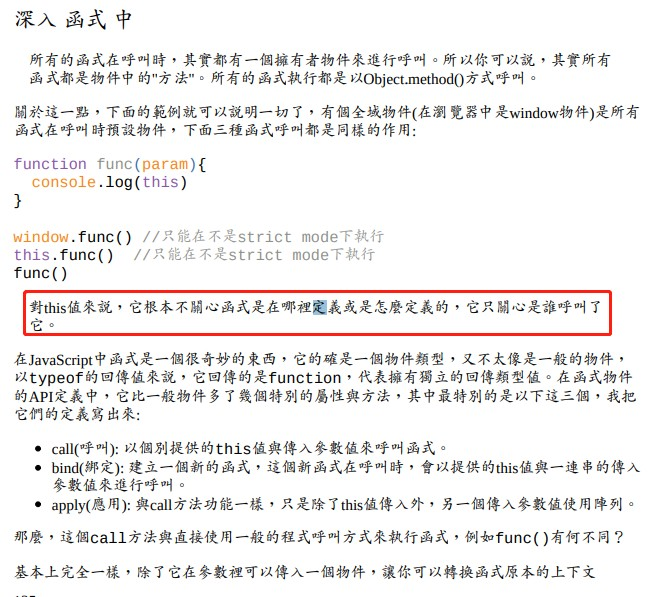

JavaScript的ES6写法

<!-- more -->

### 66 设置默认参数

### 67 arguments

### 70 let (block scope) if、for、switch、while等等，都可以劃分出作用範圍

### 101 对象拷贝Object.assign()

### 101  Object.assign替换JSON.parse(JSON.stringify(aObj))

### prototype

### this 指向调用者对象，比如方法的调用者windows对象

### 對this值來說，它根本不關心函式是在哪裡定義或是怎麼定義的，它只關心是誰呼叫了

