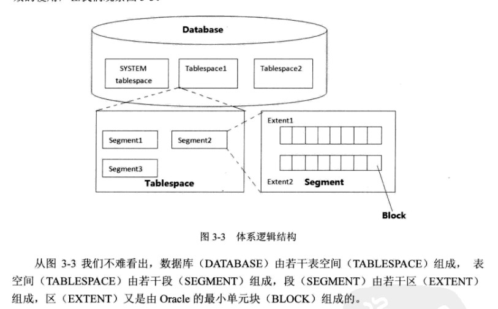

国内写数据库写的最好的一本书，不像其它写数据库的书非常枯燥的教你写各种查询命令，而是从日常生活中引出数据库，通过示例一步一步带你走进数据库的世界，逻辑严谨，原理讲的非常透彻，同时文章生动幽默。


<!-- more -->

### oracle体系结构图








### 2.1 物理体系


#### 2.2


#### 2.3 SQL指令描述




#### 2.4 日志缓存区




#### 2.5 commit逻辑








#### 2.6 一致读


#### 2.7 LWGR日志写入时机


### 3.0 逻辑体系








#### 回滚表空间可以建多个，并且自由切换，但是当前使用的只能有一个






#### oltp下，块太大，容易导致大量并发查询及更新操作都指向同一个数据库，从而产生热点块竞争


### 4.0 表设计之五朵金花


#### 普通堆表不足之处


#### truncate与delete对比




#### 分区表优势


#### 全局临时表








#### 分区表














#### 索引组织表


#### 簇表


#### 分区表的类型有范围分区，列表分区，hash分区及组合分区4种


#### 分区表的索引分为全局索引和局部索引


### 5.索引


#### 5.1索引结构图


#### 如果查询返回绝大多数数据不如全表扫描


#### 是否创建分区索引，看查询是否用到分区条件


#### 索引三种查询方式




#### 联合索引




#### 聚合因子




#### index fast full scan 和index full scan


#### 


#### 索引对三种语句的影响


#### 索引三大特点


### 6






### 7



