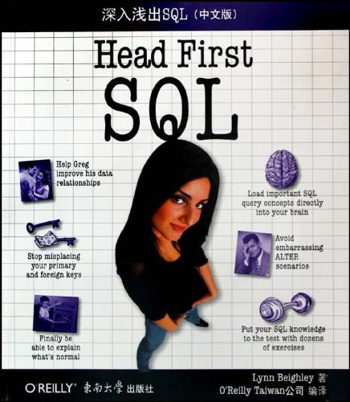

Head First通俗系列入门书籍之SQL，配图文，入门值得看


<!-- more -->

### NULL







### 不等于


### like 下划线只是一个未知字符的替身


### BETWEEN等于使用 <=加 >=,但不等于 < 加 >


### NOT 一定要紧接在where后面




### 多对多的关系时创建连接表




### NOT EXISTS


### INNER JOIN == LEFT OUTER JOIN?




### 自引用外键


### 自联接


### union和union all,数据叠加






### 选择连接还是子查询

