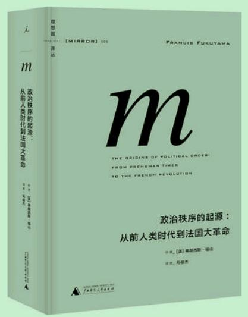

国家建构，法治，问责制三角均衡


<!-- more -->

## 

- > 战争制造国家”，中国是最早最经典的例证：春秋战国时期的几百年征战给当时的各地君主带去“国家建构”压力——唯有那些能够最大程度军事动员、控制和管理生产以及汲取社会资源的政权能够“适者生存”。于是，集权最成功的秦国“脱颖而出”，并在征服其他国家后将这一“秦国模式”推广到整个中国。

- > “国家建构”越成功越好吗？显然不是。在书中福山一再指出，只有当国家建构与法治、问责构成平衡时，一个国家的政治发展才构成“现代政治的奇迹”。而“一个没有法治和问责制的强国家相当于专制。它越现代和制度化，其专制就越有效”。 （参见本书第137页）秦国所建立的中央集权制度，被其称为“极权主义的原型”

- > 就那些转型中的国家而言，是国家能力的薄弱令民主化过程常常成为失序化过程。即使是那些相对成熟的民主国家，国家能力的削弱也使其民主制陷入危机

- > 现实政治形势的演化使他越来越担忧，在国家能力、法治和问责的“三角关系”中，人人过于强调前者对后二者的伤害，却往往忽视国家能力同时往往也是建设法治和民主的前提

- > 他对哈耶克所说的“自发扩展秩序”表示异议

- > 至少在中国，不少“国家主义者”为福山的问题意识转向感到欢欣鼓舞。但对《起源》一书真正严肃的阅读会使我们认识到，与其说福山试图用《政治秩序的起源》去否定《历史的终结》，不如说他试图用《起源》去完善《终结》。

- > 法治与问责使国家能力的发展变得“有价值”。对比政治发展的三个维度，我们会发现，由于法治原则中的平等和公正精神、问责原则中的自治与参与精神，这两个维度具有内在价值，相比之下，国家能力则仅仅具有“工具价值”——几乎不会有人认为不顾及民众死活的“强大政府”是令人尊敬的。也就是说，只有当国家能力这种“工具”服务于具有内在价值的事物时，我们才能把它视为褒义的“政治发展”

- > 民主的失败，与其说是在概念上，倒不如说是在执行中。世界上大多数人极向往这样的社会：其政府既负责又有效，民众需要的服务能获得及时和高效的满足。

- > 现实世界中的共产党政权，恰恰做了与马克思预测相反的事。它们建立庞大且暴力的国家机器

- > 我们视政府的存在为理所当然，以致忘记它们有多重要、重建它们有多难、缺乏基本政治制度的世界会有多大的不同。

- > 政治制度是必要的，不能被视为理所当然。你“叫政府让开”后，市场经济和富裕不会魔术般出现，它们得依赖背后的产权、法治、基本政治秩序。自由市场、充满活力的公民社会、自发的“群众智慧”，都是良好民主制的重要组件，但不能替代强大且等级分明的政府

- > 1.国家（the state）2.法治（the rule of law）3.负责制政府（accountable government）

- > 国家功能是集中和行使权力，要求公民遵从法律，保护自己免遭他国的威胁。另一方面，法治和负责制政府又在限制国家权力，首先迫使国家依据公开和透明的规则来行使权力，再确保国家从属于民众愿望。

- > 国家、法治、负责制政府的组合一旦出现，证明是高度强大和极富吸引力的，之后传播到世界各个角落。我们必须记住，这一现象仅是历史上的偶然。中国有强大国家，但没有法治和负责制政府；印度有法治，现又有负责制政府，但传统上一直缺乏强大国家；中东有国家和法治，但阿拉伯世界的大部已扔掉后者。

- > 由此说明暴力对政治发展的重要性

