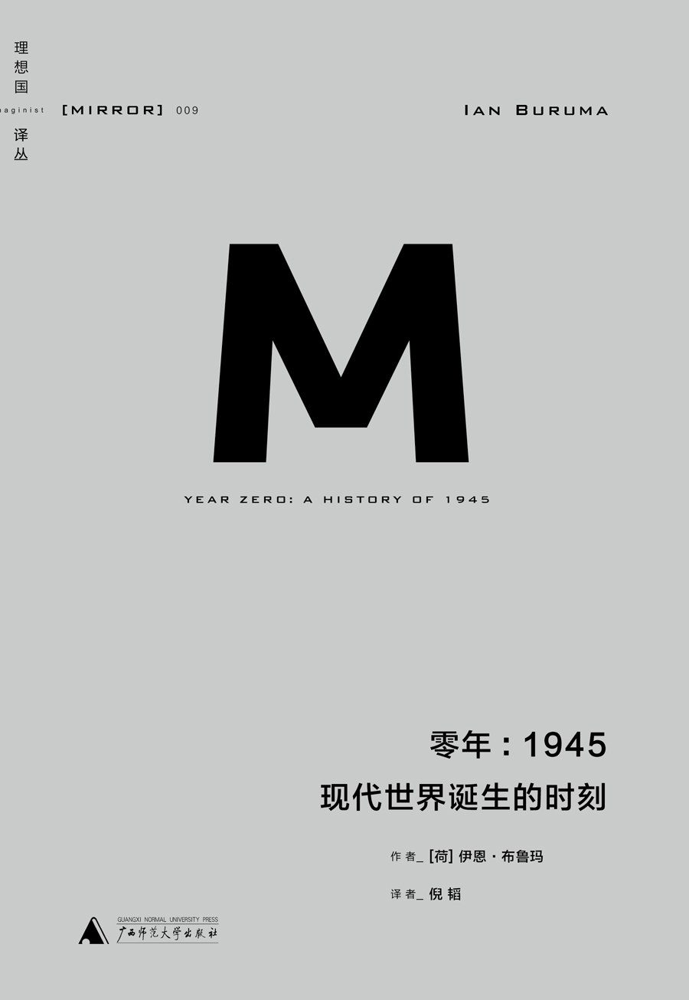

二战胜利后的时刻


<!-- more -->

- > 如今，比任何时刻，香港都感觉像一座没有过去、也没有未来的城市，它只有一个狂热的现在

- > 1945年夏，盟军士兵在被解放国家的经历也许可以同二十年后甲壳虫乐队造访这些国家时的情况相提并论

- > 日本政府和军部的宣传机器从没有停止过吓唬国民，说是一旦日本战败，妇女就会遭到外国军人奸淫、折磨甚至杀害。为了避免这种可怕而耻辱的命运，日本人被命令要么战死，要么玉碎。太平洋岛屿和冲绳的妇孺被勒令拉响手榴弹，或者跳崖自尽。很多人照做了