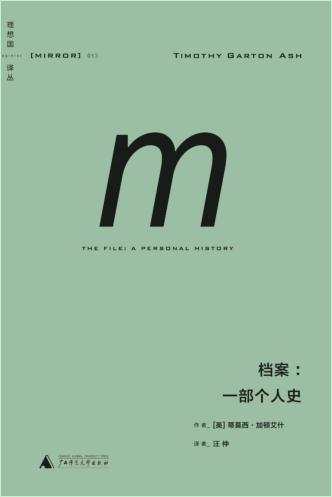

东德告密组织斯塔西搜集的个人档案，人人告密的社会，告密的人可能就是睡在你旁边的人，太恐怖了，人人互相检举揭发，这种情况是不是很熟悉，伟人还是伟人，从二十四史中学习权谋之术，一步一步当上帝位，整人从来不亲自动手，然后从邻国科技发展和奴民之术全面复制，学习能力很强


<!-- more -->

## 

- > “斯塔西”大概是人类史上网络发展得最庞大也最严密的国安机构，其正式雇员就有97000人，非在职的线民更有173000人。若以东德人口估算，平均每50个成年人当中，就有一个和斯塔西相关，若非直接替它工作，便是间接为它服务。在这样的一张大网底下，当年东德老百姓的生活真可谓无可逃于天地间。

- > 中国人总是喜欢比较德国和日本，夸奖前者坦白对待纳粹的罪行，却又总是有意
  > 无意地忽略了他们近二十年来在处理东德历史上的细致（尽管很多德国人还是认为做得不够彻底）。

  > 无意地忽略了他们近二十年来在处理东德历史上的细致（尽管很多德国人还是认为做得不够彻底）。

- > 东德之所以能够建立起如此惊人的秘密警察系统，是因为它有一个在纳粹时代打下的告密文化基础，所以德国不认真清算自己的历史是不行的

- > 恐惧，乃是这种体制的基石。它的双重性质要求国民也要以双重态度来对待它，在表面上爱它爱得要死，在心里则怕它怕得要死。结果是一群表里不一、心中多疑、彼此提防的原子化个体；这就是它的深层腐败，东德政权大厦的散砂地基。

- > 自古以来，几乎任何文化都找不到把背叛和出卖看作德目的价值体系。尤其中国，例如孟子那句名言：“舜视弃天下犹弃敝蹤也，窃负而逃，遵海滨而处，终身訢然，乐而忘天下”，可见儒家绝对不能接受对任何天然情感联系的背叛。

- > 于是每一个告密者都能为自己的脆弱找到最大义凛然的理由，让自己安心；每一个出卖过其他人的，也都能在事后多年把往事推给那个时代的道德错乱。

- 

- > 只有那些头脑冷静、心底温暖、手脚干净的人，才能成为契卡人

