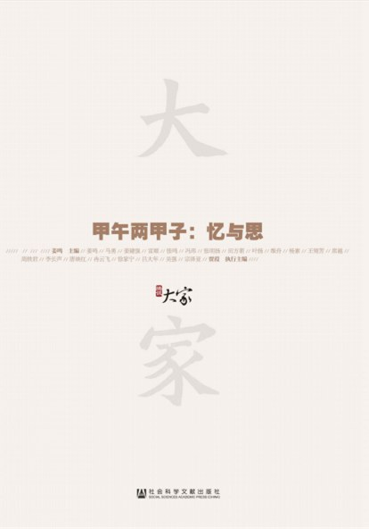

今年是甲午年，发生在1894年的中日甲午战争，距今整整两个甲子了。岁月远去，伤口也渐渐抚平。中国在甲午战争中为什么失败，中国的第一次现代化努力为什么没有成功，却是中国人必须思考的问题，也是纪念甲午战争两甲子的宗旨所在。



<!-- more -->

2020年5月2日

维　度

《尚书·禹贡》把天下分为五个同心而具有阶级性的地区，分别是甸服、侯服、绥服、要服、荒服。夷夏对举始于西周，有四夷、八蛮、七闽、九貉、五戎、六狄之说，严夷夏之辨却是春秋时期。约至春秋时期，“夏”和与其相对的“狄”“夷”“蛮”“戎”“胡”等（后简称“狄夷”或“夷”）概念的使用开始突破地域范围，主要用于区别尊卑上下、文明野蛮、道德与非道德。“华夏”代表正宗、中心、高贵、文明、伦理道德；“夷”则代表偏庶、边缘、卑下、野蛮、没有伦理道德，尚未脱离兽性。 这种居高临下俯视其他文明、文化的华夏中心论在处理、对待与他国的关系中，制度化为以中国为宗主、他国为藩属的“宗藩体制”，或曰“朝贡体制”，以此规范“华夷秩序”。这种“华夷秩序”中，中国的“皇帝”是承受天命的“天子”，“天子”是最高的道德“天道”在人间的化身、代表，代“天”来执政“天下”

费孝通 阶级秩序

2020年5月2日

维　度

登舰之后首先注意到的是，舰上已经没有以前来访时摆放过的关公像，以及塑像前各种燃香，没有了过去那种焚香的气味。过去，甲板上会丢有散乱的残剩食物，水兵的行为也无纪律，而此次这些不体面的情况均已杜绝。

2020年5月2日

维　度

可见，鸦片战争中国的败北，给日本一个直感就是这个古老帝国已自身难保。再效法它的话，自己岂不也要被西方殖民？必须抓紧变革，必须脱亚入欧。于是明治维新的帆船迅速起航。

2020年5月2日

维　度

战争刚结束血迹还未干，被日本人打败了，又死了那么多人。照现在的民族主义者心情来看，应该记住仇恨，不忘雪耻才是，怎么还能跑到日本，接受日本人的招待与援助？退一步说接受招待与援助也就罢了，怎么还发表演说与文章，说日本是“模范”，是“目标”，是学习的“榜样”？原来这就是一位革命家的政治视野了。实际上球是圆的，牌也有多种出法。对孙中山来说当时“终二千年帝制”是其目的，为了达成目的，手段就是个选项问题了。辛亥革命最终成功推翻帝制，日本也就成了孙中山的“基地”与“福地”。这就是历史纠缠于人的地方。这样看来孙中山之所以被誉为“中国革命之父”，不就是他比别人看得更远些更高些吗？要说爱国主义，这就是最大的爱国主义，要说民族主义，这就是最值得赞赏的民族主义。

2020年5月2日

维　度

1644年，满清入关、定鼎中原，开始进入“华夏”、成为“天朝”的继承人因而理所当然地成为“华夷秩序”世界中的“天下共主”。在乾隆、嘉庆两朝《会典》，包括葡萄牙、意大利、英国在内的“西洋”，也被列入朝贡国家。虽然这些“西洋”国家并未向中国进贡，但反映了当时的中国对世界的看法。

2020年5月2日

维　度

由《马关条约》获得的总计2.3亿两库平银（约相当于日本当时年度财政收入的4.87倍），则为推行这一路线提供了物质基础。这一在日本被称为“日清战后经营”的路线，对其以后的侵略扩张，产生了重大影响。

2020年5月2日

视　野

2013年，中国在伊拉克的所有外国投资中，占到70%，

2020年5月2日

星期ONE

这两天北京大学的孔庆东教授就堪称示范，他不仅轻信一则谣传的北大女生驳斥奥巴马夫人的段子，还煞有介事地骄傲地给予义正词严的评论。而确认一下信源，只需要花费2分钟。 为什么会这样？因为谣传的段子太符合孔教授内心的期盼和渴望。

2020年5月2日

星期ONE

布什说：“我们准备干掉400万伊拉克人和一个修单车的。”CNN记者：“一个修单车的？！为什么要杀死一个修单车的？”布什转身拍拍鲍威尔的肩膀：“看吧，我就说没有人会关心那400万伊拉克人吧。”

2020年5月2日

星期ONE

为什么有些人比另一些人更容易相信和传播阴谋论呢？这起码跟两个因素有关：先天的大脑和后天的教育

2020年5月2日

大家书评

有文献表明，中国自杀率是世界平均水平的2.3倍，每年自杀人数平均28.7万。而1990年以来，中国妇女的自杀率从十万分之十三稳步上升到十万分之三十左右，妇女的自杀率超过男性25%，这一现象世界仅有，而且中国妇女每年自杀人数占世界每年自杀妇女总和的56.6%（1999年）。其中，农村妇女的自杀率又是城市妇女自杀率的三倍。无论是否可用严重的相对剥夺感来解释女性的受压迫状况、导致自杀这一最极端的自我暴力的主因，农村妇女的高自杀率本身很大程度上都可自我解释为来自家人和亲戚等血缘关系的压力。

2020年5月2日

大家书评

1987年开始的“扫黄”运动延续至今，成为1949年后延续时间最长的国家暴力动员，也是持续时间最长的严打运动。