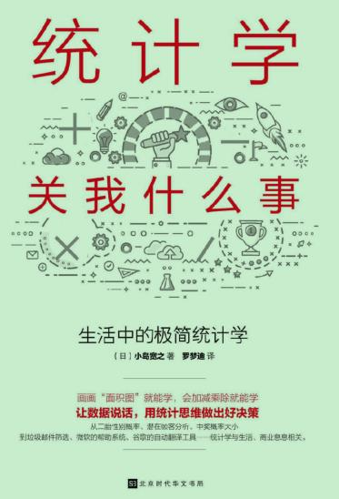
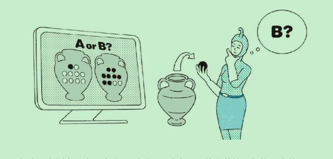
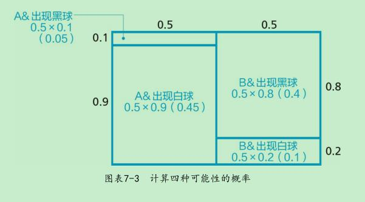
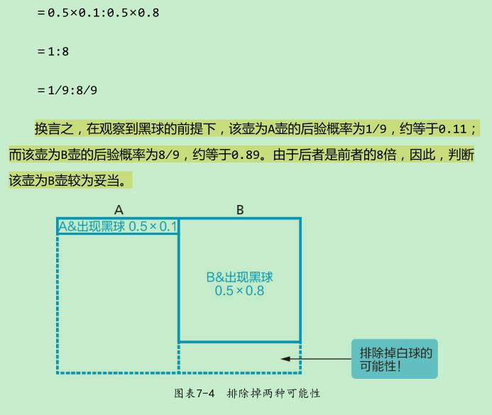
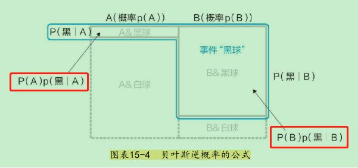
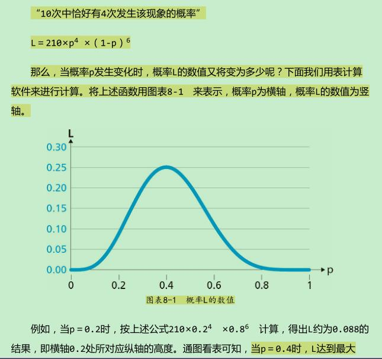

贝叶斯原理讲的最透彻的书,书简单易读，但是贝叶斯原理说清楚了，学贝叶斯必看书籍



1.

面前有一个壶。虽然我们知道这个壶不是A壶就是B壶，但仅从外观上，完全无法确定究竟是A壶还是B壶。同时，我们还知道：A壶中有9个白球和1个黑球，B壶中有2个白球8个黑球。现在，如果从壶里取出一个球，结果是黑球，那么，眼前这个壶究竟是A还是B呢？

已知拿到一个黑球，要么从A中取出，要么从B中取出，从A中取出黑球的概率和从B中取出的概率面积之比为

P(A)p(黑|A) : P(B)p(黑|B)

#### 2.极大似然原理

标准统计学与贝叶斯统计学的共通之处，在于一种被称为“极大似然原理”的思考方式。简单来说，“极大似然原理”的含义就是：世界上正在事件，之所以发生，是因为它发生的概率大。

为何要将发生次数的平均值作为该现象发生概率p的推断值呢？仔细想想，“在这几次当中，该现象发生了几次”与“该现象发生的概率”，其实并没有直接的关联。而为其添加理由的时候，就是运用了极大似然原理。

#### 3.蒙蒂霍尔问题

面前有A、B、C三道帘子。其中一道帘子后面停着一辆轿车作为奖品。你需要在这三道帘子中任选一道，如果揭开帘子，后面有轿车的话，那么轿车就归你所有了。而当你选择了A帘之后，主持人会从剩下的两道帘子中，选择B帘打开，而B帘后面并没有轿车。这时，主持人会问你：“现在只剩下你所选的A帘和尚未打开的C帘这两种选择了，那么现在你要不要改变主意呢？”这时，你认为该不该改变最初的选择呢？

想法1： 因为汽车一定藏在A帘和C帘这两者之一的后面，所以概率也变为了两种可能性各占一半。因此，A帘后藏有汽车的概率从1/3上升到1/2。

想法2： 即使知道了B帘后面没有汽车，A帘后面藏有汽车的概率仍然不会变化。因此，A帘后藏有汽车的概率仍然是1/3不变。而这同时意味着，C帘后藏有汽车的概率从1/3上升到了2/3。多数人会选择上述两种想法中的前者，而二者区别的关键在于：究竟是A和C的概率同时发生变化，还是仅仅C的概率发生了变化。随着B的可能性被排除，那么理所当然地，A和C的概率至少有一个会发生变化（标准化条件），而问题是究竟是其中只有一个发生了变化，还是两者都发生了变化呢？

在你选出某1张彩票的时刻，它是不是头奖就已经是固定不变的事实了，后来发生变化的只是“你的主观推测值”。 既然是主观的东西，那么答案自然不止一个了。

因为“A帘的后验概率为1/3，C帘的后验概率为2/3”的结果，毫无疑问依存于模型的设定

**答案是，在你选择了1号门之后，蒙提·霍尔就不能再打开它了——他本可以打开2号门，但他没有这样做，而是打开了3号门，这一事实表明他很有可能是不得不这样做的，因为2号门后面可能是汽车。因此，我们就有了比之前更多的证据表明汽车在2号门。这是贝叶斯分析的一个普遍主题：任何通过了威胁其有效性的测试的假设，其可能性都会变得更大。威胁越大，幸存下来的假设的可能性就越大。2号门很容易被驳斥（蒙提本可以打开它），而1号门则不然。因此，2号门后面更可能是汽车，而1号门后面则更可能不是汽车，汽车在1号门后的概率仍是1/3。**

来源《为什么》（图灵奖获得者、贝叶斯网络之父集大成之作）

还有一种理解，你选择了1号门，如果蒙提·霍尔不打开任何门，再给你一次重新选择的机会，此时每个门的后面有车的概率仍然为1/3，