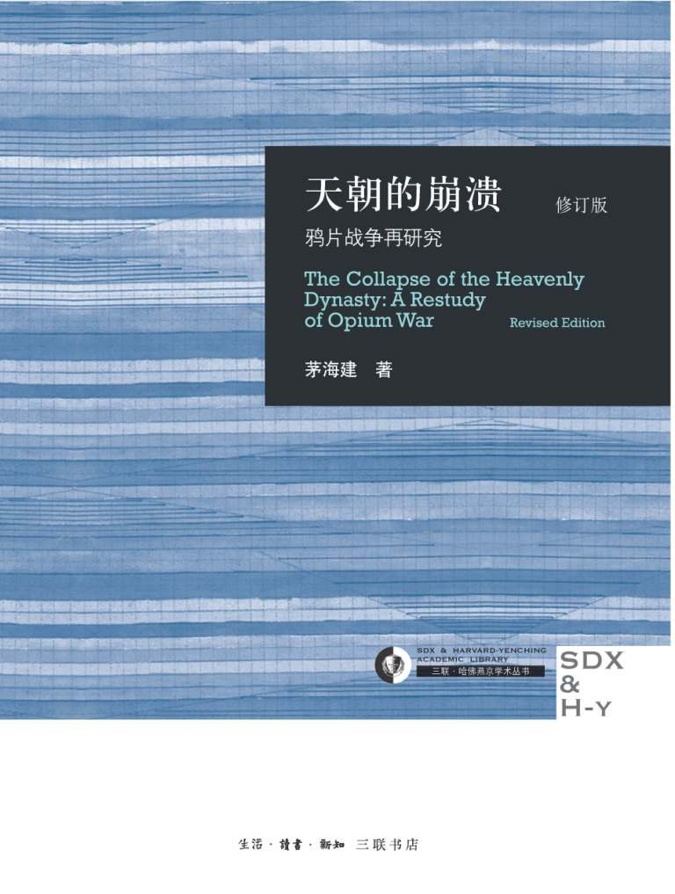

《另一眼看鸦片战争》推荐过来，   另一个角度看鸦片战争，事情是如此的复杂而我们的教科书就简单截取片段来宣传爱国主义，真相从来不是简单的好坏和黑白，联想到《后真相时代》一书，我们看到的真相到底有多真，感谢作者给了我们另外一个视角。



## 

- > 绪 论 由琦善卖国而想到的

  - > 至鸦片战争前夕，中国确确实实是落后了。但是，由于文化背景的不同，英国最先进的事物，经过儒家教义的折光，顿时变为最荒谬不堪的东西。君主立宪，在皇权至上面前，有如大臣擅权；经商贸易，在农本主义面前，显为舍本求末；追逐利润，在性理名教面前，只是小人之举；至于女王主位、男女不
    > 辨，更是牝鸡司晨之类的“夷俗”；即便令人兴叹的西方器物（钟表、玻璃、呢羽等），享用赏玩收藏之余，仍可斥之为“坏人心术”的“奇技淫巧”。无怪乎海通200余年后，中土的官僚士子们并未折服于西方，反坚信于中华文物制度远胜于“西夷”，尽管他们在一个事实方面已经达成了共识：西方“船坚炮利”。

    > 辨，更是牝鸡司晨之类的“夷俗”；即便令人兴叹的西方器物（钟表、玻璃、呢羽等），享用赏玩收藏之余，仍可斥之为“坏人心术”的“奇技淫巧”。无怪乎海通200余年后，中土的官僚士子们并未折服于西方，反坚信于中华文物制度远胜于“西夷”，尽管他们在一个事实方面已经达成了共识：西方“船坚炮利”。

  - > 在皇权至上的社会中，天子被说成至圣至明，不容许也不“应该”犯任何错误。尽管皇帝握有近乎无限的权力，因而对一切事件均应该负有程度不一的责任；但是，当时的人们对政治的批判，最多只能到大臣一级。由此而产生了中国传统史学、哲学中的“奸臣模式”：“奸臣”欺蒙君主，滥用职权，结党营私，施横作恶，致使国运败落；一旦除去“奸臣”，圣明重开，万众欢腾。这一类模式使皇帝避免了直接承担坏事的责任，至多不过是用人不周不察，而让“奸臣”去承担责任，充当替罪羊。若非如此，将会直接批判到皇帝。这就冲犯了儒家的“礼”，是士人学子们不会也不愿去做的。

  - > 历史学最基本的价值，就在于提供错误，即失败的教训。所谓“以史为鉴”，正是面对错误。从这个意义上讲，一个民族从失败中学到的东西，远远超过他们胜利时的收获。胜利使人兴奋，失败使人沉思。一个沉思着的民族往往要比兴奋中的民族更有力量。历史学本应当提供这种力量。

- > 第1章 清朝的军事力量

- > 第2章 骤然而至的战争

  - > 就在这一天上午，钦差大臣林则徐接到义律的禀帖，表示愿意交出鸦片。林为此而松了一口气，自3月18日以来与外国商人的对抗，总算是有了结果。但是，他和他的同事们都没有意识到，驻华商务总监督给钦差大臣的第一份禀帖[69]，改变了林则徐使命的性质，即由针对境内外国人的反走私行动，变成中英两国官员间的交涉。

  - > 同是在这一天，林则徐还收到商馆里各国商人集体签名的禀帖，声称林则徐谕内所指各事，多涉紧要，难以理论，因此禀恳林则徐找他们的领事、总管“自行办理”。林也没有发现其中的奥秘。此后各谕令，不再绕过行商，也不再直接对着外国商人，而是发给他们的领事或总管。[70]也就是说，从这一天之后，林则徐面前的对手，不再是作为个人的外国商人，而是站在他们背后的各国政府，尤其是英国政府。这就犯下了第一个错误。

  - > 义律代表鸦片商人缴出鸦片，并不意味着将遵循中国的法令，而是将鸦片商人的货物变为英国政府的财产，图谋以此为由向中国发动战争。

  - > 林则徐从其翻译资料中，已经了解到从事鸦片贸易的英国商人的大体背景，他曾在奏折中作过分析，认为这些毫无官方背景的散商绝无左右政府之
    > 能量

    > 能量

  - > 处在失败中的人们，找不到胜利的迹象，最容易产生某种希望。林则徐就是这种希望。而且，局势越危急，战争越失利，这种希望之火就越放光芒。
    > 由此，一个神话诞生了。一个林则徐不可战胜的神话，占据了当时许多人的心，并流传至今。

    > 由此，一个神话诞生了。一个林则徐不可战胜的神话，占据了当时许多人的心，并流传至今。

- > 第3章 “剿”“抚”“剿”的回旋

  - > 琦善主“剿”信念动摇的主因，在于目睹英军的“船坚炮利”，自忖不敌，这是英方完全可以想见的并希望达到的效果。而道光帝主“抚”意向的萌生原因，却是英方无论如何也猜不到的，据蒋廷黻先生的发现，竟是巴麦尊照会的翻译问题。[45]尽管巴麦尊对其照会的汉译提出了详尽严格的要求，[46]但该文件的第一句话的翻译就有严重错误。道光帝看到的汉译本为：兹因官宪扰害本国住在中国之民人，及该官宪亵渎大英国家威仪，是以大英国主，调派水陆军师，前往中国海境，求讨皇帝昭雪伸冤。[47]对照英文，“求讨皇帝昭雪伸冤”一语，原为“demand from the Emperorsatisfaction and redress”[48]，若直译为现代汉语，当为“要求皇帝赔偿并匡正”。此外，该文件还多处将“匡正”译为“伸冤”，“抗议”（protest）译为“告明”，“赔偿”译为“昭雪”，“要求”译为“催讨”，等等不一。如此重要的文件如此译法，实为难解之迷。[49]前面已经提及，道光帝除此照会外，还收到琦善进呈的懿律“咨会”中有“以致冤情无能得以疏闻”和琦善奏折中称英军军官的“负屈之由，无以上达天听”的言词。所有这些，使英方的表现显得“情词恭顺”。毫无疑问，这些卑下的文句颇合“天朝”大皇帝的脾胃，使得道光帝由此居然将领兵上门要挟的敌凶，看作上门“告御状”的“负屈”外藩。

  - > 这里面有必要分清两个问题：一是对侵略者应不应抵抗；二是若这种抵抗注定要失败，是否仍应抵抗。前者是道德层面的，结论是肯定的，没有疑义。后者是政治层面的，结论不能从前者引申而来。思想家与政治家的区别正在于此（我拟在第八章中作专门讨论）。既然正义的反抗并不能取胜，那么，避免无谓的牺牲也是可以的。

- > 第4章 广州的“战局”

  - > 在此，道光帝将琦善对军情的如实陈词，统统当作“妄称”的虚情，“要挟”道光帝的“危言”，并予以道德的斥责。这实际上也下了一道钳口令，封住了杨芳和奕山的嘴巴：不仅不许败，而且不许言败。这就把杨芳和奕山推上绝路，他们面前只有一条出路——捏谎

  - > 与琦善相比，杨芳的违旨行为不知严重多少倍。琦善奉旨主“抚”，始终不肯与英人签订条约。杨芳奉旨主“剿”，却擅与英人达成停战协定。可杨芳的结局又不知好过琦善多少倍。这里面的关键，在于如何上奏。

  - > 奕山与他的前任相比，无疑要幸运得多，林则徐是大体诚实的，此时被罪而遣戍伊犁（后改河工效力）；琦善也是大体诚实的，此时被罪在京城受审（后判斩监候）。广州的三位钦派大员，以当时的是非标准来看，奕山的罪孽最重，但却获得交部优叙、白玉翎管等赏赉。不仅仅如此，就是此次广州之败，奕山还保举了“出力”文武员弁兵勇共计554人优叙、升官、补缺、换顶戴！[114]战败后的广州，并没有像通常那样死气沉沉，而是上上下下都喜气洋洋地互贺升迁。这些得利的554名有关人员（几乎囊括当时在广州的全部官员），又如何能不结成死党，竭力维护奕山的谎言呢？谎言使是非颠倒，赏罚颠倒。就此功利的角度来看，清王朝若不变成一个谎言世界，那才真是咄咄怪事呢。

  - > 三元里体现了一种什么样的精神？最近几十年的宣传，将之提升为人民群众（或中华民族）的民族主义、爱国主义的精神展示。

  - > 我在本节的起首就专门讨论并判明了三元里民众抗英的起因——英军的暴行。这一起因的真正意义在于：三元里等处民众进行的是一次保卫家园的战斗，而不是投身于一场保卫祖国的战争，尽管其中的某些士绅，有着传统民族主义色彩的号召，但他们着力的重点且最具影响力的，仍是对保卫家园的宣传。保家战斗与卫国战争，在观念上的区别是显而易见的，无需过多的分析。就行动而言，前者只可能发生于英军肆虐的地区，如广州郊区，但在广东其他地区或广东的邻省，就不会产生民众的自觉，更何况后者是一场全国民众奋然投身的热浪冲天的壮剧。

  - > 英方的文献又为我们提供了另一种场景。在整个鸦片战争期间，英军虽有一时的供应不足之虞，但在总体上不觉困难。一些民众向他们出售粮食、畜禽、淡水，以图获利，另一些民众为他们充当苦力，从事运输，以求工值。这些被清方文献斥为“汉奸”的民众，在交战地区几乎无处不有。至于英军在行进甚至开战之时，成群的民众躲在远处观看这难得一见的“西洋景”，更是在英方文献中屡见不鲜。中国的历史长达几千年，中国的老百姓在历史的变迁中对诸如改朝换代之类的重大变动都习以为常。只要不触动他们的眼前利益，逆来顺受又成为另一种传统。谁当皇上就给谁纳粮。满清的皇帝也未必比浮海东来的“红毛”统治者，更为可亲可爱。在三元里抗英事件之前，英军曾统治舟山长达半年，虽有俘获安突德的义民，而绝大多数还是作了顺民甚至“良民”。但是，民众的利益一旦受到侵犯，如三元里一带的棺榇被开，财物被掠，妻女被淫，情势就立即发生变化。他们的愤怒转瞬间化作以牙还牙的武力相抗，如同千百年来因讨生无计而被迫“造反”一样。如果我们抽去侵略这一特定的内容，可以看出，三元里民众抗英在许多形式上类似于“官逼民反”。

  - > 因此，我们不能将保卫家园的战斗，与保卫祖国的战争混同起来，尽管家与国之间有着很深沉的联系。况且，保卫家园亦有其他形式，在鸦片战争
    > 后期，江南的官绅们主动付给英军“赎城费”，乞求他们不要骚扰本境，如同对待乱世中横行作恶的土匪一样。他们的做法与三元里截然对立，也有是非之别，但旨趣却有相通之处，即保卫家园。

    > 后期，江南的官绅们主动付给英军“赎城费”，乞求他们不要骚扰本境，如同对待乱世中横行作恶的土匪一样。他们的做法与三元里截然对立，也有是非之别，但旨趣却有相通之处，即保卫家园。

  - > 在鸦片战争以及后来的诸次列强侵华战争中，绝大多数民众的基本态度，是置身事外。中国近代具有真正意义的民族战争、卫国战争，实始于本世纪30年代发生的抗日战争。

- > 第5章 东南壁垒的倾塌

  - > 于是，余步云如同琦善一样，成为大清朝的另一名“奸臣”。本来由个人意气、政策分歧而引起的裕谦、余步云之间的矛盾，变成了“忠”“奸”矛盾。而且，若不是“奸臣”的破坏，“忠臣”的抵抗（镇海之战）是很有可能成功的。
    > 因此，余步云被时人及后人如此定性，并非出自于史料，而是出自于排列史料的思想。[144]也正是由于这种思想，在虎门之战的“奸臣”琦善、镇海之战的“奸臣”余步云之后，我们还会看到吴淞之战的“奸臣”牛鉴。与之相对立的是，关天培、裕谦、陈化成的精忠报国。余步云的真相由此而被遮盖了。

    > 因此，余步云被时人及后人如此定性，并非出自于史料，而是出自于排列史料的思想。[144]也正是由于这种思想，在虎门之战的“奸臣”琦善、镇海之战的“奸臣”余步云之后，我们还会看到吴淞之战的“奸臣”牛鉴。与之相对立的是，关天培、裕谦、陈化成的精忠报国。余步云的真相由此而被遮盖了。

- > 第6章 “抚”议再起

  - > 他需要了解的太多了，一下子开出这么多问题。可见他的焦躁，又可见他的浅薄。“天朝”大皇帝本不屑于过问“夷”事，此时俯查“夷”情，姿势自然可笑，多少又有那么点进步的意味。可是，他似乎并不知道，他最为困惑的地理问题，[83]正是他最有资格回答的。我们今天尚能看到的由传教士南怀仁为他高祖父康熙帝绘制的当时中国最精美的世界地图——《坤舆全图》，此时正在紫禁城的库房里睡觉。

  - > 尽管如此，英军在攻占乍浦时付出的代价却远远超出了厦门、定海和镇海，共有9人毙命，55人受伤，为鸦片战争历次战斗的第3位。

  - > 在“天朝”的历史上，对外交涉本是大皇帝的专权，任何臣子都不得擅专，即所谓“人臣无外交”。因而当时根本不可能有“全权”的职差，恐怕当时人连“全权”的概念都没有。

- > 第7章 平等与不平等

  - > 中西关系是特别的。在鸦片战争以前，我们不肯给外国平等待遇；在以后，他们不肯给我们平等待遇。

  - > ［释评］ 此项交涉的利害关系实在太重大了，我不得不照引全文。耆英和刘韵珂一样，如何处理通商口岸的民、“夷”纠纷而不引发衅端，成为其心头大患。为了简单明了且一劳永逸地解决此难题，他干脆将对英人的审判权主动拱手予英方。在他看来，如此中英各司其民，就不会再出现诸如林维喜案那样令人头痛的麻烦了。耆英由此铸成大错！

  - > 由上可见，尽管耆英对南京条约的内容并不满意，尽管他也主动找英方交涉以作补救，但从十二项交涉中，我们找不到能挽回中国利益之处，即使是违反南京条约的第一、第十一项，若以今日标准度之，也毫无益处，而整份照会反潜藏着对中国利益的极大损害，其中第八项又是近代中国治外法权之滥觞。一个半世纪后的今人，完全有理由指责耆英，埋怨他不应有如此拙劣的外交，但问题仅仅出在耆英一人身上？与此同时，北京的道光帝不是正式谕令、杭州的刘韵珂又在暗谕他去交涉？耆英的十二项交涉的后果是非常严重的，但将之与刘韵珂信函中十个问题、道光帝前后谕旨中九项指令比较，能分出高下吗？

  - > 然而，鸦片战争虽然击碎了“天朝”的威严，但“天朝”的观念却不能随之更换。即便是对战败体会最深，已从“天朝”梦幻中探出头来的耆英者流，手捧南京条约，迷迷然，感到面对着一大堆全新的难题。原先“夷人”的去处仅为一地——广州；其居住活动范围是有限的——商馆；交易的商人是指定的——行商；接触的民众是少量的——仆役（包括买办）；管理的手段是间接的——经过行商……现在，这些限制统统没有了，那又怎么管理这些桀骜不驯嗜利如命的“夷人”呢？我们若从这种思路一直追到最深处，就遇到了中西社会背景和文化观念的差别。在西方，商业活动已不再受官方的具体管制，商人只需遵从法律即可；而从保甲编氓层层至宝塔尖大皇帝的中国传统社会，每一个人都在官府治理的网络之中，很难想象脱离这种治理之民。国家设官治民。既然中国官府无法治理这些英人，把他们交由英国官府来治理也不失为一种办法。耆英
    > 放弃对英人的审判权，在这种思路上几乎是顺理成章的，尽管这种思路本身应别作评价。

    > 放弃对英人的审判权，在这种思路上几乎是顺理成章的，尽管这种思路本身应别作评价。

  - > 此时耆英的目光，又盯在顾盛手中的一纸国书上。尽管顾盛多次保证不再北上，但耆英唯恐其中有诈。他认定：“条约可以在外商定，而国书必须亲赉赴京，故其国书一日未缴，则夷情一日未定。”[96]7月3日，当顾盛终于交出国书后，耆英总算松了一口气，当即与顾盛签订了中美“五口通商章程：海关税则”，又称中美望厦条约。顾盛胜利了！他以一纸国书换来了一项对美极有利益的条约。耆英也胜利了！他阻止了美使进京，消弭了衅端，只是用文字的形式确立了一年前他对美国领事的口头承诺。双方都心满意足地离开了居住17天的望厦村，各向其主子报功去了。只有中华民族须长久地蒙受在这小小村庄中达成的协定而带来的灾难。

- > 第8章 历史的诉说

  - > 日本的事例已经证明：避免交战，减少损失，也是一种明智的选择；即使订立了不平等条约，也不见得必然一味沉沦。失败的民族仍有机会再度辉煌，关键在于战后的奋发。

  - > 除了自杀的裕谦，以上12人均是鸦片战争中负有重大责任的顶级人物。他们对战败体会最深，理应有猛烈的反省，有复仇的欲望。可从这12人战后的经历来看，琦善、伊里布、杨芳、奕山、颜伯焘、牛鉴几乎是没有反应，
    > 剩下的5人又可分3类：一是耆英、黄恩彤的“柔夷”；二是刘韵珂的阴制；三是林则徐的对抗（假定福州反入城事件能代表其全部思想），道光帝则在三者间游移。作出反应的人，大多在通商口岸。我不知道耆、黄、刘等人若放缺云贵川或陕甘新，会否像琦善等人一样麻木？一个民族战败了并不可怕，但战败引出的不是“制夷”而是“顺夷”时，就直接葬送了一切前程。耆英者流之所以在当时就不得人心至今仍受人痛斥，就在于他们不敢“制夷”。

    > 剩下的5人又可分3类：一是耆英、黄恩彤的“柔夷”；二是刘韵珂的阴制；三是林则徐的对抗（假定福州反入城事件能代表其全部思想），道光帝则在三者间游移。作出反应的人，大多在通商口岸。我不知道耆、黄、刘等人若放缺云贵川或陕甘新，会否像琦善等人一样麻木？一个民族战败了并不可怕，但战败引出的不是“制夷”而是“顺夷”时，就直接葬送了一切前程。耆英者流之所以在当时就不得人心至今仍受人痛斥，就在于他们不敢“制夷”。

  - > 鸦片战争结束后的14年，1856年，战火又起。英法联军次第攻占广州、大沽，进入天津、北京。清朝又与英、法、美、俄四国签订了11个不平等条约。与前次战争相比，清朝没有丝毫的进步，完全是重复错误。战后，新兴起的地方军政集团——湘、淮系首领做了一些“师夷”的工夫，导致后来的洋务运动（自强运动）。可是，一查来历，其原动力不是来自战败的刺激，其最初目标也非为“制夷”，而是为了对付那些造反的“长毛”。

  - > 鸦片战争结束后的52年，1894年，经明治维新而疾速发展的日本，打到其先前祖师爷的门前。他们废除了与李鸿章在天津签订的别开生面的前约，让李鸿章至马关另订新约，仿效鸦片战争中的英国，要求割地赔款，并在一切方面享有与西方列强同等的权利。

  - > 鸦片战争结束后的86年，1928年，中英两国政府又在南京签订条约，取
    > 消协定关税。这一份新的南京条约开始了转折。

    > 消协定关税。这一份新的南京条约开始了转折。

  - > 鸦片战争结束后的101年，1943年，中英两国政府在重庆签订条约，废除领事裁判权、军舰自由进入通商口岸、片面最惠国待遇等不平等权利。鸦片战争结束后的142年，1984年，中英两国政府在北京签订联合声明，香港将于1997年降下米字旗，回归中国。

