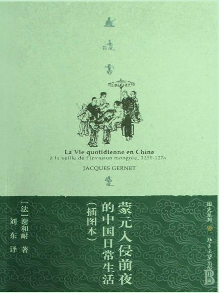

有点意思，书名说明了内容



## 蒙元入侵前夜的中国日常生活 by [法]谢和耐(Jacques Gemet) 

- > 导言

  - > 上流社会几乎总是无一例外地不负责任和一晌贪欢。

  - > 中国崩溃的真正原因其实与道德松弛无关，而似乎更像是在其经济学和社会学的本质之中。有关13世纪中国南方之安定繁荣的印象只不过是幻象。在此幻象背后的，却是国库之连年悲剧性的空虚、农村之贫困和不满，以及统治阶层内部的党争。这座大厦已是十分脆弱，只要蛮族用力地推它一把，就会倒塌下来。

  - > 在中国早已开始了近代化时期，是蒙古人的入使阻断了此一迅速进步的过程。此一时期的显著标志是城市中心和商业活动的突出发展。在不到百年的时间内，杭州居民的人口就翻了一番，迄1275年已逾百万。

  - > 正是公元10世纪至13世纪的来自中亚和今天蒙古一带的野蛮游牧民族的持续不断的压力，才构成了促进中国长江流域和东南省份经济普遍成长的主要动因。

- > 第一章 城市

  - > 除掉大米和猪肉，在杭州居民的食物中就要数咸鱼重要了

- > 第二章 社会

  - > 但这种在欧洲与远东同时表现出来的突如其来的经济活力的增大，却导致了不同的结果。在欧洲，由于划分成了众多的辖区和政权，商人阶级便足可自我维护，使自身的权益受到承认，并形成了自己的实体。城市获得了自主权，市民机构开始出现，城乡对峙变成永久性的现象，再加上资产阶级的兴起——这是构成第三等级的第一步——凡此种种都对西方世界的未来命运产生了重大影响。而在中国，尽管有了如此规模巨大的发展，但除去商人赚足了钱以外，却什么都没有产生。世界的这两个部分有如此不同的演进过程，这该如何解释呢？在中国，从一开始就有一个中央集权政府，任何看上去会威胁到国家之至上权威的变化，都是不可想象的。尤有甚者，宋代文官国家本身还会利用此一时期的活跃经济增长来为自己谋取利益，同时，它还会摇身变成商人，通过专卖制度和对私人交易课税，来获得其大部分岁收。这样，一种中国社会生活的传统形式，同时也是后来使其变得落后的主要原因，便得以永远固定下来了。

  - > 劳动力资源既丰富又便宜，结果导致了高度的专业化分工。就中国当时所达到的财富和技术水准而言，这几乎可以说是发展得过分了。由于有了行会来进行劳动力交换，劳动力市场被组织得井井有条。无论雇主还是被雇者均依赖于行会，没有它的媒介作用什么交易也谈不成（很可能是行会根本不允许任何单独的成交)。

  - > 私人的慈善事业也同样赈恤渴望救助者。大官拜命时则布施所谓“抢节钱”给穷人，以提高其声望。[53]居住在城南凤凰山上的富有船主们，亦曾将其庞大家产的一部分捐赠给慈善机构。不过还远不止这些。从公元5世纪起，佛教就在中国引进和发展了各种各样的慈善机构（医院、安济院、施药局、赈济中心)，此类机构均由被捐田产上的收益来支持。

  - > 要不是以牺牲农村为代价，东南诸路各城市的兴盛就不可能出现。城市的消费量大于其产出，而许多富有的城里人的全部财产都来自他们在杭州以北广大田产上的收益。私人田租和国家地租、日用消费品的交易税、国家在某些地区强制实行的盐业专卖制度——总而言之，凡此种种，无论是直接税还是间接税，都使农村每况愈下。因而，农村人口不断减少，人们都拥向城市。

  - > 在9世纪，每个在山西南部盐池劳作的家庭，只能每天从国家那里领取6.5磅的谷物，再加上每年40贯的现金。[54]后来，在淮河流域地区的盐田，负责盐务的官衙要从被国家以很低工薪雇佣的盐工那里征调食盐，并且规定每年必须交纳的产品总量。在淮河一带的盐田，有将近2.8万个家庭——也就是说有大约10万人口——生活在半奴隶状态

  - > 在大片产米区劳作的小自耕农、佃农和长工，其遭遇也与盐工相去无几。即使收成较好，他们的基本生活需求也不能满足。而一碰上荒年，他们就举债度日，并且经常饿饭。将其土地出租或出售，把孩子卖给官府，背井离乡，落草为寇，自寻短见——这些都是他们在极度贫困中的迫不得已之举。借贸的利息相当高：借现金的月息高达20%，而若想待秋收时以谷物偿还，则需付息50%。

- > 第三章 衣·食·住

- > 第四章 生命周期

  - > 祖传香烟只能为男性后代所延续，因为闺女们一出嫁便会完全变成婆家的人。正因为这样，人们通常就更渴望生个男孩，而妻妾们则寻求一切可能的手段——求医问药、乞助巫术、祷告神灵——来获得儿子。不过，如果有谁以为对于父母来说生男孩总是件受欢迎的事，生女儿总是件不受欢迎的事，那他就弄错了。经济环境可以将这一切彻底翻转过来，事实上在杭州的下层百姓那里正是如此。据《旸谷谩录》载：“京都中下之户，不重生男，每生女则爱护如捧璧擎珠。甫长成，则随其资质，教以艺业，用备士大夫采拾娱侍，名目不一，有所谓身边人、本事人、供过人、针线人、堂前人、剧杂人、拆洗人、琴童、棋童、厨子等级，截乎不紊。”

  - > 对于处于极端贫困状态的下层家庭来说，生下了一个本不想要的孩子，不啻一场大难。这意味着又多了一张吃饭的嘴，而且在土地资源短缺的乡村，这也预示着遗产将被剖分得更细。因此，12世纪末的一位作者李元纲在其《厚德录》中告诉我们：“闽人生子多者至第四子，率皆不举，为其资产不足以赡也。若女则不待三，往往临产以器贮水，终产即溺之，谓之洗儿。”在其他地区，此种风俗称为“伤心孩”：所有在祖传财产被分掉后落生的孩子，均遭溺杀。

  - > 在（中国南方）诸省份，一些人惯于把他们的新生婴儿摆放在街头，我是说那些穷人，他们无力将这些孩子养大。不过，皇帝通常倒负起了收养这些弃婴的责任，他标记下每一个婴儿的生辰八字，然后将其送到设在乡间的慈幼局。一当富裕人家没有子嗣，就可以向皇上请求抱养他们，想要多少有多少。或者，当这些孩子长大成人后，皇上则会令他们相互婚配，并由官方出钱资助新郎新娘。通过这种办法，皇上通常每年要照料两万个男孩和女孩。

  - > 1142年建于开封的太学，在迁至杭州后，到13世纪末可供其使用的岁入总计达33600贯钱。太学生之食宿均免费。

  - > 初级教育完成以后，所有的课程均朝着这样一个方向设计：把学生塑造成适应官方科场的考生。它们一般是以古代的经典著作为本，其语言古奥简朴，
    > 与当时通用的口语语言有很大差异。学生们终日沉浸在这些古代经典之中，变得不仅能谂熟其中的思想与情感，而且能熟练地掌握表达这些思想情感的方式：经书为他们提供了丰富的意象和文体，而能够在行文中驾驭它们又正是一位真正学者的标志。进一步说，机械式的训练被赋予了极度的重要性，一位优秀的学生须在心中牢牢记住主要的经典著作，并能充分掌握古代和近代诗人的作品，可以仿照他们的风格写诗。

  - > 著名的改革家王安石（他曾经创办过州学和县学）曾于1071年上书痛陈当时的开科取士制度的谬误和阙失。他宣称，这种制度之所以得以创立，完全是因为科场提供了晋身官场的唯一正常途径。可是，究竟还有什么能比强迫精力充沛的青年人关在书斋里以其全部时间和活力去吟诗作赋更荒唐的呢？教育必须为政治哲学和实际行政能力提供更多的空间。

  - > 1080年前后，官方的医学教育把流传到当时的三大医学分支即脉科、针科和疡科再细分为9个专科。专科的增多表明中国的医学在当时达到的高度专业化水准。这些专科为：医学大经和医学小经、风湿麻痹科、眼科、妇科、牙科和喉科，以及疡科、针灸科，还有借巫术咒符治病的专科。[27]上述医学分科中包括巫术治疗法，这充分表明中国医学无论在其理论方面还是在其治疗方法方面均不具备科学性。

- > 第五章 四时节令与天地万象

  - > 和官员们不一样，商人们和普通百姓终年工作从不休息。黎明伊始，店主们便摆弄他们的货架，而城郊和周围乡村的百姓们为了赶早市来销售他们的货物也开始朝市中心云集。

  - > 无数的传闻轶事证明：人们广泛相信有一个死后的世界，并且在阴曹地府中存在着一个由阎罗王主持的地狱法庭。这些裁判所里的某些法官就是已故的高官，而治理着死后世界的复杂行政系统也正是人间世界的翻版。阴司的官员在另一个世界里又有一番仕宦沉浮。他们会被擢升或贬斥，并且掌管着手下的一大帮小吏、档案管理者、师爷和衙役。在这种繁文褥节的官僚机构中，有时候也会在姓名和数目上造成一些失误。因而，有的人大限未到，便可能会由于书记员的疏忽而被过早地召到冥间，然后又被送回阳世。而另一些人则可能会由于是孝顺的楷模、熟诵佛教经文或掌握某种魔法而逃脱阴间为其规定的寿限。每逢有昏迷不醒或假死的情况发生，人们便会基于上述理由进行解释。从上述病情中复苏过来的人，有时会有机缘偷看一眼生死簿。他们从中得悉了自己还有几何阳寿，以及自己的亲戚能活多久。还有的时候，他们还会碰上一位不相识的死者托其捎信给自己在阳世的父母，而这种从阴间传回的信息又被验证为可靠的。

  - > 马可·波罗仍十分惋惜地提到了杭州城内基督教的凄惨景象：“这里的人口如此众多，但却只有一座景教的教堂。”此教堂建于1279年或1280年，也就是刚好在蒙古人于中国南方站稳脚跟之后。相比起来，另一种从伊朗传入的外来宗教——摩尼教，在中国似乎有更大和更持久的成功，尽管其影响力也受到地理的局限。我们已经讲到过，它曾在宋代于福建浙江一带鼓舞过反叛的团体。在另一方面，回教和犹太教似乎在中国东南地区从未产生过任何实际的影响，而且中国人长期以来也根本不能将这两种宗教区
    > 分清楚。犹太教从未传播到若干很小的外国人社区之外，而回教则存在于中国的大型通商口岸中。

- > 第六章 消闲时光

  - > 说书的艺人亦广受欢迎。他们一般均专擅讲某种类型的故事，如讲“小说”者专说“烟粉、灵怪、传奇、公案朴刀杆棒发发踪参之事”，说“参请”者专说“宾主参禅悟道等事”，讲“史书”者说“《通鉴》、汉唐历代书史文传、兴废争战之事”。无论演剧还是说书，都时而倾向于对社会进行讽刺，并且公开指责当权者的腐败行径。

  - > 说书者和商谜者亦很能吸引观众。还有一种“说诨经者”，也同样受欢迎，“他们故意歪批经典，并且通过旁征博引而把佛陀、老子、孔子均解说成女流之辈”

  - > 只有最出类拔萃的艺人才能获准为皇帝表演。《武林旧事》所开的清单列举了55种不同的表演门类，并且记载了554位曾在宋末的宫中进行演出的艺人的姓名。我们只须从中略举几个表演项目来看看艺人们的专业化到了何种程度：“说诨话”、“吟叫”、“学乡谈”、“唱赚”、“小唱”、“弹唱因缘”、“唱京词”、“唱耍令”、“唱拨不断”、“放风筝”、“蹴球”、“射弩儿”……有些表演项目的确切含义我们如今已很难解释清楚了。

  - > 而在另一方面，有些游戏则为社会上上下下共同喜爱，比如“双陆”之戏。这种棋类活动大约是在公元3世纪传入中国的，它由24个棋子组成，靠掷骰子来下。“打双陆”在宋代甚为风行。根据一位12世纪的作者的说法，“富人们的赌注是他们的奴仆和马匹……穷人们则谁输了谁付下一轮的酒账”。

  - > 在10世纪中叶，人们曾尝试使用黏土、锡和木头来制造印刷用的活字。但是，由于书面文字数目巨大（中文的常用字在7000以上，不像拼音文字只需相当有限的印刷符号），也由于劳动力的便宜以及人们宁要精美的书法而不要印刷品的偏好，遂使活字印刷术的发明非但没有促进、反而延误了印刷术的推广。

  - > 正是由于有了宋版书，当时的绝大部分著作以及到宋代尚有流传的许多更早时期的著作才得以保存至今。这些印刷于宋代的文本向我们提供了令人惊奇的材料，证明极度的学习热情恰是12和13世纪中国人的特点。在中国历史上，这个时期所占据的重要性决不下于文艺复兴时期之于西方历史。

  - > 在12世纪期间，出现了一位大哲学家，他对此后中国思想的发展产生了深远的影响。这位哲学家便是朱熹(1130-1200)，他是一种实在论哲学的创始人，该哲学将实体和本质收纳进一个总结性概念，此概念又与形式相对，或者依照这位哲学家所使用的中文表达方式，此概念是与赋予了每个单个生命以特性的“气”相对。不过，形式和实体并非互相反对而是相互补充。宇宙仍被设想为一个整体，它由变易不息和相反相成的原理所构成。中国思想拒斥任何形式的二元论，它认为如果宇宙的平衡还要保持下去的话，相反的东西就必须合作。在伦理学领域，朱熹思想的特点则在于强调教化和努力。其他哲学家的观点与朱熹对立，他们的思想体系建立在某种基本的直觉之上，而这使得他们与释家的禅宗或古代道家很相似。对于他们来说，世界和心灵合而为一。可大多数人却由于其愚昧而对此种同一性了无所知，他们的愚昧并非纯然出于智力上的差别，自私和算计更使之蔽而不明。只有真正能“超然物外的”个人，才能获得直觉式的理解，看到存在于宇宙和宇宙间生灵之中的深刻的和谐。

  - > 中国的诗人并未受到过度炫耀辩才的诱惑。中文从本质上来说是简洁明了的，它不是靠逻辑关联而是靠彼此并列来表达意思。因此，虽说西方的语言比中文更适于解释和论辩，却根本不适于翻译像中文诗这样具有简洁和暗示性质的诗歌。

- > 第七章 总结性描述

  - > 早在公元前3世纪便已确立并且一直在中国延续下来的国家政治结构，恐怕与那些最明显地显示出中国人特征的种种观念和态度不无关联。在中华帝国占统治地位的秩序乃是一种道德的秩序，专制国家可将这种秩序一步步地强推到最小的社会单位——独立的家庭。在一个人的私人生活和他的公共生活之间，以及在他对家庭的责任和他对国家的责任之间，并无任何确定的界限，这种现象乃基于中国政治的观念——道德和政治是一回事。无论在何种场合，只要人们对道德的意见是一致的（如孝敬父母、尊重长辈等等），只要个人是无保留地加入到其群体之中去的，则强制便不复必要；结果，对于地区、村落、家庭等单位来说，一定程度的自主又可以被容许。

  - > 的确，帝国的幅员广大使得这种相对自由成为必要。我们可以说，中国成功地发现了一种手段，能以最少的直接干预去统治最大数量的人民。此中最关键之点在于：应当在最小社会群体的水平上维持统治秩序。这种政治结构的原始形式看来是受到了中国人之天、人观念的影响。根据这种观念，宇宙秩序乃是自发适应之总体复合的最终产物。任何事物都是实例和影响的问题，而非法则的问题。自然并无法则，因为它本身是靠不断传递的影响而活动的。当观察到人们中间的气质差别时，上述观念便提供了解释。如庄绰在《鸡肋编》中便写道：“西北多土，故其人重厚鲁。荆扬多水，其人亦明慧文巧，而患在轻浅。”在天人之间占统治地位的和谐是确实存在的。它由多重的对应关系所组成，并且在生理学观念、宇宙论、艺术、技术和占卜术中得到显现，同时也在调整社会关系及道德行为的种种规范中得到显现。因此，人们并不会体验到任何类型的内在冲突。他们绝非处于兽性和神性之间。只有人类的问题才会牵涉到他们，形而上学的忧烦和焦虑对于中国式的精神来说乃是再陌生不过的东
    > 西。

  - > 人性需要受教育，而某种训练亦属必要，这种观念无疑被普遍接受。然而，人们更经常强调的，却是有益于天性和有益于一个人对其环境之自然适应的一面。任何人都具有致良知的能力，以便容纳即使在动物那里也能发现的萌芽状态的善良天性。

  - > 宽容忍让和相信人类天性，均来自对于社会生活之价值的坚定信念，并成为中国人最突出的道德特点。不过，这些道德特点却与下述观念有关——作为一个系统的宇宙是如此平衡，以至于任何有关进步的理念均已被排除。宇宙是由平衡构成的，而不是由冲突构成的，因此，中华帝国对于人类行为的看法就和西方不一样。无论何时，只要人性不再被传统所感染，只要它成为原始的和独立的，它就会被感到是一种分裂瓦解的力量。

  - > 不过，与对于秩序、平衡和正面价值的钟爱以及对于社会生活之有益的信念恰成对照的，还有种种具有无政府性质和神秘性质的倾向。中国人气质的另一面是抑郁、疯癲和病态的。虽然我们对此所知甚少，但那却是他们的另一面，与其明显的社会性、对人性的信任以及对生活的欣赏恰成反衬。确实存在某种走向个性毁灭的病态欲望，这是许多事实都证明了的。在某些宗教团体中——我们就此所掌握的信息不超过寥寥数条偶得的参考材料——人们所实行的黑巫术似乎满足着恐怖的虐待狂口味。另一些教派则受到了抑郁症以及破坏性宗教狂热的刺激。肉体之苦修被推到了极致，推到了自残和自杀的程度。传统的催眠术和下神术被普遍施行着。营养不良和压抑性欲，以及旨在成仙的饮食和养生戒律，导致了暂时性的由高血压引起的眩晕状态，或者导致了永久性的神经系统失衡，从而引起了危机性的神秘热忱。中国是一个充满了理想家、圣贤和预言家的国度。不过，使人性破灭的技术却在那里大行实道，其范围远比通常认定的广泛得多。在下层阶级中，这些技术经常被用于满足某些宗教需要；而在士大夫那里，它们则被用来激发艺术灵感。对于真正把握了其艺术的书法家或诗人来说，—种恍惚的迷狂状态是必不可少的。宗教神秘主义和审美直觉，乃是中国非理性主义的两种形式。

  - > 13世纪的中国人似乎比其先人更善感更浪漫。从他们的文艺作品中可以发
    > 现，他们似乎充满了对人生的愁绪，并且被深深的绝望所折磨。时光的流逝、失意、羞辱和离愁是其诗作的常见主题；而他们又不像唐代的中国人那样，能够在行动中发现抵挡这种深沉忧愁的平衡力。在另一方面，13世纪的中国人也显示了某种好奇心和扩大了的视野，这又是在前几个世纪中看不到的。他们自由自在的生活方式会使其唐代祖先感到惊异。由于其谦恭有礼，富于幽默感，以及其社交生活的趣味和交谈的艺术，他们成了中华文明所曾经产生出的最精巧和最有教养的人格类型。从他们的日常生活历史中，我们得到的一般印象是：他们能自然而然地自我约束，而且其生活中充满了欢乐与魅力。他们对事物的细枝末节亦有极为敏锐的感受。

  - > 他们喜欢开玩笑。有一种很特别的中国式幽默，是玩双关俏皮话和文字游戏。正是在宋代才首次出现了这类幽默的大量例证。它们在戏弄的同时却无恶意，有时是拿邻近地区的人们来寻开心。这是因为，所有的中国人都对自己的家乡怀有热烈的感情，与此同时又对邻近省份的习俗进行取笑。开封的城里人笑话河北和山东农民的笨拙和方言。川西成都平原的人们则笑话川东山区的居民。

  - > 我们所描绘的中国人的形象看上去是如此的人性，连同其全部矛盾和放纵一起，都是如此的贴近我们，如此的似曾相识，以至于我们简直被引得要忘掉一切把他们与我们区分开的东西了：后者包括他们的天人观念，他们的希冀，他们的思想轨迹，他们特殊的感受性——总而言之，是所有属于他们本有文明的、被包容在他们自身之中的东西。

- > 译后絮语

  - > 马克·布洛赫就不会正襟危坐地去写一整本书来回答其爱子的幼稚问题了——“告诉我，爸爸，历史有什么用？”照这位法国史学巨擘看来，这个童言无忌的问题确乎击中了要害，直指历史学能否成立的正当理由。故此，为了替自己对历史知识的强烈癖好辩护，他就不能不对人们那种短浅的功利心表示反抗了：“事实上，一种根深蒂固的秉性使人们几乎本能地要求历史指导我们的行动，因此，一旦历史在这方面显得无能为力之时，人们就会感到愤慨……”

  - > 记住了历史的人，自不免常要去怀古，这也正是凡夫俗子们往往要嘲弄历史学家的话头，比如说考古家连找太太都是越老越好之类。但实际上，恰恰是这种足以跨越肉身有限性的知识背景和时间意识，才使得史家能不囿于俗常的寸光之目，从望远镜中把人类的来龙去脉看个究竟。而且，既然他曾在其他文明环境中漫游过，就不再会像芸芸众生那般把眼前约定俗成的规则当作甚么不可更改的天经地义，就有可能看穿当代生活的弊端，故而正是在史家思接千载的博大襟抱中，自会有一种批判的精神在。记得汤因比就曾这样表达过他对现代文明的忧虑，因为他说过——要是容许他自由投胎的话，则其最愿意过活的
    > 时空区间，当是在公元9世纪的中国新疆北部。我至今尚未弄清他这样讲的确切缘由，因为我尚没有福分去像他那样去识得好几十个文明，然后再去“诸害相权取其轻也”。不过，凑巧的是，设若让我也来因答上述问题，则我的选择却跟这位西方史学大师相去得并不很远，因为我最愿意去活一次的地方，无疑是在10世纪的中国汴京。对于天水一朝的文物之盛，我是那样的心往神追，因而苍天倘能独厚于我，让我每日都以宋瓷沏一盏香茗（杯中绝无化学污染），再开读一卷宋版书（其中绝少印刷垃圾），则此生复有何求？更何况，在那个产生了苏轼的时代，言路曾是何等的宽松自在，故果某能生逢其时，即便无力去自逞坡仙之才，亦应有缘与他那一班文友兴会斗酒了。嗟乎哉！那样的场面，纵是“一笑相逢那易得”，却总该是“数诗狂语不须删”的罢？当然，这永远只是个弃我而去的梦境罢了，充其量只能在惊醒之余心怀悲凉地说说而已。

  - > “对于中国人来说，看到中国完全屈从于反抗一切文化的、坚执其好战的部落传统的蛮夷民族，乃是一番五内俱焚的经历。而对于西方人来说，这些游牧民族之令人惊讶的征服也使得大家瞠目结舌。蒙古人的入侵形成了对于伟大的中华帝国的沉重打击，这个帝国在当时是全世界最富有和最先进的国家。在蒙古人入侵的前夜，中华文明的许多方面都处于它的辉煌顶峰，而由于此次入侵，它却在其历史中经受着彻底的毁坏。”(本书笫4页）

  - > 当蒙古草原卷来的尘埃刚刚落定，马可·波罗便在其游记中替中国人进行检省了：“……这片土地上的人民，决非勇武的斗士。他们贪恋女色，除此之外别无兴趣。皇帝本人更是甚上加甚，除赈济穷人之外，他满脑子都是女人。他的国土上并无战马，人民也从不习武，从不服任何形式的兵役。而这些蛮子的领地原本是很强固的，所有的城池都围着很深的护城河，河宽在强弩的射程之外。因此，设若此处的人们为赳赳武夫，这个国家原是不会沦陷的。但偏巧他们不善征战，才落得国破家亡。”正因此，我们就不单有理由说，宋王朝的覆灭乃是出于“自杀”而非“他杀”（借汤因比的一个妙喻）

  - > 由此我们就有可能逼出中华文明的病根了。马克斯·韦伯曾经认为，中国人对生活所持的态度，相对更接近于拉丁民族中的最称贪图逸乐的法兰西。而如果有谁像我这样曾在所谓“东南妩媚，雌了男儿”的杭州亲身生活过，或者他
    > 业已读罢了谢和耐这本描述南宋行在之日常生活的著作，便更会对韦伯的这个判定印象深刻。

  - > 由此我不禁记起在香港的酒店顶楼上体验到一番别样滋味：当朋友们兴高采烈地引着我去看楼下那一片圣诞灯火时，我却陡然间联想起徽宗时代汴京的上元灯节，不觉平添了无限惆怅。按说，若比起一千年前“烛龙衔耀，黼藻太平春”的盛景，香港的霓虹灯当然已是有过之无不及了，从这个意义上讲，现代文明似乎达到了更高的成就。可是，这一片比东京的螯山更辉煌的灯火，却又正是人类无情耗费有限资源的最好象征，所以谁又能断言——如今这种更加迎和放纵人类物欲的现代文明病得比古代文明轻？极而言之，只怕后人竞连像我们这样检省前人失误的机会都没有了，因为今人很可能正在把整个的生存环境糟蹋一空，落了个白茫茫大地更干净！那么，人类的历史究竟是在上升还是在衰落？活在现代的人们究竟是在醒中说梦还是在梦中说醒？自己此身究竟是蝴蝶还是庄生？……在一片恍惚迷惘之中，我无法不这样兴叹——梦来梦去，仍只有哲学家庄子才会说出最深刻最难解的梦！

