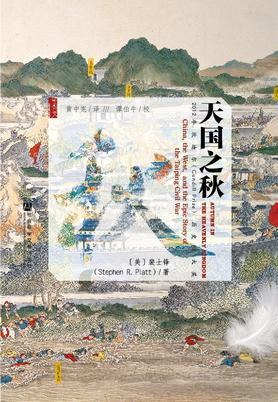

裴士锋和史景迁，国外两个写中国的历史学家


<!-- more -->

2020年5月10日

中文版自序

关于这段中国史，在我看来，中国人通常认为曾国藩和湘军剿灭了太平天国，而在西方，则更强调华尔与戈登的作用，尽管二者其实并行不悖。

2020年5月10日

中文版自序

当中国在《凡尔赛和约》谈判中令人震惊地向日本割让利权——以致引爆了“五四运动”——英国政治家劳合·乔治（Lloyd George）仍以太平叛乱为证，试图说明为什么不能给予中国平等待遇。他说：“中国的死气沉沉恰好证实了外国人所作所为的正确。中国人如同阿拉伯人一样，是非常聪明的种族，却处在一个无所进取的阶段。如果不是戈登组建了常胜军，中国定会被太平军颠覆。”

2020年5月10日

英文版自序

一八五一至一八六四年席卷中国大片江山的战争，不只是十九世纪破坏最烈的战争，也可能是史上死伤最惨重的战争。这场战争在英语里称作太平叛乱（Taiping Rebellion），战争一方是名叫太平天国的汉人叛军，另一方是立朝已两百年而国力日衰的满清王朝。惨烈的十四年战争期间，至少有两千万人因为这场战事及它带来的恐怖饥荒和瘟疫而丧命。

2020年5月10日

英文版自序

中国与美国两场内战的同时进行，绝非不值一顾的小事

美国打南北战争是内战，太平天国运动在国内正史中不是内战

2020年5月10日

英文版自序

由于支持异族满清王朝，曾国藩被数代人痛骂为汉奸，晚近则得到平反，被奉为中国人的典范，或更具体地说，是以未受西方影响的地道本土儒家方式，体现道德、强毅与克制精神的典范。他是今日中国境内最受欢迎的历史人物之一

2020年5月23日

英文版自序

以中文写成的太平天国战争史书籍，往往把焦点放在地方军队和其他国内势力，而对华尔与戈登之类人物少有着墨。上海沿岸的洋人只是中国内部更广大战争边缘不值一顾的小角色——因此，在发觉他们的角色其实必不可少时我才会那么惊讶。外国介入不仅至关紧要，而且（这也是最让我感到惊讶的一点）大体上是非正式的、往往半推半就的、充满道德情怀的介入，且从许多方面来看，其收到成效纯属偶然。

2020年5月27日

一 传教士助理

照马克思的说法，中国正发生的事，不仅是叛乱或数场暴动的合流，而且是“一场令人赞叹的革命”，那革命

2020年6月3日

一 传教士助理

一八五○年瘟疫肆虐广西，病人向洪秀全的上帝祷告即可痊愈的说法传开之后，信徒大增。无数人加入上帝会，瘟疫平息后，他们把自己得以活命归功于洪秀全的宗教。

2020年6月3日

一 传教士助理

最令人惊讶的地方：从中国内陆起事欲推翻满人的叛军是基督徒。他的书先在香港和上海以《洪秀全的异梦》（Visions of Hung-Siu-Tshuen）为名出版，然后在伦敦以《中国叛军首领》（The Chinese Rebel

2020年6月3日

一 传教士助理

另一名目击行刑场面的是中国人容闳。他于一八五四年自耶鲁大学毕业，这时刚从美国回来不久。已完全美国化的他，希望为朝廷效力，希望以美国为师推动教育改革。他先到广州以拾回他几乎忘光的中国话，却在刑场看到这一幕，使他重新思考该不该支持一个容忍如此野蛮行径的政府。

2020年6月3日

二 中立

英军以侮辱英国王室的罪名缉捕叶名琛，在他试图从同僚家后面逃走时将其捕获。英军将他捆绑，押上船送到印度，最后在英国人拘禁下死于彼地。

2020年6月3日

二 中立

岸上观看的农民似乎很害怕，船经过某个村庄时，村民全匍匐在河边，大声叫喊。额尔金的通译把他们喊的内容（生硬）译为：“大王好！愿您下船登岸，统治我们！”[23]诚如额尔金的秘书所见到的，“村民明显以为我们是要去推翻清朝”。[24]这样的认定并不离谱。

2020年6月3日

二 中立

他们也不像是国家遭入侵的愤怒国民。在他们身上，船上的人看不到一丝在意皇帝死活的迹象（事实上，对广大中国农民来说，皇帝的存在抽象而遥远，皇帝是由上天选定，而他们对此无权闻问）。随着舰队平安无事往上游驶去，民众的害怕消失，转为有所提防的好奇，乃至有时令人觉得突兀的合作。船搁浅在烂泥地时，船员会把绳子抛向民众，岸上的人会帮忙将船拉离泥地。这样的事一再发生。有些帮忙的民众得到硬饼干作为酬谢（“他们眼中的珍馐”，法国公使随员觉得），还有些民众获赠英法军人从大沽要塞劫掠来的成串铜钱。

2020年6月3日

二 中立

后来的发展表明这是明智之举，因为后来，凡是自愿与入侵者进行买卖之人，都遭到官府秋后算账

2020年6月3日

二 中立

外国船载着该国大使在这条通往京城的主水道上来来去去通行无阻，既不是来进贡，也不是来向皇帝叩头致敬——赤裸裸呈现于河岸居民眼前——意味着清朝不仅无力维持国内秩序，而且再也无法得到洋人尊敬一事，将传遍帝国各地。那将打掉皇帝本已薄

2020年6月4日

四 试探

杨坊以每人每月一百元的天价薪饷雇请这些佣兵，在重金利诱下，自然有职业军人跳船，加入这支主要由最低劣商船船员组成的部队。除了高薪，赞助者还承诺，只要这支洋人部队击败驻守松江的太平军，将他们赶走，就给予十多万元奖励，外加他们能在松江洗劫到的任何东西。 招兵买马组建这支部队的是快满二十九岁的美国人华尔（Frederick Townsend Ward），他也成为这支部队的第一任队长。

2020年6月4日

四 试探

但有些洋人坏到连上海都无容身之地。有一支非正规部队的成员，就是这类洋人。他们在上海完全不受欢迎，一八六○年春开始在上海西边约二十公里处一个遍布烂泥的村子操练战技。这支部队有约两百名欧美人，身上的制服形形色色，说明了他们出身的庞杂。

历史书上高大上的华尔的部队

2020年6月4日

五 北方之约

那天晚上，咸丰帝离开圆明园进入紫禁城，即他平常不喜待的北京皇宫。他一进紫禁城，宫门就关上不准任何人进出。然后，趁着紫禁城里的侍臣不清楚宫内情况时，咸丰帝偷偷从后门溜走，弃京城于不顾。他带着太监、嫔妃和满人官员一大群人，逃往北部山区避难，对外没有任何昭告。

2020年6月5日

第二部 挽狂澜于既倒

他于一八五三年开始组建的军队，是他的理学道德秩序观在军事上的体现；一如他已开始自律，他也将以纪律管教他的部队

2020年6月6日

七 教义的力量

抵达南京后，容闳先见了他不大看得起的罗孝全，然后在十一月十九日见了洪仁玕，带给洪仁玕有别于传教士所给的另一种讯息。

2020年6月7日

七 教义的力量

容闳承诺，只要太平天国落实这些现代化措施，他一定会加入他们共同奋斗（他十足自负）。

2020年7月4日

八 文明之劫

他还说中国人虽然发明了火药，却几乎只懂得拿它制造鞭炮。他们发明了指南针，却未走向大海。他们发明了印刷机，却只拿它来印制“一成不变的孔子著作”。

2020年7月4日

八 文明之劫

他主张，诞生于第一次鸦片战争的英国掠夺性贸易政策，破坏了中国政府的稳定，从而导致反清叛乱四处爆发，而如今在太平天国身上，叛乱之势达到最高点。因此，中国过去二十年的苦难和如今蹂躏中国人民家园的可怕战争，都是英国所造成。

2020年7月12日

八 文明之劫

这场战争期间得到无数次重述的观点：“他认为官军和叛军没什么两样，他在这两者底下都没过上好日子。

2020年7月12日

八 文明之劫

五月十九日，他们终于抓到华尔，当时他正在上海为民兵队招募新血。他来自美国马萨诸塞州，因此在上海租界里，唯一有权管治他的是美国领事，但当华尔声称他已不是美国公民，而是清朝国民时，事情变得十分难办。

2020年7月18日

九 看谁撑得久

曾国荃不知如何处置这批俘虏，“悍贼”人数几乎和他的围城总兵力一样多。那位安排缴械投降的营官再度献计，说最好杀光。曾国荃告诉他：“杀亦要设法。”于是那位营官提议：开营门，将俘虏一次带进十个，逐批砍头。他认为“只半日可以杀完”。曾国荃不忍执行这项计划，于是交给那位营官去办。营官回他的兵营准备，然后督斩八千名俘虏，据他自己所述，“自辰至酉”，只花了一天。[

2020年7月18日

九 看谁撑得久

菜园里的蔬菜和野草都已吃完。所有动物，甚至老鼠，都吃光了，没有东西可以喂饱城里饿着肚子的数千人。或者应该说几乎没有东西。九月五日进城的湘军骇然发现，安庆的市场从未关闭。人肉价格最后涨到每斤半两钱。

2020年7月18日

九 看谁撑得久

夏季时曾国藩就已写信给弟弟，谈到安庆投降时该如何处置。他写信告诉曾国荃：“克城以多杀为妥，不可假仁慈而误大事，弟意如何？”[65]爱民不表示爱那些与叛军站在同一边的人民。有人认为攻破安庆时，城里总共幸存约一万六千人，其中即使不是全为平民，至少也大部分是平民。有关他们后来遭遇的种种记述，差异主要在曾国藩麾下军官是否先将女人挑出，再杀光剩下的

2020年7月18日

十 天与地

这个观点来看，英法摧毁圆明园不是帝国主义行径，而是上天的审判。

2020年7月18日

十 天与地

至少在外国人眼中，洪仁玕仍和过去一样令人激赏。富礼赐，也就是来南京搜捕英籍佣兵的英国领事馆官员，在停泊于长江上的一艘小船上度过数月，洪仁玕从战场回来后，富礼赐与他会晤。富礼赐说洪仁玕是“我所见过最有见识的中国人”，[17]并宣称“如果整个太平天国都是这样的人，中国很快就会是他们的”。[18]英国皇家炮兵上尉布拉基斯顿（Thomas Blakiston）记下富礼赐的话，然后以那些话为基础写成一本富有影响力的书。书于来年在伦敦出版，名叫《长江上的五个月》（Five Months on the Yang-tsze）

2020年7月18日

十一 十字路口

马克思于一八五三年预测，太平叛乱将大大削弱英国在华贸易，从而“将火星抛到现今工业制度过度负载的地雷上”，但事实上最初的发展并非如此。英国对华贸易在这场叛乱期间反倒成长，

2020年7月18日

十一 十字路口

一八六一年春夏，英国决策者正面临清帝国可能瓦解的局面时，在地球另一端，美国也走向流血裂解之路。格雷伯爵在贵族院发言台上提醒“毁掉亚洲政府容易，为其换上新政府不易”时，美国南方邦联在亚拉巴马州的蒙哥马利成立才十天。那年三月舰队司令何伯正与中国叛军打开关系时，林肯在华府就任总统。到了四月，湘军与太平军在安徽的战事升级时，美国已有十一州脱离联邦。一八六一年七月，鲍超与曾国荃正在安庆城外屠杀数千叛军战俘时，美国内战第一场重要战役于弗吉尼亚州马纳萨斯附近的布尔河畔爆发。

2020年7月18日

十一 十字路口

湘军主帅曾国藩

2020年7月18日

十一 十字路口

淮军主帅李鸿章，一八七九年

2020年7月29日

十三 吸血鬼

上海和香港浮现的义愤，在民意正猛然转向不利于中国叛军的英格兰，最初几乎听不到。巴夏礼在受访和公开露面时表明，太平天国是一帮怪物。夏福礼领事有关宁波被毁的悲惨报告——把宁波说成像是已从地图上被抹掉一般——得到广泛刊载，而且少有人质疑他的说法。 到了一八六二年夏，就连马克思都在读过夏福礼的报告后，认为太平天国成不了气候。马克思最后一篇谈中国内战对全球之影响的文章，七月刊登于维也纳报纸《新闻报》（Die Presse），而引述自夏福礼写给卜鲁斯的某封信的文字，占了该文过半篇幅。在马克思引述的段落中，夏福礼严正表示，太平天国的真实面貌“与妄言（太平天国）‘拯救中国’之事的英格兰传教士的错觉不相符……经过十年闹哄哄而煞有其事的活动之后，他们摧毁一切，毫无建树”。夏福礼写道（且马克思引述道），这个中国叛乱[…]

2020年7月29日

十三 吸血鬼

一名年轻女子，看来怀胎约八个月，先前遭周遭暴民施以种种残酷虐待，都未发出一声呻吟或叹息。暴民挖出她子宫中的胎儿，抓着胎儿的一只小手，举起给她看；她一看到胎儿，立即发出一声令人心碎、令老虎听了都心生恻隐的尖叫，然后，流着血、身子颤动的胎儿被丢到她胸脯上后，她使出最后一股超乎人类的力气，将双臂从按住她的人手上挣脱，猛然将胎儿抓到她流血的心脏上，至死抓着不放。由于抓得很紧，无法将母子分开，他们就这样一起被丢到尸堆上。 俘虏中另有一名等着被开膛剖腹的少妇，怀里抱着一名在开心叫着、跳着的十个月大的漂亮男婴。男婴被猛然从她怀里抢走，掷向刽子手，刽子手举起残酷的小刀，当着他母亲的面，刺进他柔嫩的胸膛。出生不久的[…]

2020年8月6日

十五 鲜血与荣耀

。[63]李鸿章的部下把他们全部处死并肢解。 戈登怒不可遏。李鸿章杀降俘使他这个保人失信于纳王等人；他向他们保证过会平安无事，他们出卖主帅，献城给清军之后，竟遭李鸿章如此残酷杀害，在戈登眼中是可耻至极的行为。他宣布不再效力于李鸿章，说不想再见到他。后来他写信告诉母亲：“虽然这么想太无人性，但我很希望他受审处死。”[64]戈登的义愤像燎原之火蔓烧整个洋人圈。十二月十六日，上海十国领事官员发表联合声明，谴责李鸿章“令人发指、极端背信弃义的作为，很可能促使西方诸国收回对清廷的支持，收回勇武军官对清廷一直以来的援助”

2020年8月6日

十五 鲜血与荣耀

两人第一次会晤时，曾国藩慢条斯理、极有耐心地打量容闳，嘴上带着淡淡微笑，仔细察看这个在外国待过很长时间的年轻人的面相。他盯着容闳看让容闳感到“不自在”，但容闳似乎给了他好印象。他说他从容闳的眼神看出，容闳会是出色的指挥官。他问他成家与否。容闳摸不透坐在他对面这位将军的脑袋在想什么，曾国藩紧盯不放的目光似乎看透他的内心。[

2020年8月6日

十六 翻山越岭

，他们也知道苏州投降诸王的下场。[17]他们的判断很明智。接下来几个月，南京将数群妇女送出城，虽然她们没有立即被杀，却面临更未卜的未来，被“送”给农民当老婆。[18]但就连那样的宽大处理都将成为绝响。一八六四年晚春，曾国藩会劝曾国荃勿再让妇孺逃出城。他解释道，迫使叛军供养城内全部居民，将使他们更快饿死。他不希望他弟弟在无意间让任何叛军家眷活命。[19]

2020年8月6日

十六 翻山越岭

同时，乡间的饥荒加剧。曾国藩已在皖南设了救济站，但在多山的皖南，情况还是恶化，悲惨程度远甚于他初掌控安庆之时。他在一八六三年六月八日的日记写道：“皖南到处食人。”轻描淡写的语调，说明这种不可思议之事已如何司空见惯。他在日记里数次提到食人之事，但这一次他之所以在日记里写下，主要不是因为吃人肉一事——因为那已不是第一次——而是因为人肉变得很贵：“人肉始卖三十文一斤，后增至一百二十文一斤。”自前一年以来价格涨了三倍，意味着就连这最难下咽的维生物资都愈来愈买不起。他写道，江苏境内，南京以东和以南也有食人之事，尽管人肉价格据说较便宜。戈登于征战时亲眼见到可怕的食人残迹，但觉得他在上海的同胞不可能领会此事真正的骇人之处。

2020年8月6日

十六 翻山越岭

曾国荃幕僚赵烈文于七月二十六日进城，瞠目结舌于城中所见。仍活着的叛军男子，似乎全在替湘军士兵搬运战利品或帮他们挖掘埋在地下的宝物。在他看来，这些人之后可能会获释或至少逃出城。但其他人不是。老人遭恣意杀害，无法替湘军士兵干重活的病人和体弱者亦然。他在日记里写道：“沿街死尸十之九皆老者，其幼孩未二三岁者亦斫戮以为戏，匍匐道上。”就他所见，城中留下的妇女无一人在四十岁以下。“老者无不负伤”。湘军士兵对他们严刑拷打，逼他们说出值钱物品的藏放处，因而身上“或十余刀，数十刀，哀号之声达于四远”。[45]

2020年8月6日

结语

十九世纪中国这场内战所夺走的人命，最广受认可的估计是两千万至三千万人。这个数据必然不够客观，因为没有可靠的当时人口普查数据可供比较，因此这个数据基本上是根据若没有这场内战，

2020年8月6日

结语

一九一一年清朝终于覆灭时，中国将落入新一代反满革命人士之手。这些人非常清楚他们的反清前辈的作为，其中有些人剪掉辫子，留起长发，看起来就像典型的太平天国分子。还有些人写宣传小册，痛斥曾国藩是古往今来最大的汉奸，为了保住满清异族王朝杀了不计其数的汉人同胞。这批新一代革命分子最著名的领袖是广东人孙逸仙。他从小听人讲述太平天国英雄的故事，朋友还替他取了绰号“洪秀全”

2020年8月6日

结语

从一百多年后我们今日的观点来看，伊藤博文的预测——满清遭推翻时，“动荡将更为暴烈，而且会拖得更久，因为那被延迟太久，老早就该发生”——果然不幸言中。他接受采访两年后，满清覆灭，由中华民国取而代之，而中华民国几乎是甫一成立就分崩离析，陷入内战。中国受苦于数十年内战，国力衰弱，面对外敌的持续入侵几乎束手无策，