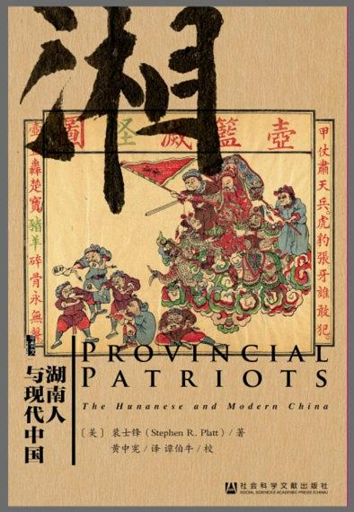



<!-- more -->

2020年5月3日

第一章 重新发掘王夫之

郭嵩焘于一八三七年通过乡试中举，与欧阳兆熊和湘军将领江忠源为同年。主编《船山遗书》的邹汉勋，在江忠源幕下当军官攻打太平军，一八五四年战死；左宗棠为邹汉勋写了挽联，强调邹与他和曾国藩交情甚笃。欧阳兆熊在医学上的钻研，使他能够在一八四○年曾国藩在北京卧病一月时救他一命[44]，结下终生不渝的友谊。[45]因此，出版《船山遗书》的那群讲究经世之学的文人最终都进入湘军，成为其核心骨干。王夫之的著作在他们的部队里流传甚广，因而一八九○年代有位学者在著述中说，王夫之论拨乱反正之道的历史著作为湘军将领提供了意识形态。[46]

2020年5月3日

第一章 重新发掘王夫之

直到清初，湖南与湖北仍为一省，两地合称为“楚”。

2020年5月3日

第二章 湖南复兴的基础

未能事人，焉能事鬼， 何必去父母之邦。[16]

2020年5月3日

第二章 湖南复兴的基础

人心风俗为立国之本，并引用宋儒苏轼的话说，“夫国家之所以存亡者，在道德之深浅，不在乎强与弱；在风俗之厚薄，不在乎富与贫。”因此，他驳斥自强运动人士追求国家富强这一基本原则，因为这一原则使他们着重于技术的改变，而非文化或道德的改变。

2020年5月3日

第二章 湖南复兴的基础

严复是其中（在郭嵩焘眼中）最聪明的一个。这时严复对造船工程计算的兴趣，已远不如对支撑起英国科技、政体的丰富理论的兴趣。两人一老一少，一个是政治家，一个是学生，数日朝夕相处，常在伦敦法院里消磨，旁听一连串案子的审讯，然后讨论那些案子直到深夜。严复把他至这时为止所已学到的光学和声学、物质运动、对数理论向郭嵩焘说明（钦佩西学之博大精深的严复说道：“苦穷年莫能殚其业”）

2020年5月3日

第二章 湖南复兴的基础

郭嵩焘有写日记的习惯，其中部分日记在他派驻海外时发表，以飨他在北京朝中的同僚。结果，不只保守派，就连他的友人，都予以毫不留情的痛批。郭嵩焘的日记里有诸多（在他们眼中）离经叛道之处，其中之一就是在朝廷正要把中国唯一一条铁路——由洋商行建造——买下来以便拆除之际，该日记却鼓吹建造铁路。

2020年5月3日

第二章 湖南复兴的基础

他以当代英国为借鉴，说明过去中国原来的样貌和（以思贤讲舍、校经堂为起点）中国可以再度成为的样貌。他接着说道：“窃观西洋以商贾为本计，通国无一闲。”换句话说，所有人学“实学”的概念（中国原初教育体制的基础），在西方大行其道，而西方如今享用它所带来的好处。他在和严复的交谈中已断定，西方强盛的根源，不在其科技，而在其学校（类似中国三代盛世时讲究全民就读和实用主义的学校），现在他则把这看法告诉他的湖南听众。顺着这一思路走，向西方取经，就不是走洋人的路子，反倒只是在拿回原属于中国的一套原则。于是他推断，要找到改革之道，中国必须望向大洋另一边，以拾回中国自己的过去。

2020年5月3日

第二章 湖南复兴的基础

郭嵩焘本人不可能知道自己对后世的影响，但他在思贤讲舍确立的模式，独一无二且经久不衰：他欲建立一个统一的教学制度，向所有学生教授受西方启发的“实学”，他欲以非官方身份引领湖南的道德、政治风气，他欲以本省耆老取代非本省官员来照顾百姓，还有他不断标举王夫之，不只将其视为学者，还视为湖南的守护神——全都将产生重大影响，且会在他死后几年即开始迅速发展。

2020年5月3日

第二章 湖南复兴的基础

郭嵩焘对湖南的贡献，包括播下数个信念的种子成为他之后湖南改革派思想的基础：他们相信，湖南人独一无二且有别于其他中国人；湖南的学校和学者组成的协会同心协力，乃是落实湖南本地共有文化的关键；湖南人注定要负起启蒙中国之责；湖南人为王夫之的后代，因而注定要履行他不服当道、践实履行的遗风。

2020年5月3日

第三章 湖南维新运动

甲午战争后，这一举动得到强化；摇摇欲坠的清廷禁不起湖南境内再爆发仇洋暴力事件的冲击。湖南省的领导阶层换血，数名与郭嵩焘有直接或间接关系且大部分极敬重他的新官员上任。最后——令人觉得讽刺的是，这主要得归功于周汉——郭嵩焘的变革计划将成为注目焦点。

2020年5月3日

第三章 湖南维新运动

郭嵩焘以为改革要花上数百年才能成，但此刻，每隔几年、几月，就有一番新气象。周汉和其党羽遭弹压后，湖南官员大换血，然后，距郭嵩焘去世才五年的现在，原被公认是中国最保守省份的湖南，摇身一变，成为公认的中国地方改革先锋。这是中外人士都在热切观看的一场试验，而对那些不知道郭嵩焘已辛苦打下基础的人，或不知道他个人对官绅领袖之影响的人来说

2020年5月3日

第三章 湖南维新运动

由此，梁启超表示，曾国藩通过湘军实现的本地化军事组织构想，其实是建立本土民主政府的理想起点。换句话说，本地武装必须作为当地政治改革的后盾。

2020年5月3日

第三章 湖南维新运动

谭嗣同对湘军的评价乃是此前所未有，郭嵩焘那一辈人（乃至周汉）若听闻此说，大概万万无法接受，但它在此后的数十年间赢得了革命志士的肯定。谭嗣同表示，湖南人从不是中国的救星，事实正好相反——湖南人是中国人民的压迫者。曾国藩、左宗棠杀害同族兄弟以保住异族政权，因此，应把他们视为晚近历史上最罪大恶极之徒。但中国人民反倒把他们当英雄来崇拜，因为他们老早就忘掉了自己与满人间的族群差别。但通过阅读王夫之著作里有关满人的见解，也就是通过读出曾国藩版《船山遗书》中那些“空格”里隐含的意思，他们仍能懂得满汉的差异。

2020年5月3日

第三章 湖南维新运动

在他看来，只有让人民终于可以置喙的国家，才是值得为其一死的国家。

2020年5月3日

第三章 湖南维新运动

谭嗣同遭处决后，湖南维新运动的冲劲，将由避难日本的那些师生传承下来。这新一代湖南人由来自时务学堂的师生、在南学会集会场上聆听过演说的年轻学者以及在湖南内地研读过《湘报》的年轻读者组成，已见过令他们难忘的湖南新政府、新生活、新社会。在日本，他们继续发扬不管中国其他地方愿不愿追随湖南人脚步，湖南人都注定要带头走向未来的信念。但清廷终结维新运动手段之粗暴（谭嗣同遭处死即为最鲜明的象征），使许多原本以为改革有望的年轻改革派满腔悲愤，报复心切，坚定认为湖南终将再起。因此，谭嗣同的死代表了湖南改革的一个转折点，此后，那些自认为“湖南精神”之化身者，大部分将扬弃郭嵩焘和谭嗣同所开启的本土草根改革策略，转而采用更为激烈的变革之道。于是，谭嗣同捐躯后不到两年，唐才常返乡不是为了创立学会，而是创立军队。

2020年5月4日

第四章 在日本重整旗鼓

杨度追随蔡锷等人的脚步，从民族主义的角度，以全球史为模拟，阐述湖南的命运。他写道，“欧洲古国斯巴达，强者充兵弱者杀。雅典文柔不足称，希腊诸邦谁与敌？”同样的，“区区小国普鲁士，倏忽成为德意志。儿童女子尽知兵，一战巴黎遂称帝。内合诸省成联邦，外与群雄争领地。” 这将是湖南为中国扮演的角色。诚如此诗接下来所说，“中国如今是希腊，湖南当作斯巴达，中国将为德意志，湖南当作普鲁士。”湖南将是年轻、尚武的国家，将振臂而起，改造其周遭地区，打造出由它领导的新帝国，带领其他省（如有必要不惜动用武力）组成一新联邦，建立以湖南为典范（且受湖南保护）的中国。

2020年5月3日

第四章 在日本重整旗鼓

这次起事虽然失败，影响却很大。对中国人（特别是为官的中国人）来说，它标志着以学生为领袖的改革开始退位，革命渐居上风。但受此事件影响最深者是湖南人，他们为此又多了一批烈士。自太平天国之乱起，湖南人就被灌输他们负有为中国之前途开路的使命，而此次起事的失败使他们更加坚定此信念。因为，诚如许多湖南年轻人所认为的，正是湖南人策划了二十世纪这第一场反清的大叛乱，一如他们于一八九○年代带头改革，

2020年5月3日

第四章 在日本重整旗鼓

支那”（意指由汉人当家做主的中国）

2020年5月4日

第四章 在日本重整旗鼓

到了一九○○年代初期，凡是湖南人所写描述湖南人性格的著作，鲜少不把王夫之视为他们的精神领袖。王夫之同时扮演了两种角色，既是中国民族主义者的先驱，也是现代湖南子弟的祖先。这两种看法直接助长了湖南人的自豪感，尽管是以不同的形式、出于不同的原因。但在湖南学生的著作中，最有力的看法，乃是这两种看法的交融为一：把王夫之视为湖南民族主义之父。

2020年5月4日

第四章 在日本重整旗鼓

“举湖南而皆为斯巴达，庶能生存于二十世纪之秋”。他警告道，如若不然，“凭故墟而吊波兰，怅萍踪而怜犹太，是则湖南之肖影也”。他主张：“言中国自治而必始于湖南自治，犹言湖南自治必始于个人自治也。”

2020年5月4日

第四章 在日本重整旗鼓

了解湖南人的自治论，须以这一模式为依据，而非以日本模式，或后来出现于中国的任何中央集权“自治”政策为依据。湖南人怀着他们所谓传承自王夫之的反抗传统，自豪于他们优于他省人的勇武善战，痛恶帝国统治，深信湖南蕴藏丰富天然资源，一心要走自己的路，因此他们所谈的自治是利伯版的自治，而非日本版的自治。

2020年5月4日

第四章 在日本重整旗鼓

古巴则已于一九○二年，即《新湖南》写成之年，脱离美国独立。

2020年5月4日

第五章 湖南与清朝的覆灭

孙文未受过传统典籍教育，因而也未能得到东京中国学生的大力支持，在那些学生眼中，孙文没有文化。与华兴会成功让文人与农村秘密会社一起献身革命不同，兴中会的成员以来自沿海省份的商人、工人居多。例如，宋教仁就蔑视孙文的革命本事。他认为孙逸仙能闹，但就此而已。

2020年5月4日

第五章 湖南与清朝的覆灭

一九○八年，双方出现明显裂痕，宋教仁带头欲拉下同盟会总理孙文，代之以黄兴，而参与这场倒孙运动者以湖南人居多。在黄兴的阻止下，宋教仁才收手。

2020年5月5日

第六章 重建

这新一代顽强的湖南学生中最具代表性的一员，亦将成为那一代人之龙头者，乃是年轻的毛泽东。一九二○年代初期，毛泽东会娶杨昌济的独生女为妻，有一段时间以船山学社为家。

2020年5月4日

第六章 重建

“独立之国，不可无独立之教育；独立之教育，不可无独立之学术；独立之学术，不可无独立之精神”。这一“独立之精神”正是王夫之的精神，而刘人熙希望这精神

2020年5月4日

第六章 重建

龙兼公在《湖南人未尽死》一文中痛批杨度背叛湖南民族主义，文章标题影射杨度的《湖南少年歌》。诚如他所写的那样，杨度为新湖南所写的歌说道：“若道中华国果亡，除是湖南人尽

2020年5月5日

第七章 毛泽东与湖南自治运动

共产国际代表了与此相反的观点，认为苏维埃布尔什维克是全球性革命的领导，且那场全球性革命要由苏维埃顾问和官员从幕后主导。彭璜与毛泽东开始意见不合之时，彭璜开始告诉他人“反抗”毛时，正好是毛泽东与何叔衡决定加入受莫斯科共产国际指导的中国共产党之时。 这一裂痕的存在，说明了中国共产党创立时的一个更大的危机。当时中国境内已有数个早期的独立共产主义“小组”，而这些“小组”对于未来要走的路，抱持两种彼此矛盾的可能，即可能走向实现由独立自治的地方革命运动组成的无政府主义愿景，也可能被吸纳入俄国所构想的、有着一体化结构的国际政党组织里。

2020年5月5日

第七章 毛泽东与湖南自治运动

毛泽东追随恩师脚步于一九一八年秋来到北京，在杨昌济家住了数月，同时在北京大学图书馆工作。他也开始追求杨昌济的女儿杨开慧。一九一九年四月回长沙，在一小学觅得教职，开始热心于公共事务，着手填补杨昌济、刘人熙离去后留下的空缺。

2020年5月5日

第七章 毛泽东与湖南自治运动

湖南仍未被承认为中国知识界龙头。因此，毛泽东爽快地支持五四运动的世界主义，或许是源于单纯的个人因素，即源于他的乡下人出身和浓重的韶山口音所带来的尴尬。那尴尬使他很想得到首都当红知识分子的接受。[32]或者从另一个角度说，那或许也说明了他个人野心之大。他想唤醒湖南，因此，他不愿承认自己景仰和延续那些湖南前辈的志业，这乃是为了将自己包装为开创者而非仿效者的手段。不管出于哪种原因，他追随前辈的脚步，但把他走过的足迹掩饰得非常好，让后来的史学家都相信他的说法，认为他的早期活动与中国共产主义的起源，完全是出于五四运动的世界主义，即以北京为中心，而非出于他居住、工作所在的这个“落后”内陆地区

2020年5月5日

第七章 毛泽东与湖南自治运动

在谭延闿重新执政的乐观气氛中，毛泽东一派昂扬自信。他解释道：“以现状观察，中国二十年内无望民治之总建设。在此期内，湖南最好保境自治，划湖南为桃源，不知以外尚有他省，亦不知尚有中央政府，自处如一百年前北美诸州中之一州，自办教育，自兴产业，自筑铁路、汽车路，充分发挥湖南人之精神，造一种湖南文明于湖南领域以内……湖南者湖南人之湖南也。”[3

2020年5月5日

第七章 毛泽东与湖南自治运动

毛泽东为此专栏打头阵，九月三日发表《湖南共和国》一文，文章一开头就写道：“我是反对‘大中华民国’的，我是主张‘湖南共和国’的。”[49]两天后，他写了《打破没有基础的大中国，建设许多的中国：从湖南做起》，文中宣告：“湖南人呵！应该醒觉了！……湖南人果有能力者，敢造出一个旭日瞳瞳的湖南共和国来！”[50]隔天，他开始发表分两天刊载的文章《湖南受中国之累：以历史及现状证明之》，文中冷冷评估了湖南在中华帝国里的地位，说“元明历清，长夜漫漫，所得的只是至痛极惨”，“湖南的历史，只是黑暗的历史”。

2020年5月5日

第七章 毛泽东与湖南自治运动

杜威的乐观构想以草根模式为基础，以学校作为改造较广大社会的微观实验室。相比之下，罗素是从宏观世界层面谈社会改造问题。他的演讲题目比杜威的题目悲观得多，名为“布尔什维克与世界政府”，并以令他理想破灭的俄国之行为基础。[64]他在演讲中提醒长沙听众，布尔什维克革命最终是场失败的革命，因为其并未带来工人的解放，而是带来如皇权一样极度压迫人民的一党专政独裁统治。同年更晚时，他在伦敦出版的《布尔什维克主义的理论与实践》

2020年5月5日

第七章 毛泽东与湖南自治运动

毛泽东提到罗素最近一场谈布尔什维克的演说。他把罗素的立场说成“主张共产主义，反对劳农专政”，并指出罗素（一如杜威）深信改革应通过教育渐渐施行。毛泽东说，罗素在长沙演说后，他与彭璜有过详细的辩论，然后毛泽东得出结论：罗素的主张“理论上说得通，事实上做不到”。这句结论代表毛泽东彻底扬弃了通过教育改革的路线

2020年5月5日

第七章 毛泽东与湖南自治运动

焘的一贯主张，转而走上唐才常、杨毓麟、黄兴的路线。他简单解释道：“教育的方法是不行的。”还说：“我看俄国式的革命，是无可如何的山穷水尽诸路皆走不通了的一个变计。”而毛泽东这时的想法认为，此刻已走到其他诸路皆走不通的时候，只能诉诸革命

2020年5月5日

第七章 毛泽东与湖南自治运动

这一转变于一九二一年一月初在文化书社的一连串密集会议上完成。会议选在平静的元旦假期时，新民学会十八名会员聚集在一起讨论他们未来的新方向。经过多方辩论，他们决定，原以杨昌济“奋斗的和向上的人生观”为基础创立的新民学会，在成立三年之后，要以实行布尔什维克式革命改造中国和世界为其新使命。从一开始，共产主义“小组”的成员就在辩论上占了上风。何叔衡主张：“一次的扰乱，抵得二十年的教育”

2020年5月5日

第七章 毛泽东与湖南自治运动

在一九二一年，苏联共产党全然不同于革命同盟会。它是高度官僚化的意识形态组织，由莫斯科在背后一手操控，吸收了湖南人的地域忠诚，使湖南人致力于实现苏联共产党的目标，无意把湖南人归还给湖南。不管一九二一年冬彭璜的遭遇为何，湖南本土民族主义的冲劲和独立“精神”，大体上已跟着它的最后一个且最直言不讳的倡导者一起消失。

2020年5月5日

第七章 毛泽东与湖南自治运动

一八八○年代郭嵩焘用它来作为他新式学校的栖身之地，一如一九一五年刘人熙用它来组织反袁世凯运动，此刻，船山学社这个保护壳，其与当地学界的深厚关系、其所彰显的湖南士绅之骄傲，为中国共产党初生的湖南支部，提供了可让他们近乎随心所欲工作的保护空间。这是令人兴奋的一刻，而毛泽东、何叔衡和其他老师、学生一起住在这学社里。当地同志说毛泽东和杨昌济的女儿杨开慧就在那里秘密结婚。